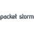

<h2 align="center">
  SearchToolkit 
  
</h2>

  

<!-- Intro  -->
<h3 align="center">
        <samp>&gt; Ethical Hacking 
                <b><a target="_blank" href="https://en.wikipedia.org/wiki/Penetration_test">Engine</a></b>
        </samp>
</h3>

    
     
     <b>「 Author 」</b>
  <samp>
     
    <a href="https://facebook.com/ehphofficial" onclick="window.open(this.href,'_blank');return false;">「 <b>l0n3m4n : EHPH Member </b> 」
     
     
  </samp>

 

    
    
      
    
      
    

 

<h2 align="center">Search Navigation</h2>

<!--Search navigation-->

  <a href="#cheatsheets"><b>Cheatsheets</b></a> |
  <a href="#osint-menu"><b>OSINT</b></a> |
  <a href="#server"><b>Servers</b></a> |
  <a href="#attack-surface"><b>Attack Surface</b></a> |
  <a href="#code-search"><b>Code Search</b></a> | 
  <a href="#domains"><b>Domains</b></a> | 
  <a href="#dns"><b>DNS</b></a> | 
  <a href="#certificates"><b>Certificates</b></a> |
  <a href="#wifi-networks"><b>WiFi</b></a> |
  <a href="#wifi-networks "><b>Dorking</b></a> |
  <a href="#device-information"><b>Device Information</b></a> |
  <a href="#credential-leaks"><b>Credential Leaks</b></a> |
  <a href="#hidden-services"><b>Hidden Services</b></a> |
  <a href="#android"><b>Reverse Engineering</b></a> |
  <a href="#android"><b>IOC Scanner</b></a> |
  <a href="#android"><b>Steganography</b></a> |
  <a href="#threat-intelligence"><b>Threat Intelligence</b></a> | 
  <a href="#ctf"><b>CTF Platform</b></a> |  
  <a href="#android"><b>Android</b></a> |
  <a href="#android"><b>Awesome List</b></a> |

  <h3 align="center">Attack Cycle</h3>

  <a href="#reconnaissance"><b>Reconnaissance</b></a> |
  <a href="#vulnerability-identification"><b>Vulnerability Identification</b></a> | 
  <a href="#social-engineering"><b>Social Engineering</b></a> |
  <a href="#establish-foothold"><b>Initial Access</b></a> | 
  <a href="#exploitations"><b>Exploitations</b></a> |
  <a href="#privilege-escalation"><b>Privilege Escalation</b></a> |
  <a href="#evasion"><b>Evasion</b></a> |
  <a href="#credential-dumping"><b>Credential Dumping</b></a> |
  <a href="#persistence"><b>Persistence</b></a> |
  <a href="#lateral-movement"><b>Lateral Movement</b></a> |
  <a href="#command-and-control"><b>Command and Control<b><a> |
  <a href="#data-exfiltration"><b>Data Exfiltration</b></a> |
  <a href="#covering-tracks"><b>Covering Tracks</b></a> |
  <a href="#securing-data"><b>Securing Data</b></a> |
  <a href="#reports"><b>Reports</b></a>

## Cheatsheets

<table>
<thead>
<tr>
<th>IMAGE</th>
<th>NAME</th>
<th>LINKS</th>
<th>DESCRIPTION</th>
</tr>
</thead>
<tbody>

<tr>
<td></td>
<td><b>HackTricks</b></td>
<td><a href="https://book.hacktricks.xyz/">Github.io</a></td>
<td>The Best hacking cheatsheets</td>
</tr>

<tr>
<td></td>
<td><b>RedTeam Cheatsheets</b></td>
<td><a href="https://github.com/wsummerhill/C2_RedTeam_CheatSheets">Github</a></td>
<td>Useful C2 techniques and cheatsheets learned from engagements (Cobalt strike and sliver c2)</td>
</tr>

<tr>
<td></td>
<td><b>Internall-all-the-things</b></td>
<td><a href="https://swisskyrepo.github.io/InternalAllTheThings/">Github.io</a></td>
<td>Active Directory and Internal Pentest Cheatsheets</td>
</tr>

<tr>
<td></td>
<td><b>Awesome-Pentest</b></td>
<td><a href="https://github.com/coreb1t/awesome-pentest-cheat-sheets">Github</a></td>
<td>Awesome Pentest Cheat Sheets a collection of the cheat sheets useful for pentesting </td>
</tr>

</tbody>
</table>

## Server

<table>
<thead>
<tr>
<th>IMAGE</th>
<th>NAME</th>
<th>LINKS</th>
<th>DESCRIPTION</th>
</tr>
</thead>
<tbody>
<tr>
<td></td>
<td><b>Shodan</b></td>
<td><a href="https://shodan.io">Website</a></td>
<td>Search Engine for the Internet of Everything.</td>
</tr>
<tr>
<td></td>
<td><b>Censys Search</b></td>
<td><a href="https://search.censys.io/">Website</a></td>
<td>Search Engine for every server on the Internet to reduce exposure and improve security.</td>
</tr>

<tr>
<td></td>
<td><b>Onyphe</b></td>
<td><a href="https://www.onyphe.io">Website</a></td>
<td>Cyber Defense search engine for open-source and cyber threat intelligence data.</td>
</tr>

<tr>
<td></td>
<td><b>ZoomEye</b></td>
<td><a href="https://zoomeye.org/">Website</a></td>
<td>Global Cyberspace mapping.</td>
</tr>

<tr>
<td></td>
<td><b>GreyNoise</b></td>
<td><a href="https://viz.greynoise.io/">Website</a></td>
<td>The source for understanding internet noise.</td>
</tr>

<tr>
<td></td>
<td><b>Netlas</b></td>
<td><a href="https://netlas.io/">Website</a></td>
<td>Discove, Research and monitor any assets available online.</td>
</tr>

<tr>
<td></td>
<td><b>FOFA</b></td>
<td><a href="https://fofa.info/">Website</a></td>
<td>Cyberspace Mapping</td>
</tr>

<tr>
<td></td>
<td><b>Quake</b></td>
<td><a href="https://quake.360.net/quake/#/index/">Website</a></td>
<td>Global Cyberspace Surveying and mapping system.</td>
</tr>

<tr>
<td></td>
<td><b>Hunter</b></td>
<td><a href="https://hunter.how/">Website</a></td>
<td>Internet search engine for security researchers.</td>
</tr>

<tr>
<td></td>
<td><b>Qualys SSL Labs</b></td>
<td><a href="https://www.ssllabs.com/ssltest/">Website</a></td>
<td>This free online service performs a deep analysis of the configuration of any SSL web server on the public Internet. </td>
</tr>

</tbody>
</table>

 [🔝 Back to top](#Search-Navigation)

## Reconnaissance

<table>
<thead>
<tr>
<th>IMAGE</th>
<th><b>NAME</b></th>
<th>LINKS</th>
<th>DESCRIPTION</th>
</tr>
</thead>
<tbody>

<tr>
<td></td>
<td><b>Sublist3r</b></td>
<td><a href="https://github.com/aboul3la/Sublist3r">GitHub</a></td>
<td>Fast subdomains enumeration tool for penetration testers</td>
</tr>

<tr>
<td></td>
<td><b>Amass</b></td>
<td><a href="https://github.com/OWASP/Amass">GitHub</a></td>
<td>In-depth Attack Surface Mapping and Asset Discovery</td>
</tr>

<tr>
<td></td>
<td><b>massdns</b></td>
<td><a href="https://github.com/blechschmidt/massdns">GitHub</a></td>
<td>High-performance DNS stub resolver for bulk lookups</td>
</tr>

<tr>
<td></td>
<td><b>Findomain</b></td>
<td><a href="https://github.com/Findomain/Findomain">GitHub</a></td>
<td>The fastest and cross-platform subdomain enumerator</td>
</tr>

<tr>
<td></td>
<td><b>Sudomy</b></td>
<td><a href="https://github.com/Screetsec/Sudomy">GitHub</a></td>
<td>Automated reconnaissance tool for bug hunting / pentesting</td>
</tr>

<tr>
<td></td>
<td><b>chaos-client</b></td>
<td><a href="https://github.com/projectdiscovery/chaos-client">GitHub</a></td>
<td>Go client to communicate with Chaos DNS API</td>
</tr>

<tr>
<td></td>
<td><b>domained</b></td>
<td><a href="https://github.com/TypeError/domained">GitHub</a></td>
<td>Multi Tool Subdomain Enumeration</td>
</tr>

<tr>
<td></td>
<td><b>shuffledns</b></td>
<td><a href="https://github.com/projectdiscovery/shuffledns">GitHub</a></td>
<td>Wrapper around massdns for subdomain enumeration with active bruteforce</td>
</tr>

<tr>
<td></td>
<td><b>puredns</b></td>
<td><a href="https://github.com/d3mondev/puredns">GitHub</a></td>
<td>Fast domain resolver and subdomain bruteforcing</td>
</tr>

<tr>
<td></td>
<td><b>censys-subdomain-finder</b></td>
<td><a href="https://github.com/christophetd/censys-subdomain-finder">GitHub</a></td>
<td>Subdomain enumeration using Censys certificate transparency logs</td>
</tr>

<tr>
<td></td>
<td><b>Turbolist3r</b></td>
<td><a href="https://github.com/fleetcaptain/Turbolist3r">GitHub</a></td>
<td>Subdomain enumeration tool with analysis features</td>
</tr>

<tr>
<td></td>
<td><b>as3nt</b></td>
<td><a href="https://github.com/cinerieus/as3nt">GitHub</a></td>
<td>Another Subdomain Enumeration Tool</td>
</tr>

<tr>
<td></td>
<td><b>Subra</b></td>
<td><a href="https://github.com/si9int/Subra">GitHub</a></td>
<td>Web-UI for subdomain enumeration using subfinder</td>
</tr>

<tr>
<td></td>
<td><b>Substr3am</b></td>
<td><a href="https://github.com/nexxai/Substr3am">GitHub</a></td>
<td>Passive reconnaissance/enumeration using SSL certificates</td>
</tr>

<tr>
<td></td>
<td><b>domain</b></td>
<td><a href="https://github.com/jhaddix/domain/">GitHub</a></td>
<td>Setup script for Recon-ng for subdomain enumeration</td>
</tr>

<tr>
<td></td>
<td><b>altdns</b></td>
<td><a href="https://github.com/infosec-au/altdns">GitHub</a></td>
<td>Generates permutations, alterations, and mutations of subdomains</td>
</tr>

<tr>
<td></td>
<td><b>brutesubs</b></td>
<td><a href="https://github.com/anshumanbh/brutesubs">GitHub</a></td>
<td>Automation framework for running multiple subdomain bruteforcing tools</td>
</tr>

<tr>
<td></td>
<td><b>dns-parallel-prober</b></td>
<td><a href="https://github.com/lorenzog/dns-parallel-prober">GitHub</a></td>
<td>Parallelised domain name prober for subdomain enumeration</td>
</tr>

<tr>
<td></td>
<td><b>dnscan</b></td>
<td><a href="https://github.com/rbsec/dnscan">GitHub</a></td>
<td>Python wordlist-based DNS subdomain scanner</td>
</tr>

<tr>
<td></td>
<td><b>knock</b></td>
<td><a href="https://github.com/guelfoweb/knock">GitHub</a></td>
<td>Enumerate subdomains on a target domain through a wordlist</td>
</tr>

<tr>
<td></td>
<td><b>hakrevdns</b></td>
<td><a href="https://github.com/hakluke/hakrevdns">GitHub</a></td>
<td>Tool for performing reverse DNS lookups en masse</td>
</tr>

<tr>
<td></td>
<td><b>dnsx</b></td>
<td><a href="https://github.com/projectdiscovery/dnsx">GitHub</a></td>
<td>Fast and multi-purpose DNS toolkit for running DNS queries</td>
</tr>

<tr>
<td></td>
<td><b>subfinder</b></td>
<td><a href="https://github.com/projectdiscovery/subfinder">GitHub</a></td>
<td>Subdomain discovery tool that finds valid subdomains for websites</td>
</tr>

<tr>
<td></td>
<td><b>assetfinder</b></td>
<td><a href="https://github.com/tomnomnom/assetfinder">GitHub</a></td>
<td>Find domains and subdomains related to a given domain</td>
</tr>

<tr>
<td></td>
<td><b>crtndstry</b></td>
<td><a href="https://github.com/nahamsec/crtndstry">GitHub</a></td>
<td>Yet another subdomain finder</td>
</tr>

<tr>
<td></td>
<td><b>VHostScan</b></td>
<td><a href="https://github.com/codingo/VHostScan">GitHub</a></td>
<td>Virtual host scanner that performs reverse lookups</td>
</tr>

<tr>
<td></td>
<td><b>scilla</b></td>
<td><a href="https://github.com/edoardottt/scilla">GitHub</a></td>
<td>Information Gathering tool - DNS / Subdomains / Ports / Directories enumeration</td>
</tr>

<tr>
<td></td>
<td><b>sub3suite</b></td>
<td><a href="https://github.com/3nock/sub3suite">GitHub</a></td>
<td>Research-grade suite of tools for subdomain enumeration</td>
</tr>

<tr>
<td></td>
<td><b>cero</b></td>
<td><a href="https://github.com/glebarez/cero">GitHub</a></td>
<td>Scrape domain names from SSL certificates of arbitrary hosts</td>
</tr>

<tr>
<td></td>
<td><b>shosubgo</b></td>
<td><a href="https://github.com/incogbyte/shosubgo">GitHub</a></td>
<td>Tool to grab subdomains using Shodan API</td>
</tr>

<tr>
<td></td>
<td><b>haktrails</b></td>
<td><a href="https://github.com/hakluke/haktrails">GitHub</a></td>
<td>Golang client for querying SecurityTrails API data</td>
</tr>

<tr>
<td></td>
<td><b>bbot</b></td>
<td><a href="https://github.com/blacklanternsecurity/bbot">GitHub</a></td>
<td>Recursive internet scanner for hackers</td>
</tr>

<tr>
<td></td>
<td><b>wappalyzer</b></td>
<td><a href="https://github.com/AliasIO/wappalyzer">GitHub</a></td>
<td>Identify technology on websites.</td>
</tr>

<tr>
<td></td>
<td><b>webanalyze</b></td>
<td><a href="https://github.com/rverton/webanalyze">GitHub</a></td>
<td>Port of Wappalyzer to automate mass scanning.</td>
</tr>

<tr>
<td></td>
<td><b>python-builtwith</b></td>
<td><a href="https://github.com/claymation/python-builtwith">GitHub</a></td>
<td>BuiltWith API client.</td>
</tr>

<tr>
<td></td>
<td><b>whatweb</b></td>
<td><a href="https://github.com/urbanadventurer/whatweb">GitHub</a></td>
<td>Next generation web scanner.</td>
</tr>

<tr>
<td></td>
<td><b>retire.js</b></td>
<td><a href="https://github.com/RetireJS/retire.js">GitHub</a></td>
<td>Scanner detecting JavaScript libraries with known vulnerabilities.</td>
</tr>

<tr>
<td></td>
<td><b>httpx</b></td>
<td><a href="https://github.com/projectdiscovery/httpx">GitHub</a></td>
<td>Fast and multi-purpose HTTP toolkit for probing.</td>
</tr>

<tr>
<td></td>
<td><b>fingerprintx</b></td>
<td><a href="https://github.com/praetorian-inc/fingerprintx">GitHub</a></td>
<td>Standalone utility for service discovery on open ports.</td>
</tr>

<tr>
<td></td>
<td><b>gobuster</b></td>
<td><a href="https://github.com/OJ/gobuster">GitHub</a></td>
<td>Directory/File, DNS and VHost busting tool written in Go.</td>
</tr>

<tr>
<td></td>
<td><b>recursebuster</b></td>
<td><a href="https://github.com/C-Sto/recursebuster">GitHub</a></td>
<td>Rapid content discovery tool for recursively querying webservers.</td>
</tr>

<tr>
<td></td>
<td><b>feroxbuster</b></td>
<td><a href="https://github.com/epi052/feroxbuster">GitHub</a></td>
<td>A fast, simple, recursive content discovery tool written in Rust.</td>
</tr>

<tr>
<td></td>
<td><b>dirsearch</b></td>
<td><a href="https://github.com/maurosoria/dirsearch">GitHub</a></td>
<td>Web path scanner.</td>
</tr>

<tr>
<td></td>
<td><b>dirsearch (Go implementation)</b></td>
<td><a href="https://github.com/evilsocket/dirsearch">GitHub</a></td>
<td>A Go implementation of dirsearch.</td>
</tr>

<tr>
<td></td>
<td><b>filebuster</b></td>
<td><a href="https://github.com/henshin/filebuster">GitHub</a></td>
<td>An extremely fast and flexible web fuzzer.</td>
</tr>

<tr>
<td></td>
<td><b>dirstalk</b></td>
<td><a href="https://github.com/stefanoj3/dirstalk">GitHub</a></td>
<td>Modern alternative to dirbuster/dirb.</td>
</tr>

<tr>
<td></td>
<td><b>dirbuster-ng</b></td>
<td><a href="https://github.com/digination/dirbuster-ng">GitHub</a></td>
<td>dirbuster-ng is C CLI implementation of the Java dirbuster tool.</td>
</tr>

<tr>
<td></td>
<td><b>gospider</b></td>
<td><a href="https://github.com/jaeles-project/gospider">GitHub</a></td>
<td>Gospider - Fast web spider written in Go.</td>
</tr>

<tr>
<td></td>
<td><b>hakrawler</b></td>
<td><a href="https://github.com/hakluke/hakrawler">GitHub</a></td>
<td>Simple, fast web crawler designed for easy, quick discovery of endpoints and assets within a web application.</td>
</tr>

<tr>
<td></td>
<td><b>crawley</b></td>
<td><a href="https://github.com/s0rg/crawley">GitHub</a></td>
<td>Fast, feature-rich unix-way web scraper/crawler written in Golang.</td>
</tr>

<tr>
<td></td>
<td><b>katana</b></td>
<td><a href="https://github.com/projectdiscovery/katana">GitHub</a></td>
<td>A next-generation crawling and spidering framework.</td>
</tr>

<tr>
<td></td>
<td><b>LinkFinder</b></td>
<td><a href="https://github.com/GerbenJavado/LinkFinder">GitHub</a></td>
<td>A python script that finds endpoints in JavaScript files.</td>
</tr>

<tr>
<td></td>
<td><b>JS-Scan</b></td>
<td><a href="https://github.com/zseano/JS-Scan">GitHub</a></td>
<td>A .js scanner built in PHP, designed to scrape URLs and other information.</td>
</tr>

<tr>
<td></td>
<td><b>LinksDumper</b></td>
<td><a href="https://github.com/arbazkiraak/LinksDumper">GitHub</a></td>
<td>Extracts links/possible endpoints from responses & filters them via decoding/sorting.</td>
</tr>

<tr>
<td></td>
<td><b>GoLinkFinder</b></td>
<td><a href="https://github.com/0xsha/GoLinkFinder">GitHub</a></td>
<td>A fast and minimal JS endpoint extractor.</td>
</tr>

<tr>
<td></td>
<td><b>BurpJSLinkFinder</b></td>
<td><a href="https://github.com/InitRoot/BurpJSLinkFinder">GitHub</a></td>
<td>Burp Extension for passive scanning of JS files for endpoint links.</td>
</tr>

<tr>
<td></td>
<td><b>urlgrab</b></td>
<td><a href="https://github.com/IAmStoxe/urlgrab">GitHub</a></td>
<td>A Go utility to spider through a website searching for additional links.</td>
</tr>

<tr>
<td></td>
<td><b>waybackurls</b></td>
<td><a href="https://github.com/tomnomnom/waybackurls">GitHub</a></td>
<td>Fetches all URLs that the Wayback Machine knows about for a domain.</td>
</tr>

<tr>
<td></td>
<td><b>gau</b></td>
<td><a href="https://github.com/lc/gau">GitHub</a></td>
<td>Fetches known URLs from AlienVault's Open Threat Exchange, the Wayback Machine, and Common Crawl.</td>
</tr>

<tr>
<td></td>
<td><b>getJS</b></td>
<td><a href="https://github.com/003random/getJS">GitHub</a></td>
<td>A tool to quickly get all JavaScript sources/files.</td>
</tr>

<tr>
<td></td>
<td><b>linx</b></td>
<td><a href="https://github.com/riza/linx">GitHub</a></td>
<td>Reveals invisible links within JavaScript files.</td>
</tr>

<tr>
<td></td>
<td><b>waymore</b></td>
<td><a href="https://github.com/xnl-h4ck3r/waymore">GitHub</a></td>
<td>Finds more from the Wayback Machine.</td>
</tr>

<tr>
<td></td>
<td><b>xnLinkFinder</b></td>
<td><a href="https://github.com/xnl-h4ck3r/xnLinkFinder">GitHub</a></td>
<td>A Python tool used to discover endpoints, potential parameters, and a target specific wordlist for a given target.</td>
</tr>

<tr>
<td></td>
<td><b>parameth</b></td>
<td><a href="https://github.com/maK-/parameth">GitHub</a></td>
<td>Tool for brute discovering GET and POST parameters.</td>
</tr>

<tr>
<td></td>
<td><b>param-miner</b></td>
<td><a href="https://github.com/PortSwigger/param-miner">GitHub</a></td>
<td>Identifies hidden, unlinked parameters, useful for finding web cache poisoning vulnerabilities.</td>
</tr>

<tr>
<td></td>
<td><b>ParamPamPam</b></td>
<td><a href="https://github.com/Bo0oM/ParamPamPam">GitHub</a></td>
<td>Tool for brute discovering GET and POST parameters.</td>
</tr>

<tr>
<td></td>
<td><b>Arjun</b></td>
<td><a href="https://github.com/s0md3v/Arjun">GitHub</a></td>
<td>HTTP parameter discovery suite.</td>
</tr>

<tr>
<td></td>
<td><b>ParamSpider</b></td>
<td><a href="https://github.com/devanshbatham/ParamSpider">GitHub</a></td>
<td>Mines parameters from dark corners of Web Archives.</td>
</tr>

<tr>
<td></td>
<td><b>x8</b></td>
<td><a href="https://github.com/Sh1Yo/x8">GitHub</a></td>
<td>Hidden parameters discovery suite written in Rust.</td>
</tr>

<tr>
<td></td>
<td><b>wfuzz</b></td>
<td><a href="https://github.com/xmendez/wfuzz">GitHub</a></td>
<td>Web application fuzzer.</td>
</tr>

<tr>
<td></td>
<td><b>ffuf</b></td>
<td><a href="https://github.com/ffuf/ffuf">GitHub</a></td>
<td>Fast web fuzzer written in Go.</td>
</tr>

<tr>
<td></td>
<td><b>fuzzdb</b></td>
<td><a href="https://github.com/fuzzdb-project/fuzzdb">GitHub</a></td>
<td>Dictionary of attack patterns and primitives for black-box application fault injection and resource discovery.</td>
</tr>

<tr>
<td></td>
<td><b>IntruderPayloads</b></td>
<td><a href="https://github.com/1N3/IntruderPayloads">GitHub</a></td>
<td>Collection of Burpsuite Intruder payloads, fuzz lists, and web pentesting methodologies.</td>
</tr>

<tr>
<td></td>
<td><b>fuzz.txt</b></td>
<td><a href="https://github.com/Bo0oM/fuzz.txt">GitHub</a></td>
<td>Potentially dangerous files.</td>
</tr>

<tr>
<td></td>
<td><b>fuzzilli</b></td>
<td><a href="https://github.com/googleprojectzero/fuzzilli">GitHub</a></td>
<td>JavaScript Engine Fuzzer.</td>
</tr>

<tr>
<td></td>
<td><b>fuzzapi</b></td>
<td><a href="https://github.com/Fuzzapi/fuzzapi">GitHub</a></td>
<td>REST API pentesting tool that uses API_Fuzzer gem.</td>
</tr>

<tr>
<td></td>
<td><b>qsfuzz</b></td>
<td><a href="https://github.com/ameenmaali/qsfuzz">GitHub</a></td>
<td>Allows building custom rules to fuzz query strings and identify vulnerabilities.</td>
</tr>

<tr>
<td></td>
<td><b>vaf</b></td>
<td><a href="https://github.com/d4rckh/vaf">GitHub</a></td>
<td>Very advanced (web) fuzzer written in Nim.</td>
</tr>

</tbody>
</table>

[🔝 Back to top](#Search-Navigation)

## Vulnerability Identification

<table>
<thead>
<tr>
<th>IMAGE</th>
<th><b>NAME</b></th>
<th>LINKS</th>
<th>DESCRIPTION</th>
</tr>
</thead>
<tbody>
<tr>
<td></td>
<td><b>NIST NVD</b></td>
<td><a href="https://nvd.nist.gov/vuln/search">Website</a></td>
<td>US National Vulnerability Database</td>
</tr>

<tr>
<td></td>
<td><b>MITRE CVE</b></td>
<td><a href="https://cve.mitre.org/cve/search_cve_list.html">Website</a></td>
<td>Identify, define, and catalog publicly disclosed cybersecurity vulnerabilities</td>
</tr>

<tr>
<td></td>
<td><b>CVE Search</b></td>
<td><a href="https://github.com/cve-search/cve-search">Github</a></td>
<td>The main objective of the "cve search" is to avoid doing direct and public lookups into the public CVE databases.</td>
</tr>

<tr>
<td></td>
<td><b>GitHub Advisory Database</b></td>
<td><a href="https://github.com/advisories">Github</a></td>
<td>Security vulnerability database inclusive of CVEs and GitHub originated security advisories</td>
</tr>

<tr>
<td></td>
<td><b>Valhalla YARA Rules</b></td>
<td><a href="https://valhalla.nextron-systems.com/">Website</a></td>
<td>Valhalla is a Malware Detection tools based on YARA rules.</td>
</tr>

<tr>
<td></td>
<td><b>AttackerKB</b></td>
<td><a href="https://attackerkb.com/">Website</a></td>
<td> AttackerKB is a technical analysis tool on which you can search vulnerabilities that are rated by the community.</td>
</tr>

<tr>
<td></td>
<td><b>Cloudvulndb.org</b></td>
<td><a href="https://www.cloudvulndb.org/">Website</a></td>
<td>The Open Cloud Vulnerability & Security Issue Database</td>
</tr>

<tr>
<td></td>
<td><b>Osv.dev</b></td>
<td><a href="https://osv.dev/list">Website</a></td>
<td>Open Source Vulnerabilities</td>
</tr>

<tr>
<td></td>
<td><b>Vulners.com</b></td>
<td><a href="https://vulners.com/">Website</a></td>
<td>Your Search Engine for Security Intelligence</td>
</tr>

<tr>
<td></td>
<td><b>Opencve.io</b></td>
<td><a href="https://www.opencve.io/cve">Website</a></td>
<td>Easiest way to track CVE updates and be alerted about new vulnerabilities</td>
</tr>

<tr>
<td></td>
<td><b>Security.snyk.io</b></td>
<td><a href="https://security.snyk.io/">Website</a></td>
<td>Open Source Vulnerability Database</td>
</tr>

<tr>
<td></td>
<td><b>Mend Vulnerability Database</b></td>
<td><a href="https://www.mend.io/vulnerability-database/">Website</a></td>
<td>The largest open source vulnerability DB</td>
</tr>

<tr>
<td></td>
<td><b>Rapid7 - DB</b></td>
<td><a href="https://www.rapid7.com/db/">Website</a></td>
<td>Vulnerability &  Database</td>
</tr>

<tr>
<td></td>
<td><b>CVE Details</b></td>
<td><a href="https://www.cvedetails.com/">Website</a></td>
<td>The ultimate security vulnerability datasource</td>
</tr>

<tr>
<td></td>
<td><b>VulnIQ</b></td>
<td><a href="https://vulniq.com/">Website</a></td>
<td>Vulnerability intelligence and management solution</td>
</tr>

<tr>
<td></td>
<td><b>SynapsInt</b></td>
<td><a href="https://synapsint.com/">Website</a></td>
<td>The unified OSINT research tool</td>
</tr>

<tr>
<td></td>
<td><b>Aqua Vulnerability Database</b></td>
<td><a href="https://avd.aquasec.com/">Website</a></td>
<td>Vulnerabilities and weaknesses in open source applications and cloud native infrastructure</td>
</tr>

<tr>
<td></td>
<td><b>VulDB</b></td>
<td><a href="https://vuldb.com/">Website</a></td>
<td>Number one vulnerability database</td>
</tr>

<tr>
<td></td>
<td><b>ScanFactory</b></td>
<td><a href="https://in.scanfactory.io/cvemon.html">Website</a></td>
<td>Realtime Security Monitoring</td>
</tr>

<tr>
<td></td>
<td><b>Trend Micro Zero Day Initiative</b></td>
<td><a href="https://www.zerodayinitiative.com/advisories/published/">Website</a></td>
<td>Publicly disclosed vulnerabilities discovered by Zero Day Initiative researchers</td>
</tr>

<tr>
<td></td>
<td><b>Google Project Zero</b></td>
<td><a href="https://bugs.chromium.org/p/project-zero/issues/list?can=1&q=&sort=-id&colspec=ID%20Type%20Status%20Priority%20Milestone%20Owner%20Summary">Website</a></td>
<td>Vulnerabilities including Zero Days</td>
</tr>

<tr>
<td></td>
<td><b>Trickest CVE Repository</b></td>
<td><a href="https://github.com/trickest/cve">GitHub</a></td>
<td>Gather and update all available and newest CVEs with their PoC</td>
</tr>

<tr>
<td></td>
<td><b>Cnvd.org.cn</b></td>
<td><a href="https://www.cnvd.org.cn/">Website</a></td>
<td>Chinese National Vulnerability Database</td>
</tr>

<tr>
<td></td>
<td><b>InTheWild.io</b></td>
<td><a href="https://inthewild.io/feed">Website</a></td>
<td>Check CVEs in our free, open source feed of exploited vulnerabilities</td>
</tr>

<tr>
<td></td>
<td><b>Vulnerability Lab</b></td>
<td><a href="https://www.vulnerability-lab.com/">Website</a></td>
<td>Vulnerability research, bug bounties, and vulnerability assessments</td>
</tr>

<tr>
<td></td>
<td><b>Red Hat Security Advisories</b></td>
<td><a href="https://access.redhat.com/security/security-updates/">Website</a></td>
<td>Information about security flaws that affect Red Hat products and services in the form of security advisories</td>
</tr>

<tr>
<td></td>
<td><b>Cisco Security Advisories</b></td>
<td><a href="https://sec.cloudapps.cisco.com/security/center/publicationListing.x">Website</a></td>
<td>Security advisories and vulnerability information for Cisco products, including network equipment and software</td>
</tr>

<tr>
<td></td>
<td><b>Microsoft Security Response Center</b></td>
<td><a href="https://msrc.microsoft.com/update-guide/en-us">Website</a></td>
<td>Reports of security vulnerabilities affecting Microsoft products and services</td>
</tr>

<tr>
<td></td>
<td><b>CISA</b></td>
<td><a href="https://www.cisa.gov/known-exploited-vulnerabilities-catalog">Website</a></td>
<td>Known Exploited Vulnerabilities Catalog</td>
</tr>

</tbody>
</table>

## Exploitations

 [🔝 Back to top](#Search-Navigation)

<table>
<thead>
<tr>
<th>IMAGE</th>
<th><b>NAME</b></th>
<th>LINKS</th>
<th>DESCRIPTION</th>
</tr>
</thead>
<tbody>

<tr>
<td></td>
<td><b>Exploit-DB</b></td>
<td><a href="https://www.exploit-db.com/">Website</a></td>
<td>Exploit Database</td>
</tr>

<tr>
<td></td>
<td><b>Sploitus</b></td>
<td><a href="https://sploitus.com/">Website</a></td>
<td>Convenient central place for identifying the newest exploits</td>
</tr>

<tr>
<td></td>
<td><b>Rapid7 - DB</b></td>
<td><a href="https://www.rapid7.com/db/">Website</a></td>
<td>Vulnerability & Exploit Database</td>
</tr>

<tr>
<td></td>
<td><b>Vulmon</b></td>
<td><a href="https://vulmon.com/">Website</a></td>
<td>Vulnerability and exploit search engine</td>
</tr>

<tr>
<td></td>
<td><b>PEASS-ng (WinPEAS,LenPEAS,MacPEAS)</b></td>
<td><a href="https://github.com/carlospolop/PEASS-ng">Github</a></td>
<td>PEASS-ng is tools search for local privilege escalation</td>
</tr>

<tr>
<td></td>
<td><b> Villain C2 Framework</b></td>
<td><a href="https://github.com/t3l3machus/Villain">Github</a></td>
<td>Villain is a high level C2 framework that can handle multiple TCP socket & HoaxShell-based reverse shells .</td>
</tr>

<tr>
<td></td>
<td><b>packetstormsecurity.com</b></td>
<td><a href="https://packetstormsecurity.com/">Website</a></td>
<td>Information Security Services, News, Files, Tools, Exploits, Advisories, and Whitepapers</td>
</tr>

<tr>
<td></td>
<td><b>0day.today</b></td>
<td><a href="https://0day.today/">Website</a></td>
<td>Ultimate database of exploits and vulnerabilities</td>
</tr>

<tr>
<td></td>
<td><b>LOLBAS</b></td>
<td><a href="https://lolbas-project.github.io/">Github</a></td>
<td>Living Off The Land Binaries, Scripts and Libraries</td>
</tr>

<tr>
<td></td>
<td><b>GTFOBins</b></td>
<td><a href="https://gtfobins.github.io/">Github</a></td>
<td>Curated list of Unix binaries that can be used to bypass local security restrictions in misconfigured systems</td>
</tr>

<tr>
<td></td>
<td><b>Payloads All The Things</b></td>
<td><a href="https://github.com/swisskyrepo/PayloadsAllTheThings">Github</a></td>
<td>A list of useful payloads and bypasses for Web Application Security</td>
</tr>

<tr>
<td></td>
<td><b>XSS Payloads</b></td>  
<td><a href="https://xss.js.org/">Website</a></td>
<td>The wonderland of JavaScript unexpected usages, and more</td>
</tr> 

<tr>
<td></td>
<td><b>Reverse Shell generator</b></td>
<td><a href="https://www.revshells.com/">Website</a></td>
<td>Online Reverse Shell generator with Local Storage functionality, URI & Base64 Encoding, MSFVenom Generator, and Raw Mode</td>
</tr>

<tr>
<td></td>
<td><b>HackerOne hacktivity</b></td>
<td><a href="https://hackerone.com/hacktivity">Website</a></td>
<td>See the latest hacker activity on HackerOne</td>
</tr>

<tr>
<td></td>
<td><b>Bugcrowd Crowdstream</b></td>
<td><a href="https://bugcrowd.com/crowdstream">Website</a></td>
<td>Showcase of accepted and disclosed submissions on Bugcrowd programs</td>
</tr>

<tr>
<td></td>
<td><b>GTFOArgs</b></td>
<td><a href="https://gtfoargs.github.io/">Github</a></td>
<td>Curated list of Unix binaries that can be manipulated for argument injection</td>
</tr>

<tr>
<td></td>
<td><b>Shell-storm.org/shellcode</b></td>
<td><a href="https://shell-storm.org/shellcode/index.html">Website</a></td>
<td>Shellcodes database for study cases</td>
</tr>

<tr>
<td></td>
<td><b>Hacking the Cloud</b></td>
<td><a href="https://hackingthe.cloud/">Website</a></td>
<td>Encyclopedia of the attacks/tactics/techniques that offensive security professionals can use on their next cloud exploitation adventure</td>
</tr>

<tr>
<td></td>
<td><b>LOLDrivers</b></td>
<td><a href="https://www.loldrivers.io/">Website</a></td>
<td>Open-source project that brings together vulnerable, malicious, and known malicious Windows drivers</td>
</tr>

<tr>
<td></td>
<td><b>PwnWiki</b></td>
<td><a href="http://pwnwiki.io/">Website</a></td>
<td>Collection of TTPs (tools, tactics, and procedures) for what to do after access has been gained</td>
</tr>

<tr>
<td></td>
<td><b>CVExploits Search</b></td>
<td><a href="https://cvexploits.io/">Website</a></td>
<td>Your comprehensive database for CVE exploits from across the internet</td>
</tr>

<tr>
<td></td>
<td><b>NetExec (Network Exploitation)</b></td>
<td><a href="https://github.com/Pennyw0rth/NetExec">Github</a>
<a href="https://www.netexec.wiki/">Website</a></td>
<td>NetExec (a.k.a nxc) is a network service exploitation tool that helps automate assessing the security of large networks.</td>
</tr>

<tr>
<td></td>
<td><b>SploitScan</b></td>
<td><a href="https://github.com/xaitax/SploitScan">Github</a></td>
<td>SploitScan is a sophisticated cybersecurity utility designed to provide detailed information on vulnerabilities and associated proof-of-concept (PoC) exploits.</td>
</tr>

<tr>
<td></td>
<td><b>Sicat</b></td>
<td><a href="https://github.com/justakazh/sicat">Github</a></td>
<td>SiCat is an advanced exploit search tool designed to identify and gather information about exploits from both open sources and local repositories effectively.</td>
</tr>

<tr>
<td></td>
<td><b>DNS Tunnel Keylogger</b></td>
  <td><a href="https://github.com/Geeoon/DNS-Tunnel-Keylogger">Github</a></td>
<td> Keylogging server and client that uses DNS tunneling/exfiltration to transmit keystrokes through firewalls. </td>
</tr>

</tbody>
</table>

## Privilege Escalation 

 [🔝 Back to top](#Search-Navigation)

<table>
<thead>
<tr>
<th>IMAGE</th>
<th><b>NAME</b></th>
<th>LINKS</th>
<th>DESCRIPTION</th>
</tr>
</thead>
<tbody>

<tr>
<td></td>
<td><b>WLPE</b></td>
<td><a href="https://github.com/nickvourd/Windows-Local-Privilege-Escalation-Cookbook">Github</a></td>
<td>Windows Local Privilege Escalation Cookbook </td>
</tr>

<tr>
<td></td>
<td><b>LinWinPwn</b></td> 
<td><a href="https://github.com/lefayjey/linWinPwn">Github</a></td>
<td>Swiss-Army knife for Active Directory Pentesting using Linux</td> 
</tr>
</tbody>
</table>

## Attack Surface

 [🔝 Back to top](#Search-Navigation)

<table>
<thead>
<tr>
<th>IMAGE</th>
<th><b>NAME</b></th>
<th>LINKS</th>
<th>DESCRIPTION</th>
</tr>
</thead>
<tbody>
<tr>
<td></td>
<td><b>FullHunt.io</b></td>
<td><a href="https://fullhunt.io/">Website</a></td>
<td>Attack surface database of the entire Internet</td>
</tr>

<tr>
<td></td>
<td><b>BinaryEdge</b></td>
<td><a href="https://www.binaryedge.io/">Website</a></td>
<td>We scan the web and gather data for you</td>
</tr>

<tr>
<td></td>
<td><b>Censys ASM</b></td>
<td><a href="https://censys.io/">Website</a></td>
<td>Attack Surface Management Solutions</td>
</tr>

<tr>
<td></td>
<td><b>RedHunt Labs</b></td>
<td><a href="https://redhuntlabs.com/">Website</a></td>
<td>Discover your Attack Surface, Continuously</td>
</tr>

<tr>
<td></td>
<td><b>SecurityTrails</b></td>
<td><a href="https://securitytrails.com/">Website</a></td>
<td>The Total Internet Inventory</td>
</tr>

<tr>
<td></td>
<td><b>Overcast Security</b></td>
<td><a href="https://overcast-security.com/">Website</a></td>
<td>We make tracking your external attack surface easy</td>
</tr>

<tr>
<td></td>
<td><b>IPInfo</b></td>
<td><a href="https://ipinfo.io/">Website</a></td>
<td>The trusted source for IP address data</td>
</tr>

<tr>
<td></td>
<td><b>IPData</b></td>
<td><a href="https://ipdata.co/">Website</a></td>
<td>IP Geolocation and Threat Intelligence API</td>
</tr>

<tr>
<td></td>
<td><b>NetworksDB</b></td>
<td><a href="https://networksdb.io/">Website</a></td>
<td>Information about the public IPv4 and IPv6 addresses, networks, and domains owned by companies and organizations across the world</td>
</tr>

<tr>
<td></td>
<td><b>ASNlookup</b></td>
<td><a href="https://asnlookup.com/">Website</a></td>
<td>Quickly lookup updated information about specific Autonomous System Number (ASN), Organization, CIDR, or registered IP addresses (IPv4 and IPv6) among other relevant data</td>
</tr>

<tr>
<td></td>
<td><b>BGPtools</b></td>
<td><a href="https://bgp.tools/">Website</a></td>
<td>Browse the Internet ecosystem</td>
</tr>

<tr>
<td></td>
<td><b>BGPview</b></td>
<td><a href="https://bgpview.io/">Website</a></td>
<td>Debug and investigate information about IP addresses, ASN, IXs, BGP, ISPs, Prefixes, and Domain names</td>
</tr>

<tr>
<td></td>
<td><b>BigDataCloud</b></td>
<td><a href="https://www.bigdatacloud.com/">Website</a></td>
<td>The API provides comprehensive location and network data</td>
</tr>

<tr>
<td></td>
<td><b>RADb</b></td>
<td><a href="https://www.radb.net/query">Website</a></td>
<td>The world's largest public routing registry</td>
</tr>

<tr>
<td></td>
<td><b>Deepinfo</b></td>
<td><a href="https://www.deepinfo.com/">Website</a></td>
<td>Empower your security with the most comprehensive Internet data</td>
</tr>

<tr>
<td></td>
<td><b>Detectify</b></td>
<td><a href="https://detectify.com/">Website</a></td>
<td>Complete External Attack Surface Management</td>
</tr>
</tbody>
</table>

## Code Search

[🔝 Back to top](#Main-Menu)

<table>
<thead>
<tr>
<th>IMAGE</th>
<th><b>NAME</b></th>
<th>LINKS</th>
<th>DESCRIPTION</th>
</tr>
</thead>
<tbody>
<tr>
<td></td>
<td><b>GitHub Code Search</b></td>
<td><a href="https://github.com/search?type=code">Website</a></td>
<td>Search globally across all of GitHub, or scope your search to a particular repository or organization</td>
</tr>

<tr>
<td></td>
<td><b>GitLab Code Search</b></td>
<td><a href="https://gitlab.com/">Website</a></td>
<td>Advanced search for faster, more efficient search across the entire GitLab instance</td>
</tr>

<tr>
<td></td>
<td><b>Sourceforge</b></td>
<td><a href="https://sourceforge.net/">Website</a></td>
<td>Complete Open-Source and Business Software Platform</td>
</tr>

<tr>
<td></td>
<td><b>Grep.app</b></td>
<td><a href="https://grep.app/">Website</a></td>
<td>Search across a half million git repos</td>
</tr>

<tr>
<td></td>
<td><b>Publicwww.com</b></td>
<td><a href="https://publicwww.com/">Website</a></td>
<td>Find any alphanumeric snippet, signature or keyword in the web pages HTML, JS and CSS code</td>
</tr>

<tr>
<td></td>
<td><b>SearchCode</b></td>
<td><a href="https://searchcode.com/">Website</a></td>
<td>Search 75 billion lines of code from 40 million projects</td>
</tr>

<tr>
<td></td>
<td><b>NerdyData</b></td>
<td><a href="https://www.nerdydata.com/">Website</a></td>
<td>Find companies based on their website's tech stack or code</td>
</tr>

<tr>
<td></td>
<td><b>RepoSearch</b></td>
<td><a href="http://codefinder.org/">Website</a></td>
<td>Source code search engine that helps you find implementation details, example usages or just analyze code</td>
</tr>

<tr>
<td></td>
<td><b>SourceGraph</b></td>
<td><a href="https://about.sourcegraph.com/">Website</a></td>
<td>Understand and search across your entire codebase</td>
</tr>

<tr>
<td></td>
<td><b>HotExamples</b></td>
<td><a href="https://hotexamples.com/">Website</a></td>
<td>Search code examples from over 1 million projects</td>
</tr>

<tr>
<td></td>
<td><b>WP Directory</b></td>
<td><a href="https://wpdirectory.net/">Website</a></td>
<td>Lightning fast regex searching of code in the WordPress Plugin and Theme Directories</td>
</tr>

<tr>
<td></td>
<td><b>Github gist</b></td>
<td><a href="https://gist.github.com/discover">Website</a></td>
<td>Instantly share code, notes, and snippets</td>
</tr>

<tr>
<td></td>
<td><b>CodeBerg</b></td>
<td><a href="https://codeberg.org/explore/repos">Website</a></td>
<td>Collaboration platform and Git hosting for free and open source software, content and projects</td>
</tr>

<tr>
<td></td>
<td><b>Fedora Pagure</b></td>
<td><a href="https://pagure.io/browse/projects/">Website</a></td>
<td>Open Source software code hosting system</td>
</tr>

<tr>
<td></td>
<td><b>LaunchPad</b></td>
<td><a href="https://launchpad.net/">Website</a></td>
<td>Software collaboration platform that provides: Bug tracking, Code hosting, Code reviews, Ubuntu package building and hosting, Translations...</td>
</tr>

<tr>
<td></td>
<td><b>Repo.or.cz</b></td>
<td><a href="https://repo.or.cz/?a=project_list">Website</a></td>
<td>Public Git hosting site</td>
</tr>

<tr>
<td></td>
<td><b>Gitorious.org</b></td>
<td><a href="https://gitorious.org/">Website</a></td>
<td>Read-only mirror of the former gitorious.org code hosting website</td>
</tr>

<tr>
<td></td>
<td><b>Sourcehut</b></td>
<td><a href="https://sr.ht/projects">Website</a></td>
<td>Collection of tools useful for software development</td>
</tr>

<tr>
<td></td>
<td><b>Android.googlesource.com</b></td>
<td><a href="https://android.googlesource.com/">Website</a></td>
<td>Git repositories on android</td>
</tr>

<tr>
<td></td>
<td><b>Deps.dev</b></td>
<td><a href="https://deps.dev/">Website</a></td>
<td>Service developed and hosted by Google to help developers better understand the structure, construction, and security of open source software packages</td>
</tr>

<tr>
<td></td>
<td><b>WebFinery</b></td>
<td><a href="https://webfinery.com/search">Website</a></td>
<td>Search the source code of the web</td>
</tr>

<tr>
<td></td>
<td><b>Google Code Archive</b></td>
<td><a href="https://code.google.com/archive/">Website</a></td>
<td>Data found on the Google Code Project Hosting Service, which was turned down in early 2016</td>
</tr>

<tr>
<td></td>
<td><b>Snipplr</b></td>
<td><a href="https://snipplr.com/all">Website</a></td>
<td>Code snippet search engine that allows users to search and share code snippets across various programming languages and frameworks</td>
</tr>
</tbody>
</table>

## Domains

 [🔝 Back to top](#Search-Navigation)

<table>
<thead>
<tr>
<th>IMAGE</th>
<th><b>NAME</b></th>
<th>LINKS</th>
<th>DESCRIPTION</th>
</tr>
</thead>
<tbody>

<tr>
<td></td>
<td><b>DomainTyper</b></td>
<td><a href="https://domaintyper.com/top-websites-with-ph-domain">PH only</a>
 <a href="https://domaintyper.com">Website</a></td>
<td>The list of Top Websites in the World is based on the Traffic data for the Top 1,000,000 sites globally.
In the top 1 million sites there are 590 [lastview: 07-15-24] sites ending with .PH Domain.</td>
</tr>

<tr>
<td></td>
<td><b>PhoneBook</b></td>
<td><a href="https://phonebook.cz/">Website</a></td>
<td>Lists all domains, email addresses, or URLs for the given input domain</td>
</tr>

<tr>
<td></td>
<td><b>IntelligenceX</b></td>
<td><a href="https://intelx.io/">Website</a></td>
<td>Search engine and data archive</td>
</tr>

<tr>
<td></td>
<td><b>Omnisint</b></td>
<td><a href="https://omnisint.io/subdomain-enumeration">Website</a></td>
<td>Subdomain enumeration</td>
</tr>

<tr>
<td></td>
<td><b>RobTex</b></td>
<td><a href="https://www.robtex.com/">Website</a></td>
<td>Various kinds of research of IP numbers, Domain names, etc</td>
</tr>

<tr>
<td></td>
<td><b>CentralOps - DomainDossier</b></td>
<td><a href="https://centralops.net/co/DomainDossier.aspx">Website</a></td>
<td>Investigate domains and IP addresses</td>
</tr>

<tr>
<td></td>
<td><b>DomainIQ</b></td>
<td><a href="https://www.domainiq.com/">Website</a></td>
<td>Comprehensive Domain Intelligence</td>
</tr>

<tr>
<td></td>
<td><b>Whois.domaintools.com</b></td>
<td><a href="https://whois.domaintools.com/">Website</a></td>
<td>Industry’s fastest domain discovery engine and broadest, most accurate data</td>
</tr>

<tr>
<td></td>
<td><b>Grayhatwarfare.com - domains</b></td>
<td><a href="https://shorteners.grayhatwarfare.com/domains">Website</a></td>
<td>How to search URLs exposed by Shortener services</td>
</tr>

<tr>
<td></td>
<td><b>Whoisology.com</b></td>
<td><a href="https://whoisology.com/">Website</a></td>
<td>Deep Connections Between Domain Names & Their Owners</td>
</tr>

<tr>
<td></td>
<td><b>Who.is</b></td>
<td><a href="https://who.is/">Website</a></td>
<td>WHOIS Search, Domain Name, Website, and IP Tools</td>
</tr>
 

<tr>
<td></td>
<td><b>Pentest Tools</b></td>
<td><a href="https://pentest-tools.com/information-gathering/find-subdomains-of-domain">Website</a></td>
<td>Find the subdomains of an internet domain and determine the attack surface of an organization.</td>
</tr>
 

<tr>
<td></td>
<td><b>BuiltWith</b></td>
<td><a href="https://builtwith.com/">Website</a></td>
<td>Find out what websites are Built With</td>
</tr>

<tr>
<td></td>
<td><b>MoonSearch</b></td>
<td><a href="http://moonsearch.com/">Website</a></td>
<td>Backlinks checker & SEO Report</td>
</tr>

<tr>
<td></td>
<td><b>Sitereport.netcraft.com</b></td>
<td><a href="https://sitereport.netcraft.com/">Website</a></td>
<td>Find out the infrastructure and technologies used by any site</td>
</tr>

<tr>
<td></td>
<td><b>SynapsInt</b></td>
<td><a href="https://synapsint.com/">Website</a></td>
<td>The unified OSINT research tool</td>
</tr>

<tr>
<td></td>
<td><b>Statscrop.com</b></td>
<td><a href="https://www.statscrop.com/">Website</a></td>
<td>Millions of amazing websites across the web are being analyzed with StatsCrop</td>
</tr>

<tr>
<td></td>
<td><b>Securityheaders.com</b></td>
<td><a href="https://securityheaders.com/">Website</a></td>
<td>Scan your site now</td>
</tr>

<tr>
<td></td>
<td><b>Visualsitemapper.com</b></td>
<td><a href="http://www.visualsitemapper.com/">Website</a></td>
<td>Create a visual map of your site</td>
</tr>

<tr>
<td></td>
<td><b>Similarweb.com</b></td>
<td><a href="https://www.similarweb.com/">Website</a></td>
<td>The easiest and fastest tool to find out what's really going on online</td>
</tr>

<tr>
<td></td>
<td><b>Buckets.grayhatwarfare.com</b></td>
<td><a href="https://buckets.grayhatwarfare.com/">Website</a></td>
<td>Public buckets</td>
</tr>

<tr>
<td></td>
<td><b>C99.nl</b></td>
<td><a href="https://api.c99.nl/">Website</a></td>
<td>Over 57 quality API's and growing!</td>
</tr>

<tr>
<td></td>
<td><b>Wannabe1337.xyz</b></td>
<td><a href="https://wannabe1337.xyz/">Website</a></td>
<td>Online Tools</td>
</tr>

<tr>
<td></td>
<td><b>Subdomainfinder.c99.nl</b></td>
<td><a href="https://subdomainfinder.c99.nl/">Website</a></td>
<td>Scanner that scans an entire domain to find as many subdomains as possible</td>
</tr>

<tr>
<td></td>
<td><b>AnubisDB</b></td>
<td><a href="https://jonlu.ca/anubis/">Website</a></td>
<td>Subdomain enumeration and information gathering tool</td>
</tr>

<tr>
<td></td>
<td><b>WhoisXMLAPI</b></td>
<td><a href="https://www.whoisxmlapi.com/">Website</a></td>
<td>Domain & IP Data Intelligence for Greater Enterprise Security</td>
</tr>

<tr>
<td></td>
<td><b>HypeStat</b></td>
<td><a href="https://hypestat.com/">Website</a></td>
<td>Free statistics and analytics service, where you can find information about every website</td>
</tr>

<tr>
<td></td>
<td><b>Private Key Project</b></td>
<td><a href="https://www.pkey.in/tools-i/search-subdomains">Website</a></td>
<td>Information security tools from Private Key Project</td>
</tr>

<tr>
<td></td>
<td><b>SiteDossier</b></td>
<td><a href="http://www.sitedossier.com/">Website</a></td>
<td>Profiles for millions of sites on the web</td>
</tr>

<tr>
<td></td>
<td><b>SpyOnWeb</b></td>
<td><a href="https://spyonweb.com/">Website</a></td>
<td>Quick and convenient search for the websites that probably belong to the same owner</td>
</tr>
</tbody>
</table>

## DNS

 [🔝 Back to top](#Search-Navigation)

<table>
<thead>
<tr>
<th>IMAGE</th>
<th><b>NAME</b></th>
<th>LINKS</th>
<th>DESCRIPTION</th>
</tr>
</thead>
<tbody>

<tr>
<td></td>
<td><b>DNSDumpster</b></td>
<td><a href="https://dnsdumpster.com/">Website</a></td>
<td>DNS recon & research, find & lookup DNS records</td>
</tr>

<tr>
<td></td>
<td><b>Chaos</b></td>
<td><a href="https://chaos.projectdiscovery.io/#/">Website</a></td>
<td>Enhance research and analyze changes around DNS for better insights</td>
</tr>

<tr>
<td></td>
<td><b>RapidDNS</b></td>
<td><a href="https://rapiddns.io/">Website</a></td>
<td>DNS query tool which makes querying subdomains or sites of the same IP easy</td>
</tr>

<tr>
<td></td>
<td><b>DNSdb</b></td>
<td><a href="https://docs.farsightsecurity.com/#dnsdb">Website</a></td>
<td>Passive DNS historical database</td>
</tr>

<tr>
<td></td>
<td><b>Omnisint</b></td>
<td><a href="https://omnisint.io/reverse-dns-lookup">Website</a></td>
<td>Reverse DNS lookup</td>
</tr>

<tr>
<td></td>
<td><b>HackerTarget</b></td>
<td><a href="https://hackertarget.com/ip-tools/">Website</a></td>
<td>Collect information about IP Addresses, Networks, Web Pages, and DNS records</td>
</tr>

<tr>
<td></td>
<td><b>Passivedns.mnemonic.no</b></td>
<td><a href="https://passivedns.mnemonic.no/">Website</a></td>
<td>Web interface for querying passive DNS data collected in our malware lab</td>
</tr>

<tr>
<td></td>
<td><b>Ptrarchive.com</b></td>
<td><a href="http://ptrarchive.com/">Website</a></td>
<td>Over 230 billion reverse DNS entries from 2008 to the present</td>
</tr>

<tr>
<td></td>
<td><b>Dnshistory.org</b></td>
<td><a href="http://dnshistory.org/">Website</a></td>
<td>Domain Name System Historical Record Archive</td>
</tr>

<tr>
<td></td>
<td><b>DNSTwister</b></td>
<td><a href="https://dnstwister.report/">Website</a></td>
<td>The anti-phishing domain name search engine and DNS monitoring service</td>
</tr>

<tr>
<td></td>
<td><b>DNSviz</b></td>
<td><a href="https://dnsviz.net/">Website</a></td>
<td>Tool for visualizing the status of a DNS zone</td>
</tr>
 
<tr>
<td></td>
<td><b>DNSlytics</b></td>
<td><a href="https://dnslytics.com/">Website</a></td>
<td>Find out everything about a domain name, IP address, or provider</td>
</tr>

<tr>
<td></td>
<td><b>Dnsrepo.noc.org</b></td>
<td><a href="https://dnsrepo.noc.org/">Website</a></td>
<td>DNS Database Repository Search</td>
</tr>

<tr>
<td></td>
<td><b>DNSSpy</b></td>
<td><a href="https://dnsspy.io/">Website</a></td>
<td>Monitor, validate, and verify your DNS configurations</td>
</tr>

<tr>
<td></td>
<td><b>ZETAlytics</b></td>
<td><a href="https://zetalytics.com/">Website</a></td>
<td>We offer unrivaled geographic diversity and exclusive global network visibility in searchable datasets for use by cybersecurity analysts</td>
</tr>

<tr>
<td></td>
<td><b>AskDNS</b></td>
<td><a href="https://askdns.com/">Website</a></td>
<td>Lookup Connected Domain Names and IP Addresses</td>
</tr>

<tr>
<td></td>
<td><b>MXtoolbox</b></td>
<td><a href="https://mxtoolbox.com/SuperTool.aspx">Website</a></td>
<td>All of your MX record, DNS, blacklist, and SMTP diagnostics in one integrated tool</td>
</tr>

<tr>
<td></td>
<td><b>NSLookup.io</b></td>
<td><a href="https://www.nslookup.io/">Website</a></td>
<td>Find all DNS records for a domain name using this online tool</td>
</tr>

<tr>
<td></td>
<td><b>Robtex DNS Lookup</b></td>
<td><a href="https://www.robtex.com/dns-lookup/">Website</a></td>
<td>Get detailed information on the nameservers associated with a domain name</td>
</tr>
</tbody>
</table>

## Certificates

 [🔝 Back to top](#Search-Navigation)

<table>
<thead>
<tr>
<th>IMAGE</th>
<th><b>NAME</b></th>
<th>LINKS</th>
<th>DESCRIPTION</th>
</tr>
</thead>
<tbody>

<tr>
<td></td>
<td><b>Crt.sh</b></td>
<td><a href="https://crt.sh/">Website</a></td>
<td>Certificate Search</td>
</tr>

<tr>
<td></td>
<td><b>CTSearch</b></td>
<td><a href="https://ui.ctsearch.entrust.com/ui/ctsearchui">Website</a></td>
<td>Certificate Transparency Search Tool</td>
</tr>

<tr>
<td></td>
<td><b>Tls.bufferover.run</b></td>
<td><a href="https://tls.bufferover.run/">Website</a></td>
<td>Quickly find certificates in IPv4 space</td>
</tr>

<tr>
<td></td>
<td><b>CertSpotter</b></td>
<td><a href="https://sslmate.com/certspotter/">Website</a></td>
<td>Monitors your domains for expiring, unauthorized, and invalid SSL certificates</td>
</tr>
 

<tr>
<td></td>
<td><b>Censys Search - Certificates</b></td>
<td><a href="https://search.censys.io/certificates">Website</a></td>
<td>Certificates Search</td>
</tr>

<tr>
<td></td>
<td><b>Certificatedetails</b></td>
<td><a href="https://certificatedetails.com/">Website</a></td>
<td>Online certificate viewer. Inspect and download certificates from your browser</td>
</tr>

<tr>
<td></td>
<td><b>FacebookCT</b></td>
<td><a href="https://developers.facebook.com/tools/ct/search/">Website</a></td>
<td>Search for certificates issued for a given domain and subscribe to notifications from Facebook regarding new certificates</td>
</tr>

<tr>
<td></td>
<td><b>ciphersuite</b></td>
<td><a href="https://ciphersuite.info/">Website</a></td>
<td>ciphersuite by using IANA, OpenSSL, or GnuTLS name format</td>
</tr>

<tr>
<td></td>
<td><b>certificatedetails.com</b></td>
<td><a href="https://certificatedetails.com/">Website</a></td>
<td>Online certificate viewer. Inspect and download certificates from your browser</td>
</tr>

<tr>
<td></td>
<td><b>certs.io</b></td>
<td><a href="https://certs.io/">Website</a></td>
<td>Search TLS certificates across the internet</td>
</tr>

</tbody>
</table>

## Wifi Networks

 [🔝 Back to top](#Search-Navigation)

<table>
  <thead>
    <tr>
      <th>IMAGE</th>
      <th>NAMES</th>
      <th>LINKSS</th>
      <th>DESCRIPTIONS</th>
    </tr>
  </thead>
  <tbody>
    <tr>
      <td></td>
      <td><b>Wigle.net</b></td>
      <td><a href="https://wigle.net/">Website</a></td>
      <td>Maps and database of 802.11 wireless networks with statistics</td>
    </tr>
    <tr>
      <td></td>
      <td><b>wifimap.io</b></td>
      <td><a href="https://www.wifimap.io/">Website</a></td>
      <td>Connect to all Free WiFi Hotspots using WiFi Map App all over the World!</td>
    </tr>
    <tr>
      <td></td>
      <td><b>wificafespots.com</b></td>
      <td><a href="http://www.wificafespots.com/">Website</a></td>
      <td>Free WiFi Cafe Spots</td>
    </tr>
    <tr>
      <td></td>
      <td><b>wifispc.com</b></td>
      <td><a href="https://wifispc.com/">Website</a></td>
      <td>Free map of Wi-Fi passwords anywhere you go!</td>
    </tr>
    <tr>
      <td></td>
      <td><b>openwifimap.net</b></td>
      <td><a href="https://openwifimap.net/">Website</a></td>
      <td>HTML5 map with OpenWiFiMap data</td>
    </tr>
    <tr>
      <td></td>
      <td><b>mylnikov.org</b></td>
      <td><a href="https://www.mylnikov.org/">Website</a></td>
      <td>Public API implementation of Wi-Fi Geo-Location database</td>
    </tr>
  </tbody>
</table>

## Device Information

 [🔝 Back to top](#Search-Navigation)

<table>
  <thead>
    <tr>
      <th>IMAGE</th>
      <th>NAMES</th>
      <th>LINKSS</th>
      <th>DESCRIPTIONS</th>
    </tr>
  </thead>
  <tbody>
    <tr>
      <td></td>
      <td><b>MACVendorLookup.com</b></td>
      <td><a href="https://www.macvendorlookup.com/">Website</a></td>
      <td>Look up the vendor for a specific MAC Address</td>
    </tr>
    <tr>
      <td></td>
      <td><b>macvendors.com</b></td>
      <td><a href="https://macvendors.com/">Website</a></td>
      <td>Find MAC Address Vendors</td>
    </tr>
    <tr>
      <td></td>
      <td><b>macaddress.io</b></td>
      <td><a href="https://macaddress.io/">Website</a></td>
      <td>MAC address vendor lookup</td>
    </tr>
    <tr>
      <td></td>
      <td><b>maclookup.app</b></td>
      <td><a href="https://maclookup.app/">Website</a></td>
      <td>Find the vendor name of a device by entering an OUI or a MAC address</td>
    </tr>
    <tr>
      <td></td>
      <td><b>macvendors.co</b></td>
      <td><a href="https://macvendors.co/">Website</a></td>
      <td>Get vendor name of your network device using its MAC address</td>
    </tr>
  </tbody>
</table>

## Credential Leaks

 [🔝 Back to top](#Search-Navigation)

<table>
  <thead>
    <tr>
      <th>IMAGE</th>
      <th>NAMES</th>
      <th>LINKSS</th>
      <th>DESCRIPTIONS</th>
    </tr>
  </thead>
  <tbody>
    <tr>
      <td></td>
      <td><b>Have I Been Pwned</b></td>
      <td><a href="https://haveibeenpwned.com/">Website</a></td>
      <td>Check if your email or phone is in a data breach</td>
    </tr>
    <tr>
      <td></td>
      <td><b>Dehashed</b></td>
      <td><a href="https://www.dehashed.com/">Website</a></td>
      <td>Free deep-web scans and protection against credential leaks</td>
    </tr>
    <tr>
      <td></td>
      <td><b>LeakCheck.io</b></td>
      <td><a href="https://leakcheck.io/">Website</a></td>
      <td>Make sure your credentials haven't been compromised</td>
    </tr>
    <tr>
      <td></td>
      <td><b>crackstation.net</b></td>
      <td><a href="https://crackstation.net/">Website</a></td>
      <td>Massive pre-computed lookup tables to crack password hashes</td>
    </tr>
    <tr>
      <td></td>
      <td><b>HashKiller</b></td>
      <td><a href="https://hashkiller.io/listmanager">Website</a></td>
      <td>Pre-cracked Hashes, easily searchable</td>
    </tr>
    <tr>
      <td></td>
      <td><b>LeakedPassword</b></td>
      <td><a href="https://leakedpassword.com/">Website</a></td>
      <td>Search across multiple data breaches to see if your password has been compromised</td>
    </tr>
    <tr>
      <td></td>
      <td><b>BugMeNot</b></td>
      <td><a href="https://bugmenot.com/">Website</a></td>
      <td>Find and share logins</td>
    </tr>
  </tbody>
</table>

## Leaks

 [🔝 Back to top](#Search-Navigation)

<table>
  <thead>
    <tr>
      <th>IMAGE</th>
      <th>NAMES</th>
      <th>LINKSS</th>
      <th>DESCRIPTIONS</th>
    </tr>
  </thead>
  <tbody>
  <tr>
        <td></td>
        <td><b>LeakSearch</b></td>
        <td><a href="https://github.com/JoelGMSec/LeakSearch">Github</a></td>
        <td>A tool search and parse plain text passwords using ProxyNova COMB (Combination Of Many Breaches) over the Internet.</td>
    </tr>
    <tr>
      <td></td>
      <td><b>WikiLeaks</b></td>
      <td><a href="https://wikileaks.org/">Website</a></td>
      <td>News leaks and classified media provided by anonymous sources</td>
    </tr>
    <tr>
      <td></td>
      <td><b>Leak-Lookup</b></td>
      <td><a href="https://leak-lookup.com/">Website</a></td>
      <td>Search across thousands of data breaches</td>
    </tr>
    <tr>
      <td></td>
      <td><b>Snusbase</b></td>
      <td><a href="https://snusbase.com/">Website</a></td>
      <td>Stay on top of the latest database breaches</td>
    </tr>
    <tr>
      <td></td>
      <td><b>breachdirectory.org</b></td>
      <td><a href="https://breachdirectory.org/">Website</a></td>
      <td>Check if your information was exposed in a data breach</td>
    </tr>
    <tr>
      <td></td>
      <td><b>BreachForums</b></td>
      <td><a href="https://breached.to/">Website</a></td>
      <td>Breaches, Data leaks, databases, and more</td>
    </tr>
    <tr>
      <td></td>
      <td><b>Siph0n Breach DB (onionsite)</b></td>
      <td><a href="https://siphondkh34l5vki.onion/">Onion Site</a></td>
      <td>Breaches, Data leaks, Exploits</td>
    </tr>
    <tr>
      <td></td>
      <td><b>Exposed Forum</b></td>
      <td><a href="https://exposed.vc/">Website</a></td>
      <td>The premier Databreach discussion & leaks forum</td>
    </tr>
  </tbody>
</table>

## Hidden Services

 [🔝 Back to top](#Search-Navigation)

<table>
  <thead>
    <tr>
      <th>IMAGE</th>
      <th>NAMES</th>
      <th>LINKSS</th>
      <th>DESCRIPTIONS</th>
    </tr>
  </thead>
  <tbody>
    <tr>
      <td></td>
      <td><b>AHMIA</b></td>
      <td><a href="https://ahmia.fi/">Website</a></td>
      <td>Search hidden services on the Tor network</td>
    </tr>
    <tr>
      <td></td>
      <td><b>thehiddenwiki.org</b></td>
      <td><a href="https://thehiddenwiki.org/">Website</a></td>
      <td>The darknet guide</td>
    </tr>
    <tr>
      <td></td>
      <td><b>tor.link</b></td>
      <td><a href="https://tor.link/">Website</a></td>
      <td>Free anonymous deepweb / Darknet search engine</td>
    </tr>
    <tr>
      <td></td>
      <td><b>deepweblinks.net</b></td>
      <td><a href="https://deepweblinks.net/">Website</a></td>
      <td>Onion Links</td>
    </tr>
    <tr>
      <td></td>
      <td><b>onionengine.com</b></td>
      <td><a href="https://onionengine.com/">Website</a></td>
      <td>A search engine for services accessible on the Tor network</td>
    </tr>
    <tr>
      <td></td>
      <td><b>OnionLand</b></td>
      <td><a href="https://onionlandsearchengine.com/">Website</a></td>
      <td>Discover Hidden Services and access to Tor's onion sites</td>
    </tr>
  </tbody>
</table>

## Threat Intelligence

 [🔝 Back to top](#Search-Navigation)

<table>
  <thead>
    <tr>
      <th>IMAGE</th>
      <th>NAMES</th>
      <th>LINKSS</th>
      <th>DESCRIPTIONS</th>
    </tr>
  </thead>
  <tbody>
    <tr>
      <td></td>
      <td><b>MITRE ATT&CK</b></td>
      <td><a href="https://attack.mitre.org/">Website</a></td>
      <td>Globally-accessible knowledge base of adversary tactics and techniques</td>
    </tr>
    <tr>
      <td></td>
      <td><b>PulseDive</b></td>
      <td><a href="https://pulsedive.com/">Website</a></td>
      <td>Threat intelligence made easy</td>
    </tr>
    <tr>
      <td></td>
      <td><b>ThreatCrowd</b></td>
      <td><a href="https://threatcrowd.org/">Website</a></td>
      <td>A Search Engine for Threats</td>
    </tr>
    <tr>
      <td></td>
      <td><b>ThreatMiner</b></td>
      <td><a href="https://www.threatminer.org/">Website</a></td>
      <td>Data Mining for Threat Intelligence</td>
    </tr>
    <tr>
      <td></td>
      <td><b>VirusTotal</b></td>
      <td><a href="https://www.virustotal.com/">Website</a></td>
      <td>Analyze suspicious files, domains, IPs and URLs to detect malware and other breaches</td>
    </tr>
    <tr>
      <td></td>
      <td><b>vx-underground.org</b></td>
      <td><a href="https://www.vx-underground.org/">Website</a></td>
      <td>The largest collection of malware source code, samples, and papers on the internet</td>
    </tr>
    <tr>
      <td></td>
      <td><b>bazaar.abuse.ch</b></td>
      <td><a href="https://bazaar.abuse.ch/browse/">Website</a></td>
      <td>Malware sample database</td>
    </tr>
    <tr>
      <td></td>
      <td><b>feodotracker.abuse.ch</b></td>
      <td><a href="https://feodotracker.abuse.ch/browse/">Website</a></td>
      <td>List of botnet Command&Control servers</td>
    </tr>
    <tr>
      <td></td>
      <td><b>sslbl.abuse.ch</b></td>
      <td><a href="https://sslbl.abuse.ch/ssl-certificates/">Website</a></td>
      <td>All malicious SSL certificates</td>
    </tr>
    <tr>
      <td></td>
      <td><b>urlhaus.abuse.ch</b></td>
      <td><a href="https://urlhaus.abuse.ch/browse/">Website</a></td>
      <td>Propose new malware urls</td>
    </tr>
    <tr>
      <td></td>
      <td><b>threatfox.abuse.ch</b></td>
      <td><a href="https://threatfox.abuse.ch/browse/">Website</a></td>
      <td>Indicator Of Compromise (IOC) database</td>
    </tr>
    <tr>
      <td></td>
      <td><b>yaraify.abuse.ch</b></td>
      <td><a href="https://yaraify.abuse.ch/">Website</a></td>
      <td>Scan suspicious files such as malware samples or process dumps against a large repository of YARA rules</td>
    </tr>
    <tr>
      <td></td>
      <td><b>Rescure</b></td>
      <td><a href="https://rescure.me/">Website</a></td>
      <td>Curated cyber threat intelligence for everyone</td>
    </tr>
    <tr>
      <td></td>
      <td><b>otx.alienvault</b></td>
      <td><a href="https://otx.alienvault.com/">Website</a></td>
      <td>The World's First Truly Open Threat Intelligence Community</td>
    </tr>
    <tr>
      <td></td>
      <td><b>urlquery.net</b></td>
      <td><a href="https://urlquery.net/">Website</a></td>
      <td>Service for detecting and analyzing web-based malware</td>
    </tr>
    <tr>
      <td></td>
      <td><b>socradar.io</b></td>
      <td><a href="https://socradar.io/">Website</a></td>
      <td>Extension to your SOC team</td>
    </tr>
    <tr>
      <td></td>
      <td><b>VirusShare</b></td>
      <td><a href="https://virusshare.com/">Website</a></td>
      <td>System currently contains 48 million malware samples</td>
    </tr>
    <tr>
      <td></td>
      <td><b>PassiveTotal</b></td>
      <td><a href="https://www.riskiq.com/products/passivetotal/">Website</a></td>
      <td>Security intelligence that scales security operations and response</td>
    </tr>
    <tr>
      <td></td>
      <td><b>malapi.io</b></td>
      <td><a href="https://malapi.io/">Website</a></td>
      <td>Windows APIs used for malicious purposes</td>
    </tr>
    <tr>
      <td></td>
      <td><b>filesec.io</b></td>
      <td><a href="https://filesec.io/">Website</a></td>
      <td>Latest file extensions being used by attackers</td>
    </tr>
    <tr>
      <td></td>
      <td><b>leakix.net</b></td>
      <td><a href="https://leakix.net/">Website</a></td>
      <td>Search engine indexing public information and an open reporting platform linked to the results</td>
    </tr>
    <tr>
      <td></td>
      <td><b>tria.ge</b></td>
      <td><a href="https://tria.ge/s">Website</a></td>
      <td>Fully automated solution for high-volume malware analysis using advanced sandboxing technology</td>
    </tr>
    <tr>
      <td></td>
      <td><b>Polyswarm</b></td>
      <td><a href="https://polyswarm.network/">Website</a></td>
      <td>Launchpad for new technologies and innovative threat detection methods</td>
    </tr>
    <tr>
      <td></td>
      <td><b>Cisco Talos</b></td>
      <td><a href="https://talosintelligence.com/">Website</a></td>
      <td>The threat intelligence organization at the center of the Cisco Security portfolio</td>
    </tr>
    <tr>
      <td></td>
      <td><b>scamsearch.io</b></td>
      <td><a href="https://scamsearch.io/#anchorCeckNow">Website</a></td>
      <td>Find your scammer online & report them</td>
    </tr>
    <tr>
      <td></td>
      <td><b>CyberCampaigns</b></td>
      <td><a href="http://www.cybercampaigns.net/">Website</a></td>
      <td>Threat Actor information and Write-Ups</td>
    </tr>
    <tr>
      <td></td>
      <td><b>ORKL</b></td>
      <td><a href="https://orkl.eu/">Website</a></td>
      <td>The Community Driven Cyber Threat Intelligence Library</td>
    </tr>
    <tr>
      <td></td>
      <td><b>Maltiverse</b></td>
      <td><a href="https://maltiverse.com/search">Website</a></td>
      <td>Data from more than 100 different Threat Intelligence sources</td>
    </tr>
    <tr>
      <td></td>
      <td><b>Inquest Labs</b></td>
      <td><a href="https://labs.inquest.net/">Website</a></td>
      <td>Threat intelligence from hundreds of public, private, and internal sources to develop new FDR signatures and rules</td>
    </tr>
    <tr>
      <td></td>
      <td><b>PhishTank</b></td>
      <td><a href="https://phishtank.org/">Website</a></td>
      <td>Collaborative clearing house for data and information about phishing on the Internet</td>
    </tr>
    <tr>
      <td></td>
      <td><b>IntelOwl</b></td>
      <td><a href="https://github.com/intelowlproject/IntelOwl">GitHub</a></td>
      <td>Open Source Intelligence, or OSINT solution to get threat intelligence data about a specific file, an IP or a domain from a single API at scale</td>
    </tr>
    <tr>
      <td></td>
      <td><b>Lupovis</b></td>
      <td><a href="https://prowl.lupovis.io/">Website</a></td>
      <td>Analyze and collect data on Internet-wide scans and attacks in real-time. We use this data to identify and classify malicious actors</td>
    </tr>
    <tr>
      <td></td>
      <td><b>AbuseIPDB</b></td>
      <td><a href="https://www.abuseipdb.com/">Website</a></td>
      <td>Check the report history of any IP address to see if anyone else has reported malicious activities</td>
    </tr>
    <tr>
      <td></td>
      <td><b>Sucuri SiteCheck</b></td>
      <td><a href="https://sitecheck.sucuri.net/">Website</a></td>
      <td>Check websites for known malware, viruses, blacklisting status, website errors, out-of-date software, and malicious code</td>
    </tr>
    <tr>
      <td></td>
      <td><b>Spamhaus</b></td>
      <td><a href="https://spamhaus.com">Website</a></td>
      <td>Protect and investigate using IP and domain reputation data</td>
    </tr>
    <tr>
      <td></td>
      <td><b>ThreatBook</b></td>
      <td><a href="https://threatbook.io/">Website</a></td>
      <td>One step ahead of your adversary with high-fidelity, efficient and actionable cyber threat intelligence</td>
    </tr>
    <tr>
      <td></td>
      <td><b>ShadowServer</b></td>
      <td><a href="https://www.shadowserver.org/">Website</a></td>
      <td>Nonprofit security organization working altruistically behind the scenes to make the Internet more secure for everyone</td>
    </tr>
    <tr>
      <td></td>
      <td><b>Team Cymru</b></td>
      <td><a href="https://www.team-cymru.com/">Website</a></td>
      <td>Global leader in cyber threat intelligence and attack surface management</td>
    </tr>
    <tr>
      <td></td>
      <td><b>BeVigil</b></td>
      <td><a href="https://bevigil.com/">Website</a></td>
      <td>Search engine for mobile application security testing</td>
    </tr>
    <tr>
      <td></td>
      <td><b>CIRCL</b></td>
      <td><a href="https://www.circl.lu/">Website</a></td>
      <td>The Computer Incident Response Center Luxembourg is a government-driven initiative designed to gather, review, report and respond to computer security threats and incidents</td>
    </tr>
    <tr>
      <td></td>
      <td><b>MetaDefender Cloud</b></td>
      <td><a href="https://metadefender.opswat.com/">Website</a></td>
      <td>Advanced threat detection and prevention platform</td>
    </tr>
    <tr>
      <td></td>
      <td><b>Cybersixgill</b></td>
      <td><a href="https://cybersixgill.com/">Website</a></td>
      <td>Threat intelligence platform that provides access to a wide range of cybersecurity information, including dark web monitoring and threat actor analysis</td>
    </tr>
    <tr>
      <td></td>
      <td><b>Hybrid Analysis</b></td>
      <td><a href="https://www.hybrid-analysis.com/">Website</a></td>
      <td>Free malware analysis service for the community that detects and analyzes unknown threats using a unique Hybrid Analysis technology</td>
    </tr>
    <tr>
      <td></td>
      <td><b>IBM X-Force Exchange</b></td>
      <td><a href="https://exchange.xforce.ibmcloud.com/">Website</a></td>
      <td>Threat intelligence sharing platform enabling research on security threats, aggregation of intelligence, and collaboration with peers</td>
    </tr>
    <tr>
      <td></td>
      <td><b>C2-Trackers</b></td>
      <td><a href="https://github.com/montysecurity/C2-Tracker">Github</a></td>
      <td>Free to use IOC feed for various tools/malware. It started out for just C2 tools but has morphed into tracking infostealers and botnets as well. It uses Shodan searches to collect the IPs. The most recent collection is always stored in data; the IPs are broken down by tool and there is an all.txt.</td>
    </tr>
  </tbody>
</table>

## Web History

 [🔝 Back to top](#Search-Navigation)

<table>
  <thead>
    <tr>
      <th>IMAGE</th>
      <th>NAMES</th>
      <th>LINKSS</th>
      <th>DESCRIPTIONS</th>
    </tr>
  </thead>
  <tbody>
    <tr>
      <td></td>
      <td><b>Web Archive</b></td>
      <td><a href="https://web.archive.org/">Website</a></td>
      <td>Explore more than 702 billion web pages saved over time</td>
    </tr>
    <tr>
      <td></td>
      <td><b>Archive.ph</b></td>
      <td><a href="https://archive.ph/">Website</a></td>
      <td>Create a copy of a webpage that will always be up even if the original link is down</td>
    </tr>
    <tr>
      <td></td>
      <td><b>CachedPages</b></td>
      <td><a href="http://www.cachedpages.com/">Website</a></td>
      <td>Get the cached page of any URL</td>
    </tr>
    <tr>
      <td></td>
      <td><b>stored.website</b></td>
      <td><a href="https://stored.website/">Website</a></td>
      <td>View cached web pages/website</td>
    </tr>
    <tr>
      <td></td>
      <td><b>CommonCrawl</b></td>
      <td><a href="https://commoncrawl.org/">Website</a></td>
      <td>Open repository of web crawl data</td>
    </tr>
    <tr>
      <td></td>
      <td><b>UK Web Archive</b></td>
      <td><a href="https://www.webarchive.org.uk/ukwa/">Website</a></td>
      <td>Collects millions of websites each year, preserving them for future generations</td>
    </tr>
    <tr>
      <td></td>
      <td><b>Arquivo</b></td>
      <td><a href="https://arquivo.pt/">Website</a></td>
      <td>Non-profit service that maintains information published on the web of interest to the Portuguese community</td>
    </tr>
    <tr>
      <td></td>
      <td><b>Archive-It</b></td>
      <td><a href="https://archive-it.org/">Website</a></td>
      <td>An archive of digital government and non-government organization (NGO) documents and reports</td>
    </tr>
    <tr>
      <td></td>
      <td><b>HAW</b></td>
      <td><a href="https://haw.nsk.hr/en/">Website</a></td>
      <td>Croatian Web Archive</td>
    </tr>
  </tbody>
</table>

## Surveillance Cameras

 [🔝 Back to top](#Search-Navigation)

<table>
  <thead>
    <tr>
      <th>IMAGE</th>
      <th>NAMES</th>
      <th>LINKSS</th>
      <th>DESCRIPTIONS</th>
    </tr>
  </thead>
  <tbody>
    <tr>
      <td></td>
      <td><b>Insecam.org</b></td>
      <td><a href="http://www.insecam.org/en/">Website</a></td>
      <td>The world biggest directory of online surveillance security cameras</td>
    </tr>
    <tr>
      <td></td>
      <td><b>Surveillance under Surveillance</b></td>
      <td><a href="https://sunders.uber.space/">Website</a></td>
      <td>Cameras and guards watching you almost everywhere</td>
    </tr>
  </tbody>
</table>

## Dorking

 [🔝 Back to top](#Search-Navigation)

<table>
  <thead>
    <tr>
      <th>IMAGE</th>
      <th>NAMES</th>
      <th>LINKSS</th>
      <th>DESCRIPTIONS</th>
    </tr>
  </thead>
  <tbody>
    <tr>
      <td></td>
      <td><b>NetoGraph</b></td>
      <td><a href="https://netograph.io/">Website</a></td>
      <td>Captures and indexes detailed, low-level snapshots of website behavior</td>
    </tr>
    <tr>
      <td></td>
      <td><b>DorkSearch</b></td>
      <td><a href="https://dorksearch.com/">Website</a></td>
      <td>Speed up your Dorking</td>
    </tr>
    <tr>
      <td></td>
      <td><b>usersearch.org</b></td>
      <td><a href="https://usersearch.org/">Website</a></td>
      <td>Find someone by username or email on Social Networks, Dating Sites, Forums, Crypto Forums, Chat Sites and Blogs</td>
    </tr>
    <tr>
      <td></td>
      <td><b>Pastebin</b></td>
      <td><a href="https://pastebin.com/">Website</a></td>
      <td>Website where you can store text online for a set period of time</td>
    </tr>
  </tbody>
</table>

## URL

 [🔝 Back to top](#Search-Navigation)

<table>
  <thead>
    <tr>
      <th>IMAGE</th>
      <th>NAMES</th>
      <th>LINKSS</th>
      <th>DESCRIPTIONS</th>
    </tr>
  </thead>
  <tbody>
    <tr>
      <td></td>
      <td><b>PhoneBook</b></td>
      <td><a href="https://phonebook.cz/">Website</a></td>
      <td>Lists all domains, email addresses, or URLs for the given input domain</td>
    </tr>
    <tr>
      <td></td>
      <td><b>IntelligenceX</b></td>
      <td><a href="https://intelx.io/">Website</a></td>
      <td>Search engine and data archive</td>
    </tr>
    <tr>
      <td></td>
      <td><b>URLScan</b></td>
      <td><a href="https://urlscan.io/">Website</a></td>
      <td>A sandbox for the web</td>
    </tr>
    <tr>
      <td></td>
      <td><b>HackerTarget</b></td>
      <td><a href="https://hackertarget.com/ip-tools/">Website</a></td>
      <td>Collect information about IP Addresses, Networks, Web Pages, and DNS records</td>
    </tr>
    <tr>
      <td></td>
      <td><b>MOZ Link Explorer</b></td>
      <td><a href="https://moz.com/link-explorer">Website</a></td>
      <td>The world's best backlink checker with over 40 trillion links</td>
    </tr>
    <tr>
      <td></td>
      <td><b>shorteners.grayhatwarfare.com</b></td>
      <td><a href="https://shorteners.grayhatwarfare.com/">Website</a></td>
      <td>Search URLs exposed by Shortener services</td>
    </tr>
    <tr>
      <td></td>
      <td><b>CommonCrawl Index</b></td>
      <td><a href="http://index.commoncrawl.org/">Website</a></td>
      <td>Open repository of web crawl data</td>
    </tr>
    <tr>
      <td></td>
      <td><b>URLVoid</b></td>
      <td><a href="https://www.urlvoid.com/">Website</a></td>
      <td>Check the online reputation/safety of a website</td>
    </tr>
    <tr>
      <td></td>
      <td><b>Norton SafeWeb</b></td>
      <td><a href="https://safeweb.norton.com/">Website</a></td>
      <td>Look up a site, Get our rating</td>
    </tr>
  </tbody>
</table>

 [🔝 Back to top](#Search-Navigation)

 

<h2 align="center">OSINT-Menu</h2>

  <a href="#geolocation-tracking"><b>Geolocation Tracking</b></a> |
  <a href="#special-osint-tools"><b>Special OSINT Tools</b></a> |
  <a href="#phone-numbers"><b>Phone Numbers</b></a> |
  <a href="#mail-address"><b>Mail Address</b></a> | 
  <a href="#url"><b>URL</b></a> |
  <a href="#dorks"><b>Dorks</b></a> | 
  <a href="#hidden-services"><b>Hidden Services</b></a> | 
  <a href="#darkweb-search-engine"><b>Darkweb Search Engine</b></a> |
  <a href="#discovering-onion-links"><b>Discovering Onion Links</b></a> |
  <a href="#scanning-onion-links"><b>Scanning Onions Links</b></a> |
  <a href="#darkweb-data-crawling"><b>Darkweb Data Crawling</b></a> 
  <a href="#adversaries-monitoring"><b>Adversaries Monitoring</b></a>

 
 

### Special OSINT Tools
<table>
  <thead>
    <tr>
      <th>IMAGE</th>
      <th>NAMES</th>
      <th>LINKSS</th>
      <th>DESCRIPTIONS</th>
    </tr>
  </thead>
  <tbody>
    <tr>
      <td></td>
      <td><b>OSINT Map</b></td>
      <td><a href="https://map.malfrats.industries/">Website</a>
      <a href="https://github.com/Malfrats/OSINT-Map">Github</a</td>
      <td>Malfrat's OSINT Map is an online tree of selected useful tools made for OSINT purposes,
made to help you during your investigations</td>
    </tr>
    </tbody>
    </table>

### Geolocation Tracking

[🔙 Back to OSINT](#OSINT-Menu)

<table>
  <thead>
    <tr>
      <th>IMAGE</th>
      <th>NAMES</th>
      <th>LINKSS</th>
      <th>DESCRIPTIONS</th>
    </tr>
  </thead>
  <tbody>
    <tr>
      <td></td>
      <td><b>HoneyBadgerV3</b></td>
      <td><a href="https://adhdproject.github.io/#!Tools/Attribution/HoneyBadger.md">Website</a>
      <a href="https://github.com/adhdproject/honeybadger">Github</a></td>
      <td>HoneyBadger is an Active Defense tool to determine who the malicious actor is and where they are located in realtime location. Device work (Laptop, Desktop with windows, linux destros).</td>
    </tr>
    <tr>
      <td></td>
      <td><b>Seeker</b></td>
      <td><a href="https://github.com/thewhiteh4t/seeker">Github</a></td>
      <td>Seeker a is host phishing pages to get credentials by hosting a fake page that requests your location like many popular location based websites it includes Device information, Geolocation information and etc.</td>
    </tr>
     <tr>
      <td></td>
      <td><b>Grabify IP Logger</b></td>
      <td><a href="https://grabify.link">Website</a></td>
      <td>Grabify IP logger will help you find and track the IP address of any person.</td>
    </tr>
    </tbody>
    </table>

## Phone Numbers 

<table>
  <thead>
    <tr>
      <th>IMAGE</th>
      <th>NAMES</th>
      <th>LINKS</th>
      <th>DESCRIPTIONS</th>
    </tr>
  </thead>
  <tbody>
    <tr>
      <td></td>
      <td><b>NumLookup</b></td>
      <td><a href="https://www.numlookup.com/">Website</a></td>
      <td>Free reverse phone lookup</td>
    </tr>
    <tr>
      <td></td>
      <td><b>SpyDialer</b></td>
      <td><a href="https://spydialer.com/">Website</a></td>
      <td>Free Reverse Lookup Search</td>
    </tr>
    <tr>
      <td></td>
      <td><b>WhitePages</b></td>
      <td><a href="https://www.whitepages.com/">Website</a></td>
      <td>Find people, contact info & background checks</td>
    </tr>
    <tr>
      <td></td>
      <td><b>National Cellular Directory</b></td>
      <td><a href="https://www.nationalcellulardirectory.com/">Website</a></td>
      <td>Begin your comprehensive people search now</td>
    </tr>
    <tr>
      <td></td>
      <td><b>Phone Validator</b></td>
      <td><a href="https://www.phonevalidator.com/">Website</a></td>
      <td>Is it a cell phone or is it a landline or is it a fake?</td>
    </tr>
    <tr>
      <td></td>
      <td><b>Free Carrier Lookup</b></td>
      <td><a href="https://freecarrierlookup.com/">Website</a></td>
      <td>Enter a phone number and we'll return the carrier name</td>
    </tr>
    <tr>
      <td></td>
      <td><b>RocketReach</b></td>
      <td><a href="https://rocketreach.co/">Website</a></td>
      <td>Your first-degree connection to any professional</td>
    </tr>
    <tr>
      <td></td>
      <td><b>sync.me</b></td>
      <td><a href="https://sync.me/">Website</a></td>
      <td>Find out who called</td>
    </tr>
    <tr>
      <td></td>
      <td><b>EmobileTracker</b></td>
      <td><a href="https://www.emobiletracker.com/">Website</a></td>
      <td>Track Mobile Owner Name, Location and Mobile Service Provider</td>
    </tr>
    <tr>
      <td></td>
      <td><b>Reverse Phone Lookup</b></td>
      <td><a href="https://www.reversephonelookup.com/">Website</a></td>
      <td>Find Out The Owner Of A Phone Number</td>
    </tr>
    <tr>
      <td></td>
      <td><b>ThatsThem</b></td>
      <td><a href="https://thatsthem.com/reverse-phone-lookup">Website</a></td>
      <td>Reverse phone lookup</td>
    </tr>
    <tr>
      <td></td>
      <td><b>thisnumber.com</b></td>
      <td><a href="https://www.thisnumber.com/">Website</a></td>
      <td>International Phone Directories</td>
    </tr>
    <tr>
      <td></td>
      <td><b>usphonebook.com</b></td>
      <td><a href="https://www.usphonebook.com/">Website</a></td>
      <td>Free Reverse Phone Number Lookup</td>
    </tr>
    <tr>
      <td></td>
      <td><b>truepeoplesearch.com</b></td>
      <td><a href="https://www.truepeoplesearch.com/#">Website</a></td>
      <td>Get current address, cell phone number, email address, relatives, friends and a lot more</td>
    </tr>
    <tr>
      <td></td>
      <td><b>Tellows</b></td>
      <td><a href="https://www.tellows.com/">Website</a></td>
      <td>Who is calling? The phone number reverse search</td>
    </tr>
    <tr>
      <td></td>
      <td><b>SynapsInt</b></td>
      <td><a href="https://synapsint.com/">Website</a></td>
      <td>The unified OSINT research tool</td>
    </tr>
    <tr>
      <td></td>
      <td><b>ValidNumber.com</b></td>
      <td><a href="https://validnumber.com/">Website</a></td>
      <td>Free reverse phone lookup service to let you identify a caller associated with any 10-digit phone number from the US and Canada</td>
    </tr>
    <tr>
      <td></td>
      <td><b>CellIdFinder</b></td>
      <td><a href="https://cellidfinder.com/">Website</a></td>
      <td>Nonprofit project which helps you to find GSM BTS by MCC, MNC, LAC and CellID</td>
    </tr>
    <tr>
      <td></td>
      <td><b>OldPhoneBook</b></td>
      <td><a href="http://www.oldphonebook.com/">Website</a></td>
      <td>Instantly search a large selection from the past 20 years of USA phone listings</td>
    </tr>
    <tr>
      <td></td>
      <td><b>Spokeo</b></td>
      <td><a href="https://www.spokeo.com/">Website</a></td>
      <td>Search by name, phone, address, or email to confidentially lookup information about people you know</td>
    </tr>
    <tr>
      <td></td>
      <td><b>Intelius Phone Lookup</b></td>
      <td><a href="https://www.intelius.com/reverse-phone-lookup/">Website</a></td>
      <td>Look up a phone number to find owner information, carrier details, and more</td>
    </tr>
    <tr>
      <td></td>
      <td><b>ZabaSearch Phone Lookup</b></td>
      <td><a href="https://www.zabasearch.com/reverse-phone-lookup/">Website</a></td>
      <td>Reverse Phone Lookup Tool Can Uncover Personal Information, Social Media Data, Online Activity, Photos, and More</td>
    </tr>
    <tr>
      <td></td>
      <td><b>AnyWho Phone Lookup</b></td>
      <td><a href="https://www.anywho.com/reverse-phone-lookup/">Website</a></td>
      <td>Find out information associated with a phone number</td>
    </tr>
    <tr>
      <td></td>
      <td><b>Radaris Phone Lookup</b></td>
      <td><a href="https://radaris.com/#findPhoneH">Website</a></td>
      <td>Look up any phone number to see its owner and identify who's calling or texting you</td>
    </tr>
   
  </tbody>
</table>

[🔙 Back to OSINT](#OSINT-Menu)

<!--Dorks-->
### Dorks
<table>
  <thead>
    <tr>
      <th>IMAGE</th>
      <th>NAMES</th>
      <th>LINKS</th>
      <th>DESCRIPTIONS</th>
    </tr>
  </thead>
  <tbody>
   <tr>
      <td></td>
      <td><b>go-dork</b></td>
      <td><a href="https://github.com/dwisiswant0/go-dork">Github</a></td>
      <td>The fastest dork scanner written in Go</td>
    </tr>   
    <tr>
      <td></td>
      <td><b>github-dorks</b></td>
      <td><a href="https://github.com/techgaun/github-dorks">Github</a></td>
      <td>Github dorks can reveal sensitive personal and/or organizational information such as private keys, credentials, authentication tokens, etc.</td>
    </tr>
    <tr>
      <td></td>
      <td><b>GooFuzz </b></td>
      <td><a href="https://github.com/m3n0sd0n4ld/GooFuzz">Github</a></td>
      <td>GooFuzz is a tool to perform fuzzing with an OSINT approach, managing to enumerate directories, files, subdomains or parameters without leaving evidence on the target's server and by means of advanced Google searches (Google Dorking). </td>
    </tr> 
</table>
  

[🔙 Back to OSINT](#OSINT-Menu)

<!--Mail Address-->
### Mail Address

<table>
  <thead>
    <tr>
      <th>IMAGE</th>
      <th>NAMES</th>
      <th>LINKS</th>
      <th>DESCRIPTIONS</th>
    </tr>
  </thead>
  <tbody>
    <tr>
      <td></td>
      <td><b>Hunter.io</b></td>
      <td><a href="https://hunter.io/">Website</a></td>
      <td>Find professional email addresses in seconds</td>
    </tr>
     <tr>
      <td></td>
      <td><b>GHunt, OSINT Industries</b></td>
      <td><a href="https://osint.industries/">Website</a>
      <a href="">Github</a></td>
      <td>GHunt (v2) is an offensive Google framework, designed to evolve efficiently.
It's currently focused on OSINT, but any use related with Google is possible.
   <tr>
      <td></td>
      <td><b>xeuledoc</b></td>
      <td><a href="https://github.com/Malfrats/xeuledoc">Github</a></td>
      <td>Google Account information gathering (Google Docs)</td>
    </tr>
</td>
    </tr>
    <tr>
      <td></td>
      <td><b>PhoneBook</b></td>
      <td><a href="https://phonebook.cz/">Website</a></td>
      <td>Lists all domains, email addresses, or URLs for the given input domain</td>
    </tr>
    <tr>
      <td></td>
      <td><b>IntelligenceX</b></td>
      <td><a href="https://intelx.io/">Website</a></td>
      <td>Search engine and data archive</td>
    </tr>
    <tr>
      <td></td>
      <td><b>Reacher.email</b></td>
      <td><a href="https://reacher.email/">Website</a></td>
      <td>Open-Source Email Verification</td>
    </tr>
    <tr>
      <td></td>
      <td><b>RocketReach</b></td>
      <td><a href="https://rocketreach.co/">Website</a></td>
      <td>Your first-degree connection to any professional</td>
    </tr>
    <tr>
      <td></td>
      <td><b>email-format.com</b></td>
      <td><a href="https://www.email-format.com/">Website</a></td>
      <td>Find the email address formats in use at thousands of companies</td>
    </tr>
    <tr>
      <td></td>
      <td><b>EmailHippo</b></td>
      <td><a href="https://tools.emailhippo.com/">Website</a></td>
      <td>Email address verification technology</td>
    </tr>
    <tr>
      <td></td>
      <td><b>ThatsThem</b></td>
      <td><a href="https://thatsthem.com/reverse-email-lookup">Website</a></td>
      <td>Reverse email lookup</td>
    </tr>
    <tr>
      <td></td>
      <td><b>verify-email.org</b></td>
      <td><a href="https://verify-email.org/">Website</a></td>
      <td>Checks whether the mailbox exists or not</td>
    </tr>
    <tr>
      <td></td>
      <td><b>Melissa - Emailcheck</b></td>
      <td><a href="https://www.melissa.com/v2/lookups/emailcheck/email/">Website</a></td>
      <td>Check email addresses and verify they are live</td>
    </tr>
    <tr>
      <td></td>
      <td><b>VoilaNorbert</b></td>
      <td><a href="https://www.voilanorbert.com/">Website</a></td>
      <td>I can find anyone's email address</td>
    </tr>
    <tr>
      <td></td>
      <td><b>SynapsInt</b></td>
      <td><a href="https://synapsint.com/">Website</a></td>
      <td>The unified OSINT research tool</td>
    </tr>
    <tr>
      <td></td>
      <td><b>skymem.info</b></td>
      <td><a href="http://www.skymem.info/">Website</a></td>
      <td>Find email addresses of companies and people</td>
    </tr>
    <tr>
      <td></td>
      <td><b>findemails.com</b></td>
      <td><a href="https://www.findemails.com/">Website</a></td>
      <td>Find Anyone's Email Address in Seconds</td>
    </tr>
    <tr>
      <td></td>
      <td><b>Experte email finder</b></td>
      <td><a href="https://www.experte.com/email-finder">Website</a></td>
      <td>Find the right email address, even if you only know the name and the company</td>
    </tr>
    <tr>
      <td></td>
      <td><b>EmailSherlock</b></td>
      <td><a href="https://www.emailsherlock.com/">Website</a></td>
      <td>Search for the Person behind the Email address and find our reputation score</td>
    </tr>
    <tr>
      <td></td>
      <td><b>Anymail Finder</b></td>
      <td><a href="https://anymailfinder.com/">Website</a></td>
      <td>Find verified emails</td>
    </tr>
    <tr>
      <td></td>
      <td><b>Tomba.io</b></td>
      <td><a href="https://tomba.io/">Website</a></td>
      <td>With 430+ million email addresses indexed, effective search filters, and deliverability checks, Tomba's email finder is its most powerful tool</td>
    </tr>
  </tbody>
</table>

 [🔝 Back to top](#Search-Navigation)

## Darkweb Search Engine

<table>
<thead>
<tr>
<th>IMAGE</th>
<th>NAMES</th>
<th>LINKS</th>
<th>DESCRIPTIONS</th>
</tr>
</thead>
<tbody>
<tr>
<td></td>
<td><b>Katana</b></td>
<td><a href="https://github.com/adnane-X-tebbaa/Katana">GitHub</a></td>
<td>Katana is a powerful Dark Web search engine tool designed to help you discover hidden websites and information within the Tor network.</td>
</tr>
<tr>
<td></td>
<td><b>OnionSearch</b></td>
<td><a href="https://github.com/megadose/OnionSearch">GitHub</a></td>
<td>OnionSearch is a tool for searching and indexing onion websites on the Dark Web, making it easier to find specific content.</td>
</tr>

<tr>
<td></td>
<td><b>Darkdump</b></td>
<td><a href="https://github.com/josh0xA/darkdump">GitHub</a></td>
<td>Darkdump is an open source intelligence tool that scrapes information about Tor websites, including website titles, IPs, and more, helping you gather data from the Dark Web.</td>
</tr>

<tr>
<td></td>
<td><b>Ahmia Search Engine</b></td>
<td><a href="http://ahmia.fi/">Website</a>, <a href="https://github.com/ahmia/ahmia-site">GitHub</a></td>
<td>Ahmia is a privacy-focused search engine for the Tor network. It helps users find onion websites while respecting their anonymity.</td>
</tr>
</tbody>
</table>

## Discovering Onion Links

<table>
<thead>
<tr>
<th>IMAGE</th>
<th>NAMES</th>
<th>LINKS</th>
<th>DESCRIPTIONS</th>
</tr>
</thead>
<tbody>
<tr>
<td></td>
<td><b>Hunchly</b></td>
<td><a href="https://www.hunch.ly/darkweb-osint/">Website</a></td>
<td>Hunchly is a comprehensive OSINT platform that includes features for collecting and tracking onion links and Dark Web content.</td>
</tr>
</tbody>
</table>

[🔙 Back to Darkweb](#OSINT-Menu)

## Scanning Onion Links

<table>
<thead>
<tr>
<th>IMAGE</th>
<th>NAMES</th>
<th>LINKS</th>
<th>DESCRIPTIONS</th>
</tr>
</thead>
<tbody>
<tr>
<td></td>
<td><b>Onionscan</b></td>
<td><a href="https://github.com/s-rah/onionscan">GitHub</a></td>
<td>Onionscan is a powerful tool for scanning onion websites, helping you identify potential vulnerabilities and security issues.</td>
</tr>
<tr>
<td></td>
<td><b>Onioff</b></td>
<td><a href="https://github.com/k4m4/onioff">GitHub</a></td>
<td>Onioff is an OSINT tool designed to analyze and extract information from onion websites, providing insights into their characteristics and content.</td>
</tr>
<tr>
<td></td>
<td><b>Onion-nmap</b></td>
<td><a href="https://github.com/milesrichardson/docker-onion-nmap">GitHub</a></td>
<td>Onion-nmap is a Docker container for running Nmap scans on onion websites, helping you gather information about open ports and services.</td>
</tr>
</tbody>
</table>

[🔙 Back to Darkweb](#OSINT-Menu)

## Darkweb Data Crawling

<table>
<thead>
<tr>
<th>IMAGE</th>
<th>NAMES</th>
<th>LINKS</th>
<th>DESCRIPTIONS</th>
</tr>
</thead>
<tbody>
<tr>
<td></td>
<td><b>TorBot</b></td>
<td><a href="https://github.com/DedSecInside/TorBot">GitHub</a></td>
<td>TorBot is an OSINT tool designed for crawling and collecting data from the Dark Web.</td>
</tr>
</tbody>
</table>

[🔙 Back to Darkweb](#OSINT-Menu)

## Adversaries Monitoring

<table>
<thead>
<tr>
<th>IMAGE</th>
<th>NAMES</th>
<th>LINKS</th>
<th>DESCRIPTIONS</th>
</tr>
</thead>
<tbody>
<tr>
<td></td>
<td><b>RansomLook</b></td>
<td><a href="https://ransomlook.io">Website</a></td>
<td>RansomLook is an open-source project aimed at assisting users in tracking ransomware-group related posts and activities across various sites, forums, and Telegram channels.</td>
</tr>

<tr>
<td></td>
<td><b>Ransomwhere</b></td>
<td><a href="https://ransomwhe.re">Website</a></td>
<td>Ransomwhere Monitoring Cryptocurrencies, a crowdsourced ransomware payment tracker. Browse and download ransomware payment data or help build our dataset by reporting ransomware demands you have received.</td>
</tr>

</tbody>
</table>

  [🔝 Back to top](#Search-Navigation)

## Social Engineering 

<table>
<thead>
<tr>
<th>IMAGE</th>
<th>NAMES</th>
<th>LINKS</th>
<th>DESCRIPTIONS</th>
</tr>
</thead>
<tbody>

<tr>
<td>
<td>SET Toolkit</td>
<td><a href="https://github.com/trustedsec/social-engineer-toolkit">Github</a></td>
<td>The Social-Engineer Toolkit (SET) repository from TrustedSec - All new versions of SET will be deployed here. </td>
</tr>

<tr>
<td>
<td>Evilginx3</td>
<td><a href="https://github.com/kgretzky/evilginx3">Github</a></td>
<td>MITM attack framework used for phishing credentials and session cookies from any Web service</td>
</tr>

<tr>
<td>
<td>Gophish</td>
<td><a href="https://getgophish.com/">Website</a></td>
<td>Open-Source Phishing Framework (Best Phishing Website)</td>
</tr>

<tr>
<td></td>
<td><b>PS2EXE</b></td>
<td><a href="https://github.com/MScholtes/PS2EXE">Github</a></td>
<td>Compile powershell scripts to real windows executable file.</td>
</tr>

<tr>
<td>
<td>King Phisher</td>
<td><a href="https://github.com/securestate/king-phisher">Github</a></td>
<td>Phishing campaign toolkit used for creating and managing multiple simultaneous phishing attacks with custom email and server content.</td>
</tr>

<tr>
<td>
<td>wifiphisher</td>
<td><a href="https://github.com/sophron/wifiphisher">Github</a></td>
<td>Automated phishing attacks against Wi-Fi networks</td>
</tr>

<tr>
<td>
<td>PhishingFrenzy</td>
<td><a href="https://www.phishingfrenzy.com/">Website</a></td>
<td>Phishing Frenzy is an Open Source Ruby on Rails application that is leveraged by penetration testers to manage email phishing campaigns.</td>
</tr>

<tr>
<td>
<td>Lucy Phishing Server</td>
<td><a href="https://www.lucysecurity.com/">Github</a></td>
<td>(commercial) tool to perform security awareness trainings for employees including custom phishing campaigns, malware attacks etc. Includes many useful attack templates as well as training materials to raise security awareness.</td>
</tr>

</tbody>
</table>

 [🔝 Back to top](#Search-Navigation)

 
<!--CTF Platform-->
<h1 align="center">CTF</h1>

 

## CTF Platform 

<table>
  <thead>
    <tr>
      <th>IMAGE</th>
      <th>NAMES</th>
      <th>LINKS</th>
      <th>DESCRIPTIONS</th>
    </tr>
  </thead>
  <tbody>
    <tr>
        <td></td>
        <td><b>HackTheBox</b></td>
        <td><a href="https://hackthebox.com">Online Platform</a></td>
        <td>An acclaimed platform where users refine their penetration testing skills by maneuvering through a variety of virtual machines (VMs) primed for exploitation. Boasting an engaged community, it's a hub for sharing insights and exploring advanced techniques.</td>
    </tr>
    <tr>
        <td></td>
        <td><b>TryHackMe</b></td>
        <td><a href="https://tryhackme.com">Online Platform</a></td>
        <td>Distinguished for its range of virtual machines, TryHackMe is a popular platform catering to all expertise levels. It not only offers diverse challenges but also structured learning paths, ideal for both beginners and seasoned practitioners.</td>
    </tr>
    <tr>
        <td></td>
        <td><b>PentesterLab</b></td>
        <td><a href="https://pentesterlab.com">Online Platform</a></td>
        <td>This platform specializes in web application security challenges, serving as an adept learning ground for both novices and experts. With an array of labs and exercises, it covers an extensive spectrum of security topics.</td>
    </tr>
    <tr>
        <td></td>
        <td><b>VulnHub</b></td>
        <td><a href="https://vulnhub.com">Offline Platform</a></td>
        <td>Offering an extensive collection of real-world scenario-based VMs, VulnHub invites users to explore and exploit. Its inclusive community forum encourages users to share and learn from each other's experiences.</td>
    </tr>
    <tr>
        <td></td>
        <td><b>OverTheWire</b></td>
        <td><a href="https://overthewire.org">Online Platform</a></td>
        <td>Known for its assorted challenges spanning network security, cryptography, and web exploitation, OverTheWire is an excellent starting point for beginners seeking to develop and practice new skills.</td>
    </tr>
    <tr>
        <td></td>
        <td><b>Root-Me</b></td>
        <td><a href="https://root-me.org/en/">Online Platform</a></td>
        <td>Providing challenges across multiple skill levels, Root-Me covers diverse domains like web application security, cryptography, and reverse engineering. Its built-in leaderboard tracks and motivates your progress.</td>
    </tr>
    <tr>
        <td></td>
        <td><b>picoCTF</b></td>
        <td><a href="https://picoctf.org">Online Platform</a></td>
        <td>A free online platform focused on computer security, cryptography, reverse engineering, and web exploitation. It's an ideal space for honing cybersecurity skills through practical challenges.</td>
    </tr>
    <tr>
        <td></td>
        <td><b>Hacking-Lab</b></td>
        <td><a href="https://hacking-lab.com">Online Platform</a></td>
        <td>Offering a blend of challenges and competitions mirroring real-world scenarios, Hacking-Lab provides a wealth of training materials and courses, catering to both beginners and advanced users.</td>
    </tr>
    <tr>
        <td></td>
        <td><b>DVWA</b></td>
        <td><a href="https://github.com/digininja/DVWA">Offline Platform</a></td>
        <td>An intentionally vulnerable web application designed for honing web application security skills. It's a comprehensive resource to practice various attack techniques and grasp web application security.</td>
    </tr>
    <tr>
        <td></td>
        <td><b>WebGoat</b></td>
        <td><a href="https://github.com/WebGoat/WebGoat">Ofline Platform</a></td>
        <td>Another deliberately vulnerable web application designed for hands-on teaching of web application security. It encompasses challenges and exercises covering various security topics.</td>
    </tr>
</table>

 [🔝 Back to top](#Search-Navigation)

 
<!--CTF Platform-->
<h1 align="center">Android</h1>

## Andriod

<table>
  <thead>
    <tr>
      <th>IMAGE</th>
      <th>NAMES</th>
      <th>LINKS</th>
      <th>DESCRIPTIONS</th>
    </tr>
  </thead>
  <tbody>
    <tr>
        <td></td>
        <td><b>Moukthar RAT</b></td>
        <td><a href="https://github.com/Tomiwa-Ot/moukthar">Github</a></td>
        <td>Android remote administration tool </td>
    </tr>
    <tr>
        <td></td>
        <td><b>APKDeepLens</b></td>
        <td><a href="https://github.com/d78ui98/APKDeepLens">Github</a></td>
        <td>APKDeepLens is a Python based tool designed to scan Android applications (APK files) for security vulnerabilities</td>
    </tr>
     <tr>
        <td></td>
        <td><b>Apktool</b></td>
        <td><a href="https://apktool.org/">Website</a></td>
        <td>A tool for reverse engineering Android apk files.</td>
    </tr>
     <tr>
        <td></td>
        <td><b>Apk2url</b></td>
        <td><a href="https://github.com/n0mi1k/apk2url">Github</a></td>
        <td>An OSINT tool to quickly extract IP and URL endpoints from APKs by disassembling and decompiling </td>
    </tr>
     <tr>
        <td></td>
        <td><b>DroidLysis</b></td>
        <td>Github</td>
        <td>Property extractor for Android apps </td>
    </tr>
       <tr>
        <td></td>
        <td><b>Drozer</b></td>
        <td><a href="https://github.com/WithSecureLabs/drozer">Github</a></td>
        <td>drozer allows you to search for security vulnerabilities in apps and devices by assuming the role of an app and interacting with the Android Runtime, other apps' IPC endpoints and the underlying OS.</td>
    </tr>
      <tr>
        <td></td>
        <td><b>apkmonk</b></td>
        <td>Website</td>
        <td>Download APK from Desktop browser</td>
    </tr>

</table>

 [🔝 Back to top](#Search-Navigation)

 

## Lateral Movement

<table>
  <thead>
    <tr>
      <th>IMAGE</th>
      <th>NAMES</th>
      <th>LINKS</th>
      <th>DESCRIPTIONS</th>
    </tr>
  </thead>
  <tbody>
    <tr>
        <td></td>
        <td><b>Ligolo-ng </b></td>
        <td><a href="https://github.com/nicocha30/ligolo-ng.git">Github</a></td>
        <td>An advanced, yet simple, tunneling/pivoting tool that uses a TUN interface. </td>
    </tr>
</table>

 [🔝 Back to top](#Search-Navigation)

 

## Covering Tracks

<table>
  <thead>
    <tr>
      <th>IMAGE</th>
      <th>NAMES</th>
      <th>LINKS</th>
      <th>DESCRIPTIONS</th>
    </tr>
  </thead>
  <tbody>
    <tr>
        <td></td>
        <td><b>moonwalk</b></td>
        <td><a href="https://github.com/mufeedvh/moonwalk">Github</a></td>
        <td>Cover your tracks during Linux Exploitation by leaving zero traces on system logs and filesystem timestamps. </td>
    </tr>
</table>

 [🔝 Back to top](#Search-Navigation)

 

## Command and Control

<table>
  <thead>
    <tr>
      <th>IMAGE</th>
      <th>NAMES</th>
      <th>LINKS</th>
      <th>DESCRIPTIONS</th>
    </tr>
  </thead>
  <tbody>

<tr>
    <td></td>
    <td><b>Metasploit</b></td>
    <td><a href="https://github.com/rapid7/metasploit-framework">Github</a></td>
    <td>Computer security project that provides information about security vulnerabilities and aids in penetration testing and IDS signature development.</td>
</tr>

<tr>
    <td></td>
    <td><b>Cobalt Strike</b></td>
    <td><a href="https://www.cobaltstrike.com/">Website</a></td>
    <td>Software for Adversary Simulations and Red Team Operations (commercial).</td>
</tr>

<tr>
    <td></td>
    <td><b>Sliver</b></td>
    <td><a href="https://github.com/BishopFox/sliver">Github</a></td>
    <td>General purpose cross-platform implant framework that supports C2 over Mutual-TLS, HTTP(S), and DNS.</td>
</tr>

<tr>
    <td></td>
    <td><b>Havoc c2</b></td>
    <td><a href="https://github.com/HavocFramework/Havoc">Github</a></td>
    <td>Havoc is a modern and malleable post-exploitation command and control framework, created by @C5pider (most suggested if you dont have cobalt-strike).</td>
</tr>

<tr>
    <td></td>
    <td><b>Empire</b></td>
    <td><a href="https://github.com/BC-SECURITY/Empire">Github</a></td>
    <td>Post-exploitation framework that includes a pure-PowerShell2.0 Windows agent, and a pure Python 2.6/2.7 Linux/OS X agent.</td>
</tr>

<tr>
    <td></td>
    <td><b>Pupy</b></td>
    <td><a href="https://github.com/n1nj4sec/pupy">Github</a></td>
    <td>Opensource, cross-platform (Windows, Linux, OSX, Android) remote administration and post-exploitation tool mainly written in python.</td>
</tr>

<tr>
    <td></td>
    <td><b>Merlin</b></td>
    <td><a href="https://github.com/Ne0nd0g/merlin">Github</a></td>
    <td>Cross-platform post-exploitation HTTP/2 Command & Control server and agent written in golang.</td>
</tr>

<tr>
    <td></td>
    <td><b>GC2-sheet</b></td>
    <td><a  href="https://github.com/looCiprian/GC2-sheet">Github</a></td>
    <td>GC2 is a Command and Control application that allows an attacker to execute commands on the target machine using Google Sheet and exfiltrate data using Google Drive. </td>
</tr>

<tr>
    <td></td>
    <td><b>brute ratel</b></td>
    <td><a  href="https://bruteratel.com/">Website</a></td>
    <td>A Customized Command and Control Center for Red Team and Adversary Simulation (commercial)</td>
</tr>

<tr>
    <td></td>
    <td><b>Apfell</b></td>
    <td><a href="https://github.com/its-a-feature/Apfell">Github</a></td>
    <td>Cross-platform, post-exploit, red teaming framework built with python3, docker, docker-compose, and a web browser UI.</td>
</tr>

<tr>
    <td></td>
    <td><b>AsyncRat C#</b></td>
    <td><a href="https://github.com/NYAN-x-CAT/AsyncRAT-C-Sharp">Github</a></td>
    <td>Remote Access Tool designed to remotely monitor and control other computers through a secure encrypted connection.</td>
</tr>

<tr>
    <td></td>
    <td><b>Baby Shark</b></td>
    <td><a href="https://github.com/UnkL4b/BabyShark">Github</a></td>
    <td>Basic C2 generic server written in Python and Flask.</td>
</tr>

<tr>
    <td></td>
    <td><b>C3</b></td>
    <td><a href="https://github.com/FSecureLABS/C3">Github</a></td>
    <td>Framework that extends other red team tooling, such as the commercial Cobalt Strike (CS) product via ExternalC2, which is supported at release.</td>
</tr>

<tr>
    <td></td>
    <td><b>Caldera</b></td>
    <td><a href="https://github.com/mitre/caldera">Github</a></td>
    <td>Built on the MITRE ATT&CK™ framework and an active research project at MITRE.</td>
</tr>

<tr>
    <td></td>
    <td><b>CHAOS</b></td>
    <td><a href="https://github.com/tiagorlampert/CHAOS">Github</a></td>
    <td>PoC that allows payloads generation and control of remote operating systems.</td>
</tr>

<tr>
    <td></td>
    <td><b>Dali</b></td>
    <td><a href="https://github.com/h0mbre/Dali">Github</a></td>
    <td>Image-based C2 channel which utilizes Imgur to host images and task agents.</td>
</tr>

<tr>
    <td></td>
    <td><b>Covenant</b></td>
    <td><a href="https://github.com/cobbr/Covenant">Github</a></td>
    <td>.NET command and control framework that aims to highlight the attack surface of .NET, make the use of offensive .NET tradecraft easier, and serve as a collaborative command and control platform for red teamers.</td>
</tr>

<tr>
    <td></td>
    <td><b>Silent Trinity</b></td>
    <td><a href="https://github.com/byt3bl33d3r/SILENTTRINITY">Github</a></td>
    <td>Post-exploitation agent powered by Python, IronPython, C#/.NET.</td>
</tr>

<tr>
    <td></td>
    <td><b>Faction C2</b></td>
    <td><a href="https://github.com/FactionC2/">Github</a></td>
    <td>C2 framework which uses websockets based API that allows for interacting with agents and transports.</td>
</tr>

<tr>
    <td></td>
    <td><b>Godoh</b></td>
    <td><a href="https://github.com/sensepost/goDoH">Github</a></td>
    <td>godoh is a proof of concept Command and Control framework, written in Golang, that uses DNS-over-HTTPS as a transport medium. </td>
</tr>

<tr>
    <td></td>
    <td><b>iBombshell</b></td>
    <td><a href="https://github.com/ElevenPaths/ibombshell">Github</a></td>
    <td>Tool to deploy a post-exploitation prompt at any time </td>
</tr>

<tr>
    <td></td>
    <td><b>HARS</b></td>
    <td><a href="https://github.com/onSec-fr/Http-Asynchronous-Reverse-Shell">Github</a></td>
    <td>HTTP/S Asynchronous Reverse Shell.</td>
</tr>

<tr>
    <td></td>
    <td><b>Ninja</b></td>
    <td><a href="https://github.com/ahmedkhlief/Ninja/">Github</a></td>
    <td>Open source C2 server created by Purple Team to do stealthy computer and Active directory enumeration without being detected by SIEM and AVs.</td>
</tr>

<tr>
    <td></td>
    <td><b>NorthStarC2</b></td>
    <td><a href="https://github.com/EnginDemirbilek/NorthStarC2">Github</a></td>
    <td>Open-source command and control framework developed for penetration testing and red teaming purposes.</td>
</tr>

<tr>
    <td></td>
    <td><b>EvilOSX</b></td>
    <td><a href="https://github.com/Marten4n6/EvilOSX">Github</a></td>
    <td>An evil RAT (Remote Administration Tool) for macOS / OS X.</td>
</tr>

<tr>
    <td></td>
    <td><b>Nuages</b></td>
    <td><a href="https://github.com/p3nt4/Nuages">Github</a></td>
    <td>A modular C2 framework </td>
</tr>

<tr>
    <td></td>
    <td><b>Octopus</b></td>
    <td><a href="https://github.com/mhaskar/Octopus">Github</a></td>
    <td>Open source, pre-operation C2 server based on python which can control an Octopus powershell agent through HTTP/S.</td>
</tr>

<tr>
    <td></td>
    <td><b>PoshC2</b></td>
    <td><a href="https://github.com/nettitude/PoshC2">Github</a></td>
    <td>Proxy aware C2 framework written completely in PowerShell to aid penetration testers with red teaming, post-exploitation and lateral movement.</td>
</tr>

<tr>
    <td></td>
    <td><b>Powerhub</b></td>
    <td><a href="https://github.com/AdrianVollmer/PowerHub">Github</a></td>
    <td>Convenient post exploitation tool for PowerShell which aids a pentester in transferring data, in particular code which may get flagged by endpoint protection.</td>
</tr>

<tr>
    <td></td>
    <td><b>Prismatica</b></td>
    <td><a href="https://github.com/Project-Prismatica">Github</a></td>
    <td>Modular C2 Interface hooked into the Diagon Command and Control Toolkit.</td>
</tr>

<tr>
    <td></td>
    <td><b>QuasarRAT</b></td>
    <td><a href="https://github.com/quasar/Quasar">Github</a></td>
    <td>Fast and light-weight remote administration tool coded in C#. Providing high stability and an easy-to-use user interface, Quasar is the perfect remote administration solution for you.</td>
</tr>

 
<tr>
    <td></td>
    <td><b>Trevor C2</b></td>
    <td><a href="https://github.com/trustedsec/trevorc2">Github</a></td>
    <td>Legitimate website (browsable) that tunnels client/server communications for covert command execution.</td>
</tr>

<tr>
    <td></td>
    <td><b>Meterpreter</b></td>
    <td><a href="https://github.com/r00t-3xp10it/meterpeter">Github</a></td>
    <td>C2 Powershell Command & Control Framework with BuiltIn Commands </td>
</tr>

<tr>
    <td></td>
    <td><b>ReverseTCPShell</b></td>
    <td><a href="https://github.com/ZHacker13/ReverseTCPShell">Github</a></td>
    <td>PowerShell ReverseTCP Shell - Framework.  </td>
</tr>

<tr>
    <td></td>
    <td><b>SHAD0W</b></td>
    <td><a href="https://github.com/bats3c/shad0w">Github</a></td>
    <td>Modular C2 framework designed to use a range of methods to evade EDR and AV.</td>
</tr>

<tr>
    <td></td>
    <td><b>Gcat</b></td>
    <td><a href="https://github.com/byt3bl33d3r/gcat">Github</a></td>
    <td>Stealthy Python based backdoor that uses Gmail as a command and control server.</td>
</tr>

 
</table>

 [🔝 Back to top](#Search-Navigation)

 

## Reverse Engineering

<table>
  <thead>
    <tr>
      <th>IMAGE</th>
      <th>NAMES</th>
      <th>LINKS</th>
      <th>DESCRIPTIONS</th>
    </tr>
  </thead>
  <tbody>

<tr>
    <td></td>
    <td><b>pwndbg</b></td>
    <td><a href="https://github.com/pwndbg/pwndbg">Github</a></td>
    <td>Exploit Development and Reverse Engineering with GDB Made Easy</td>
</tr>
 

 https://github.com/vavkamil/awesome-bugbounty-tools/blob/main/README.md