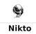

  <h2 align="center">
  SearchToolkit 
  
</h2>

  

 

  
  <strong style="display: block; margin-bottom: 5px;">「 Author 」</strong>
  <samp>
    <a href="https://web.facebook.com/ehphofficial" target="_blank" style="text-decoration: none; color: inherit;">
      <strong>EHPH member: l0n3m4n</strong>
    </a>
  </samp>

 

    
    
      
    
      
    
    

 

<h2 align="center">Search Navigation</h2>

  <a href="#pentest-and-redteaming"><b>Pentest and RedTeaming</b></a> |
  <a href="#cheatsheets"><b>Cheatsheets</b></a> |   
  <a href="#devices-and-services"><b>Devices and Services</b></a> |
  <a href="#geolocation-tracking"><b>Geolocation Tracking</b></a> | 
  <a href="#intelligence-surveillance"><b>Intelligence surveillance</b></a> | 
  <a href="#code-search"><b>Code Search</b></a> | 
  <a href="#domains"><b>Domains</b></a> | 
  <a href="#dorking"><b>Dorking</b></a> |
  <a href="#osint"><b>OSINT</b></a> |
  <a href="#attack-surface"><b>Attack Surface</b></a> |
  <a href="#programming"><b>Programming</b></a> |  
  <a href="#web-history"><b>Web History</b></a> | 
  <a href="#dns"><b>DNS</b></a> | 
  <a href="#certificates"><b>Certificates</b></a> |
  <a href="#wifi-networks"><b>WiFi</b></a> |
  <a href="#credential-leaks"><b>Credential Leaks</b></a> |
  <a href="#data-leaks"><b>Data Leaks</b></a> |
  <a href="#reverse-engineering"><b>Reverse Engineering</b></a> |
  <a href="#malware-analysis"><b>Malware Analysis</b></a> |
  <a href="#cryptography"><b>Cryptography</b></a> |
  <a href="#android"><b>Android</b></a> |
  <a href="#ctf-challenges"><b>CTF Challenges</b></a> |    
  <a href="#threat-intelligence"><b>Threat Intelligence</b></a> |  
  <a href="#browser-extensions"><b>Browser Extentions</b></a> | 
  <a href ="#forensics"><b>Forensics</b></a> |
  <a href="#bugbounty"><b>Bugbounty</b></a> | 
  <a href="#resources"><b>Resources</b></a> |
  <a href="#misc"><b>Misc</b></a> | 
  
  <h3 align="center">Attack Cycle</h3>
 <!--- If you think this attack cycle could be improved or does not fully align based on your perspective and experience, please feel free to submit a pull request. :) -->

  <a href="#discovery"><b>Discovery</b></a> |
  <a href="#vulnerability-identification"><b>Vulnerability Identification</b></a> | 
  <a href="#vulnerability-scanner"><b>Vulnerability Scanner</b></a> | 
  <a href="#social-engineering"><b>Social Engineering</b></a> |
  <a href="#payload-and-staging"><b>Payload and Staging</b></a> |
  <a href="#exploitation"><b>Exploitation</b></a> |
  <a href="#privilege-escalation"><b>Privilege Escalation</b></a> |
  <a href="#evasion"><b>Evasion</b></a> |
  <a href="#credential-dumping"><b>Credential Dumping</b></a> |
  <a href="#persistence"><b>Persistence</b></a> |
  <a href="#lateral-movement"><b>Lateral Movement</b></a> |
  <a href="#tunnelling"><b>Tunnelling</b></a> |
  <a href="#command-and-control"><b>Command and Control<b><a> |
  <a href="#data-exfiltration"><b>Data Exfiltration</b></a> |
  <a href="#securing-data"><b>Securing Data</b></a> |
  <a href="#covering-tracks"><b>Covering Tracks</b></a> |
  <a href="#reports"><b>Reports</b></a>

## Pentest and RedTeaming
> engagement, standard process, mitre att&ck, certifications and etc.

<table>
<thead>
<tr>
<th>IMAGE</th>
<th>NAME</th>
<th>LINKS</th>
<th>DESCRIPTION</th>
</tr>
</thead>
<tbody>

<tr>
<td></td>
<td><b>Pentest Standard</b></td>
<td><a href="http://www.pentest-standard.org">Website</a></td>
<td>(Engagement): A comprehensive framework designed to standardize the process of conducting penetration tests</td>
</tr>
<tr>
<td></td>
<td><b>Red-Team-Infra</b></td>
<td><a href="https://github.com/mantvydasb/Red-Team-Infrastructure-Automation">Github</a></td>
<td>(Infrastructure): Disposable and resilient red team infrastructure with Terraform</td>
</tr>
<tr>
<td></td>
<td><b>Red-Team-Infras-Wiki</b></td>
<td><a href="https://github.com/bluscreenofjeff/Red-Team-Infrastructure-Wiki">Github</a></td>
<td>(Infrastructure): Wiki to collect Red Team infrastructure hardening resources</td>
</tr>
<tr>
<td></td>
<td><b>RedInfraCraft</b></td>
<td><a href="https://github.com/RedTeamOperations/Red-Infra-Craft">Github</a></td>
<td>(Infrastructure):automates the deployment of powerful red team infrastructures! makes it easy to create advanced phishing & payload infras</td>
</tr>
</tbody>
</table>

 

[🔝 Back to top](#Search-Navigation)

## Cheatsheets

> notes, methodology , resources, techniques and etc.

<table>
<thead>
<tr>
<th>IMAGE</th>
<th>NAME</th>
<th>LINKS</th>
<th>DESCRIPTION</th>
</tr>
</thead>
<tbody>

<tr>
<td></td>
<td><b>HackTricks</b></td>
<td><a href="https://book.hacktricks.xyz/">Website</a></td>
<td>(General): HackTricks is a comprehensive resource that provides a wide range of information and tips related to pentesting, redteaming and etc. </td>
</tr>

<tr>
<td></td>
<td><b>Payloads All The Things</b></td>
<td><a href="https://github.com/swisskyrepo/PayloadsAllTheThings">Github</a></td>
<td>(General): A list of useful payloads and bypasses for Web Application Security and also a cheatsheets</td>
</tr>

<tr>
<td></td>
<td><b>Atomic RedTeam</b></td>
<td><a href="https://atomicredteam.io/atomics/">Website</a></td>
<td>(TTPs): Atomic Red Team can be used as a reference for cheatsheets. It provides detailed examples of specific commands, scripts, and guides that can be used to simulate various adversary techniques (TTPs).</td>
</tr>

<tr>
<td></td>
<td><b>OWASP Cheatsheet</b></td>
<td><a href="https://cheatsheetseries.owasp.org/index.html">Website</a></td>
<td>(Web-APP): The OWASP Cheat Sheet Series was created to provide a concise collection of high value information on specific application security topics.</td>
</tr>

<tr>
<td></td>
<td><b>Internall-all-the-things</b></td>
<td><a href="https://swisskyrepo.github.io/InternalAllTheThings/">Github.io</a></td>
<td>(General): Active Directory and Internal Pentest Cheatsheets</td>
</tr>

<tr>
<td></td>
<td><b>Arsenal</b></td>
<td><a href="https://github.com/Orange-Cyberdefense/arsenal?tab=readme-ov-file">Github</a></td>
<td>(Cheatsheets): In arsenal you can search for a command, select one and it's prefilled directly in your terminal. This functionality is independent of the shell used.</td>
</tr>

<tr>
<td></td>
<td><b>cheat.sh</b></td>
<td><a href="https://cheat.sh">Website</a></td>
<td>(Cheatsheets): Unified access to the best community driven cheat sheets repositories of the world. Covers 56 programming languages, several DBMSes, and more than 1000 most important UNIX/Linux commands.</td>
</tr>

<tr>
<td></td>
<td><b>cheat</b></td>
<td><a href="https://github.com/cheat/cheat">Github</a></td>
<td>(Cheasheets): cheat allows you to create and view interactive cheatsheets on the command-line. It was designed to help remind *nix system administrators of options for commands that they use frequently, but not frequently enough to remember.</td>
</tr>

<tr>
<td></td>
<td><b>RedTeam-Tools</b></td>
<td><a href="https://github.com/A-poc/RedTeam-Tools">Github</a></td>
<td>(Resources): A github repository contains a collection of 130+ tools and resources that can be useful for red teaming activities.</td>
</tr>

<tr>
<td></td>
<td><b>BlueTeam-Tools</b></td>
<td><a href="https://github.com/A-poc/BlueTeam-Tools">Github</a></td>
<td>(Resources): A github repository contains a collection of 65+ tools and resources that can be useful for blue teaming activities.</td>
</tr>

<tr>
<td></td>
<td><b>Activate Directory Cheatsheets</b></td>
<td><a href="https://github.com/S1ckB0y1337/Active-Directory-Exploitation-Cheat-Sheet">Github</a></td>
<td>(Cheatsheets): A cheat sheet that contains common enumeration and attack methods for Windows Active Directory. </td>
</tr>

<tr>
<td></td>
<td><b>CloudPentest</b></td>
<td><a href="https://github.com/4ndersonLin/awesome-cloud-security">Github</a></td>
<td>(Cheatsheets): 🛡️ Awesome Cloud Security Resources and cheatsheets ⚔️</td>
</tr>

<tr>
<td></td>
<td><b>RedTeam Guide</b></td>
<td><a href="https://github.com/RistBS/Awesome-RedTeam-Cheatsheet">Github</a></td>
<td>(Cheatsheets): Red Team Cheatsheet in constant expansion.</td>
</tr>

<tr>
<td></td>
<td><b>Exploits Notes</b></td>
<td><a href="https://exploit-notes.hdks.org/">Website</a></td>
<td>(Resources): Search hacking techniques and tools for penetration testings, bug bounty, CTFs. </td>
</tr>

<tr>
<td></td>
<td><b>RedTeam Cheatsheets</b></td>
<td><a href="https://github.com/wsummerhill/C2_RedTeam_CheatSheets">Github</a></td>
<td>(Cheatsheets): Useful C2 techniques and cheatsheets learned from engagements (Cobalt strike and sliver c2)</td>
</tr>

<tr>
<td></td>
<td><b>Appsecexplained</b></td>
<td><a href="https://appsecexplained.gitbook.io/appsecexplained">Gitbook</a></td>
<td>(Cheatsheets): This is a curated repository of notes and experience over many years of testing web applications. </td>
</tr>

<tr>
<td></td>
<td><b>Awesome-Pentest Cheatsheets</b></td>
<td><a href="https://github.com/ByteSnipers/awesome-pentest-cheat-sheets">Github</a></td>
<td>Collection of cheat sheets and check lists useful for security and pentesting. The list contains a huge list of very sorted and selected resources, which can help you to save a lot of time.</td>
</tr>

<tr>
<td></td>
<td><b>Awesome-Hacking</b></td>
<td><a href="https://github.com/Hack-with-Github/Awesome-Hacking">Github</a></td>
<td>(Genreal): A collection of various awesome lists for hackers, pentesters and security researchers </td>
</tr>

<tr>
<td></td>
<td><b>Awesome-Pentest</b></td>
<td><a href="https://github.com/coreb1t/awesome-pentest-cheat-sheets">Github</a></td>
<td>(General): Awesome Pentest Cheat Sheets a collection of the cheat sheets useful for pentesting </td>
</tr>

<tr>
<td></td>
<td><b>RedTeam Notes 2.0</b></td>
<td><a href="https://dmcxblue.gitbook.io/red-team-notes-2-0">Gitbook</a></td>
<td> (General): It is very beginner friendly and have everything from MITRE with more great images and high level explanations</td>
</tr>

<tr>
<td></td>
<td><b>RedTeam</b></td>
<td><a href="https://www.ired.team/">Website</a></td>
<td>(General): These are notes about all things focusing on, but not limited to, red teaming and offensive security.</td>
</tr>

<tr>
<td></td>
<td><b>Red Teaming and Malware Analysis</b></td>
<td><a href="https://gitbook.seguranca-informatica.pt/">Gitbook</a></td>
<td>(Resources): Personal notes on red teaming / pentest and malware analysis, various techniques used during assessments.</td>
</tr>

<tr>
<td></td>
<td><b>Offensive Security Cheatsheet</b></td>
<td><a href="https://cheatsheet.haax.fr/">Website</a></td>
<td>(General): Their are few useful resources for penetration testing and enumerations staff. </td>
</tr>

</tbody>
</table>
 

[🔝 Back to top](#Search-Navigation)

## Discovery

> reconnaissance, enumeration, fuzzing, AD DC, post-explotation and etc.

<table>
<thead>
<tr>
<th>IMAGE</th>
<th><b>NAME</b></th>
<th>LINKS</th>
<th>DESCRIPTION</th>
</tr>
</thead>
<tbody>

<tr>
<td></td>
<td><b>pdtm</b></td>
<td><a href="https://github.com/projectdiscovery/pdtm">GitHub</a></td>
<td>(General-Recon): ProjectDiscovery's Open Source Tool Manager </td>
</tr>

<tr>
<td></td>
<td><b>ffuf</b></td>
<td><a href="https://github.com/ffuf/ffuf">GitHub</a></td>
<td>(General-Recon): Fast web fuzzer written in Go.</td>
</tr>

<tr>
<td></td>
<td><b>gobuster</b></td>
<td><a href="https://github.com/OJ/gobuster">GitHub</a></td>
<td>(General-Recon): DNS and VHost busting tool written in Go.</td>
</tr> 

<tr>
<td></td>
<td><b>Axiom</b></td>
<td><a href="https://github.com/pry0cc/axiom">GitHub</a></td>
<td>(General-Tool): The dynamic infrastructure framework for hacking! different scanning tools with ease, including nmap, ffuf, masscan, nuclei, meg and many more! </td>
</tr> 

<tr>
<td></td>
<td><b>reconftw</b></td>
<td><a href="https://github.com/six2dez/reconftw">GitHub</a></td>
<td>(General-Recon): Perform automated recon on a target domain by running the best set of tools to perform scanning and finding out vulnerabilities </td>
</tr> 

<tr>
<td></td>
<td><b>wappalyzer</b></td>
<td><a href="https://github.com/AliasIO/wappalyzer">GitHub</a></td>
<td>(Technologies): Identify technology on websites.</td>
</tr>

<tr>
<td></td>
<td><b>Sublist3r</b></td>
<td><a href="https://github.com/aboul3la/Sublist3r">GitHub</a></td>
<td>(Subdomain): Fast subdomains enumeration tool for penetration testers</td>
</tr>

<tr>
<td></td>
<td><b>katana</b></td>
<td><a href="https://github.com/projectdiscovery/katana">GitHub</a></td>
<td>(Crawling): A next-generation crawling and spidering framework.</td>
</tr>

<tr>
<td></td>
<td><b>BloodHound</b></td>
<td><a href="https://github.com/projectdiscovery/katana">GitHub</a></td>
<td>(AD): BloodHound is a powerful tool used for Active Directory (AD) security assessments. It helps identify and analyze security vulnerabilities and relationships within an Active Directory environment.</td>

</tr>
<tr>
<td></td>
<td><b>CrackMapExec</b></td>
<td><a href="https://github.com/byt3bl33d3r/CrackMapExec">GitHub</a></td>
<td>(Network): A swiss army knife for pentesting networks </td>
</tr>

<tr>
<td></td>
<td><b>Recon-AD</b></td>
<td><a href="https://github.com/outflanknl/Recon-AD">GitHub</a></td>
<td>(AD): recon-ad tool based on ADSI and reflective DLL’s</td>
</tr>

<tr>
<td></td>
<td><b>PSPKIAudit</b></td>
<td><a href="https://github.com/GhostPack/PSPKIAudit">GitHub</a></td>
<td>(AD CS): PowerShell toolkit for auditing Active Directory Certificate Services.</td>
</tr>

<tr>
<td></td>
<td><b>powerview 3.0</b></td>
<td><a href="https://gist.github.com/HarmJ0y/184f9822b195c52dd50c379ed3117993">GitHub</a></td>
<td>(AD): Active Directory enumeration tools</td>
</tr>

<tr>
<td></td>
<td><b>ImproHound</b></td>
<td><a href="https://github.com/improsec/ImproHound">GitHub</a></td>
<td>(AD): sIdentify the attack paths in BloodHound breaking your AD tiering</td>
</tr>

<tr>
<td></td>
<td><b>ADRecon</b></td>
<td><a href="https://github.com/adrecon/ADRecon">GitHub</a></td>
<td>(AD): ADRecon is a tool which gathers information about the Active Directory and generates a report which can provide a holistic picture of the current state of the target AD environment.</td>
</tr>

<tr>
<td></td>
<td><b>Amass</b></td>
<td><a href="https://github.com/OWASP/Amass">GitHub</a></td>
<td>(Subdomain): In-depth Attack Surface Mapping and Asset Discovery</td>
</tr>

<tr>
<td></td>
<td><b>wfuzz</b></td>
<td><a href="https://github.com/xmendez/wfuzz">GitHub</a></td>
<td>(Fuzzing): Web application fuzzer.</td>
</tr>

<tr>
<td></td>
<td><b>scilla</b></td>
<td><a href="https://github.com/edoardottt/scilla">GitHub</a></td>
<td>(Subdomain): Information Gathering tool - DNS / Subdomains / Ports / Directories enumeration</td>
</tr>

<tr>
<td></td>
<td><b>httpx</b></td>
<td><a href="https://github.com/projectdiscovery/httpx">GitHub</a></td>
<td>(Technologies): Fast and multi-purpose HTTP toolkit for probing.</td>
</tr>

<tr>
<td></td>
<td><b>dirbuster-ng</b></td>
<td><a href="https://github.com/digination/dirbuster-ng">GitHub</a></td>
<td>(Directory): dirbuster-ng is C CLI implementation of the Java dirbuster tool.</td>
</tr>

<tr>
<td></td>
<td><b>massdns</b></td>
<td><a href="https://github.com/blechschmidt/massdns">GitHub</a></td>
<td>(DNS): High-performance DNS stub resolver for bulk lookups</td>
</tr>

<tr>
<td></td>
<td><b>Findomain</b></td>
<td><a href="https://github.com/Findomain/Findomain">GitHub</a></td>
<td>(Subdomain): The fastest and cross-platform subdomain enumerator</td>
</tr>

<tr>
<td></td>
<td><b>RustScan</b></td>
<td><a href="https://github.com/RustScan/RustScan">GitHub</a></td>
<td>(Ports): The Modern Port Scanner. Find ports quickly (3 seconds at its fastest). Run scripts through our scripting engine (Python, Lua, Shell supported).</td>
</tr>

<tr>
<td></td>
<td><b>gitleaks</b></td>
<td><a href="https://github.com/zricethezav/gitleaks">GitHub</a></td>
<td>(Web): Gitleaks is a SAST tool for detecting hardcoded secrets like passwords, api keys, and tokens in git repos.</td>
</tr>

<tr>
<td></td>
<td><b>s3scanner</b></td>
<td><a href="https://github.com/sa7mon/S3Scanner">GitHub</a></td>
<td>(Web): Scan for open S3 buckets and dump the contents</td>
</tr>

<tr>
<td></td>
<td><b>Whatwaf</b></td>
<td><a href="https://github.com/Ekultek/WhatWaf">GitHub</a></td>
<td>(WAF Detector): Detect and bypass web application firewalls and protection systems </td>
</tr>

<tr>
<td></td>
<td><b>cloud_enum</b></td>
<td><a href="https://github.com/initstring/cloud_enum">GitHub</a></td>
<td>(Cloud): Multi-cloud OSINT tool. Enumerate public resources in AWS, Azure, and Google Cloud.</td>
</tr>

<tr>
<td></td>
<td><b>recon-ng</b></td>
<td><a href="https://github.com/lanmaster53/recon-ng">GitHub</a></td>
<td>(Web): Open Source Intelligence gathering tool aimed at reducing the time spent harvesting information from open sources.</td>
</tr>

<tr>
<td></td>
<td><b>witnessme</b></td>
<td><a href="https://github.com/byt3bl33d3r/WitnessMe">GitHub</a></td>
<td>(Web): Inventory tool, takes screenshots of webpages using Pyppeteer (headless Chrome/Chromium) and provides some extra bells & whistles to make life easier</td>
</tr>

<tr>
<td></td>
<td><b>spoofcheck</b></td>
<td><a href="https://github.com/BishopFox/spoofcheck">GitHub</a></td>
<td>(Web): A program that checks if a domain can be spoofed from. The program checks SPF and DMARC records for weak configurations that allow spoofing.</td>
</tr>

<tr>
<td></td>
<td><b>Sudomy</b></td>
<td><a href="https://github.com/Screetsec/Sudomy">GitHub</a></td>
<td>(General): Automated reconnaissance tool for bug hunting / pentesting</td>
</tr>

<tr>
<td></td>
<td><b>chaos-client</b></td>
<td><a href="https://github.com/projectdiscovery/chaos-client">GitHub</a></td>
<td>(Subdomain): Go client to communicate with Chaos DNS API</td>
</tr>

<tr>
<td></td>
<td><b>domained</b></td>
<td><a href="https://github.com/TypeError/domained">GitHub</a></td>
<td>(Subdomain): Multi Tool Subdomain Enumeration</td>
</tr>

<tr>
<td></td>
<td><b>shuffledns</b></td>
<td><a href="https://github.com/projectdiscovery/shuffledns">GitHub</a></td>
<td>(Subdomain): Wrapper around massdns for subdomain enumeration with active bruteforce</td>
</tr>

<tr>
<td></td>
<td><b>puredns</b></td>
<td><a href="https://github.com/d3mondev/puredns">GitHub</a></td>
<td>(Subdomain): Fast domain resolver and subdomain bruteforcing</td>
</tr>

<tr>
<td></td>
<td><b>censys-subdomain-finder</b></td>
<td><a href="https://github.com/christophetd/censys-subdomain-finder">GitHub</a></td>
<td>(Subdomain): enumeration using Censys certificate transparency logs</td>
</tr>

<tr>
<td></td>
<td><b>Turbolist3r</b></td>
<td><a href="https://github.com/fleetcaptain/Turbolist3r">GitHub</a></td>
<td>(Subdomain): enumeration tool with analysis features</td>
</tr>

<tr>
<td></td>
<td><b>domain</b></td>
<td><a href="https://github.com/jhaddix/domain/">GitHub</a></td>
<td>(Subdomain): Setup script for Recon-ng for subdomain enumeration</td>
</tr>

<tr>
<td></td>
<td><b>altdns</b></td>
<td><a href="https://github.com/infosec-au/altdns">GitHub</a></td>
<td>(Subdomain): Generates permutations, alterations, and mutations of subdomains</td>
</tr>

<tr>
<td></td>
<td><b>brutesubs</b></td>
<td><a href="https://github.com/anshumanbh/brutesubs">GitHub</a></td>
<td>(Subdomain): Automation framework for running multiple subdomain bruteforcing tools</td>
</tr>

<tr>
<td></td>
<td><b>dns-parallel-prober</b></td>
<td><a href="https://github.com/lorenzog/dns-parallel-prober">GitHub</a></td>
<td>(Subdomain): Parallelised domain name prober for subdomain enumeration</td>
</tr>

<tr>
<td></td>
<td><b>dnscan</b></td>
<td><a href="https://github.com/rbsec/dnscan">GitHub</a></td>
<td>(Subdomain): Python wordlist-based DNS subdomain scanner</td>
</tr>

<tr>
<td></td>
<td><b>knock</b></td>
<td><a href="https://github.com/guelfoweb/knock">GitHub</a></td>
<td>(Subdomain): Enumerate subdomains on a target domain through a wordlist</td>
</tr>

<tr>
<td></td>
<td><b>hakrevdns</b></td>
<td><a href="https://github.com/hakluke/hakrevdns">GitHub</a></td>
<td>(DNS): Tool for performing reverse DNS lookups en masse</td>
</tr>

<tr>
<td></td>
<td><b>dnsx</b></td>
<td><a href="https://github.com/projectdiscovery/dnsx">GitHub</a></td>
<td>(Subdomain): Fast and multi-purpose DNS toolkit for running DNS queries</td>
</tr>

<tr>
<td></td>
<td><b>subfinder</b></td>
<td><a href="https://github.com/projectdiscovery/subfinder">GitHub</a></td>
<td>(Subdomain): discovery tool that finds valid subdomains for websites</td>
</tr>

<tr>
<td></td>
<td><b>assetfinder</b></td>
<td><a href="https://github.com/tomnomnom/assetfinder">GitHub</a></td>
<td>(Subdomain): Find domains and subdomains related to a given domain</td>
</tr>

<tr>
<td></td>
<td><b>VHostScan</b></td>
<td><a href="https://github.com/codingo/VHostScan">GitHub</a></td>
<td>(Vhost): Virtual host scanner that performs reverse lookups</td>
</tr>

<tr>
<td></td>
<td><b>sub3suite</b></td>
<td><a href="https://github.com/3nock/sub3suite">GitHub</a></td>
<td>(Subdomain): Research-grade suite of tools for subdomain enumeration</td>
</tr>

<tr>
<td></td>
<td><b>cero</b></td>
<td><a href="https://github.com/glebarez/cero">GitHub</a></td>
<td>(Subdomain): Scrape domain names from SSL certificates of arbitrary hosts</td>
</tr>

<tr>
<td></td>
<td><b>shosubgo</b></td>
<td><a href="https://github.com/incogbyte/shosubgo">GitHub</a></td>
<td>(Subdomain): Tool to grab subdomains using Shodan API</td>
</tr>

<tr>
<td></td>
<td><b>haktrails</b></td>
<td><a href="https://github.com/hakluke/haktrails">GitHub</a></td>
<td>(Subdomain): Golang client for querying SecurityTrails API data</td>
</tr>

<tr>
<td></td>
<td><b>bbot</b></td>
<td><a href="https://github.com/blacklanternsecurity/bbot">GitHub</a></td>
<td>(Subdomain): Recursive internet scanner for hackers</td>
</tr>

<tr>
<td></td>
<td><b>webanalyze</b></td>
<td><a href="https://github.com/rverton/webanalyze">GitHub</a></td>
<td>(Technologies): Port of Wappalyzer to automate mass scanning.</td>
</tr>
 
<tr>
<td></td>
<td><b>whatweb</b></td>
<td><a href="https://github.com/urbanadventurer/whatweb">GitHub</a></td>
<td>(Technologies): Next generation web scanner.</td>
</tr>

<tr>
<td></td>
<td><b>retire.js</b></td>
<td><a href="https://github.com/RetireJS/retire.js">GitHub</a></td>
<td>(Technologies): Scanner detecting JavaScript libraries with known vulnerabilities.</td>
</tr>

<tr>
<td></td>
<td><b>fingerprintx</b></td>
<td><a href="https://github.com/praetorian-inc/fingerprintx">GitHub</a></td>
<td>(Technologies): Standalone utility for service discovery on open ports.</td>
</tr>

<tr>
<td></td>
<td><b>recursebuster</b></td>
<td><a href="https://github.com/C-Sto/recursebuster">GitHub</a></td>
<td>(Content-Discovery): Rapid content discovery tool for recursively querying webservers.</td>
</tr>

<tr>
<td></td>
<td><b>feroxbuster</b></td>
<td><a href="https://github.com/epi052/feroxbuster">GitHub</a></td>
<td>(Content-Discovery): A fast, simple, recursive content discovery tool written in Rust.</td>
</tr>

<tr>
<td></td>
<td><b>dirsearch</b></td>
<td><a href="https://github.com/maurosoria/dirsearch">GitHub</a></td>
<td>(Content-Discovery): Web path scanner.</td>
</tr>

<tr>
<td></td>
<td><b>dirsearch</b></td>
<td><a href="https://github.com/evilsocket/dirsearch">GitHub</a></td>
<td>(Content-Discovery): A Go implementation of dirsearch.</td>
</tr>

<tr>
<td></td>
<td><b>filebuster</b></td>
<td><a href="https://github.com/henshin/filebuster">GitHub</a></td>
<td>(Content-Discovery): An extremely fast and flexible web fuzzer.</td>
</tr>

<tr>
<td></td>
<td><b>dirstalk</b></td>
<td><a href="https://github.com/stefanoj3/dirstalk">GitHub</a></td>
<td>(Content-Discovery): Modern alternative to dirbuster/dirb.</td>
</tr>

<tr>
<td></td>
<td><b>gospider</b></td>
<td><a href="https://github.com/jaeles-project/gospider">GitHub</a></td>
<td>(Content-Discovery): Gospider - Fast web spider written in Go.</td>
</tr>

<tr>
<td></td>
<td><b>hakrawler</b></td>
<td><a href="https://github.com/hakluke/hakrawler">GitHub</a></td>
<td>(Content-Discovery): Simple, fast web crawler designed for easy, quick discovery of endpoints and assets within a web application.</td>
</tr>

<tr>
<td></td>
<td><b>crawley</b></td>
<td><a href="https://github.com/s0rg/crawley">GitHub</a></td>
<td>(Content-Discovery): Fast, feature-rich unix-way web scraper/crawler written in Golang.</td>
</tr>

<tr>
<td></td>
<td><b>LinkFinder</b></td>
<td><a href="https://github.com/GerbenJavado/LinkFinder">GitHub</a></td>
<td>(Links): A python script that finds endpoints in JavaScript files.</td>
</tr>

<tr>
<td></td>
<td><b>JS-Scan</b></td>
<td><a href="https://github.com/zseano/JS-Scan">GitHub</a></td>
<td>(Links): A .js scanner built in PHP, designed to scrape URLs and other information.</td>
</tr>

<tr>
<td></td>
<td><b>GoLinkFinder</b></td>
<td><a href="https://github.com/0xsha/GoLinkFinder">GitHub</a></td>
<td>(Links): A fast and minimal JS endpoint extractor.</td>
</tr>

<tr>
<td></td>
<td><b>BurpJSLinkFinder</b></td>
<td><a href="https://github.com/InitRoot/BurpJSLinkFinder">GitHub</a></td>
<td>(Links): Burp Extension for passive scanning of JS files for endpoint links.</td>
</tr>

<tr>
<td></td>
<td><b>urlgrab</b></td>
<td><a href="https://github.com/IAmStoxe/urlgrab">GitHub</a></td>
<td>(Links): A Go utility to spider through a website searching for additional links.</td>
</tr>

<tr>
<td></td>
<td><b>waybackurls</b></td>
<td><a href="https://github.com/tomnomnom/waybackurls">GitHub</a></td>
<td>(Links): Fetches all URLs that the Wayback Machine knows about for a domain.</td>
</tr>

<tr>
<td></td>
<td><b>gau</b></td>
<td><a href="https://github.com/lc/gau">GitHub</a></td>
<td>(Links): Fetches known URLs from AlienVault's Open Threat Exchange, the Wayback Machine, and Common Crawl.</td>
</tr>

<tr>
<td></td>
<td><b>getJS</b></td>
<td><a href="https://github.com/003random/getJS">GitHub</a></td>
<td>(Links): A tool to quickly get all JavaScript sources/files.</td>
</tr>

<tr>
<td></td>
<td><b>linx</b></td>
<td><a href="https://github.com/riza/linx">GitHub</a></td>
<td>(Links): Reveals invisible links within JavaScript files.</td>
</tr>

<tr>
<td></td>
<td><b>waymore</b></td>
<td><a href="https://github.com/xnl-h4ck3r/waymore">GitHub</a></td>
<td>(Links): Finds more from the Wayback Machine.</td>
</tr>

<tr>
<td></td>
<td><b>xnLinkFinder</b></td>
<td><a href="https://github.com/xnl-h4ck3r/xnLinkFinder">GitHub</a></td>
<td>(Links): A Python tool used to discover endpoints, potential parameters, and a target specific wordlist for a given target.</td>
</tr>

<tr>
<td></td>
<td><b>parameth</b></td>
<td><a href="https://github.com/maK-/parameth">GitHub</a></td>
<td>(Parameters): Tool for brute discovering GET and POST parameters.</td>
</tr>

<tr>
<td></td>
<td><b>param-miner</b></td>
<td><a href="https://github.com/PortSwigger/param-miner">GitHub</a></td>
<td>(Parameters): Identifies hidden, unlinked parameters, useful for finding web cache poisoning vulnerabilities.</td>
</tr>

<tr>
<td></td>
<td><b>ParamPamPam</b></td>
<td><a href="https://github.com/Bo0oM/ParamPamPam">GitHub</a></td>
<td>(Parameters): Tool for brute discovering GET and POST parameters.</td>
</tr>

<tr>
<td></td>
<td><b>Arjun</b></td>
<td><a href="https://github.com/s0md3v/Arjun">GitHub</a></td>
<td>(Parameters): HTTP parameter discovery suite.</td>
</tr>

<tr>
<td></td>
<td><b>ParamSpider</b></td>
<td><a href="https://github.com/devanshbatham/ParamSpider">GitHub</a></td>
<td>(Parameters): Mines parameters from dark corners of Web Archives.</td>
</tr>

<tr>
<td></td>
<td><b>x8</b></td>
<td><a href="https://github.com/Sh1Yo/x8">GitHub</a></td>
<td>(Parameters): Hidden parameters discovery suite written in Rust.</td>
</tr>

<tr>
<td></td>
<td><b>fuzzdb</b></td>
<td><a href="https://github.com/fuzzdb-project/fuzzdb">GitHub</a></td>
<td>(Fuzzing): Dictionary of attack patterns and primitives for black-box application fault injection and resource discovery.</td>
</tr>

<tr>
<td></td>
<td><b>IntruderPayloads</b></td>
<td><a href="https://github.com/1N3/IntruderPayloads">GitHub</a></td>
<td>(Fuzzing): Collection of Burpsuite Intruder payloads, fuzz lists, and web pentesting methodologies.</td>
</tr>

<tr>
<td></td>
<td><b>fuzz.txt</b></td>
<td><a href="https://github.com/Bo0oM/fuzz.txt">GitHub</a></td>
<td>(Fuzzing): Potentially dangerous files.</td>
</tr>

<tr>
<td></td>
<td><b>fuzzilli</b></td>
<td><a href="https://github.com/googleprojectzero/fuzzilli">GitHub</a></td>
<td>(Fuzzing): JavaScript Engine Fuzzer.</td>
</tr> 

<tr>
<td></td>
<td><b>qsfuzz</b></td>
<td><a href="https://github.com/ameenmaali/qsfuzz">GitHub</a></td>
<td>(Fuzzing): Allows building custom rules to fuzz query strings and identify vulnerabilities.</td>
</tr>

<tr>
<td></td>
<td><b>vaf</b></td>
<td><a href="https://github.com/d4rckh/vaf">GitHub</a></td>
<td>(Fuzzing): Very advanced (web) fuzzer written in Nim.</td>
</tr>

<tr>
<td></td>
<td><b>CMSeeK</b></td>
<td><a href="https://github.com/Tuhinshubhra/CMSeeK">GitHub</a></td>
<td>(CMS Detection): Scan WordPress, Joomla, Drupal and over 180 other CMSs </td>
</tr>

<tr>
<td></td>
<td><b>cms-wordlists</b></td>
<td><a href="https://github.com/p0dalirius/webapp-wordlists">GitHub</a></td>
<td>(CMS Wordlists): contains wordlists for each versions of common web applications (CMS). Each version contains a wordlist of all the files directories for this version. </td>
</tr>

<tr>
<td></td>
<td><b>GitFive</b></td>
<td><a href="https://github.com/mxrch/GitFive">GitHub</a></td>
<td>(Git/OSINT): GitFive is an OSINT tool to investigate GitHub profiles.</td>
</tr>

<tr>
<td></td>
<td><b>gixposed</b></td>
<td><a href="https://github.com/WH1T3-E4GL3/gixposed?">GitHub</a></td>
<td>(Git/OSINT): Gixposed is a powerful command-line tool designed to search the commit history of Git repositories for sensitive information, such as API keys and access tokens. </td>
</tr>

<tr>
<td></td>
<td><b>Gitdumper</b></td>
<td><a href="https://github.com/arthaud/git-dumper">GitHub</a></td>
<td>(Git): A tool to dump a git repository from a website </td>
</tr>

<tr>
<td></td>
<td><b>Eviltree</b></td>
<td><a href="https://github.com/t3l3machus/eviltree">GitHub</a></td>
<td>(Regex): Searching for secrets (passwords/accounts) in files of nested directory structures, being able to visualize which files contain user provided keywords/regex patterns and where those files are located.</td>
</tr>

<tr>
<td></td>
<td><b>Beeceptor</b></td>
<td><a href="https://beeceptor.com/">Website</a></td>
<td>(webhook): Instantly create a webhook and mock a server over HTTPS</td>
</tr>

<tr>
<td></td>
<td><b>webhooks</b></td>
<td><a href="https://github.com/l0n3m4n/webhook">Github</a></td>
<td>(webhook): Lightweight HTTP Server with Public Exposure for Pentesting, Red Teaming and Bughunting</td>
</tr>

<tr>
<td></td>
<td><b>assetnote wordlists</b></td>
<td><a href="https://wordlists.assetnote.io/">Website</a></td>
<td>(wordlists): This website provides you with wordlists that are up to date and effective against the most popular technologies on the internet.</td>
</tr>

</tbody>
</table>
 

[🔝 Back to top](#Search-Navigation)

## Devices and Services

> servers, IoT, routers and etc.

<table>
<thead>
<tr>
<th>IMAGE</th>
<th>NAME</th>
<th>LINKS</th>
<th>DESCRIPTION</th>
</tr>
</thead>
<tbody>
<tr>
<td></td>
<td><b>Shodan</b></td>
<td><a href="https://shodan.io">Website</a></td>
<td>Search Engine for the Internet of Everything.</td>
</tr>
<tr>
<td></td>
<td><b>Censys Search</b></td>
<td><a href="https://search.censys.io/">Website</a></td>
<td>Search Engine for every server on the Internet to reduce exposure and improve security.</td>
</tr>

<tr>
<td></td>
<td><b>FOFA</b></td>
<td><a href="https://fofa.info/">Website</a></td>
<td>Cyberspace Mapping</td>
</tr>

<tr>
<td></td>
<td><b>Hunter.how</b></td>
<td><a href="https://hunter.how/">Website</a></td>
<td>Internet search engine for security researchers.</td>
</tr>

<tr>
<td></td>
<td><b>Onyphe</b></td>
<td><a href="https://www.onyphe.io">Website</a></td>
<td>Cyber Defense search engine for open-source and cyber threat intelligence data.</td>
</tr>

<tr>
<td></td>
<td><b>ZoomEye</b></td>
<td><a href="https://zoomeye.org/">Website</a></td>
<td>Global Cyberspace mapping.</td>
</tr>

<tr>
<td></td>
<td><b>GreyNoise</b></td>
<td><a href="https://viz.greynoise.io/">Website</a></td>
<td>The source for understanding internet noise.</td>
</tr>

<tr>
<td></td>
<td><b>Netlas</b></td>
<td><a href="https://netlas.io/">Website</a></td>
<td>Discove, Research and monitor any assets available online.</td>
</tr>

<tr>
<td></td>
<td><b>Quake</b></td>
<td><a href="https://quake.360.net/quake/#/index/">Website</a></td>
<td>Global Cyberspace Surveying and mapping system.</td>
</tr>

<tr>
<td></td>
<td><b>Qualys SSL Labs</b></td>
<td><a href="https://www.ssllabs.com/ssltest/">Website</a></td>
<td>This free online service performs a deep analysis of the configuration of any SSL web server on the public Internet. </td>
</tr>

</tbody>
</table>
 

[🔝 Back to top](#Search-Navigation)

### Geolocation Tracking

> tracking computers, laptop, Androids, iOS, Bluetooth, Realtime tracking, IoT devices, Social Engineering monitoring.  

<table>
  <thead>
    <tr>
      <th>IMAGE</th>
      <th>NAMES</th>
      <th>LINKS</th>
      <th>DESCRIPTIONS</th>
    </tr>
  </thead>
  <tbody>
    <tr>
      <td></td>
      <td><b>HoneyBadgerV3</b></td>
      <td><a href="https://adhdproject.github.io/#!Tools/Attribution/HoneyBadger.md">Website</a>
      <a href="https://github.com/adhdproject/honeybadger">Github</a></td>
      <td>(WIFI/Phishing/meterpreter): HoneyBadger is an Active Defense tool to determine who the malicious actor is and where they are located in realtime locatio (Desktop, Mobile).</td>
    </tr>
    <tr>
      <td></td>
      <td><b>Seeker</b></td>
      <td><a href="https://github.com/thewhiteh4t/seeker">Github</a></td>
      <td>(Phishing): Seeker a is host phishing pages to get credentials by hosting a fake page that requests your location like many popular location based websites.</td>
    </tr>
     <tr>
      <td></td>
      <td><b>Grabify IP Logger</b></td>
      <td><a href="https://grabify.link">Website</a></td>
      <td>(SocialEngineering): Grabify IP logger will help you find and track the IP address of any person.</td>
    </tr>
      <tr>
      <td></td>
      <td><b>QCSuper</b></td>
      <td><a href="https://github.com/P1sec/QCSuper">Github</a></td>
      <td>(hardware/triangulation): QCSuper is a tool communicating with Qualcomm-based phones and modems, allowing to capture raw 2G/3G/4G radio frames, among other things. </td>
    </tr>
     <tr>
      <td></td>
      <td><b>SigPloit </b></td>
      <td><a href="https://github.com/SigPloiter/SigPloit">Github</a></td>
      <td>(Mobile/ISMI/SS7): SigPloit: Telecom Signaling Exploitation Framework - SS7, GTP, Diameter & SIP </td>
    </tr>
      <tr>
      <td></td>
      <td><b>Silent SMS Ping</b></td>
      <td><a href="https://github.com/MatejKovacic/silent-sms-ping">Github</a></td>
      <td>(Mobile/Detector/Ping):  Silent SMS ping and detector an android application for detecting (and sending) Class-0 silent SMS messages (binary messages) that does not require rooted device.</td>
    </tr>
    </tbody>
    </table>
     

[🔝 Back to top](#Search-Navigation)

### Intelligence surveillance

> HUMINT, SIGINT, COMINT, Telcos, IMSI catcher, Drones Interception, Cellular Interception, WIFI Interception, SMS senders, Jammer, Polygraph, VoIP, LRF, Bluetooth and etc.

<table>
  <thead>
    <tr>
      <th>IMAGE</th>
      <th>NAMES</th>
      <th>LINKS</th>
      <th>DESCRIPTIONS</th>
    </tr>
  </thead>
  <tbody>
    <tr>
      <td></td>
      <td><b>Intercept Monitoring System</b></td>
      <td><a href="https://www.intercept.ws/">Website</a>
      <td>(Hardware/Software/Resources/Shops): Note: not-verified. Advanced Interception Systems. Intelligence and surveillance etc.</td>
    </tr>
     <tr>
      <td></td>
      <td><b>Discovery Telecom</b></td>
      <td><a href="https://www.discoverytelecom.eu/">Original Website</a>
      <td>(Note: not-verified Shops): Advanced Interception Systems. Intelligence and surveillance etc.</td>
    </tr>
    <tr>
      <td></td>
      <td><b>DragonOS SDR </b></td>
      <td><a href="https://cemaxecuter.com/">Website</a>
      <td>(SDR/OS/Linux): specifically designed for (SDR) enthusiasts, pre-installed with a wide range of open-source SDR tools and software like GNU Radio, GQRX, easily capture, analyz.</td>
    </tr>
  </tbody>
</table>
 

[🔝 Back to top](#Search-Navigation)

## Vulnerability Identification

<table>
<thead>
<tr>
<th>IMAGE</th>
<th><b>NAME</b></th>
<th>LINKS</th>
<th>DESCRIPTION</th>
</tr>
</thead>
<tbody>

<tr>
<td></td>
<td><b>NIST NVD</b></td>
<td><a href="https://nvd.nist.gov/vuln/search">Website</a></td>
<td>US National Vulnerability Database</td>
</tr>

<tr>
<td></td>
<td><b>MITRE CVE</b></td>
<td><a href="https://cve.mitre.org/cve/search_cve_list.html">Website</a></td>
<td>Identify, define, and catalog publicly disclosed cybersecurity vulnerabilities</td>
</tr>

<tr>
<td></td>
<td><b>CVE Search</b></td>
<td><a href="https://github.com/cve-search/cve-search">Github</a></td>
<td>The main objective of the "cve search" is to avoid doing direct and public lookups into the public CVE databases.</td>
</tr>

<tr>
<td></td>
<td><b>GitHub Advisory Database</b></td>
<td><a href="https://github.com/advisories">Github</a></td>
<td>Security vulnerability database inclusive of CVEs and GitHub originated security advisories</td>
</tr>

<tr>
<td></td>
<td><b>AttackerKB</b></td>
<td><a href="https://attackerkb.com/">Website</a></td>
<td> AttackerKB is a technical analysis tool on which you can search vulnerabilities that are rated by the community.</td>
</tr>

<tr>
<td></td>
<td><b>Cloudvulndb.org</b></td>
<td><a href="https://www.cloudvulndb.org/">Website</a></td>
<td>The Open Cloud Vulnerability & Security Issue Database</td>
</tr>

<tr>
<td></td>
<td><b>Osv.dev</b></td>
<td><a href="https://osv.dev/list">Website</a></td>
<td>Open Source Vulnerabilities</td>
</tr>

<tr>
<td></td>
<td><b>Vulners.com</b></td>
<td><a href="https://vulners.com/">Website</a></td>
<td>Your Search Engine for Security Intelligence</td>
</tr>

<tr>
<td></td>
<td><b>Opencve.io</b></td>
<td><a href="https://www.opencve.io/cve">Website</a></td>
<td>Easiest way to track CVE updates and be alerted about new vulnerabilities</td>
</tr>

<tr>
<td></td>
<td><b>Security.snyk.io</b></td>
<td><a href="https://security.snyk.io/">Website</a></td>
<td>Open Source Vulnerability Database</td>
</tr>

<tr>
<td></td>
<td><b>Mend Vulnerability Database</b></td>
<td><a href="https://www.mend.io/vulnerability-database/">Website</a></td>
<td>The largest open source vulnerability DB</td>
</tr>

<tr>
<td></td>
<td><b>Rapid7 - DB</b></td>
<td><a href="https://www.rapid7.com/db/">Website</a></td>
<td>Vulnerability &  Database</td>
</tr>

<tr>
<td></td>
<td><b>CVE Details</b></td>
<td><a href="https://www.cvedetails.com/">Website</a></td>
<td>The ultimate security vulnerability datasource</td>
</tr>

<tr>
<td></td>
<td><b>VulnIQ</b></td>
<td><a href="https://vulniq.com/">Website</a></td>
<td>Vulnerability intelligence and management solution</td>
</tr>

<tr>
<td></td>
<td><b>SynapsInt</b></td>
<td><a href="https://synapsint.com/">Website</a></td>
<td>The unified OSINT research tool</td>
</tr>

<tr>
<td></td>
<td><b>Aqua Vulnerability Database</b></td>
<td><a href="https://avd.aquasec.com/">Website</a></td>
<td>Vulnerabilities and weaknesses in open source applications and cloud native infrastructure</td>
</tr>

<tr>
<td></td>
<td><b>VulDB</b></td>
<td><a href="https://vuldb.com/">Website</a></td>
<td>Number one vulnerability database</td>
</tr>

<tr>
<td></td>
<td><b>ScanFactory</b></td>
<td><a href="https://in.scanfactory.io/cvemon.html">Website</a></td>
<td>Realtime Security Monitoring</td>
</tr>

<tr>
<td></td>
<td><b>Trend Micro Zero Day Initiative</b></td>
<td><a href="https://www.zerodayinitiative.com/advisories/published/">Website</a></td>
<td>Publicly disclosed vulnerabilities discovered by Zero Day Initiative researchers</td>
</tr>

<tr>
<td></td>
<td><b>Google Project Zero</b></td>
<td><a href="https://bugs.chromium.org/p/project-zero/issues/list?can=1&q=&sort=-id&colspec=ID%20Type%20Status%20Priority%20Milestone%20Owner%20Summary">Website</a></td>
<td>Vulnerabilities including Zero Days</td>
</tr>

<tr>
<td></td>
<td><b>Trickest CVE Repository</b></td>
<td><a href="https://github.com/trickest/cve">GitHub</a></td>
<td>Gather and update all available and newest CVEs with their PoC</td>
</tr>

<tr>
<td></td>
<td><b>Cnvd.org.cn</b></td>
<td><a href="https://www.cnvd.org.cn/">Website</a></td>
<td>Chinese National Vulnerability Database</td>
</tr>

<tr>
<td></td>
<td><b>InTheWild.io</b></td>
<td><a href="https://inthewild.io/feed">Website</a></td>
<td>Check CVEs in our free, open source feed of exploited vulnerabilities</td>
</tr>

<tr>
<td></td>
<td><b>Vulnerability Lab</b></td>
<td><a href="https://www.vulnerability-lab.com/">Website</a></td>
<td>Vulnerability research, bug bounties, and vulnerability assessments</td>
</tr>

<tr>
<td></td>
<td><b>Red Hat Security Advisories</b></td>
<td><a href="https://access.redhat.com/security/security-updates/">Website</a></td>
<td>Information about security flaws that affect Red Hat products and services in the form of security advisories</td>
</tr>

<tr>
<td></td>
<td><b>Cisco Security Advisories</b></td>
<td><a href="https://sec.cloudapps.cisco.com/security/center/publicationListing.x">Website</a></td>
<td>Security advisories and vulnerability information for Cisco products, including network equipment and software</td>
</tr>

<tr>
<td></td>
<td><b>Microsoft Security Response Center</b></td>
<td><a href="https://msrc.microsoft.com/update-guide/en-us">Website</a></td>
<td>Reports of security vulnerabilities affecting Microsoft products and services</td>
</tr>

<tr>
<td></td>
<td><b>CISA</b></td>
<td><a href="https://www.cisa.gov/known-exploited-vulnerabilities-catalog">Website</a></td>
<td>Known Exploited Vulnerabilities Catalog</td>
</tr>

</tbody>
</table>
 

[🔝 Back to top](#Search-Navigation)
 
## Vulnerability Scanner

<table>
<thead>
<tr>
<th>IMAGE</th>
<th><b>NAME</b></th>
<th>LINKS</th>
<th>DESCRIPTION</th>
</tr>
</thead>
<tbody>

<tr>
<td></td>
<td><b>Nuclei</b></td>
<td><a href="https://github.com/projectdiscovery/nuclei">GitHub</a></td>
<td>(Network-Web): Fast and customizable vulnerability scanner based on simple YAML based DSL.</td>
</tr>

<tr>
<td></td>
<td><b>OWASP ZAP</b></td>
<td><a href="https://github.com/zaproxy/zaproxy">GitHub</a></td>
<td>(Web): Dynamic application security testing tool for finding vulnerabilities in web applications.</td>
</tr>

<tr>
<td></td>
<td><b>Nmap</b></td>
<td><a href="https://github.com/nmap/nmap">GitHub</a></td>
<td>(Network-Web): Powerful network scanner with built-in vulnerability scanning capabilities.</td>
</tr>

<tr>
<td></td>
<td><b>Vulnscan</b></td>
<td><a href="https://github.com/scipag/vulscan">GitHub</a></td>
<td>(Network-Web): Vulnerability scanning and management tool.</td>
</tr>

<tr>
<td></td>
<td><b>vulners</b></td>
<td><a href="https://github.com/vulnersCom/nmap-vulners">GitHub</a></td>
<td>(Network-Web):  NSE script based on Vulners.com API </td>
</tr>

<tr>
<td></td>
<td><b>Nikto</b></td>
<td><a href="https://github.com/sullo/nikto">GitHub</a></td>
<td>(Web): Web server scanner for detecting vulnerabilities and misconfigurations.</td>
</tr>

<tr>
<td></td>
<td><b>Metasploit</b></td>
<td><a href="https://github.com/rapid7/metasploit-framework">Github</a></td>
<td>(Network-Web): Computer security project that provides information about security vulnerabilities and aids in penetration testing and IDS signature development.</td>
</tr>

<tr>
<td></td>
<td><b>Arachni</b></td>
<td><a href="https://github.com/arachni/arachni">GitHub</a></td>
<td>(Web): Modular web application security scanner.</td>
</tr>

<tr>
<td></td>
<td><b>OpenVAS</b></td>
<td><a href="https://github.com/greenbone">GitHub</a></td>
<td>(Network-Web): Comprehensive vulnerability scanner for network services and applications.</td>
</tr>

<tr>
<td></td>
<td><b>Nexpose</b></td>
<td><a href="https://www.rapid7.com/products/nexpose">Website</a></td>
<td>(Network-Web): Nexpose is a comprehensive vulnerability management solution developed by Rapid7. It is designed to help organizations proactively identify, assess, and address security vulnerabilities across their IT environments</td>
</tr>

<tr>
<td></td>
<td><b>Wapiti</b></td>
<td><a href="https://github.com/wapiti-scanner/wapiti">GitHub</a></td>
<td>(Web): vulnerability scanner for black-box scanning.</td>
</tr>

<tr>
<td></td>
<td><b>Vuls</b></td>
<td><a href="https://github.com/future-architect/vuls">GitHub</a></td>
<td>(Network-Web): Agent-less vulnerability scanner for Linux, FreeBSD, Container, WordPress, Programming language libraries, Network devices.</td>
</tr>

<tr>
<td></td>
<td><b>Retire.js</b></td>
<td><a href="https://github.com/retirejs/retire.js">GitHub</a></td>
<td>(Web): Scans for outdated JavaScript libraries with known vulnerabilities.</td>
</tr>

<tr>
<td></td>
<td><b>Clair</b></td>
<td><a href="https://github.com/quay/clair">GitHub</a></td>
<td>(Network): Static analysis of vulnerabilities in container images.</td>
</tr>

<tr>
<td></td>
<td><b>Trivy</b></td>
<td><a href="https://github.com/aquasecurity/trivy">GitHub</a></td>
<td>(Network-Web): Vulnerability scanner for container images and other artifacts.</td>
</tr>

<tr>
<td></td>
<td><b>Bandit</b></td>
<td><a href="https://github.com/PyCQA/bandit">GitHub</a></td>
<td>(Programming): Finds common security issues in Python code.</td>
</tr>

<tr>
<td></td>
<td><b>Grouper</b></td>
<td><a href="https://github.com/l0ss/Grouper">GitHub</a></td>
<td>(Network): A PowerShell script for helping to find vulnerable settings in AD Group Policy. (deprecated, use Grouper2 instead!)</td>
</tr>

<tr>
<td></td>
<td><b>SecLists</b></td>
<td><a href="https://github.com/danielmiessler/SecLists">GitHub</a></td>
<td>(wordlists): Collection of multiple lists used in security assessments.</td>
</tr>

<tr>
<td></td>
<td><b>SonarQube (Community Edition)</b></td>
<td><a href="https://github.com/SonarSource/sonarqube">GitHub</a></td>
<td>(Web): Code quality and security analysis tool.</td>
</tr>

<tr>
<td></td>
<td><b>Docker-Bench-Security</b></td>
<td><a href="https://github.com/docker/docker-bench-security">GitHub</a></td>
<td>(Network): Checks Docker containers against best security practices.</td>
</tr>

<tr>
<td></td>
<td><b>Snyk CLI</b></td>
<td><a href="https://github.com/snyk/snyk">GitHub</a></td>
<td>(Network): Finds and fixes vulnerabilities in dependencies and Docker images.</td>
</tr>

<tr>
<td></td>
<td><b>OWASP Dependency-Check</b></td>
<td><a href="https://github.com/jeremylong/DependencyCheck">GitHub</a></td>
<td>(Web): Identifies project dependencies with known vulnerabilities.</td>
</tr>

<tr>
<td></td>
<td><b>Forta</b></td>
<td><a href="https://github.com/kovart/forta-attack-simulation">GitHub</a></td>
<td>(Web): Real-time vulnerability detection for Ethereum smart contracts.</td>
</tr>

<tr>
<td></td>
<td><b>sqlmap</b></td>
<td><a href="https://github.com/sqlmapproject/sqlmap">GitHub</a></td>
<td>(Web): Automatic SQL injection and database takeover tool.</td>
</tr>

<tr>
<td></td>
<td><b>xray</b></td>
<td><a href="https://github.com/chaitin/xray">GitHub</a></td>
<td>(Web): A complete security assessment tool that supports scanning of common web security issues and custom POC | Be sure to read the documentation before using it.</td>
</tr>

<tr>
<td></td>
<td><b>osv-scanner</b></td>
<td><a href="https://github.com/google/osv-scanner">GitHub</a></td>
<td>(Web): Vulnerability scanner written in Go which uses the data provided by.</td>
</tr>

<tr>
<td></td>
<td><b>commix</b></td>
<td><a href="https://github.com/commixproject/commix">GitHub</a></td>
<td>(Web): Automated All-in-One OS Command Injection Exploitation Tool.</td>
</tr>

<tr>
<td></td>
<td><b>afrog</b></td>
<td><a href="https://github.com/zan8in/afrog">GitHub</a></td>
<td>(Network-Web): afrog is a high-performance vulnerability scanner that is fast and stable. It supports user-defined PoC and comes with several built-in types, such as CVE, CNVD, default passwords, information disclosure, fingerprint identification, unauthorized access, arbitrary file reading, and command execution.</td>
</tr>

<tr>
<td></td>
<td><b>Nettacker</b></td>
<td><a href="https://github.com/OWASP/Nettacker">GitHub</a></td>
<td>(Network): Automated Penetration Testing Framework - Open-Source Vulnerability Scanner - Vulnerability Management.</td>
</tr>

<tr>
<td></td>
<td><b>Raccoon</b></td>
<td><a href="https://github.com/evyatarmeged/Raccoon">GitHub</a></td>
<td>(Web): A high-performance offensive security tool for reconnaissance and vulnerability scanning.</td>
</tr>

<tr>
<td></td>
<td><b>fuxploider</b></td>
<td><a href="https://github.com/almandin/fuxploider">GitHub</a></td>
<td>(Web): File upload vulnerability scanner and exploitation tool.</td>
</tr>

<tr>
<td></td>
<td><b>crawlergo</b></td>
<td><a href="https://github.com/Qianlitp/crawlergo">GitHub</a></td>
<td>(Web): A powerful browser crawler for web vulnerability scanners.</td>
</tr>
 
<tr>
<td></td>
<td><b>Golismero</b></td>
<td><a href="https://github.com/golismero/golismero">GitHub</a></td>
<td>(Web): Open-source security tool for web application assessment.</td>
</tr> 

<tr>
<td></td>
<td><b>Sn1per</b></td>
<td><a href="https://github.com/1N3/Sn1per">GitHub</a></td>
<td>(Network-Web): Penetration testing tool for vulnerability scanning and enumeration.</td>
</tr>

<tr>
<td></td>
<td><b>WhiteWidow</b></td>
<td><a href="https://github.com/WhitewidowScanner/whitewidow  ">GitHub</a></td>
<td>(Web):  SQL Vulnerability Scanner </td>
</tr>

<tr>
<td></td>
<td><b>w3af</b></td>
<td><a href="https://github.com/andresriancho/w3af">GitHub</a></td>
<td>(Web): Application Attack and Audit Framework.</td>
</tr>

</tbody>
</table>
 

[🔝 Back to top](#Search-Navigation)

## Exploitation

<table>
<thead>
<tr>
<th>IMAGE</th>
<th><b>NAME</b></th>
<th>LINKS</th>
<th>DESCRIPTION</th>
</tr>
</thead>
<tbody>

<tr>
<td></td>
<td><b>Exploit-DB</b></td>
<td><a href="https://www.exploit-db.com/">Website</a></td>
<td>Exploit Database</td>
</tr>

<tr>
<td></td>
<td><b>Sploitus</b></td>
<td><a href="https://sploitus.com/">Website</a></td>
<td>(PoC): Convenient central place for identifying the newest exploits</td>
</tr>

<tr>
<td></td>
<td><b>Rapid7 - DB</b></td>
<td><a href="https://www.rapid7.com/db/">Website</a></td>
<td>(Databse): Vulnerability & Exploit Database</td>
</tr>

<tr>
<td></td>
<td><b>Vulmon</b></td>
<td><a href="https://vulmon.com/">Website</a></td>
<td>(Database): Vulnerability and exploit search engine</td>
</tr>

<tr>
<td></td>
<td><b>packetstormsecurity.com</b></td>
<td><a href="https://packetstormsecurity.com/">Website</a></td>
<td>Information Security Services, News, Files, Tools, Exploits, Advisories, and Whitepapers</td>
</tr>

<tr>
<td></td>
<td><b>0day.today</b></td>
<td><a href="https://0day.today/">Website</a></td>
<td>Ultimate database of exploits and vulnerabilities</td>
</tr>

<tr>
<td></td>
<td><b>LOLBAS</b></td>
<td><a href="https://lolbas-project.github.io/">Github</a></td>
<td>(Windows): Living Off The Land Binaries, Scripts and Libraries</td>
</tr>

<tr>
<td></td>
<td><b>GTFOBins</b></td>
<td><a href="https://gtfobins.github.io/">Github</a></td>
<td>(Linux-Unix): Curated list of Unix binaries that can be used to bypass local security restrictions in misconfigured systems</td>
</tr>

<tr>
<td></td>
<td><b>XSS Payloads</b></td>  
<td><a href="https://xss.js.org/">Website</a></td>
<td>(WEB-XSS): The wonderland of JavaScript unexpected usages, and more</td>
</tr> 

<tr>
<td></td>
<td><b>NetExec</b></td>
<td><a href="https://github.com/Pennyw0rth/NetExec">Github</a>
<a href="https://www.netexec.wiki/">Website</a></td>
<td>(Network): NetExec (a.k.a nxc) is a network service exploitation tool that helps automate assessing the security of large networks.</td>
</tr>

<tr>
<td></td>
<td><b>Reverse Shell generator</b></td>
<td><a href="https://www.revshells.com/">Website</a></td>
<td>(Reverse-Shell): Online Reverse Shell generator with Local Storage functionality, URI & Base64 Encoding, MSFVenom Generator, and Raw Mode</td>
</tr> 

<tr>
<td></td>
<td><b>GTFOArgs</b></td>
<td><a href="https://gtfoargs.github.io/">Github</a></td>
<td>(Linux-Unix): Curated list of Unix binaries that can be manipulated for argument injection</td>
</tr>

<tr>
<td></td>
<td><b>Shell-storm.org/shellcode</b></td>
<td><a href="https://shell-storm.org/shellcode/index.html">Website</a></td>
<td>(Database): Shellcodes database for study cases</td>
</tr>

<tr>
<td></td>
<td><b>Hacking the Cloud</b></td>
<td><a href="https://hackingthe.cloud/">Website</a></td>
<td>(TTPs): Encyclopedia of the attacks/tactics/techniques that offensive security professionals can use on their next cloud exploitation adventure</td>
</tr>

<tr>
<td></td>
<td><b>LOLDrivers</b></td>
<td><a href="https://www.loldrivers.io/">Website</a></td>
<td>(Windows): Open-source project that brings together vulnerable, malicious, and known malicious Windows drivers</td>
</tr>

<tr>
<td></td>
<td><b>PwnWiki</b></td>
<td><a href="http://pwnwiki.io/">Website</a></td>
<td>(TTPs): Collection of TTPs (tools, tactics, and procedures) for what to do after access has been gained</td>
</tr>

<tr>
<td></td>
<td><b>CVExploits Search</b></td>
<td><a href="https://cvexploits.io/">Website</a></td>
<td>(Database): Your comprehensive database for CVE exploits from across the internet</td>
</tr>

<tr>
<td></td>
<td><b>nanorobeus</b></td>
<td><a href="https://github.com/wavvs/nanorobeus">Github</a></td>
<td>(Windows): A minimalistic tool for managing Kerberos tickets. Supports redteam frameworks</td>
</tr>

<tr>
<td></td>
<td><b>SploitScan</b></td>
<td><a href="https://github.com/xaitax/SploitScan">Github</a></td>
<td>(PoC): SploitScan is a sophisticated cybersecurity utility designed to provide detailed information on vulnerabilities and associated proof-of-concept (PoC) exploits.</td>
</tr>

<tr>
<td></td>
<td><b>Sicat</b></td>
<td><a href="https://github.com/justakazh/sicat">Github</a></td>
<td>(PoC): SiCat is an advanced exploit search tool designed to identify and gather information about exploits from both open sources and local repositories effectively.</td>
</tr>

<tr>
<td></td>
<td><b>DNS Tunnel Keylogger</b></td>
  <td><a href="https://github.com/Geeoon/DNS-Tunnel-Keylogger">Github</a></td>
<td>Keylogging server and client that uses DNS tunneling/exfiltration to transmit keystrokes through firewalls. </td>
</tr>

<tr>
<td></td>
<td><b>Payloads All The Things</b></td>
<td><a href="https://github.com/swisskyrepo/PayloadsAllTheThings">Github</a></td>
<td>A list of useful payloads and bypasses for Web Application Security</td>
</tr>

<tr>
<td></td>
<td><b>Commix</b></td>
<td><a href="https://github.com/commixproject/commix">GitHub</a></td>
<td>(Command-Injection): Automated All-in-One OS command injection and exploitation tool</td>
</tr>

<tr>
<td></td>
<td><b>Corsy</b></td>
<td><a href="https://github.com/s0md3v/Corsy">GitHub</a></td>
<td>(CORS-Misconfig): CORS Misconfiguration Scanner</td>
</tr>

<tr>
<td></td>
<td><b>CORStest</b></td>
<td><a href="https://github.com/RUB-NDS/CORStest">GitHub</a></td>
<td>(CORS-Misconfig): A simple CORS misconfiguration scanner</td>
</tr>

 
<tr>
<td></td>
<td><b>CorsMe</b></td>
<td><a href="https://github.com/Shivangx01b/CorsMe">GitHub</a></td>
<td>(CORS-Misconfig): Cross Origin Resource Sharing MisConfiguration Scanner</td>
</tr>

<tr>
<td></td>
<td><b>CRLFsuite</b></td>
<td><a href="https://github.com/Nefcore/CRLFsuite">GitHub</a></td>
<td>(CRLF-Injection): A fast tool specially designed to scan CRLF injection</td>
</tr>

<tr>
<td></td>
<td><b>crlfuzz</b></td>
<td><a href="https://github.com/dwisiswant0/crlfuzz">GitHub</a></td>
<td>(CRLF-Injection): A fast tool to scan CRLF vulnerability written in Go</td>
</tr>

<tr>
<td></td>
<td><b>CRLF-Injection-Scanner</b></td>
<td><a href="https://github.com/MichaelStott/CRLF-Injection-Scanner">GitHub</a></td>
<td>(CRLF-Injection): Command line tool for testing CRLF injection on a list of domains</td>
</tr>

<tr>
<td></td>
<td><b>XSRFProbe</b></td>
<td><a href="https://github.com/0xInfection/XSRFProbe">GitHub</a></td>
<td>(CSRF-Injection): The Prime Cross Site Request Forgery (CSRF) Audit and Exploitation Toolkit</td>
</tr>

<tr>
<td></td>
<td><b>dotdotpwn</b></td>
<td><a href="https://github.com/wireghoul/dotdotpwn">GitHub</a></td>
<td>(Directory-Traversal): DotDotPwn - The Directory Traversal Fuzzer</td>
</tr>

<tr>
<td></td>
<td><b>FDsploit</b></td>
<td><a href="https://github.com/chrispetrou/FDsploit">GitHub</a></td>
<td>(Directory-Traversal): File Inclusion & Directory Traversal fuzzing, enumeration & exploitation tool.</td>
</tr>

<tr>
<td></td>
<td><b>off-by-slash</b></td>
<td><a href="https://github.com/bayotop/off-by-slash">GitHub</a></td>
<td>(Directory-Traversal): Burp extension to detect alias traversal via NGINX misconfiguration at scale.</td>
</tr>
 

<tr>
<td></td>
<td><b>liffy</b></td>
<td><a href="https://github.com/mzfr/liffy">GitHub</a></td>
<td>(File-Inclusion): Local file inclusion exploitation tool</td>
</tr>

<tr>
<td></td>
<td><b>LFISuite</b></td>
<td><a href="https://github.com/D35m0nd142/LFISuite">GitHub</a></td>
<td>(File-Inclusion): Totally Automatic LFI Exploiter (+ Reverse Shell) and Scanner</td>
</tr>
 
<tr>
<td></td>
<td><b>inql</b></td>
<td><a href="https://github.com/doyensec/inql">GitHub</a></td>
<td>(GraphQL-Injection): InQL - A Burp Extension for GraphQL Security Testing</td>
</tr>

<tr>
<td></td>
<td><b>GraphQLmap</b></td>
<td><a href="https://github.com/swisskyrepo/GraphQLmap">GitHub</a></td>
<td>(GraphQL-Injection): GraphQLmap is a scripting engine to interact with a GraphQL endpoint for pentesting purposes.</td>
</tr>

<tr>
<td></td>
<td><b>clairvoyance</b></td>
<td><a href="https://github.com/nikitastupin/clairvoyance">GitHub</a></td>
<td>(GraphQL-Injection): Obtain GraphQL API schema despite disabled introspection!</td>
</tr>

<tr>
<td></td>
<td><b>headi</b></td>
<td><a href="https://github.com/mlcsec/headi">GitHub</a></td>
<td>(Header-Injection): Customisable and automated HTTP header injection.</td>
</tr>

<tr>
<td></td>
<td><b>ysoserial</b></td>
<td><a href="https://github.com/frohoff/ysoserial">GitHub</a></td>
<td>(Deserialization): A proof-of-concept tool for generating payloads that exploit unsafe Java object deserialization.</td>
</tr>

<tr>
<td></td>
<td><b>GadgetProbe</b></td>
<td><a href="https://github.com/BishopFox/GadgetProbe">GitHub</a></td>
<td>(Deserialization): Probe endpoints consuming Java serialized objects to identify classes, libraries, and library versions on remote Java classpaths.</td>
</tr>

<tr>
<td></td>
<td><b>ysoserial.net</b></td>
<td><a href="https://github.com/pwntester/ysoserial.net">GitHub</a></td>
<td>(Deserialization): payload generator for a variety of .NET formatters</td>
</tr>

<tr>
<td></td>
<td><b>phpggc</b></td>
<td><a href="https://github.com/ambionics/phpggc">GitHub</a></td>
<td>(Deserialization): PHPGGC is a library of PHP unserialize() payloads along with a tool to generate them, from command line or programmatically.</td>
</tr>

<tr>
<td></td>
<td><b>Autorize</b></td>
<td><a href="https://github.com/Quitten/Autorize">GitHub</a></td>
<td>(IDOR): Automatic authorization enforcement detection extension for Burp Suite written in Jython developed by Barak Tawily</td>
</tr>

<tr>
<td></td>
<td><b>Oralyzer</b></td>
<td><a href="https://github.com/r0075h3ll/Oralyzer">GitHub</a></td>
<td>(Open-Redirect): Open Redirection Analyzer</td>
</tr>

<tr>
<td></td>
<td><b>OpenRedireX</b></td>
<td><a href="https://github.com/devanshbatham/OpenRedireX">GitHub</a></td>
<td>(Open-Redirect): A Fuzzer for OpenRedirect issues</td>
</tr>

<tr>
<td></td>
<td><b>razzer</b></td>
<td><a href="https://github.com/compsec-snu/razzer">GitHub</a></td>
<td>(Race-Condition): A Kernel fuzzer focusing on race bugs</td>
</tr>

<tr>
<td></td>
<td><b>racepwn</b></td>
<td><a href="https://github.com/racepwn/racepwn">GitHub</a></td>
<td>(Race-Condition): Race Condition framework</td>
</tr>

<tr>
<td></td>
<td><b>requests-racer</b></td>
<td><a href="https://github.com/nccgroup/requests-racer">GitHub</a></td>
<td>(Race-Condition): Small Python library that makes it easy to exploit race conditions in web apps with Requests</td>
</tr>

<tr>
<td></td>
<td><b>turbo-intruder</b></td>
<td><a href="https://github.com/PortSwigger/turbo-intruder">GitHub</a></td>
<td>(Race-Condition): Turbo Intruder is a Burp Suite extension for sending large numbers of HTTP requests and analyzing the results</td>
</tr>

<tr>
<td></td>
<td><b>race-the-web</b></td>
<td><a href="https://github.com/TheHackerDev/race-the-web">GitHub</a></td>
<td>(Race-Condition): Tests for race conditions in web applications. Includes a RESTful API to integrate into a continuous integration pipeline</td>
</tr>

<tr>
<td></td>
<td><b>http-request-smuggling</b></td>
<td><a href="https://github.com/anshumanpattnaik/http-request-smuggling">GitHub</a></td>
<td>HTTP Request Smuggling Detection Tool</td>
</tr>

<tr>
<td></td>
<td><b>smuggler</b></td>
<td><a href="https://github.com/defparam/smuggler">GitHub</a></td>
<td>Smuggler - An HTTP Request Smuggling / Desync testing tool written in Python 3</td>
</tr>

<tr>
<td></td>
<td><b>h2csmuggler</b></td>
<td><a href="https://github.com/BishopFox/h2csmuggler">GitHub</a></td>
<td>(Request-Smuggling): HTTP Request Smuggling over HTTP/2 Cleartext (h2c)</td>
</tr>

<tr>
<td></td>
<td><b>tiscripts</b></td>
<td><a href="https://github.com/defparam/tiscripts">GitHub</a></td>
<td>(Request-Smuggling): These scripts I use to create Request Smuggling Desync payloads for CLTE and TECL style attacks</td>
</tr>

<tr>
<td></td>
<td><b>SSRFmap</b></td>
<td><a href="https://github.com/swisskyrepo/SSRFmap">GitHub</a></td>
<td>(SSRF): Automatic SSRF fuzzer and exploitation tool</td>
</tr>

<tr>
<td></td>
<td><b>Gopherus</b></td>
<td><a href="https://github.com/tarunkant/Gopherus">GitHub</a></td>
<td>(SSRF): This tool generates gopher link for exploiting SSRF and gaining RCE in various servers</td>
</tr>

<tr>
<td></td>
<td><b>SSRFire</b></td>
<td><a href="https://github.com/micha3lb3n/SSRFire">GitHub</a></td>
<td>(SSRF): An automated SSRF finder. Just give the domain name and your server and chill! ;) Also has options to find XSS and open redirects</td>
</tr>

<tr>
<td></td>
<td><b>httprebind</b></td>
<td><a href="https://github.com/daeken/httprebind">GitHub</a></td>
<td>(SSRF): Automatic tool for DNS rebinding-based SSRF attacks</td>
</tr>

<tr>
<td></td>
<td><b>ssrf-sheriff</b></td>
<td><a href="https://github.com/teknogeek/ssrf-sheriff">GitHub</a></td>
<td>(SSRF): A simple SSRF-testing sheriff written in Go</td>
</tr>

<tr>
<td></td>
<td><b>B-XSSRF</b></td>
<td><a href="https://github.com/SpiderMate/B-XSSRF">GitHub</a></td>
<td>(SSRF): Toolkit to detect and keep track on Blind XSS, XXE & SSRF</td>
</tr>

<tr>
<td></td>
<td><b>extended-ssrf-search</b></td>
<td><a href="https://github.com/Damian89/extended-ssrf-search">GitHub</a></td>
<td>(SSRF): Smart SSRF scanner using different methods like parameter brute forcing in POST and GET</td>
</tr>

<tr>
<td></td>
<td><b>gaussrf</b></td>
<td><a href="https://github.com/KathanP19/gaussrf">GitHub</a></td>
<td>(SSRF): Fetch known URLs from AlienVault's Open Threat Exchange, the Wayback Machine, and Common Crawl and filter URLs with OpenRedirection or SSRF Parameters</td>
</tr>
 
<tr>
<td></td>
<td><b>lorsrf</b></td>
<td><a href="https://github.com/knassar702/lorsrf">GitHub</a></td>
<td>(SSRF): Bruteforcing on hidden parameters to find SSRF vulnerability using GET and POST methods</td>
</tr>

<tr>
<td>
<td><b>Singularity</b></td>
<td><a href="https://github.com/nccgroup/singularity">GitHub</a></td>
<td>(SSRF): A DNS rebinding attack framework</td>
</tr>

<tr>
<td></td>
<td><b>whonow</b></td>
<td><a href="https://github.com/brannondorsey/whonow">GitHub</a></td>
<td>(SSRF): A "malicious" DNS server for executing DNS Rebinding attacks on the fly (public instance running on rebind.network:53)</td>
</tr>

<tr>
<td></td>
<td><b>dns-rebind-toolkit</b></td>
<td><a href="https://github.com/brannondorsey/dns-rebind-toolkit">GitHub</a></td>
<td>(SSRF): A front-end JavaScript toolkit for creating DNS rebinding attacks</td>
</tr>

<tr>
<td></td>
<td><b>dref</b></td>
<td><a href="https://github.com/FSecureLABS/dref">GitHub</a></td>
<td>(SSRF): DNS Rebinding Exploitation Framework</td>
</tr>

<tr>
<td></td>
<td><b>rbndr</b></td>
<td><a href="https://github.com/taviso/rbndr">GitHub</a></td>
<td>(SSRF): Simple DNS Rebinding Service</td>
</tr>

<tr>
<td></td>
<td><b>httprebind</b></td>
<td><a href="https://github.com/daeken/httprebind">GitHub</a></td>
<td>(SSRF): Automatic tool for DNS rebinding-based SSRF attacks</td>
</tr>

<tr>
<td></td>
<td><b>dnsFookup</b></td>
<td><a href="https://github.com/makuga01/dnsFookup">GitHub</a></td>
<td>(SSRF): DNS rebinding toolkit</td>
</tr>

<tr>
<td></td>
<td><b>surf</b></td>
<td><a href="https://github.com/assetnote/surf">GitHub</a></td>
<td>(SSRF): Escalate your SSRF vulnerabilities on modern cloud environments. `surf` allows you to filter a list of hosts, returning a list of viable SSRF candidates</td>
</tr>

<tr>
<td></td>
<td><b>NoSQLMap</b></td>
<td><a href="https://github.com/codingo/NoSQLMap">GitHub</a></td>
<td>(SQL Injection): Automated NoSQL database enumeration and web application exploitation tool.</td>
</tr>

<tr>
<td></td>
<td><b>SQLiScanner</b></td>
<td><a href="https://github.com/0xbug/SQLiScanner">GitHub</a></td>
<td>(SQL Injection): Automatic SQL injection with Charles and sqlmap api</td>
</tr>

<tr>
<td></td>
<td><b>SleuthQL</b></td>
<td><a href="https://github.com/RhinoSecurityLabs/SleuthQL">GitHub</a></td>
<td>(SQL Injection): Python3 Burp History parsing tool to discover potential SQL injection points. To be used in tandem with SQLmap.</td>
</tr>

<tr>
<td></td>
<td><b>mssqlproxy</b></td>
<td><a href="https://github.com/blackarrowsec/mssqlproxy">GitHub</a></td>
<td>(SQL Injection): Toolkit aimed to perform lateral movement in restricted environments through a compromised Microsoft SQL Server via socket reuse</td>
</tr>

<tr>
<td></td>
<td><b>sqli-hunter</b></td>
<td><a href="https://github.com/zt2/sqli-hunter">GitHub</a></td>
<td>(SQL Injection): Simple HTTP / HTTPS proxy server and a SQLMAP API wrapper that makes digging SQLi easy.</td>
</tr>

<tr>
<td></td>
<td><b>ESC</b></td>
<td><a href="https://github.com/NetSPI/ESC">GitHub</a></td>
<td>(SQL Injection): Evil SQL Client (ESC) is an interactive .NET SQL console client with enhanced SQL Server discovery, access, and data exfiltration features.</td>
</tr>

<tr>
<td></td>
<td><b>mssqli-duet</b></td>
<td><a href="https://github.com/Keramas/mssqli-duet">GitHub</a></td>
<td>(SQL Injection): script for MSSQL that extracts domain users from an Active Directory environment based on RID bruteforcing</td>
</tr>

<tr>
<td></td>
<td><b>sqliv</b></td>
<td><a href="https://github.com/the-robot/sqliv">GitHub</a></td>
<td>(SQL Injection): Massive SQL injection vulnerability scanner</td>
</tr>

<tr>
<td></td>
<td><b>nosqli</b></td>
<td><a href="https://github.com/Charlie-belmer/nosqli">GitHub</a></td>
<td>(SQL Injection): NoSql Injection CLI tool, for finding vulnerable websites using MongoDB.</td>
</tr>

<tr>
<td></td>
<td><b>ghauri</b></td>
<td><a href="https://github.com/r0oth3x49/ghauri">GitHub</a></td>
<td>(SQL Injection): An advanced cross-platform tool that automates the process of detecting and exploiting SQL injection security flaws</td>
</tr>
 
<tr>
<td></td>
<td><b>XSStrike</b></td>
<td><a href="https://github.com/s0md3v/XSStrike">GitHub</a></td>
<td>(XSS Injection):  Most advanced XSS scanner.</td>
</tr>

<tr>
<td></td>
<td><b>xssor2</b></td>
<td><a href="https://github.com/evilcos/xssor2">GitHub</a></td>
<td>(XSS  Injection): XSS'OR - Hack with JavaScript.</td>
</tr>

<tr>
<td></td>
<td><b>ezXSS</b></td>
<td><a href="https://github.com/ssl/ezXSS">GitHub</a></td>
<td>(XSS Injection): ezXSS is an easy way for penetration testers and bug bounty hunters to test (blind) Cross Site Scripting.</td>
</tr>

<tr>
<td></td>
<td><b>xsshunter</b></td>
<td><a href="https://github.com/mandatoryprogrammer/xsshunter">GitHub</a></td>
<td>(XSS Injection): The XSS Hunter service - a portable version of XSSHunter.com</td>
</tr>

<tr>
<td></td>
<td><b>dalfox</b></td>
<td><a href="https://github.com/hahwul/dalfox">GitHub</a></td>
<td>(XSS Injection): DalFox(Finder Of XSS) / Parameter Analysis and XSS Scanning tool based on golang</td>
</tr>

<tr>
<td></td>
<td><b>xsser</b></td>
<td><a href="https://github.com/epsylon/xsser">GitHub</a></td>
<td>(XSS Injection): Cross Site "Scripter" (aka XSSer) is an automatic -framework- to detect, exploit and report XSS vulnerabilities in web-based applications.</td>
</tr>

<tr>
<td></td>
<td><b>XSpear</b></td>
<td><a href="https://github.com/hahwul/XSpear">GitHub</a></td>
<td>(XSS Injection): Powerful XSS Scanning and Parameter analysis tool&gem</td>
</tr>

<tr>
<td></td>
<td><b>weaponised-XSS-payloads</b></td>
<td><a href="https://github.com/hakluke/weaponised-XSS-payloads">GitHub</a></td>
<td>(XSS Injection): XSS payloads designed to turn alert(1) into P1</td>
</tr>

<tr>
<td></td>
<td><b>tracy</b></td>
<td><a href="https://github.com/nccgroup/tracy">GitHub</a></td>
<td>(XSS Injection): A tool designed to assist with finding all sinks and sources of a web application and display these results in a digestible manner.</td>
</tr>

<tr>
<td></td>
<td><b>ground-control</b></td>
<td><a href="https://github.com/jobertabma/ground-control">GitHub</a></td>
<td>(XSS Injection): A collection of scripts that run on my web server. Mainly for debugging SSRF, blind XSS, and XXE vulnerabilities.</td>
</tr>

<tr>
<td></td>
<td><b>JSShell</b></td>
<td><a href="https://github.com/Den1al/JSShell">GitHub</a></td>
<td>(XSS Injection): An interactive multi-user web JS shell</td>
</tr>

<tr>
<td></td>
<td><b>bXSS</b></td>
<td><a href="https://github.com/LewisArdern/bXSS">GitHub</a></td>
<td>(XSS Injection): bXSS is a utility which can be used by bug hunters and organizations to identify Blind Cross-Site Scripting.</td>
</tr>

<tr>
<td></td>
<td><b>docem</b></td>
<td><a href="https://github.com/whitel1st/docem">GitHub</a></td>
<td>(XSS Injection): Utility to embed XXE and XSS payloads in docx, odt, pptx, etc (OXML_XEE on steroids)</td>
</tr>

<tr>
<td></td>
<td><b>XSS-Radar</b></td>
<td><a href="https://github.com/bugbountyforum/XSS-Radar">GitHub</a></td>
<td>(XSS Injection): XSS Radar is a tool that detects parameters and fuzzes them for cross-site scripting vulnerabilities.</td>
</tr>

<tr>
<td></td>
<td><b>findom-xss</b></td>
<td><a href="https://github.com/dwisiswant0/findom-xss">GitHub</a></td>
<td>(XSS  Injection): A fast DOM based XSS vulnerability scanner with simplicity.</td>
</tr>

<tr>
<td></td>
<td><b>domdig</b></td>
<td><a href="https://github.com/fcavallarin/domdig">GitHub</a></td>
<td>(XSS Injection): DOM XSS scanner for Single Page Applications</td>
</tr>

<tr>
<td></td>
<td><b>femida</b></td>
<td><a href="https://github.com/wish-i-was/femida">GitHub</a></td>
<td>(XSS Injection): Automated blind-xss search for Burp Suite</td>
</tr>

<tr>
<td></td>
<td><b>B-XSSRF</b></td>
<td><a href="https://github.com/SpiderMate/B-XSSRF">GitHub</a></td>
<td>(XSS Injection): Toolkit to detect and keep track on Blind XSS, XXE & SSRF</td>
</tr>
 
<tr>
<td></td>
<td><b>xssmap</b></td>
<td><a href="https://github.com/Jewel591/xssmap">GitHub</a></td>
<td>(XSS Injection): XSSMap 是一款基于 Python3 开发用于检测 XSS 漏洞的工具</td>
</tr>

<tr>
<td></td>
<td><b>XSSCon</b></td>
<td><a href="https://github.com/menkrep1337/XSSCon">GitHub</a></td>
<td>(XSS Injection): Simple XSS Scanner tool</td>
</tr>

<tr>
<td></td>
<td><b>BitBlinder</b></td>
<td><a href="https://github.com/BitTheByte/BitBlinder">GitHub</a></td>
<td>(XSS Injection):BurpSuite extension to inject custom cross-site scripting payloads on every form/request submitted to detect blind XSS vulnerabilities</td>
</tr>

<tr>
<td></td>
<td><b>shadow-workers</b></td>
<td><a href="https://github.com/shadow-workers/shadow-workers">GitHub</a></td>
<td>(XSS Injection): Shadow Workers is a free and open source C2 and proxy designed for penetration testers to help in the exploitation of XSS and malicious Service Workers (SW)</td>
</tr>
 
<tr>
<td></td>
<td><b>dtd-finder</b></td>
<td><a href="https://github.com/GoSecure/dtd-finder">GitHub</a></td>
<td>(XXE  Injection): List DTDs and generate XXE payloads using those local DTDs.</td>
</tr>

<tr>
<td></td>
<td><b>xxeserv</b></td>
<td><a href="https://github.com/staaldraad/xxeserv">GitHub</a></td>
<td>(XXE Injection): A mini webserver with FTP support for XXE payloads</td>
</tr>

<tr>
<td></td>
<td><b>xxexploiter</b></td>
<td><a href="https://github.com/luisfontes19/xxexploiter">GitHub</a></td>
<td>(XXE Injection): Tool to help exploit XXE vulnerabilities</td>
</tr>

<tr>
<td></td>
<td><b>XXEinjector</b></td>
<td><a href="https://github.com/enjoiz/XXEinjector">GitHub</a></td>
<td>(XXE Injection): Tool for automatic exploitation of XXE vulnerability using direct and different out of band methods.</td>
</tr>

<tr>
<td></td>
<td><b>oxml_xxe</b></td>
<td><a href="https://github.com/BuffaloWill/oxml_xxe">GitHub</a></td>
<td>(XXE Injection): A tool for embedding XXE/XML exploits into different filetypes</td>
</tr>
 
<tr>
<td></td>
<td><b>tplmap</b></td>
<td><a href="https://github.com/epinna/tplmap">GitHub</a></td>
<td>(SSTI): Server-Side Template Injection and Code Injection Detection and Exploitation Tool</td>
</tr>

<tr>
<td></td>
<td><b>SSTImap</b></td>
<td><a href="https://github.com/vladko312/SSTImap">GitHub</a></td>
<td>(SSTI): Automatic SSTI detection tool with interactive interface</td>
</tr>

<tr>
<td></td>
<td>SprayingToolkit</td>
<td><a href="https://github.com/byt3bl33d3r/SprayingToolkit">Github</a></td>
<td>(Password): Scripts to make password spraying attacks against Lync/S4B, OWA & O365 quicker, less painful, and more efficient.</td>
</tr>

<tr>
<td></td>
<td>o365recon</td>
<td><a href="https://github.com/nyxgeek/o365recon">Github</a></td>
<td>(Cloud/AD): retrieve information via O365 and AzureAD with a valid cred </td>
</tr>

<tr>
<td></td>
<td>CredMaster</td>
<td><a href="https://github.com/knavesec/CredMaster">Github</a></td>
<td>(Password): Refactored & improved CredKing password spraying tool. Uses FireProx APIs to rotate IP addresses, stay anonymous, and beat throttling.</td>
</tr>

<tr>
<td></td>
<td>LFImap</td>
<td><a href="https://github.com/hansmach1ne/LFImap">Github</a></td>
<td>(LFI): Local File Inclusion discovery and exploitation tool</td>
</tr>
 
</tbody>
</table>
 

[🔝 Back to top](#Search-Navigation)

## Attack Surface

<table>
<thead>
<tr>
<th>IMAGE</th>
<th><b>NAME</b></th>
<th>LINKS</th>
<th>DESCRIPTION</th>
</tr>
</thead>
<tbody>
<tr>
<td></td>
<td><b>FullHunt.io</b></td>
<td><a href="https://fullhunt.io/">Website</a></td>
<td>Attack surface database of the entire Internet</td>
</tr>

<tr>
<td></td>
<td><b>BinaryEdge</b></td>
<td><a href="https://www.binaryedge.io/">Website</a></td>
<td>We scan the web and gather data for you</td>
</tr>

<tr>
<td></td>
<td><b>Censys ASM</b></td>
<td><a href="https://censys.io/">Website</a></td>
<td>Attack Surface Management Solutions</td>
</tr>

<tr>
<td></td>
<td><b>RedHunt Labs</b></td>
<td><a href="https://redhuntlabs.com/">Website</a></td>
<td>Discover your Attack Surface, Continuously</td>
</tr>

<tr>
<td></td>
<td><b>SecurityTrails</b></td>
<td><a href="https://securitytrails.com/">Website</a></td>
<td>The Total Internet Inventory</td>
</tr>

<tr>
<td></td>
<td><b>Overcast Security</b></td>
<td><a href="https://overcast-security.com/">Website</a></td>
<td>We make tracking your external attack surface easy</td>
</tr>

<tr>
<td></td>
<td><b>IPInfo</b></td>
<td><a href="https://ipinfo.io/">Website</a></td>
<td>The trusted source for IP address data</td>
</tr>

<tr>
<td></td>
<td><b>IPData</b></td>
<td><a href="https://ipdata.co/">Website</a></td>
<td>IP Geolocation and Threat Intelligence API</td>
</tr>

<tr>
<td></td>
<td><b>NetworksDB</b></td>
<td><a href="https://networksdb.io/">Website</a></td>
<td>Information about the public IPv4 and IPv6 addresses, networks, and domains owned by companies and organizations across the world</td>
</tr>

<tr>
<td></td>
<td><b>ASNlookup</b></td>
<td><a href="https://asnlookup.com/">Website</a></td>
<td>Quickly lookup updated information about specific Autonomous System Number (ASN), Organization, CIDR, or registered IP addresses (IPv4 and IPv6) among other relevant data</td>
</tr>

<tr>
<td></td>
<td><b>BGPtools</b></td>
<td><a href="https://bgp.tools/">Website</a></td>
<td>Browse the Internet ecosystem</td>
</tr>

<tr>
<td></td>
<td><b>BGPview</b></td>
<td><a href="https://bgpview.io/">Website</a></td>
<td>Debug and investigate information about IP addresses, ASN, IXs, BGP, ISPs, Prefixes, and Domain names</td>
</tr>

<tr>
<td></td>
<td><b>BigDataCloud</b></td>
<td><a href="https://www.bigdatacloud.com/">Website</a></td>
<td>The API provides comprehensive location and network data</td>
</tr>

<tr>
<td></td>
<td><b>RADb</b></td>
<td><a href="https://www.radb.net/query">Website</a></td>
<td>The world's largest public routing registry</td>
</tr>

<tr>
<td></td>
<td><b>Deepinfo</b></td>
<td><a href="https://www.deepinfo.com/">Website</a></td>
<td>Empower your security with the most comprehensive Internet data</td>
</tr>

<tr>
<td></td>
<td><b>Detectify</b></td>
<td><a href="https://detectify.com/">Website</a></td>
<td>Complete External Attack Surface Management</td>
</tr>
</tbody>
</table>

[🔝 Back to top](#Search-Navigation)

## Code Search

<table>
<thead>
<tr>
<th>IMAGE</th>
<th><b>NAME</b></th>
<th>LINKS</th>
<th>DESCRIPTION</th>
</tr>
</thead>
<tbody>

<tr>
<td></td>
<td><b>GitHub Code Search</b></td>
<td><a href="https://github.com/search?type=code">Website</a></td>
<td>Search globally across all of GitHub, or scope your search to a particular repository or organization</td>
</tr>

<tr>
<td></td>
<td><b>GitLab Code Search</b></td>
<td><a href="https://gitlab.com/">Website</a></td>
<td>Advanced search for faster, more efficient search across the entire GitLab instance</td>
</tr>

<tr>
<td></td>
<td><b>Sourceforge</b></td>
<td><a href="https://sourceforge.net/">Website</a></td>
<td>Complete Open-Source and Business Software Platform</td>
</tr>

<tr>
<td></td>
<td><b>Grep.app</b></td>
<td><a href="https://grep.app/">Website</a></td>
<td>Search across a half million git repos</td>
</tr>

<tr>
<td></td>
<td><b>Publicwww.com</b></td>
<td><a href="https://publicwww.com/">Website</a></td>
<td>Find any alphanumeric snippet, signature or keyword in the web pages HTML, JS and CSS code</td>
</tr>

<tr>
<td></td>
<td><b>SearchCode</b></td>
<td><a href="https://searchcode.com/">Website</a></td>
<td>Search 75 billion lines of code from 40 million projects</td>
</tr>

<tr>
<td></td>
<td><b>NerdyData</b></td>
<td><a href="https://www.nerdydata.com/">Website</a></td>
<td>Find companies based on their website's tech stack or code</td>
</tr>

<tr>
<td></td>
<td><b>RepoSearch</b></td>
<td><a href="http://codefinder.org/">Website</a></td>
<td>Source code search engine that helps you find implementation details, example usages or just analyze code</td>
</tr>

<tr>
<td></td>
<td><b>SourceGraph</b></td>
<td><a href="https://about.sourcegraph.com/">Website</a></td>
<td>Understand and search across your entire codebase</td>
</tr>

<tr>
<td></td>
<td><b>HotExamples</b></td>
<td><a href="https://hotexamples.com/">Website</a></td>
<td>Search code examples from over 1 million projects</td>
</tr>

<tr>
<td></td>
<td><b>WP Directory</b></td>
<td><a href="https://wpdirectory.net/">Website</a></td>
<td>Lightning fast regex searching of code in the WordPress Plugin and Theme Directories</td>
</tr>

<tr>
<td></td>
<td><b>Github gist</b></td>
<td><a href="https://gist.github.com/discover">Website</a></td>
<td>Instantly share code, notes, and snippets</td>
</tr>

<tr>
<td></td>
<td><b>CodeBerg</b></td>
<td><a href="https://codeberg.org/explore/repos">Website</a></td>
<td>Collaboration platform and Git hosting for free and open source software, content and projects</td>
</tr>

<tr>
<td></td>
<td><b>Fedora Pagure</b></td>
<td><a href="https://pagure.io/browse/projects/">Website</a></td>
<td>Open Source software code hosting system</td>
</tr>

<tr>
<td></td>
<td><b>LaunchPad</b></td>
<td><a href="https://launchpad.net/">Website</a></td>
<td>Software collaboration platform that provides: Bug tracking, Code hosting, Code reviews, Ubuntu package building and hosting, Translations...</td>
</tr>

<tr>
<td></td>
<td><b>Repo.or.cz</b></td>
<td><a href="https://repo.or.cz/?a=project_list">Website</a></td>
<td>Public Git hosting site</td>
</tr>

<tr>
<td></td>
<td><b>Gitorious.org</b></td>
<td><a href="https://gitorious.org/">Website</a></td>
<td>Read-only mirror of the former gitorious.org code hosting website</td>
</tr>

<tr>
<td></td>
<td><b>Sourcehut</b></td>
<td><a href="https://sr.ht/projects">Website</a></td>
<td>Collection of tools useful for software development</td>
</tr>

<tr>
<td></td>
<td><b>Android.googlesource.com</b></td>
<td><a href="https://android.googlesource.com/">Website</a></td>
<td>Git repositories on android</td>
</tr>

<tr>
<td></td>
<td><b>Deps.dev</b></td>
<td><a href="https://deps.dev/">Website</a></td>
<td>Service developed and hosted by Google to help developers better understand the structure, construction, and security of open source software packages</td>
</tr>

<tr>
<td></td>
<td><b>WebFinery</b></td>
<td><a href="https://webfinery.com/search">Website</a></td>
<td>Search the source code of the web</td>
</tr>

<tr>
<td></td>
<td><b>Google Code Archive</b></td>
<td><a href="https://code.google.com/archive/">Website</a></td>
<td>Data found on the Google Code Project Hosting Service, which was turned down in early 2016</td>
</tr>

<tr>
<td></td>
<td><b>Snipplr</b></td>
<td><a href="https://snipplr.com/all">Website</a></td>
<td>Code snippet search engine that allows users to search and share code snippets across various programming languages and frameworks</td>
</tr>
</tbody>
</table>

[🔝 Back to top](#Search-Navigation)

## Domains

<table>
<thead>
<tr>
<th>IMAGE</th>
<th><b>NAME</b></th>
<th>LINKS</th>
<th>DESCRIPTION</th>
</tr>
</thead>
<tbody>

<tr>
<td></td>
<td><b>DomainTyper</b></td>
<td><a href="https://domaintyper.com/top-websites-with-ph-domain">PH only</a>
 <a href="https://domaintyper.com">Website</a></td>
<td>The list of Top Websites in the World is based on the Traffic data for the Top 1,000,000 sites globally.
In the top 1 million sites there are 590 [lastview: 07-15-24] sites ending with .PH Domain.</td>
</tr>

<tr>
<td></td>
<td><b>PhoneBook</b></td>
<td><a href="https://phonebook.cz/">Website</a></td>
<td>Lists all domains, email addresses, or URLs for the given input domain</td>
</tr>

<tr>
<td></td>
<td><b>IntelligenceX</b></td>
<td><a href="https://intelx.io/">Website</a></td>
<td>Search engine and data archive</td>
</tr>

<tr>
<td></td>
<td><b>Omnisint</b></td>
<td><a href="https://omnisint.io/subdomain-enumeration">Website</a></td>
<td>Subdomain enumeration</td>
</tr>

<tr>
<td></td>
<td><b>RobTex</b></td>
<td><a href="https://www.robtex.com/">Website</a></td>
<td>Various kinds of research of IP numbers, Domain names, etc</td>
</tr>

<tr>
<td></td>
<td><b>CentralOps - DomainDossier</b></td>
<td><a href="https://centralops.net/co/DomainDossier.aspx">Website</a></td>
<td>Investigate domains and IP addresses</td>
</tr>

<tr>
<td></td>
<td><b>DomainIQ</b></td>
<td><a href="https://www.domainiq.com/">Website</a></td>
<td>Comprehensive Domain Intelligence</td>
</tr>

<tr>
<td></td>
<td><b>Whois.domaintools.com</b></td>
<td><a href="https://whois.domaintools.com/">Website</a></td>
<td>Industry’s fastest domain discovery engine and broadest, most accurate data</td>
</tr>

<tr>
<td></td>
<td><b>Grayhatwarfare.com - domains</b></td>
<td><a href="https://shorteners.grayhatwarfare.com/domains">Website</a></td>
<td>How to search URLs exposed by Shortener services</td>
</tr>

<tr>
<td></td>
<td><b>Whoisology.com</b></td>
<td><a href="https://whoisology.com/">Website</a></td>
<td>Deep Connections Between Domain Names & Their Owners</td>
</tr>

<tr>
<td></td>
<td><b>Who.is</b></td>
<td><a href="https://who.is/">Website</a></td>
<td>WHOIS Search, Domain Name, Website, and IP Tools</td>
</tr>
 

<tr>
<td></td>
<td><b>Pentest Tools</b></td>
<td><a href="https://pentest-tools.com/information-gathering/find-subdomains-of-domain">Website</a></td>
<td>Find the subdomains of an internet domain and determine the attack surface of an organization.</td>
</tr>
 

<tr>
<td></td>
<td><b>BuiltWith</b></td>
<td><a href="https://builtwith.com/">Website</a></td>
<td>Find out what websites are Built With</td>
</tr>

<tr>
<td></td>
<td><b>MoonSearch</b></td>
<td><a href="http://moonsearch.com/">Website</a></td>
<td>Backlinks checker & SEO Report</td>
</tr>

<tr>
<td></td>
<td><b>Sitereport.netcraft.com</b></td>
<td><a href="https://sitereport.netcraft.com/">Website</a></td>
<td>Find out the infrastructure and technologies used by any site</td>
</tr>

<tr>
<td></td>
<td><b>SynapsInt</b></td>
<td><a href="https://synapsint.com/">Website</a></td>
<td>The unified OSINT research tool</td>
</tr>

<tr>
<td></td>
<td><b>Statscrop.com</b></td>
<td><a href="https://www.statscrop.com/">Website</a></td>
<td>Millions of amazing websites across the web are being analyzed with StatsCrop</td>
</tr>

<tr>
<td></td>
<td><b>Securityheaders.com</b></td>
<td><a href="https://securityheaders.com/">Website</a></td>
<td>Scan your site now</td>
</tr>

<tr>
<td></td>
<td><b>Visualsitemapper.com</b></td>
<td><a href="http://www.visualsitemapper.com/">Website</a></td>
<td>Create a visual map of your site</td>
</tr>

<tr>
<td></td>
<td><b>Similarweb.com</b></td>
<td><a href="https://www.similarweb.com/">Website</a></td>
<td>The easiest and fastest tool to find out what's really going on online</td>
</tr>

<tr>
<td></td>
<td><b>Buckets.grayhatwarfare.com</b></td>
<td><a href="https://buckets.grayhatwarfare.com/">Website</a></td>
<td>Public buckets</td>
</tr>

<tr>
<td></td>
<td><b>C99.nl</b></td>
<td><a href="https://api.c99.nl/">Website</a></td>
<td>Over 57 quality API's and growing!</td>
</tr>

<tr>
<td></td>
<td><b>Wannabe1337.xyz</b></td>
<td><a href="https://wannabe1337.xyz/">Website</a></td>
<td>Online Tools</td>
</tr>

<tr>
<td></td>
<td><b>Subdomainfinder.c99.nl</b></td>
<td><a href="https://subdomainfinder.c99.nl/">Website</a></td>
<td>Scanner that scans an entire domain to find as many subdomains as possible</td>
</tr>

<tr>
<td></td>
<td><b>AnubisDB</b></td>
<td><a href="https://jonlu.ca/anubis/">Website</a></td>
<td>Subdomain enumeration and information gathering tool</td>
</tr>

<tr>
<td></td>
<td><b>WhoisXMLAPI</b></td>
<td><a href="https://www.whoisxmlapi.com/">Website</a></td>
<td>Domain & IP Data Intelligence for Greater Enterprise Security</td>
</tr>

<tr>
<td></td>
<td><b>HypeStat</b></td>
<td><a href="https://hypestat.com/">Website</a></td>
<td>Free statistics and analytics service, where you can find information about every website</td>
</tr>

<tr>
<td></td>
<td><b>Private Key Project</b></td>
<td><a href="https://www.pkey.in/tools-i/search-subdomains">Website</a></td>
<td>Information security tools from Private Key Project</td>
</tr>

<tr>
<td></td>
<td><b>SiteDossier</b></td>
<td><a href="http://www.sitedossier.com/">Website</a></td>
<td>Profiles for millions of sites on the web</td>
</tr>

<tr>
<td></td>
<td><b>SpyOnWeb</b></td>
<td><a href="https://spyonweb.com/">Website</a></td>
<td>Quick and convenient search for the websites that probably belong to the same owner</td>
</tr>
</tbody>
</table>
 

[🔝 Back to top](#Search-Navigation)

## DNS

<table>
<thead>
<tr>
<th>IMAGE</th>
<th><b>NAME</b></th>
<th>LINKS</th>
<th>DESCRIPTION</th>
</tr>
</thead>
<tbody>

<tr>
<td></td>
<td><b>DNSDumpster</b></td>
<td><a href="https://dnsdumpster.com/">Website</a></td>
<td>DNS recon & research, find & lookup DNS records</td>
</tr>

<tr>
<td></td>
<td><b>Chaos</b></td>
<td><a href="https://chaos.projectdiscovery.io/#/">Website</a></td>
<td>Enhance research and analyze changes around DNS for better insights</td>
</tr>

<tr>
<td></td>
<td><b>RapidDNS</b></td>
<td><a href="https://rapiddns.io/">Website</a></td>
<td>DNS query tool which makes querying subdomains or sites of the same IP easy</td>
</tr>

<tr>
<td></td>
<td><b>DNSdb</b></td>
<td><a href="https://docs.farsightsecurity.com/#dnsdb">Website</a></td>
<td>Passive DNS historical database</td>
</tr>

<tr>
<td></td>
<td><b>Omnisint</b></td>
<td><a href="https://omnisint.io/reverse-dns-lookup">Website</a></td>
<td>Reverse DNS lookup</td>
</tr>

<tr>
<td></td>
<td><b>HackerTarget</b></td>
<td><a href="https://hackertarget.com/ip-tools/">Website</a></td>
<td>Collect information about IP Addresses, Networks, Web Pages, and DNS records</td>
</tr>

<tr>
<td></td>
<td><b>Passivedns.mnemonic.no</b></td>
<td><a href="https://passivedns.mnemonic.no/">Website</a></td>
<td>Web interface for querying passive DNS data collected in our malware lab</td>
</tr>

<tr>
<td></td>
<td><b>Ptrarchive.com</b></td>
<td><a href="http://ptrarchive.com/">Website</a></td>
<td>Over 230 billion reverse DNS entries from 2008 to the present</td>
</tr>

<tr>
<td></td>
<td><b>Dnshistory.org</b></td>
<td><a href="http://dnshistory.org/">Website</a></td>
<td>Domain Name System Historical Record Archive</td>
</tr>

<tr>
<td></td>
<td><b>DNSTwister</b></td>
<td><a href="https://dnstwister.report/">Website</a></td>
<td>The anti-phishing domain name search engine and DNS monitoring service</td>
</tr>

<tr>
<td></td>
<td><b>DNSviz</b></td>
<td><a href="https://dnsviz.net/">Website</a></td>
<td>Tool for visualizing the status of a DNS zone</td>
</tr>
 
<tr>
<td></td>
<td><b>DNSlytics</b></td>
<td><a href="https://dnslytics.com/">Website</a></td>
<td>Find out everything about a domain name, IP address, or provider</td>
</tr>

<tr>
<td></td>
<td><b>Dnsrepo.noc.org</b></td>
<td><a href="https://dnsrepo.noc.org/">Website</a></td>
<td>DNS Database Repository Search</td>
</tr>

<tr>
<td></td>
<td><b>DNSSpy</b></td>
<td><a href="https://dnsspy.io/">Website</a></td>
<td>Monitor, validate, and verify your DNS configurations</td>
</tr>

<tr>
<td></td>
<td><b>ZETAlytics</b></td>
<td><a href="https://zetalytics.com/">Website</a></td>
<td>We offer unrivaled geographic diversity and exclusive global network visibility in searchable datasets for use by cybersecurity analysts</td>
</tr>

<tr>
<td></td>
<td><b>AskDNS</b></td>
<td><a href="https://askdns.com/">Website</a></td>
<td>Lookup Connected Domain Names and IP Addresses</td>
</tr>

<tr>
<td></td>
<td><b>MXtoolbox</b></td>
<td><a href="https://mxtoolbox.com/SuperTool.aspx">Website</a></td>
<td>All of your MX record, DNS, blacklist, and SMTP diagnostics in one integrated tool</td>
</tr>

<tr>
<td></td>
<td><b>NSLookup.io</b></td>
<td><a href="https://www.nslookup.io/">Website</a></td>
<td>Find all DNS records for a domain name using this online tool</td>
</tr>

<tr>
<td></td>
<td><b>Robtex DNS Lookup</b></td>
<td><a href="https://www.robtex.com/dns-lookup/">Website</a></td>
<td>Get detailed information on the nameservers associated with a domain name</td>
</tr>
</tbody>
</table>
 

[🔝 Back to top](#Search-Navigation)

## Certificates

<table>
<thead>
<tr>
<th>IMAGE</th>
<th><b>NAME</b></th>
<th>LINKS</th>
<th>DESCRIPTION</th>
</tr>
</thead>
<tbody>

<tr>
<td></td>
<td><b>Crt.sh</b></td>
<td><a href="https://crt.sh/">Website</a></td>
<td>Certificate Search</td>
</tr>

<tr>
<td></td>
<td><b>CTSearch</b></td>
<td><a href="https://ui.ctsearch.entrust.com/ui/ctsearchui">Website</a></td>
<td>Certificate Transparency Search Tool</td>
</tr>

<tr>
<td></td>
<td><b>Tls.bufferover.run</b></td>
<td><a href="https://tls.bufferover.run/">Website</a></td>
<td>Quickly find certificates in IPv4 space</td>
</tr>

<tr>
<td></td>
<td><b>CertSpotter</b></td>
<td><a href="https://sslmate.com/certspotter/">Website</a></td>
<td>Monitors your domains for expiring, unauthorized, and invalid SSL certificates</td>
</tr>
 

<tr>
<td></td>
<td><b>Censys Search - Certificates</b></td>
<td><a href="https://search.censys.io/certificates">Website</a></td>
<td>Certificates Search</td>
</tr>

<tr>
<td></td>
<td><b>Certificatedetails</b></td>
<td><a href="https://certificatedetails.com/">Website</a></td>
<td>Online certificate viewer. Inspect and download certificates from your browser</td>
</tr>

<tr>
<td></td>
<td><b>FacebookCT</b></td>
<td><a href="https://developers.facebook.com/tools/ct/search/">Website</a></td>
<td>Search for certificates issued for a given domain and subscribe to notifications from Facebook regarding new certificates</td>
</tr>

<tr>
<td></td>
<td><b>ciphersuite</b></td>
<td><a href="https://ciphersuite.info/">Website</a></td>
<td>ciphersuite by using IANA, OpenSSL, or GnuTLS name format</td>
</tr>

<tr>
<td></td>
<td><b>certificatedetails.com</b></td>
<td><a href="https://certificatedetails.com/">Website</a></td>
<td>Online certificate viewer. Inspect and download certificates from your browser</td>
</tr>

<tr>
<td></td>
<td><b>certs.io</b></td>
<td><a href="https://certs.io/">Website</a></td>
<td>Search TLS certificates across the internet</td>
</tr>

</tbody>
</table>

## Wifi Networks

 [🔝 Back to top](#Search-Navigation)

<table>
  <thead>
    <tr>
      <th>IMAGE</th>
      <th>NAMES</th>
      <th>LINKS</th>
      <th>DESCRIPTIONS</th>
    </tr>
  </thead>
  <tbody>
    <tr>
      <td></td>
      <td><b>Wigle.net</b></td>
      <td><a href="https://wigle.net/">Website</a></td>
      <td>Maps and database of 802.11 wireless networks with statistics</td>
    </tr>
    <tr>
      <td></td>
      <td><b>wifimap.io</b></td>
      <td><a href="https://www.wifimap.io/">Website</a></td>
      <td>Connect to all Free WiFi Hotspots using WiFi Map App all over the World!</td>
    </tr>
    <tr>
      <td></td>
      <td><b>wificafespots.com</b></td>
      <td><a href="http://www.wificafespots.com/">Website</a></td>
      <td>Free WiFi Cafe Spots</td>
    </tr>
    <tr>
      <td></td>
      <td><b>wifispc.com</b></td>
      <td><a href="https://wifispc.com/">Website</a></td>
      <td>Free map of Wi-Fi passwords anywhere you go!</td>
    </tr>
    <tr>
      <td></td>
      <td><b>openwifimap.net</b></td>
      <td><a href="https://openwifimap.net/">Website</a></td>
      <td>HTML5 map with OpenWiFiMap data</td>
    </tr>
    <tr>
      <td></td>
      <td><b>mylnikov.org</b></td>
      <td><a href="https://www.mylnikov.org/">Website</a></td>
      <td>Public API implementation of Wi-Fi Geo-Location database</td>
    </tr>
  </tbody>
</table>

## Device Information

 [🔝 Back to top](#Search-Navigation)

<table>
  <thead>
    <tr>
      <th>IMAGE</th>
      <th>NAMES</th>
      <th>LINKS</th>
      <th>DESCRIPTIONS</th>
    </tr>
  </thead>
  <tbody>
    <tr>
      <td></td>
      <td><b>MACVendorLookup.com</b></td>
      <td><a href="https://www.macvendorlookup.com/">Website</a></td>
      <td>Look up the vendor for a specific MAC Address</td>
    </tr>
    <tr>
      <td></td>
      <td><b>macvendors.com</b></td>
      <td><a href="https://macvendors.com/">Website</a></td>
      <td>Find MAC Address Vendors</td>
    </tr>
    <tr>
      <td></td>
      <td><b>macaddress.io</b></td>
      <td><a href="https://macaddress.io/">Website</a></td>
      <td>MAC address vendor lookup</td>
    </tr>
    <tr>
      <td></td>
      <td><b>maclookup.app</b></td>
      <td><a href="https://maclookup.app/">Website</a></td>
      <td>Find the vendor name of a device by entering an OUI or a MAC address</td>
    </tr>
    <tr>
      <td></td>
      <td><b>macvendors.co</b></td>
      <td><a href="https://macvendors.co/">Website</a></td>
      <td>Get vendor name of your network device using its MAC address</td>
    </tr>
  </tbody>
</table>
 

[🔝 Back to top](#Search-Navigation)

## Credential Leaks

<table>
  <thead>
    <tr>
      <th>IMAGE</th>
      <th>NAMES</th>
      <th>LINKS</th>
      <th>DESCRIPTIONS</th>
    </tr>
  </thead>
  <tbody>
   <tr>
      <td></td>
      <td><b>Weakpass: wordlist - dicassassin</b></td>
      <td><a href="https://weakpass.com/wordlist/1946">Website</a></td>
      <td>weakpass unleash the power of them all at once</td>
    </tr>
    <tr>
      <td></td>
      <td><b>Have I Been Pwned</b></td>
      <td><a href="https://haveibeenpwned.com/">Website</a></td>
      <td>Check if your email or phone is in a data breach</td>
    </tr>
    <tr>
      <td></td>
      <td><b>Dehashed</b></td>
      <td><a href="https://www.dehashed.com/">Website</a></td>
      <td>Free deep-web scans and protection against credential leaks</td>
    </tr>
    <tr>
      <td></td>
      <td><b>LeakCheck.io</b></td>
      <td><a href="https://leakcheck.io/">Website</a></td>
      <td>Make sure your credentials haven't been compromised</td>
    </tr>
    <tr>
      <td></td>
      <td><b>crackstation.net</b></td>
      <td><a href="https://crackstation.net/">Website</a></td>
      <td>Massive pre-computed lookup tables to crack password hashes</td>
    </tr>
    <tr>
      <td></td>
      <td><b>HashKiller</b></td>
      <td><a href="https://hashkiller.io/listmanager">Website</a></td>
      <td>Pre-cracked Hashes, easily searchable</td>
    </tr>
    <tr>
      <td></td>
      <td><b>LeakedPassword</b></td>
      <td><a href="https://leakedpassword.com/">Website</a></td>
      <td>Search across multiple data breaches to see if your password has been compromised</td>
    </tr>
    <tr>
      <td></td>
      <td><b>BugMeNot</b></td>
      <td><a href="https://bugmenot.com/">Website</a></td>
      <td>Find and share logins</td>
    </tr>
  <tr>
        <td></td>
        <td><b>LeakSearch</b></td>
        <td><a href="https://github.com/JoelGMSec/LeakSearch">Github</a></td>
        <td>A tool search and parse plain text passwords using ProxyNova COMB (Combination Of Many Breaches) over the Internet.</td>
    </tr>
  </tbody>
</table>
 

[🔝 Back to top](#Search-Navigation)

## Data Leaks

<table>
  <thead>
    <tr>
      <th>IMAGE</th>
      <th>NAMES</th>
      <th>LINKS</th>
      <th>DESCRIPTIONS</th>
    </tr>
  </thead>
  <tbody>
    <tr>
      <td></td>
      <td><b>WikiLeaks</b></td>
      <td><a href="https://wikileaks.org/">Website</a></td>
      <td>News leaks and classified media provided by anonymous sources</td>
    </tr>
    <tr>
      <td></td>
      <td><b>BreachForums</b></td>
      <td><a href="http://breached26tezcofqla4adzyn22notfqwcac7gpbrleg4usehljwkgqd.onion/">Onion Website</a></td>
      <td>Breaches, Data leaks, databases, and more</td>
    </tr>
     <tr>
      <td></td>
      <td><b>Snusbase</b></td>
      <td><a href="https://snusbase.com/">Website</a></td>
      <td>Stay on top of the latest database breaches</td>
    </tr>
    <tr>
      <td></td>
      <td><b>breachdirectory.org</b></td>
      <td><a href="https://breachdirectory.org/">Website</a></td>
      <td>Check if your information was exposed in a data breach</td>
    </tr>
    <tr>
      <td></td>
      <td><b>Leak-Lookup</b></td>
      <td><a href="https://leak-lookup.com/">Website</a></td>
      <td>Search across thousands of data breaches</td>
    </tr>
  </tbody>
</table>
 

[🔝 Back to top](#Search-Navigation)

## Threat Intelligence

<table>
  <thead>
    <tr>
      <th>IMAGE</th>
      <th>NAMES</th>
      <th>LINKS</th>
      <th>DESCRIPTIONS</th>
    </tr>
  </thead>
  <tbody>
    <tr>
      <td></td>
      <td><b>MITRE ATT&CK</b></td>
      <td><a href="https://attack.mitre.org/">Website</a></td>
      <td>Globally-accessible knowledge base of adversary tactics and techniques</td>
    </tr>
    <tr>
      <td></td>
      <td><b>PulseDive</b></td>
      <td><a href="https://pulsedive.com/">Website</a></td>
      <td>Threat intelligence made easy</td>
    </tr>
    <tr>
      <td></td>
      <td><b>ThreatCrowd</b></td>
      <td><a href="https://threatcrowd.org/">Website</a></td>
      <td>A Search Engine for Threats</td>
    </tr>
    <tr>
      <td></td>
      <td><b>ThreatMiner</b></td>
      <td><a href="https://www.threatminer.org/">Website</a></td>
      <td>Data Mining for Threat Intelligence</td>
    </tr>
    <tr>
      <td></td>
      <td><b>VirusTotal</b></td>
      <td><a href="https://www.virustotal.com/">Website</a></td>
      <td>Analyze suspicious files, domains, IPs and URLs to detect malware and other breaches</td>
    </tr>
    <tr>
      <td></td`>
      <td><b>vx-underground.org</b></td>
      <td><a href="https://www.vx-underground.org/">Website</a></td>
      <td>The largest collection of malware source code, samples, and papers on the internet</td>
    </tr>
    <tr>
      <td></td>
      <td><b>bazaar.abuse.ch</b></td>
      <td><a href="https://bazaar.abuse.ch/browse/">Website</a></td>
      <td>Malware sample database</td>
    </tr>
    <tr>
      <td></td>
      <td><b>feodotracker.abuse.ch</b></td>
      <td><a href="https://feodotracker.abuse.ch/browse/">Website</a></td>
      <td>List of botnet Command&Control servers</td>
    </tr>
    <tr>
    <td></td>
    <td><b>Valhalla YARA Rules</b></td>
    <td><a href="https://valhalla.nextron-systems.com/">Website</a></td>
    <td>Valhalla is a Malware Detection tools based on YARA rules.</td>
    </tr>
    <tr>
      <td></td>
      <td><b>sslbl.abuse.ch</b></td>
      <td><a href="https://sslbl.abuse.ch/ssl-certificates/">Website</a></td>
      <td>All malicious SSL certificates</td>
    </tr>
    <tr>
      <td></td>
      <td><b>urlhaus.abuse.ch</b></td>
      <td><a href="https://urlhaus.abuse.ch/browse/">Website</a></td>
      <td>Propose new malware urls</td>
    </tr>
    <tr>
      <td></td>
      <td><b>threatfox.abuse.ch</b></td>
      <td><a href="https://threatfox.abuse.ch/browse/">Website</a></td>
      <td>Indicator Of Compromise (IOC) database</td>
    </tr>
    <tr>
      <td></td>
      <td><b>yaraify.abuse.ch</b></td>
      <td><a href="https://yaraify.abuse.ch/">Website</a></td>
      <td>Scan suspicious files such as malware samples or process dumps against a large repository of YARA rules</td>
    </tr>
    <tr>
      <td></td>
      <td><b>Rescure</b></td>
      <td><a href="https://rescure.me/">Website</a></td>
      <td>Curated cyber threat intelligence for everyone</td>
    </tr>
    <tr>
      <td></td>
      <td><b>otx.alienvault</b></td>
      <td><a href="https://otx.alienvault.com/">Website</a></td>
      <td>The World's First Truly Open Threat Intelligence Community</td>
    </tr>
    <tr>
      <td></td>
      <td><b>urlquery.net</b></td>
      <td><a href="https://urlquery.net/">Website</a></td>
      <td>Service for detecting and analyzing web-based malware</td>
    </tr>
    <tr>
      <td></td>
      <td><b>socradar.io</b></td>
      <td><a href="https://socradar.io/">Website</a></td>
      <td>Extension to your SOC team</td>
    </tr>
    <tr>
      <td></td>
      <td><b>VirusShare</b></td>
      <td><a href="https://virusshare.com/">Website</a></td>
      <td>System currently contains 48 million malware samples</td>
    </tr>
    <tr>
      <td></td>
      <td><b>PassiveTotal</b></td>
      <td><a href="https://www.riskiq.com/products/passivetotal/">Website</a></td>
      <td>Security intelligence that scales security operations and response</td>
    </tr>
    <tr>
      <td></td>
      <td><b>malapi.io</b></td>
      <td><a href="https://malapi.io/">Website</a></td>
      <td>Windows APIs used for malicious purposes</td>
    </tr>
    <tr>
      <td></td>
      <td><b>filesec.io</b></td>
      <td><a href="https://filesec.io/">Website</a></td>
      <td>Latest file extensions being used by attackers</td>
    </tr>
    <tr>
      <td></td>
      <td><b>leakix.net</b></td>
      <td><a href="https://leakix.net/">Website</a></td>
      <td>Search engine indexing public information and an open reporting platform linked to the results</td>
    </tr>
    <tr>
      <td></td>
      <td><b>tria.ge</b></td>
      <td><a href="https://tria.ge/s">Website</a></td>
      <td>Fully automated solution for high-volume malware analysis using advanced sandboxing technology</td>
    </tr>
    <tr>
      <td></td>
      <td><b>Polyswarm</b></td>
      <td><a href="https://polyswarm.network/">Website</a></td>
      <td>Launchpad for new technologies and innovative threat detection methods</td>
    </tr>
    <tr>
      <td></td>
      <td><b>Cisco Talos</b></td>
      <td><a href="https://talosintelligence.com/">Website</a></td>
      <td>The threat intelligence organization at the center of the Cisco Security portfolio</td>
    </tr>
    <tr>
      <td></td>
      <td><b>scamsearch.io</b></td>
      <td><a href="https://scamsearch.io/#anchorCeckNow">Website</a></td>
      <td>Find your scammer online & report them</td>
    </tr>
    <tr>
      <td></td>
      <td><b>CyberCampaigns</b></td>
      <td><a href="http://www.cybercampaigns.net/">Website</a></td>
      <td>Threat Actor information and Write-Ups</td>
    </tr>
    <tr>
      <td></td>
      <td><b>ORKL</b></td>
      <td><a href="https://orkl.eu/">Website</a></td>
      <td>The Community Driven Cyber Threat Intelligence Library</td>
    </tr>
    <tr>
      <td></td>
      <td><b>Maltiverse</b></td>
      <td><a href="https://maltiverse.com/search">Website</a></td>
      <td>Data from more than 100 different Threat Intelligence sources</td>
    </tr>
    <tr>
      <td></td>
      <td><b>Inquest Labs</b></td>
      <td><a href="https://labs.inquest.net/">Website</a></td>
      <td>Threat intelligence from hundreds of public, private, and internal sources to develop new FDR signatures and rules</td>
    </tr>
    <tr>
      <td></td>
      <td><b>PhishTank</b></td>
      <td><a href="https://phishtank.org/">Website</a></td>
      <td>Collaborative clearing house for data and information about phishing on the Internet</td>
    </tr>
    <tr>
      <td></td>
      <td><b>IntelOwl</b></td>
      <td><a href="https://github.com/intelowlproject/IntelOwl">GitHub</a></td>
      <td>Open Source Intelligence, or OSINT solution to get threat intelligence data about a specific file, an IP or a domain from a single API at scale</td>
    </tr>
    <tr>
      <td></td>
      <td><b>Lupovis</b></td>
      <td><a href="https://prowl.lupovis.io/">Website</a></td>
      <td>Analyze and collect data on Internet-wide scans and attacks in real-time. We use this data to identify and classify malicious actors</td>
    </tr>
    <tr>
      <td></td>
      <td><b>AbuseIPDB</b></td>
      <td><a href="https://www.abuseipdb.com/">Website</a></td>
      <td>Check the report history of any IP address to see if anyone else has reported malicious activities</td>
    </tr>
    <tr>
      <td></td>
      <td><b>Sucuri SiteCheck</b></td>
      <td><a href="https://sitecheck.sucuri.net/">Website</a></td>
      <td>Check websites for known malware, viruses, blacklisting status, website errors, out-of-date software, and malicious code</td>
    </tr>
    <tr>
      <td></td>
      <td><b>Spamhaus</b></td>
      <td><a href="https://spamhaus.com">Website</a></td>
      <td>Protect and investigate using IP and domain reputation data</td>
    </tr>
    <tr>
      <td></td>
      <td><b>ThreatBook</b></td>
      <td><a href="https://threatbook.io/">Website</a></td>
      <td>One step ahead of your adversary with high-fidelity, efficient and actionable cyber threat intelligence</td>
    </tr>
    <tr>
      <td></td>
      <td><b>ShadowServer</b></td>
      <td><a href="https://www.shadowserver.org/">Website</a></td>
      <td>Nonprofit security organization working altruistically behind the scenes to make the Internet more secure for everyone</td>
    </tr>
    <tr>
      <td></td>
      <td><b>Team Cymru</b></td>
      <td><a href="https://www.team-cymru.com/">Website</a></td>
      <td>Global leader in cyber threat intelligence and attack surface management</td>
    </tr>
    <tr>
      <td></td>
      <td><b>BeVigil</b></td>
      <td><a href="https://bevigil.com/">Website</a></td>
      <td>Search engine for mobile application security testing</td>
    </tr>
    <tr>
      <td></td>
      <td><b>CIRCL</b></td>
      <td><a href="https://www.circl.lu/">Website</a></td>
      <td>The Computer Incident Response Center Luxembourg is a government-driven initiative designed to gather, review, report and respond to computer security threats and incidents</td>
    </tr>
    <tr>
      <td></td>
      <td><b>MetaDefender Cloud</b></td>
      <td><a href="https://metadefender.opswat.com/">Website</a></td>
      <td>Advanced threat detection and prevention platform</td>
    </tr>
    <tr>
      <td></td>
      <td><b>Cybersixgill</b></td>
      <td><a href="https://cybersixgill.com/">Website</a></td>
      <td>Threat intelligence platform that provides access to a wide range of cybersecurity information, including dark web monitoring and threat actor analysis</td>
    </tr>
    <tr>
      <td></td>
      <td><b>Hybrid Analysis</b></td>
      <td><a href="https://www.hybrid-analysis.com/">Website</a></td>
      <td>Free malware analysis service for the community that detects and analyzes unknown threats using a unique Hybrid Analysis technology</td>
    </tr>
    <tr>
      <td></td>
      <td><b>IBM X-Force Exchange</b></td>
      <td><a href="https://exchange.xforce.ibmcloud.com/">Website</a></td>
      <td>Threat intelligence sharing platform enabling research on security threats, aggregation of intelligence, and collaboration with peers</td>
    </tr>
    <tr>
      <td></td>
      <td><b>C2-Trackers</b></td>
      <td><a href="https://github.com/montysecurity/C2-Tracker">Github</a></td>
      <td>Free to use IOC feed for various tools/malware. It started out for just C2 tools but has morphed into tracking infostealers and botnets as well.</td>
    </tr>
    <td></td>
      <td><b>RansomLook</b></td>
      <td><a href="https://ransomlook.io">Website</a></td>
      <td>(Adversaries Monitoring): RansomLook is an open-source project aimed at assisting users in tracking ransomware-group related posts and activities across various sites</td>
    </tr>
  <tr>
    <td></td>
    <td><b>Ransomwhere</b></td>
    <td><a href="https://ransomwhe.re">Website</a></td>
    <td>(Adversaries Monitoring): Ransomwhere Monitoring Cryptocurrencies, a crowdsourced ransomware payment tracker.</td>
  </tr>
   <tr>
    <td></td>
    <td><b>yara</b></td>
    <td><a href="https://github.com/VirusTotal/yara">Github</a></td>
    <td>(Yara rules): YARA is a tool aimed helping malware researchers to identify and classify malware samples.</td>
  </tr>
  </tbody>
</table>
 

[🔝 Back to top](#Search-Navigation)

## Browser Extensions

<table>
  <thead>
    <tr>
      <th>IMAGE</th>
      <th>NAMES</th>
      <th>LINKS</th>
      <th>DESCRIPTIONS</th>
    </tr>
  </thead>
  <tbody>
    <tr>
      <td></td>
      <td><b>Shodan</b></td>
      <td><a href="https://addons.mozilla.org/es/firefox/addon/shodan-addon/">Firefox</a>
      <a href="https://chromewebstore.google.com/detail/shodan/jjalcfnidlmpjhdfepjhjbhnhkbgleap">Chrome</a></td>
      <td>The Shodan plugin tells you where the website is hosted (country, city), who owns the IP and what other services/ ports are open.</td>
    </tr>
     <tr>
      <td></td>
      <td><b>Link Gopher</b></td>
      <td><a href="https://addons.mozilla.org/en-US/firefox/addon/link-gopher/">Firefox</a>
      <a href="https://chromewebstore.google.com/detail/link-gopher/bpjdkodgnbfalgghnbeggfbfjpcfamkf">Chrome</a></td>
      <td>Extracts all links from web page, sorts them, removes duplicates, and displays them in a new tab for inspection or copy and paste into other systems</td>
    </tr>
    <tr>
      <td></td>
      <td><b>Wappalyzer</b></td>
      <td><a href="https://addons.mozilla.org/en-US/firefox/addon/wappalyzer/">Firefox</a>
      <a href="https://chromewebstore.google.com/detail/wappalyzer-technology-pro/gppongmhjkpfnbhagpmjfkannfbllamg">Chrome</a></td>
      <td>Identify technologies on websites</td>
    </tr>
     <tr>
      <td></td>
      <td><b>Foxyproxy</b></td>
      <td><a href="https://addons.mozilla.org/en-US/firefox/addon/foxyproxy-standard/">Firefox</a>
      <a href="https://chromewebstore.google.com/detail/foxyproxy/gcknhkkoolaabfmlnjonogaaifnjlfnp">Chrome</a></td>
      <td>FoxyProxy is an open-source, advanced proxy management tool that completely replaces Firefox's limited proxying capabilities.</td>
    </tr>
     <tr>
      <td></td>
      <td><b>Wayback Machine</b></td>
      <td><a href="https://addons.mozilla.org/en-US/firefox/addon/wayback-machine_new/">Firefox</a>
      <a href="https://chromewebstore.google.com/detail/wayback-machine/fpnmgdkabkmnadcjpehmlllkndpkmiak?hl=en">Chrome</a></td>
      <td>The Official Wayback Machine Extension - by the Internet Archive.</td>
    </tr>
     <tr>
      <td></td>
      <td><b>Temp-mail</b></td>
      <td><a href="https://addons.mozilla.org/en-US/firefox/addon/temp-mail/">Firefox</a>
      <a href="https://chromewebstore.google.com/detail/temp-mail-disposable-temp/inojafojbhdpnehkhhfjalgjjobnhomj">Chrome</a></td>
      <td>Temporary disposable email address. Protect your email from spam, bots and phishing with Temp-Mail.</td>
    </tr>
     <tr>
      <td></td>
      <td><b>Hunter</b></td>
      <td><a href="https://addons.mozilla.org/en-US/firefox/addon/hunterio/">Firefox</a>
      <a href="https://chromewebstore.google.com/detail/hunter-email-finder-exten/hgmhmanijnjhaffoampdlllchpolkdnj">Chrome</a></td>
      <td>Find email addresses from anywhere on the web, with just one click.</td>
    </tr>
     <tr>
      <td></td>
      <td><b>Hacktools</b></td>
      <td><a href="https://addons.mozilla.org/en-US/firefox/addon/hacktools/">Firefox</a>
      <a href="https://chromewebstore.google.com/detail/hack-tools/cmbndhnoonmghfofefkcccljbkdpamhi">Chrome</a></td>
      <td>Hacktools, is a web extension facilitating your web application penetration tests, it includes cheat sheets as well as reverse shells to test your web application.</td>
    </tr>
     <tr>
      <td></td>
      <td><b>CookieManager</b></td>
      <td><a href="https://addons.mozilla.org/en-US/firefox/addon/edit-cookie/">Firefox</a>
      <a href="https://chromewebstore.google.com/detail/cookiemanager-cookie-edit/hdhngoamekjhmnpenphenpaiindoinpo">Chrome</a></td>
      <td>Edit cookies related to the current page and all its sub-frames right from a popup</td>
    </tr>
     <tr>
      <td></td>
      <td><b>Open-Multiple URLs</b></td>
      <td><a href="https://addons.mozilla.org/en-US/firefox/addon/open-multiple-urls/">Firefox</a>
      <a href="https://chromewebstore.google.com/detail/open-multiple-urls/oifijhaokejakekmnjmphonojcfkpbbh?hl=en">Chrome</a></td>
      <td>Opens a list of URLs</td>
    </tr>
     <tr>
      <td></td>
      <td><b>Darkreader</b></td>
      <td><a href="https://addons.mozilla.org/en-US/firefox/addon/darkreader/">Firefox</a>
      <a href="https://chromewebstore.google.com/detail/dark-reader/eimadpbcbfnmbkopoojfekhnkhdbieeh?hl=en">Chrome</a></td>
      <td>Dark mode for every website. Take care of your eyes, use dark theme for night and daily browsing.</td>
    </tr>
     <tr>
      <td></td>
      <td><b>Grammar and Spell Checker </b></td>
      <td><a href="https://addons.mozilla.org/en-US/firefox/addon/languagetool/">Firefox</a>
      <a href="https://chromewebstore.google.com/detail/ai-grammar-checker-paraph/oldceeleldhonbafppcapldpdifcinji?hl=en">Chrome</a></td>
      <td>With this extension you can check text with the free style and grammar checker LanguageTool.</td>
    </tr>
    <tr>
      <td></td>  
      <td><b>Grammarly</b></td>
      <td><a href="https://addons.mozilla.org/en-US/firefox/addon/grammarly-1/">Firefox</a>
      <a href="https://chromewebstore.google.com/detail/grammarly-ai-writing-and/kbfnbcaeplbcioakkpcpgfkobkghlhen?hl=en">Chrome</a></td>
      <td>Improve your writing with Grammarly's assistance. Get spell check, grammar check, and punctuation check in one tool. </td>
    </tr>
    <tr>
      <td></td>
      <td><b>User-Agent Switcher and Manager</b></td>
      <td><a href="https://addons.mozilla.org/en-US/firefox/addon/user-agent-string-switcher/">Firefox</a>
      <a href="https://chromewebstore.google.com/detail/user-agent-switcher-and-m/bhchdcejhohfmigjafbampogmaanbfkg?hl=en">Chrome</a></td>
      <td>Spoof websites trying to gather information about your web navigation—like your browser type and operating system—to deliver distinct content you may not want.</td>
    </tr>
     <tr>
      <td></td>
      <td><b>PwnFox</b></td>
      <td><a href="https://addons.mozilla.org/en-US/firefox/addon/pwnfox/">Firefox</a></td>
      <td>PwnFox is a Firefox/Burp extension that provide usefull tools for your security audit</td>
    </tr>
     <tr>
      <td></td>
      <td><b>HackBar v2</b></td>
      <td><a href="https://addons.mozilla.org/en-US/firefox/addon/hackbar-free/">Firefox</a>
      <td>A HackBar for google chrome/firefox browser. Small tool for pentesting websercurity.Load, split, execute url from address bar and etc.</td>
    </tr>
     <tr>
      <td></td>
      <td><b>Modify Header Value</b></td>
      <td><a href="https://addons.mozilla.org/en-US/firefox/addon/modify-header-value/">Firefox</a>
      <a href="https://chromewebstore.google.com/detail/modify-header-value-http/cbdibdfhahmknbkkojljfncpnhmacdek?hl=en">Chrome</a></td>
      <td>Modify Header Value can add, modify or remove an HTTP-request-header for all requests on a desired website or URL. </td>
    </tr>
     <tr>
      <td></td>
      <td><b>Retire.js</b></td>
      <td><a href="https://addons.mozilla.org/en-US/firefox/addon/retire-js/">Firefox</a>
      <a href="https://chromewebstore.google.com/detail/retirejs/moibopkbhjceeedibkbkbchbjnkadmom?hl=en">Chrome</a></td>
      <td>Scan a web app for use of vulnerable JavaScript libraries. The goal of Retire.js is to help you detect use of version with known vulnerabilities.</td>
    </tr>
     <tr>
      <td></td>
      <td><b>Broken Link Checker</b></td>
      <td><a href="https://addons.mozilla.org/en-US/firefox/addon/find-broken-links/">Firefox</a>
      <td>A SEO tool to find broken (404) and redirected (301, 307, 308) links in all frames. Easy way to get some bounties by taking over broken social media handles. </td>
    </tr>
     <tr>
      <td></td>
      <td><b>APK Downloader</b></td>
      <td><a href="https://addons.mozilla.org/en-US/firefox/addon/apkgk-downloader/">Firefox</a>
      <td>If you are into Android pentest or want find some quick bugs with apk static analysis, APK Downloader will make your day. </td>
    </tr>
     <tr>
      <td></td>
      <td><b>Altair GraphQL Client</b></td>
      <td><a href="https://addons.mozilla.org/en-US/firefox/addon/altair-graphql-client/">Firefox</a>
      <td>A beautiful feature-rich GraphQL Client for all platforms.</td>
    </tr>
     <tr>
      <td></td>
      <td><b>Trufflehog</b></td>
      <td><a href="https://addons.mozilla.org/en-US/firefox/addon/trufflehog/">Firefox</a>
      <a href="https://chromewebstore.google.com/detail/trufflehog/bafhdnhjnlcdbjcdcnafhdcphhnfnhjc?hl=en">Chrome</a></td>
      <td>Sniffing out credentials</td>
    </tr>
     <tr>
      <td></td>
      <td><b>Disable WebRTC</b></td>
      <td><a href="https://addons.mozilla.org/en-US/firefox/addon/happy-bonobo-disable-webrtc/">Firefox</a>
      <td>WebRTC leaks your actual IP addresses from behind your VPN, by default.</td>
    </tr>
     <tr>
      <td></td>
      <td><b>.Git</b></td>
      <td><a href="https://addons.mozilla.org/en-US/firefox/addon/dotgit/">Firefox</a>
      <a href="https://chromewebstore.google.com/detail/dotgit/pampamgoihgcedonnphgehgondkhikel?hl=en">Chrome</a></td>
      <td>An extension to check if .git is exposed in visited websites.</td>
    </tr>
     <tr>
      <td></td>
      <td><b>uBlock Origin</b></td>
      <td><a href="https://addons.mozilla.org/en-US/firefox/addon/ublock-origin/">Firefox</a>
      <a href="https://chromewebstore.google.com/detail/ublock-origin/cjpalhdlnbpafiamejdnhcphjbkeiagm?hl=en">Chrome</a></td>
      <td>Finally, an efficient wide-spectrum content blocker. Easy on CPU and memory.</td>
    </tr><tr>
      <td></td>
      <td><b>Code Beautifer/Minifier</b></td>
      <td><a href="https://addons.mozilla.org/en-US/firefox/addon/js-beautify-css-html/">Firefox</a>
      <a href="https://addons.mozilla.org/en-US/firefox/addon/beautifer-minify/">Firefox</a></td>
      <td>This extension For beautify js and css and html. HTML & CSS & JavaScript Beautifier/Minifier</td>
    </tr>
  </tbody>
</table>
 

[🔝 Back to top](#Search-Navigation)

<h2 align="center">Forensics</h2>

  <a href="#acquisition"><b>Acquisition</b></a> |
  <a href="#browser-forensics"><b>Browser Forensics</b></a> |
  <a href="#carving"><b>Carving</b></a> |
  <a href="#diskimage-handling"><b>Diskimage Handling</b></a> |
  <a href="#distribution"<b>Distribution</b></a> |
  <a href="#docker-forensics"><b>Docker Forensics</b></a> |
  <a href="#frameworks"><b>Frameworks</b></a> |
  <a href="#imaging"><b>Imaging</b></a> |
  <a href="#live-forensics"><b>Live Forensics</b></a> |
  <a href="#management"><b>Manangement</b></a> |
  <a href="#memory-forensics"><b>Memory Forensics</b></a> |
  <a href="#metadata-forensics"><b>Metadata Forensics</b></a> |
  <a href="#mobile-forensics"><b>Mobile Forensics</b></a> |
  <a href="#network-forensics"><b>Network Forensics</b></a> |
  <a href="#osx-forensics"><b>OSX Forensics</b></a> |
  <a href="#picture-analysis"><b>Picture Analysis</b></a> |
  <a href="#timeline-analysis"><b>Timeline Analysis</b></a> |
  <a href="#website-forensics"><b>Website Forensics</b></a> |
  <a href="#windows-artifacts"><b>Windows Artifacts</b></a> |
  <a href="#steganography"><b>Steganography</b></a> |

 

## Live forensics

<table>
  <thead>
    <tr>
      <th>IMAGE</th>
      <th>NAMES</th>
      <th>LINKS</th>
      <th>DESCRIPTIONS</th>
    </tr>
  </thead>
  <tbody>
<tr>
<td></td>
<td><b>grr</b></td>
<td><a href="https://github.com/google/grr">Github</a>
<td>GRR Rapid Response: remote live forensics for incident response</td>
<tr>
<td></td>
<td><b>linux explorer</b></td>
<td><a href="https://github.com/intezer/linux-explorer">Github</a>
<td>Easy-to-use live forensics toolbox for Linux endpoints</td>
</tr>
<tr>
<td></td>
<td><b>mig</b></td>
<td><a href="https://github.com/mozilla/mig">Github</a>
<td>Distributed & real time digital forensics at the speed of the cloud</td>
</tr>
<tr>
<td></td>
<td><b>osquery</b></td>
<td><a href="https://github.com/osquery/osquery">Github</a>
<td>SQL powered operating system instrumentation, monitoring, and analytics.</td>
</tr>
  </tbody>
</table>
 

[🔝 Back to forensics](#Forensics)

## Memory forensics

<table>
  <thead>
    <tr>
      <th>IMAGE</th>
      <th>NAMES</th>
      <th>LINKS</th>
      <th>DESCRIPTIONS</th>
    </tr>
  </thead>
  <tbody>
<tr>
<td></td>
<td><b>Fireye redline</b></td>
<td><a href="https://fireeye.market/">Github</a>
<td> provides host investigative capabilities to users to find signs of malicious activity through memory and file analysis and the development of a threat assessment profile.</td>
</tr>
<tr>
<td></td>
<td><b>inVtero.net</b></td>
<td><a href="https://github.com/ShaneK2/inVtero.net">Github</a>
<td> High speed memory analysis framework developed in .NET supports all Windows x64, includes code integrity and write support</td>
</tr>
<tr>
<td></td>
<td><b>MemProcFS</b></td>
<td><a href="https://github.com/ufrisk/MemProcFS">Github</a>
<td>MemProcFS is an easy and convenient way of viewing physical memory as files in a virtual file system.</td>
</tr>
<tr>
<td></td>
<td><b>rekall</b></td>
<td><a href="https://github.com/google/rekall">Github</a>
<td>Memory Forensic Framework</td>
</tr>
<tr>
<td></td>
<td><b>volatility</b></td>
<td><a href="https://github.com/volatilityfoundation/volatility">Github</a>
<td>An advanced memory forensics framework</td>
</tr>
<tr>
<td></td>
<td><b>VolUtility</b></td>
<td><a href="https://github.com/kevthehermit/VolUtility">Github</a>
<td>Web Interface for Volatility Memory Analysis framework</td>
</tr>
  </tbody>
</table>
 

[🔝 Back to forensics](#Forensics)

## Network forensics

<table>
  <thead>
    <tr>
      <th>IMAGE</th>
      <th>NAMES</th>
      <th>LINKS</th>
      <th>DESCRIPTIONS</th>
    </tr>
  </thead>
  <tbody>
<tr>
<td></td>
<td><b>NitworkMiner</b></td>
<td><a href="https://www.netresec.com/?page=Networkminer">Website</a>
<td>NetworkMiner is an open source network forensics tool that extracts artifacts, such as files, images, emails and passwords, from captured network traffic in PCAP files.</td>
</tr>
<tr>
<td></td>
<td><b>xplico</b></td>
<td><a href="https://www.xplico.org/">Website</a>
<td>extract from an internet traffic capture the applications data contained. from a pcap file Xplico extracts each email (POP, IMAP, and SMTP protocols), all HTTP contents, each VoIP call (SIP), FTP, TFTP, and so on.</td>
</tr>
  </tbody>
</table>
 

[🔝 Back to forensics](#Forensics)

## Windows Artifacts

<table>
  <thead>
    <tr>
      <th>IMAGE</th>
      <th>NAMES</th>
      <th>LINKS</th>
      <th>DESCRIPTIONS</th>
    </tr>
  </thead>
  <tbody>
<tr>
<td></td>
<td><b>beagle</b></td>
<td><a href="https://github.com/yampelo/beagle">Github</a>
<td>Beagle is an incident response and digital forensics tool which transforms security logs and data into graphs.</td>
</tr>
<tr>
<td></td>
<td><b>Fred</b></td>
<td><a href="https://www.pinguin.lu/fred">Website</a>
<td>Cross-platform microsoft registry hive editor</td>
</tr>
<tr>
<td></td>
<td><b>LastActivityView</b></td>
<td><a href="https://www.nirsoft.net/utils/computer_activity_view.html">Website</a>
<td>LastActivityView by Nirsoftis a tool for Windows operating system that collects information from various sources on a running system, and displays a log of actions made by the user and events occurred on this computer.</td>
</tr>
<tr>
<td></td>
<td><b>LogonTracer</b></td>
<td><a href="https://github.com/JPCERTCC/LogonTracer">Github</a>
<td>Investigate malicious Windows logon by visualizing and analyzing Windows event log</td>
</tr>
<tr>
<td></td>
<td><b>python-evt</b></td>
<td><a href="https://github.com/williballenthin/python-evt">Github</a>
<td>Pure Python parser for classic Windows Event Log files (.evt)</td>
</tr>
<tr>
<td></td>
<td><b>RegRipper3.0</b></td>
<td><a href="https://github.com/keydet89/RegRipper3.0">Github</a>
<td>RegRipper is an open source Perl tool for parsing the Registry and presenting it for analysis.</td>
</tr>
<tr>
<td></td>
<td><b>MFTextractor</b></td>
<td><a href="https://github.com/aarsakian/MFTExtractor">Github</a>
<td>extract filesystem information of record or for a range of records</td>
</tr>
<tr>
<td></td>
<td><b>Ntfs-linker</b></td>
<td><a href="https://strozfriedberg.github.io/ntfs-linker/">Github</a>
<td>ntfs-linker operates off of a directory of input containing $UsnJrnl, $Logfile, and $MFT.</td>
</tr>
<tr>
<td></td>
<td><b>NTFStool</b></td>
<td><a href="https://github.com/thewhiteninja/ntfstool">Github</a>
<td>Forensics tool for NTFS (parser, mft, bitlocker, deleted files<td>
</tr>
<tr>
<td></td>
<td><b>NTFS USN Journal parser</b></td>
<td><a href="https://github.com/PoorBillionaire/USN-Journal-Parser">Github</a>
<td>The NTFS USN Change journal is a volume-specific log which records metadata changes to files. It is a treasure trove of information during a forensic investigation. </td>
</tr>
<tr>
<td></td>
<td><b>RecuperaBit</b></td>
<td><a href="https://github.com/Lazza/RecuperaBit">Github</a>
<td>Reconstruct and recover NTFS data</td>
</tr>
  </tbody>
</table>
 

[🔝 Back to forensics](#Forensics)

## OSX forensics

<table>
  <thead>
    <tr>
      <th>IMAGE</th>
      <th>NAMES</th>
      <th>LINKS</th>
      <th>DESCRIPTIONS</th>
    </tr>
  </thead>
  <tbody>
<tr>
<td></td>
<td>APFS FUSE<b></b></td>
<td><a href="https://github.com/sgan81/apfs-fuse">Github</a>
<td>FUSE driver for APFS (Apple File System)</td>
</tr>
<tr>
<td></td>
<td><b>APOLLO</b></td>
<td><a href="https://github.com/mac4n6/APOLLO">Github</a>
<td>Gather database files on macOS and jailbroken iOS devices, gather_macos and gather_ios (IP/Port required)</td>
</tr>
<tr>
<td></td>
<td><b>Disk-Arbitrator</b></td>
<td><a href="https://github.com/aburgh/Disk-Arbitrator">Github</a>
<td>A Mac OS X forensic utility which manages file system mounting in support of forensic procedures.</td>
</tr>
<tr>
<td></td>
<td><b>MAC OSX Artifacts</b></td>
<td><a href="https://docs.google.com/spreadsheets/d/1X2Hu0NE2ptdRj023OVWIGp5dqZOw-CfxHLOW_GNGpX8/edit?gid=1317205466#gid=1317205466">Github</a>
<td>locations artifacts by mac4n6 group</td>
</tr>
<tr>
<td></td>
<td><b>mac_apt - macOS (and iOS) Artifact Parsing Tool</b></td>
<td><a href="https://github.com/ydkhatri/mac_apt">Github</a>
<td>mac_apt is a DFIR (Digital Forensics and Incident Response) tool to process Mac computer full disk images (or live machines) and extract data/metadata useful for forensic investigation.</td>
</tr>
<tr>
<td></td>
<td><b>Mac Locations Scraper</b></td>
<td><a href="https://github.com/mac4n6/Mac-Locations-Scraper">Github<a>
<td>macOS/iOS database location scraper to extract location data</td>
</tr>
<tr>
<td></td>
<td><b>macMRU-Parser</b></td>
<td><a href="https://github.com/mac4n6/macMRU-Parser">Github</a>
<td>Python script to parse the Most Recently Used (MRU) plist files on macOS into a more human friendly format.</td>
</tr>
<tr>
<td></td>
<td><b>OSX-Auditor</b></td>
<td><a href="https://github.com/jipegit/OSXAuditor">Github</a>
<td>OS X Auditor is a free Mac OS X computer forensics tool</td>
</tr>
<tr>
<td></td>
<td><b>OSXCollector </b></td>
<td><a href="https://github.com/Yelp/osxcollector">Github</a>
<td>A forensic evidence collection & analysis toolkit for OS X</td>
</tr>
  </tbody>
</table>
 

[🔝 Back to forensics](#Forensics)

## Mobile forensics

<table>
  <thead>
    <tr>
      <th>IMAGE</th>
      <th>NAMES</th>
      <th>LINKS</th>
      <th>DESCRIPTIONS</th>
    </tr>
  </thead>
  <tbody>
<tr>
<td></td>
<td><b>Andriller</b></td>
<td><a href="https://github.com/den4uk/andriller">Github</a>
<td>A collection of forensic tools for smartphones. It performs read-only, forensically sound, non-destructive acquisition from Android devices.</td>
</tr>
<tr>
<td></td>
<td><b>ALEAPP</b></td>
<td><a href="https://github.com/abrignoni/ALEAPP">Github</a>
<td>An Android Logs Events and Protobuf Parser</td>
</tr>
<tr>
<td></td>
<td><b>iOS Frequent Locations Dumper</b></td>
<td><a href="https://github.com/mac4n6/iOS-Frequent-Locations-Dumper">Github</a>
<td>Dump the iOS Frequent Location binary plist files</td>
</tr>
<tr>
<td></td>
<td><b>MEAT</b></td>
<td><a href="https://github.com/jfarley248/MEAT">Github</a>
<td>This toolkit aims to help forensicators perform different kinds of acquisitions on iOS devices</td>
</tr>
<tr>
<td></td>
<td><b>MobSF</b></td>
<td><a href="https://github.com/MobSF/Mobile-Security-Framework-MobSF">Github</a>
<td>About
Mobile Security Framework (MobSF) is an automated, all-in-one mobile application (Android/iOS/Windows) pen-testing, malware analysis and security assessment framework capable of performing static and dynamic analysis.</td>
</tr>
<tr>
<td></td>
<td><b>OpenBackupExtractor</b></td>
<td><a href="https://github.com/vgmoose/OpenBackupExtractor">Github</a>
<td>A free program for extracting data (like voicemails) from iPhone and iPad backups.</td>
</tr>
  </tbody>
</table>
 

[🔝 Back to forensics](#Forensics)

## Docker forensics

<table>
  <thead>
    <tr>
      <th>IMAGE</th>
      <th>NAMES</th>
      <th>LINKS</th>
      <th>DESCRIPTIONS</th>
    </tr>
  </thead>
  <tbody>
<tr>
<td></td>
<td><b>DOF</b></td>
<td><a href="https://github.com/docker-forensics-toolkit/toolkit">Github</a>
<td>A toolkit for the post-mortem examination of Docker containers from forensic HDD copies</td>
</tr>
<tr>
<td></td>
<td><b>Docker Explorer</b></td>
<td><a href="https://github.com/google/docker-explorer">Github</a>
<td>A tool to help forensicate offline docker acquisitions</td>
</tr>
  </tbody>
</table>
 

[🔝 Back to forensics](#Forensics)

## Browser forensics 

<table>
  <thead>
    <tr>
      <th>IMAGE</th>
      <th>NAMES</th>
      <th>LINKS</th>
      <th>DESCRIPTIONS</th>
    </tr>
  </thead>
  <tbody>
<tr>
<td></td>
<td><b>ChromeCacheView</b></td>
<td><a href="https://www.nirsoft.net/utils/chrome_cache_view.html">Website</a>
<td> by Nirsoft is a small utility that reads the cache folder of Google Chrome Web browser, and displays the list of all files currently stored in the cache</td>
</tr>
<tr>
<td></td>
<td><b>Hindsight</b></td>
<td><a href="https://github.com/obsidianforensics/hindsight">Github</a>
<td>Web browser forensics for Google Chrome/Chromium</td>
</tr>
<tr>
<td></td>
<td><b>Unfurl</b></td>
<td><a href="https://github.com/obsidianforensics/unfurl">Github</a>
<td>Extract and Visualize Data from URLs using Unfurl</td>
</tr>
  </tbody>
</table>
 

[🔝 Back to forensics](#Forensics)

## Metadata forensics 

<table>
  <thead>
    <tr>
      <th>IMAGE</th>
      <th>NAMES</th>
      <th>LINKS</th>
      <th>DESCRIPTIONS</th>
    </tr>
  </thead>
  <tbody>
<tr>
<td></td>
<td><b>Exiftool</b></td>
<td><a href="https://exiftool.org/">Github</a>
<td>Metadata viewer</td>
</tr>
<tr>
<td></td>
<td><b>Exiv2</b></td>
<td><a href="https://exiv2.org/">Website</a>
<td>Exiv2 is a Cross-platform C++ library and a command line utility to manage image metadata.</td>
</tr>
<tr>
<td></td>
<td><b>FOCA</b></td>
<td><a href="https://github.com/ElevenPaths/FOCA">Github</a>
<td>Tool to find metadata and hidden information in the documents.</td>
</tr>
  </tbody>
</table>
 

[🔝 Back to forensics](#Forensics)

## Website forensics

<table>
  <thead>
    <tr>
      <th>IMAGE</th>
      <th>NAMES</th>
      <th>LINKS</th>
      <th>DESCRIPTIONS</th>
    </tr>
  </thead>
  <tbody>
<tr>
<td></td>
<td><b>Fit</b></td>
<td><a href="https://github.com/fit-project/fit">Github</a>
<td>FIT is a Python3 application for forensic acquisition of contents like web pages, emails, social media, etc. directly from the internet.</td>
</tr>
  </tbody>
</table>
 

[🔝 Back to forensics](#Forensics)

## Distribution

<table>
  <thead>
    <tr>
      <th>IMAGE</th>
      <th>NAMES</th>
      <th>LINKS</th>
      <th>DESCRIPTIONS</th>
    </tr>
  </thead>
  <tbody>
<tr>
<td></td>
<td><b>bitscout</b></td>
<td><a href="https://github.com/vitaly-kamluk/bitscout">Github</a>
<td>LiveCD/LiveUSB for remote forensic acquisition and analysis
</td>
</tr>
<tr>
<td></td>
<td><b>CAINE</b></td>
<td><a href="https://www.caine-live.net/">Website</a>
<td>CAINE offers a complete forensic environment that is organized to integrate existing software tools as software modules and to provide a friendly graphical interface.</td>
</tr>
<tr>
<td></td>
<td><b>GRML-Forensic</b></td>
<td><a href="https://grml-forensic.org/">Website</a>
<td>Grml-Forensic is a system designed for forensic investigations and data rescue tasks</td>
</tr>
<tr>
<td></td>
<td><b>REMnux</b></td>
<td><a href="https://remnux.org/">Website</a>
<td>REMnux® is a Linux toolkit for reverse-engineering and analyzing malicious software.</td>
</tr>
<tr>
<td></td>
<td><b>Santoku</b></td>
<td><a href="https://santoku-linux.com/">Website</a>
<td>Santoku is dedicated to mobile forensics, analysis, and security, and packaged in an easy to use, Open Source platform.</td>
</tr>
<tr>
<td></td>
<td><b>WINFe</b></td>
<td><a href="https://www.winfe.net/home">Website</a>
<td> Windows Forensic Environment</td>
</tr>
<tr>
<td></td>
<td><b>Predator OS</b></td>
<td><a href="http://predator-os.ir/">Website</a>
<td>Linux distribution for forensic analysis</td>
</tr>
  </tbody>
</table>
 

[🔝 Back to forensics](#Forensics)

## Frameworks

<table>
  <thead>
    <tr>
      <th>IMAGE</th>
      <th>NAMES</th>
      <th>LINKS</th>
      <th>DESCRIPTIONS</th>
    </tr>
  </thead>
  <tbody>
<tr>
<td></td>
<td><b>Autopsy</b></td>
<td><a href="https://www.sleuthkit.org/autopsy/">Github</a>
<td>Autopsy® is a digital forensics platform and graphical interface to The Sleuth Kit®</td>
</tr>
<tr>
<td></td>
<td><b>The Sleuth Kit</b></td>
<td><a href="https://github.com/sleuthkit/sleuthkit">Github</a>
<td>The Sleuth Kit is an open source forensic toolkit for analyzing Microsoft and UNIX file systems and disks.</td>
</tr>
<tr>
<td></td>
<td><b>DFF</b></td>
<td><a href="https://github.com/arxsys/dff">Github</a>
<td>DFF is a Forensics Framework coming with command line and graphical interfaces. DFF can be used to investigate hard drives and volatile memory and create reports about user and system activities.</td>
</tr>
<tr>
<td></td>
<td><b>dexter</b></td>
<td><a href="https://github.com/coinbase/dexter">Github</a>
<td>Forensics acquisition framework designed to be extensible and secure</td>
</tr>
<tr>
<td></td>
<td><b>IntelMQ</b></td>
<td><a href="https://github.com/certtools/intelmq">Github</a>
<td>IntelMQ is a solution for IT security teams for collecting and processing security feeds using a message queuing protocol.</td>
</tr>
<tr>
<td></td>
<td><b>Kuiper</b></td>
<td><a href="https://github.com/DFIRKuiper/Kuiper">Github</a>
<td>Kuiper is a digital investigation platform that provides a capabilities for the investigation team and individuals to parse, search, visualize collected evidences (evidences could be collected by fast triage script like Hoarder)</td>
</tr>
<tr>
<td></td>
<td><b>regrippy </b></td>
<td><a href="https://github.com/airbus-cert/regrippy">Github</a>
<td> A modern Python-3-based alternative to RegRipper </td>
</tr>
<tr>
<td></td>
<td><b>Turbinia</b></td>
<td><a href="https://github.com/google/turbinia">Github</a>
<td> Automation and Scaling of Digital Forensics Tools </td>
</tr>
<tr>
<td></td>
<td><b>IPED Digital Forensic Tool</b></td>
<td><a href="https://github.com/sepinf-inc/IPED ">Github</a>
<td>It is an open source software that can be used to process and analyze digital evidence, often seized at crime scenes by law enforcement or in a corporate investigation by private examiners. </td>
</tr>
  </tbody>
</table>
 

[🔝 Back to forensics](#Forensics)

## Acquisition
<table>
  <thead>
    <tr>
      <th>IMAGE</th>
      <th>NAMES</th>
      <th>LINKS</th>
      <th>DESCRIPTIONS</th>
    </tr>
  </thead>
  <tbody>
<tr>
<td></td>
<td><b>Paraben e3</b></td>
<td><a href="https://paraben.com/paraben-downloads/">Website</a>
<td>Paraben Corporation’s E3 Forensic Platform offers DFIR, OSINT, Social Media accounts.</td>
</tr>
<tr>
<td></td>
<td><b>artifactcollector</b></td>
<td><a href="https://github.com/forensicanalysis/artifactcollector">Github</a>
<td> The artifactcollector is a customizable agent to collect forensic artifacts on any Windows, macOS or Linux system </td>
</tr>
<tr>
<td></td>
<td><b>ram-capturer</b></td>
<td><a href="https://belkasoft.com/ram-capturer">Website</a>
<td>by Belkasoft is a free tool to dump the data from a computer’s volatile memory. It’s compatible with Windows OS.</td>
</tr>
<tr>
<td></td>
<td><b>AVML</b></td>
<td><a href="https://github.com/microsoft/avml">Github</a>
<td>Acquire Volatile Memory for Linux </td>
</tr>
<tr>
<td></td>
<td><b>FireEye Memoryze</b></td>
<td><a href="https://fireeye.market/apps?query=FireEye%20Memoryze">Website</a>
<td>Memoryze™ is free memory forensic software that helps incident responders find evil in live memory. </td>
</tr>
<tr>
<td></td>
<td><b>Fuji: Forensic Unattended Juicy Imaging</b></td>
<td><a href="https://github.com/Lazza/Fuji">Github</a>
<td> MacOS forensic acquisition made simple </td>
</tr>

<tr>
<td></td>
<td><b>LiME</b></td>
<td><a href="https://github.com/504ensicsLabs/LiME">Github</a>
<td>LiME (formerly DMD) is a Loadable Kernel Module (LKM), which allows the acquisition of volatile memory from Linux and Linux-based devices, such as those powered by Android. </td>
</tr>
<tr>
<td></td>
<td><b>Velociraptor</b></td>
<td><a href="https://github.com/Velocidex/velociraptor">Github</a>
<td>a tool for collecting host based state information using The Velociraptor Query Language (VQL) queries.</td>
</tr>
<tr>
<td></td>
<td><b>UFADE</b></td>
<td><a href="https://github.com/prosch88/UFADE">Github</a>
<td>Extract files from Apple devices on Windows, Linux and MacOS. Mostly a wrapper for pymobiledevice3. Creates iTunes-style backups and "advanced logical backups"</td>
</tr>
  </tbody>
</table>
 

[🔝 Back to forensics](#Forensics)

## Imaging 

<table>
  <thead>
    <tr>
      <th>IMAGE</th>
      <th>NAMES</th>
      <th>LINKS</th>
      <th>DESCRIPTIONS</th>
    </tr>
  </thead>
  <tbody>
<tr>
<td></td>
<td><b>Belkasoft Acquisition Tool</b></td>
<td><a href="https://belkasoft.com/es/bat">Website</a>
<td> by Belkasoft allows you to create images of hard and removable disks, Android and iOS devices and download data from the cloud.</td>
</tr>
<td></td>
<td><b>dc3dd</b></td>
<td><a href="https://sourceforge.net/projects/dc3dd/">Website</a>
<td>Improved version of dd</td>
</tr>
<td></td>
<td><b>FTK imager</b></td>
<td><a href="https://www.exterro.com/">Website</a>
<td>Free imageing tool for windows</td>
</tr>
<td></td>
<td><b>Guymager</b></td>
<td><a href="https://guymager.sourceforge.io/">Website</a>
<td>Open source version for disk imageing on linux systems</td>
</tr>
  </tbody>
</table>
 

[🔝 Back to forensics](#Forensics)

## Carving 

<table>
  <thead>
    <tr>
      <th>IMAGE</th>
      <th>NAMES</th>
      <th>LINKS</th>
      <th>DESCRIPTIONS</th>
    </tr>
  </thead>
  <tbody>
<tr>
<td></td>
<td><b>bstrings</b></td>
<td><a href="https://github.com/EricZimmerman/bstrings">Github</a>
<td>A better strings utility!</td>
</tr>
<td></td>
<td><b>bulk extractor</b></td>
<td><a href="https://github.com/simsong/bulk_extractor">Github</a>
<td>high-performance tool it is a "get evidence" button that rapidly scans any kind of input (disk images, files, directories of files, etc) and extracts structured information such as email addresses, credit card numbers, JPEGs and JSON snippets without parsing the file system or file system structures. </td>
</tr>
<td></td>
<td><b>FLARE-floss</b></td>
<td><a href="https://github.com/mandiant/flare-floss">Github</a>
<td>Static analysis tool to automatically deobfuscate strings from malware binaries</td>
</tr>
<td></td>
<td><b>PhotoRec</b></td>
<td><a href="https://www.cgsecurity.org/wiki/PhotoRec">Website</a>
<td>recover lost files including video, documents and archives from hard disks (HD,SSD), CD-ROMs, and lost pictures (thus the Photo Recovery name) from digital camera memory.</td>
</tr>
<td></td>
<td><b>swap_digger</b></td>
<td><a href="https://github.com/sevagas/swap_digger">Github</a>
<td>It automates swap extraction and searches for Linux user credentials, web forms credentials, web forms emails, http basic authentication, Wifi SSID and keys, etc. </td>
</tr>
  </tbody>
</table>
 

[🔝 Back to forensics](#Forensics)

## Timeline analysis

<table>
  <thead>
    <tr>
      <th>IMAGE</th>
      <th>NAMES</th>
      <th>LINKS</th>
      <th>DESCRIPTIONS</th>
    </tr>
  </thead>
  <tbody>
<tr>
<td></td>
<td><b>DFTimewolf</b></td>
<td><a href="https://github.com/log2timeline/dftimewolf">Github</a>
<td>A framework for orchestrating forensic collection, processing and data export
</td>
</tr>
<td></td>
<td><b>Plaso</b></td>
<td><a href="https://github.com/log2timeline/plaso">Github</a>
<td>Extract timestamps from various files and aggregate them</td>
</tr>
<td></td>
<td><b>timeliner</b></td>
<td><a href="https://github.com/airbus-cert/timeliner">Github</a>
<td>A rewrite of mactime, a bodyfile reader</td>
</tr>
<td></td>
<td><b>Timesketch</b></td>
<td><a href="https://github.com/google/timesketch">Github</a>
<td>Collaborative forensic timeline analysis</td>
  </tbody>
</table>
 

[🔝 Back to forensics](#Forensics)

## Diskimage handling 

<table>
  <thead>
    <tr>
      <th>IMAGE</th>
      <th>NAMES</th>
      <th>LINKS</th>
      <th>DESCRIPTIONS</th>
    </tr>
  </thead>
  <tbody>
<tr>
<td></td>
<td><b>Disk-Arbitrator</b></td>
<td><a href="https://github.com/aburgh/Disk-Arbitrator">Github</a>
<td>A Mac OS X forensic utility designed to help the user ensure correct forensic procedures are followed during imaging of a disk device</td>
</tr>
<tr>
<td></td>
<td><b>imagemounter</b></td>
<td><a href="https://github.com/ralphje/imagemounter">Github</a>
<td>Command line utility and Python package to ease the (un)mounting of forensic disk images</td>
</tr>
<tr>
<td></td>
<td><b>libewf</b></td>
<td><a href="https://github.com/libyal/libewf">Github</a>
<td> Libewf is a library and some tools to access the Expert Witness Compression Format (EWF, E01)</td>
</tr>
<tr>
<td></td>
<td><b>OSFMount</b></td>
<td><a href="https://www.osforensics.com/tools/mount-disk-images.html">Github</a>
<td>It allows you to mount local disk image files (bit-for-bit copies of an entire disk or disk partition) in Windows as a physical disk or a logical drive letter</td>
</tr>
<tr>
<td></td>
<td><b>xmount</b></td>
<td><a href="https://www.pinguin.lu/xmount">Website</a>
<td>Convert between different disk image formats</td>
</tr>
  </tbody>
</table>
 

[🔝 Back to forensics](#Forensics)

## Management

<table>
  <thead>
    <tr>
      <th>IMAGE</th>
      <th>NAMES</th>
      <th>LINKS</th>
      <th>DESCRIPTIONS</th>
    </tr>
  </thead>
  <tbody>
<tr>
<td></td>
<td><b>dfirtrack</b></td>
<td><a href="https://github.com/dfirtrack/dfirtrack">Github</a>
<td>Digital Forensics and Incident Response Tracking application, track systems</td>
</tr>
<tr>
<td></td>
<td><b>INCIDENTS</b></td>
<td><a href="https://github.com/veeral-patel/incidents">Github</a>
<td> Web application for organizing non-trivial security investigations. Built on the idea that incidents are trees of tickets, where some tickets are leads</td>
</tr>
  </tbody>
</table>
 

[🔝 Back to forensics](#Forensics)

## Picture analysis

<table>
  <thead>
    <tr>
      <th>IMAGE</th>
      <th>NAMES</th>
      <th>LINKS</th>
      <th>DESCRIPTIONS</th>
    </tr>
  </thead>
  <tbody>
<tr>
<td></td>
<td><b>sherloq</b></td>
<td><a href="https://github.com/GuidoBartoli/sherloq">Github</a>
<td>An open-source digital image forensic toolset</td>
</tr>
  </tbody>
</table>
 

[🔝 Back to forensics](#Forensics)

## Steganography

<table>
  <thead>
    <tr>
      <th>IMAGE</th>
      <th>NAMES</th>
      <th>LINKS</th>
      <th>DESCRIPTIONS</th>
    </tr>
  </thead>
  <tbody>
<tr>
<td></td>
<td><b>binwalk</b></td>
<td><a href="https://github.com/ReFirmLabs/binwalk">Github</a>
<td>Binwalk can identify, and optionally extract, files and data that have been embedded inside of other files.</td>
</tr>
<tr>
<td></td>
<td><b>foremost</b></td>
<td><a href="https://github.com/korczis/foremost">Github</a>
<td>Foremost is a console program to recover files based on their headers, footers, and internal data structures.</td>
</tr>
<tr>
<td></td>
<td><b>sonicvisualiser</b></td>
<td><a href="https://www.sonicvisualiser.org/">Website</a>
<td>designed to be the first program you reach for when want to study a music recording closely. It's designed for musicologists, archivists, signal-processing researchers.</td>
</tr>
<tr>
<td></td>
<td><b>Steghide</b></td>
<td><a href="https://github.com/StegHigh/steghide">Github</a>
<td>Steghide is a steganography program that is able to hide data in various kinds
of image- and audio-files</td>
</tr>
<tr>
<td></td>
<td><b>stegsolve</b></td>
<td><a href="https://github.com/zardus/ctf-tools/blob/master/stegsolve/install">Github</a>
<td>analyze images in different planes by taking off bits of the image</td>
</tr>
<tr>
<td></td>
<td><b>WavSteg</b></td>
<td><a href="https://github.com/samolds/wavsteg">Github</a>
<td>A steganographic coder for WAV files</td>
</tr>
<tr>
<td></td>
<td><b>zsteg</b></td>
<td><a href="https://github.com/zed-0xff/zsteg">Github</a>
<td>detect stegano-hidden data in PNG & BMP</td>
</tr>
<tr>
<td></td>
<td><b>Audacity</b></td>
<td><a href="https://www.audacityteam.org/">Github</a>
<td>an easy-to-use, multi-track audio editor and recorder</td>
</tr>
  </tbody>
</table>
 

[🔝 Back to top](#Search-Navigation)

## Misc

<table>
  <thead>
    <tr>
      <th>IMAGE</th>
      <th>NAMES</th>
      <th>LINKS</th>
      <th>DESCRIPTIONS</th>
    </tr>
  </thead>
  <tbody>
<tr>
<td></td>
<td><b>simple badges</b></td>
<td><a href="https://badges.pages.dev/">Github badges</a>
<a href="https://simpleicons.org/">Icons</a></td>
<td>(Github-Badge): 3161+ awesome Simple Icons on your favorite Shields.io Badges</td>
</tr>

<tr>
<td></td>
<td><b>linkedint</b></td>
<td><a href="https://github.com/vysecurity/LinkedInt">Github</a></td>
<td>(Recon): LinkedIn Recon Tool</td>
</tr>

<tr>
<td></td>
<td><b>Gologin</b></td>
<td><a href="https://gologin.com/">Websites</a></td>
<td>(Browser): GoLogin allows users to create and manage multiple browser profiles, each with a unique digital fingerprint. This feature is essential for those managing multiple online identities or accounts.</td>
</tr>
</tbody>
</table>
 
 

[🔝 Back to top](#Search-Navigation)

## Bugbounty

<table>
  <thead>
    <tr>
      <th>IMAGE</th>
      <th>NAMES</th>
      <th>LINKS</th>
      <th>DESCRIPTIONS</th>
    </tr>
  </thead>
  <tbody>
<tr>
<td></td>
<td><b>Bugbounty-Platform</b></td>
<td><a href="https://platforms.disclose.io/">Github Page</a>
<td>Bug Bounty Platforms: Open-Sourced Collection of Bug Bounty Platforms</td>
</tr>

<tr>
<td></td>
<td><b>bounty-targets-data</b></td>
<td><a href="https://github.com/arkadiyt/bounty-targets-data">Github</a>
<td> This repo contains hourly-updated data dumps of bug bounty platform scopes (like Hackerone/Bugcrowd/Intigriti/etc) that are eligible for reports </td>
</tr>

<tr>
<td></td>
<td><b>Hackerone-reports</b></td>
<td><a href="https://github.com/reddelexc/hackerone-reports">Github</a>
<td>Tops of HackerOne reports</td>
</tr>

<tr>
<td></td>
<td><b>HackerOne hacktivity</b></td>
<td><a href="https://hackerone.com/hacktivity">Website</a></td>
<td>(Disclosures): See the latest hacker activity on HackerOne</td>
</tr>

<tr>
<td></td>
<td><b>Bugcrowd Crowdstream</b></td>
<td><a href="https://bugcrowd.com/crowdstream">Website</a></td>
<td>(Disclosures): Showcase of accepted and disclosed submissions on Bugcrowd programs</td>
</tr>

</tbody>
</table>
 
 

[🔝 Back to top](#Search-Navigation)

## Resources
> resources, blogs, vlogs, ctf-writeups, certifications, tips&tricks, anonymity etc.
<table>
  <thead>
    <tr>
      <th>IMAGE</th>
      <th>NAMES</th>
      <th>LINKS</th>
      <th>DESCRIPTIONS</th>
    </tr>
  </thead>
  <tbody>

<tr>
<td></td>
<td><b>John Hammond</b></td>
<td><a href="https://www.youtube.com/@_JohnHammond">YouTube</a>
<td>(Educational): cybersecurity researcher, educator and content creator.</td>
</tr>

<tr>
<td></td>
<td><b>IppSec</b></td>
<td><a href="https://www.youtube.com/@ippsec">YouTube</a>
<td>(CTF-HTB): Cyber Security Trainer at HTB, content creator, CTF player</td>
</tr>

<tr>
<td></td>
<td><b>NahamSec</b></td>
<td><a href="https://www.youtube.com/@NahamSec">YouTube</a>
<td>(Bug-Bounty): security researcher and content creator, educator, trainer</td>
</tr>

<tr>
<td></td>
<td><b>CyberMentor</b></td>
<td><a href="https://www.youtube.com/c/thecybermentor">YouTube</a>
<td>(Pentesting): penetration testing, compliance, content creator, trainer, TCM CEO</td>
</tr>

<tr>
<td></td>
<td><b>Hackersploit</b></td>
<td><a href="https://www.youtube.com/@HackerSploit">YouTube</a>
<td>(RedTeaming): Provider of free Infosec and cybersecurity training, Red Teamer, Content creator</td>
</tr>

<tr>
<td></td>
<td><b>LiveOverflow</b></td>
<td><a href="https://www.youtube.com/@JackRhysider">YouTube</a>
<td>(Pwning): Content creator, binary, pwning, crypto, educator</td>
</tr>

<tr>
<td></td>
<td><b>Jack Rhysider</b></td>
<td><a href="https://www.youtube.com/@JackRhysider">YouTube</a>
<td>(Diaries): Darknet Diaries is an investigative podcast, stories about cybercrime, malware, cryptography, internet privacy, etc.</td>
</tr>

<tr>
<td></td>
<td><b>0xdf</b></td>
<td><a href="https://0xdf.gitlab.io/about">GitLab</a>
<td>(CTF-HTB): Principal Lab Architect at HackTheBox, CTF player, educator</td>
</tr>

<tr>
<td></td>
<td><b>Hak5</b></td>
<td><a href="https://shop.hak5.org/">Shop</a>
<td>(Hardware): leading hardware hacker tools, WiFi Pineapple, USB Rubber Ducky, educator</td>
</tr>

<tr>
<td></td>
<td><b>Infosecmatter</b></td>
<td><a href="https://www.infosecmatter.com/">Website</a>
<td>(Blog): Sharing knowledge about cyber security, writing howtos, tips and tricks about penetration testing, red teaming, but also defense.</td>
</tr>

<tr>
<td></td>
<td><b>Hacking Articles</b></td>
<td><a href="https://www.hackingarticles.in/">Website</a>
<td>(Blog): Hacking Articles is a discursive source of knowledge on cyber security including Penetration Testing, Red teaming, Web pentesting, CTF challenge.</td>
</tr>
 
<tr>
<td></td>
<td><b>Anonymousplanet</b></td>
<td><a href="https://anonymousplanet.org/ ">Website</a>
<td>(Anonymity): The comprehensive guide for online anonymity and OpSec.</td>
</tr>

<tr>
<td></td>
<td><b>InfoCon</b></td>
<td><a href="https://infocon.org/cons/ ">Website</a>
<td>(Conference): InfoCon is an archive of hacking and security conference videos from around the world.</td>
</tr>

</tbody>
</table>
 
 

[🔝 Back to top](#Search-Navigation)

## Programming & Scripting
> programming languages, bootcamp, online GDB, tutorials, documentations and etc.
<table>
  <thead>
    <tr>
      <th>IMAGE</th>
      <th>NAMES</th>
      <th>LINKS</th>
      <th>DESCRIPTIONS</th>
    </tr>
  </thead>
  <tbody>
   <tr>
      <td></td>
      <td><b>stackoverflow</b></td>
      <td><a href="https://stackoverflow.com/">Website</a></td>
      <td>Stack Overflow is the largest, most trusted online community for developers to learn, share​ ​their programming ​knowledge, and build their careers.</td>
    </tr>
    <tr>
      <td></td>
      <td><b>GeeksforGeeks</b></td>
      <td><a href="https://www.geeksforgeeks.org/">Website</a></td>
      <td>A Computer Science portal for geeks. It contains well written, well thought and well explained computer science and programming.</td>
    </tr>
     <tr>
      <td></td>
      <td><b>W3Schools</b></td>
      <td><a href="https://www.w3schools.com/">Website</a></td>
      <td>W3Schools is optimized for learning and training. Examples might be simplified to improve reading and learning.</td>
    </tr>
    <tr>
      <td></td>
      <td><b>DEV</b></td>
      <td><a href="https://dev.to/">Website</a></td>
      <td>A constructive and inclusive social network for software developers. With you every step of your journey.</td>
    </tr>
      <tr>
      <td></td>
      <td><b>tutorialspoint</b></td>
      <td><a href="https://www.tutorialspoint.com">Website</a></td>
      <td>Learn the latest technologies and programming languages including Smart Grid Technology, Prompt Engineering, Generative AI, Python, DSA, C, C++, Java, PHP, etc.</td>
    </tr>
     <tr>
      <td></td>
      <td><b>Python Docs</b></td>
      <td><a href="https://docs.python.org">Website</a></td>
      <td>Python documentation and tutorials, search lib, modules, environment variables and etc.</td>
    </tr>
    <tr>
      <td></td>
      <td><b>code beautifier</b></td>
      <td><a href="https://beautifier.io">Website</a></td>
      <td>js-beautify (v1.15.1). Beautify JavaScript, JSON, React.js, HTML, CSS, SCSS, SASS and etc.</td>
    </tr>
     <tr>
      <td></td>
      <td><b>JavaScript Obfuscator</b></td>
      <td><a href="https://obfuscator.io/">Website</a></td>
      <td>A free and efficient obfuscator for JavaScript (including support of ES2022). Make your code harder to copy and prevent people from stealing your work. </td>
    </tr>
     <tr>
      <td></td>
      <td><b>explainshell</b></td>
      <td><a href="https://explainshell.com/">Website</a></td>
      <td>explainshell is a tool (with a web interface) capable of parsing man pages, extracting options and explaining a given command-line by matching each argument</td>
    </tr>
  </tbody>
</table>
 

[🔝 Back to top](#Search-Navigation)

## Web History

<table>
  <thead>
    <tr>
      <th>IMAGE</th>
      <th>NAMES</th>
      <th>LINKS</th>
      <th>DESCRIPTIONS</th> 
    </tr>
  </thead>
  <tbody>
    <tr>
      <td></td>
      <td><b>Web Archive</b></td>
      <td><a href="https://web.archive.org/">Website</a></td>
      <td>Explore more than 702 billion web pages saved over time</td>
    </tr>
    <tr>
      <td></td>
      <td><b>Archive.ph</b></td>
      <td><a href="https://archive.ph/">Website</a></td>
      <td>Create a copy of a webpage that will always be up even if the original link is down</td>
    </tr>
    <tr>
      <td></td>
      <td><b>stored.website</b></td>
      <td><a href="https://stored.website/">Website</a></td>
      <td>View cached web pages/website</td>
    </tr>
    <tr>
      <td></td>
      <td><b>CommonCrawl</b></td>
      <td><a href="https://commoncrawl.org/">Website</a></td>
      <td>Open repository of web crawl data</td>
    </tr>
    <tr>
      <td></td>
      <td><b>UK Web Archive</b></td>
      <td><a href="https://www.webarchive.org.uk/ukwa/">Website</a></td>
      <td>Collects millions of websites each year, preserving them for future generations</td>
    </tr>
    <tr>
      <td></td>
      <td><b>Arquivo</b></td>
      <td><a href="https://arquivo.pt/">Website</a></td>
      <td>Non-profit service that maintains information published on the web of interest to the Portuguese community</td>
    </tr>
    <tr>
      <td></td>
      <td><b>Archive-It</b></td>
      <td><a href="https://archive-it.org/">Website</a></td>
      <td>An archive of digital government and non-government organization (NGO) documents and reports</td>
    </tr>
    <tr>
      <td></td>
      <td><b>HAW</b></td>
      <td><a href="https://haw.nsk.hr/en/">Website</a></td>
      <td>Croatian Web Archive</td>
    </tr>
  </tbody>
</table>
 

[🔝 Back to top](#Search-Navigation)

<h2 align="center">OSINT</h2>

  <a href="#tools"><b>Tools</b></a> 
  <a href="#phone-numbers"><b>Phone Numbers</b></a> |
  <a href="#images"><b>Reverse Images</b></a> | 
  <a href="#mail-address"><b>Mail Address</b></a> | 
  <a href="#url"><b>URL</b></a> |
  <a href="#hidden-services"><b>Hidden Services</b></a> | 
  <a href="#device-information"><b>Device Information</b></a> | 
  <a href="#surveillance-cameras"><b>Surveillance Cameras</b></a> 
  

 

[⬆️ Back to OSINT](#OSINT)

## Investigation 

<table>
  <thead>
    <tr>
      <th>IMAGE</th>
      <th>NAMES</th>
      <th>LINKS</th>
      <th>DESCRIPTIONS</th>
    </tr>
  </thead>
  <tbody>
  <tr>
      <td></td>
      <td><b>spiderfoot</b></td>
      <td><a href="https://github.com/smicallef/spiderfoot">Github</a></td>
      <td>(Attack surface): SpiderFoot automates OSINT for threat intelligence and mapping your attack surface.</td>
    </tr>
    <tr>
      <td></td>
      <td><b>sherlock</b></td>
      <td><a href="https://github.com/sherlock-project/sherlock">Github</a></td>
      <td>(Username): Hunt down social media accounts by username across social networks</td>
    </tr>
    <tr>
      <td></td>
      <td><b>OSINT Framework</b></td>
      <td><a href="https://osintframework.com/">Website</a></td>
      <td>(General): OSINT framework focused on gathering information from free tools or resources. The intention is to help people find free OSINT resources. </td>
    </tr>
    <tr>
      <td></td>
      <td><b>linkscope</b></td>
      <td><a href="https://github.com/AccentuSoft/LinkScope_Client">Github</a></td>
      <td>(Entities): LinkScope Client Online Investigation software that allows you to perform online investigations by representing information as discrete pieces of data, called Entities.</td>
    </tr>
    <tr>
      <td></td>
      <td><b>URLCrazy</b></td>
      <td><a href="https://github.com/urbanadventurer/urlcrazy">Github</a></td>
      <td>(OSINT):  Generate and test domain typos and variations to detect and perform typo squatting, URL hijacking, phishing, and corporate espionage. </td>
    </tr>
    <tr>
      <td></td>
      <td><b>OSINT Map</b></td>
      <td><a href="https://github.com/Malfrats/OSINT-Map">Github</a></td>
      <td>(OSINT): Malfrat's OSINT Map is an online tree of selected useful tools made for OSINT purposes, made to help you during your investigations</td>
    </tr>
    <tr>
      <td></td>
      <td><b>linkedin2username</b></td>
      <td><a href="https://github.com/initstring/linkedin2username">Github</a></td>
      <td>(OSINT): Generate username lists for companies on LinkedIn</td>
    </tr>
     </tbody>
</table>
 

## Phone Numbers 

<table>
  <thead>
    <tr>
      <th>IMAGE</th>
      <th>NAMES</th>
      <th>LINKS</th>
      <th>DESCRIPTIONS</th>
    </tr>
  </thead>
  <tbody>
   <tr>
      <td></td>
      <td><b>Phoneinfoga</b></td>
      <td><a href="https://github.com/sundowndev/phoneinfoga">Github</a></td>
      <td> Information gathering framework for phone numbers </td>
    </tr>
    <tr>
      <td></td>
      <td><b>NumLookup</b></td>
      <td><a href="https://www.numlookup.com/">Website</a></td>
      <td>Free reverse phone lookup</td>
    </tr>
    <tr>
      <td></td>
      <td><b>SpyDialer</b></td>
      <td><a href="https://spydialer.com/">Website</a></td>
      <td>Free Reverse Lookup Search</td>
    </tr>
    <tr>
      <td></td>
      <td><b>WhitePages</b></td>
      <td><a href="https://www.whitepages.com/">Website</a></td>
      <td>Find people, contact info & background checks</td>
    </tr>
    <tr>
      <td></td>
      <td><b>National Cellular Directory</b></td>
      <td><a href="https://www.nationalcellulardirectory.com/">Website</a></td>
      <td>Begin your comprehensive people search now</td>
    </tr>
    <tr>
      <td></td>
      <td><b>Phone Validator</b></td>
      <td><a href="https://www.phonevalidator.com/">Website</a></td>
      <td>Is it a cell phone or is it a landline or is it a fake?</td>
    </tr>
    <tr>
      <td></td>
      <td><b>Free Carrier Lookup</b></td>
      <td><a href="https://freecarrierlookup.com/">Website</a></td>
      <td>Enter a phone number and we'll return the carrier name</td>
    </tr>
    <tr>
      <td></td>
      <td><b>RocketReach</b></td>
      <td><a href="https://rocketreach.co/">Website</a></td>
      <td>Your first-degree connection to any professional</td>
    </tr>
    <tr>
      <td></td>
      <td><b>sync.me</b></td>
      <td><a href="https://sync.me/">Website</a></td>
      <td>Find out who called</td>
    </tr>
    <tr>
      <td></td>
      <td><b>EmobileTracker</b></td>
      <td><a href="https://www.emobiletracker.com/">Website</a></td>
      <td>Track Mobile Owner Name, Location and Mobile Service Provider</td>
    </tr>
    <tr>
      <td></td>
      <td><b>Reverse Phone Lookup</b></td>
      <td><a href="https://www.reversephonelookup.com/">Website</a></td>
      <td>Find Out The Owner Of A Phone Number</td>
    </tr>
    <tr>
      <td></td>
      <td><b>ThatsThem</b></td>
      <td><a href="https://thatsthem.com/reverse-phone-lookup">Website</a></td>
      <td>Reverse phone lookup</td>
    </tr>
    <tr>
      <td></td>
      <td><b>thisnumber</b></td>
      <td><a href="https://www.thisnumber.com/">Website</a></td>
      <td>International Phone Directories</td>
    </tr>
    <tr>
      <td></td>
      <td><b>truepeoplesearch</b></td>
      <td><a href="https://www.truepeoplesearch.com/#">Website</a></td>
      <td>Get current address, cell phone number, email address, relatives, friends and a lot more</td>
    </tr>
    <tr>
      <td></td>
      <td><b>Tellows</b></td>
      <td><a href="https://www.tellows.com/">Website</a></td>
      <td>Who is calling? The phone number reverse search</td>
    </tr>
    <tr>
      <td></td>
      <td><b>ValidNumber</b></td>
      <td><a href="https://validnumber.com/">Website</a></td>
      <td>Free reverse phone lookup service to let you identify a caller associated with any 10-digit phone number from the US and Canada</td>
    </tr>
    <tr>
      <td></td>
      <td><b>CellIdFinder</b></td>
      <td><a href="https://cellidfinder.com/">Website</a></td>
      <td>Nonprofit project which helps you to find GSM BTS by MCC, MNC, LAC and CellID</td>
    </tr>
    <tr>
      <td></td>
      <td><b>OldPhoneBook</b></td>
      <td><a href="http://www.oldphonebook.com/">Website</a></td>
      <td>Instantly search a large selection from the past 20 years of USA phone listings</td>
    </tr>
    <tr>
      <td></td>
      <td><b>Spokeo</b></td>
      <td><a href="https://www.spokeo.com/">Website</a></td>
      <td>Search by name, phone, address, or email to confidentially lookup information about people you know</td>
    </tr>
    <tr>
      <td></td>
      <td><b>Intelius Phone Lookup</b></td>
      <td><a href="https://www.intelius.com/reverse-phone-lookup/">Website</a></td>
      <td>Look up a phone number to find owner information, carrier details, and more</td>
    </tr>
    <tr>
      <td></td>
      <td><b>ZabaSearch Phone Lookup</b></td>
      <td><a href="https://www.zabasearch.com/reverse-phone-lookup/">Website</a></td>
      <td>Reverse Phone Lookup Tool Can Uncover Personal Information, Social Media Data, Online Activity, Photos, and More</td>
    </tr>
    <tr>
      <td></td>
      <td><b>AnyWho Phone Lookup</b></td>
      <td><a href="https://www.anywho.com/reverse-phone-lookup/">Website</a></td>
      <td>Find out information associated with a phone number</td>
    </tr>
    <tr>
      <td></td>
      <td><b>Radaris Phone Lookup</b></td>
      <td><a href="https://radaris.com/#findPhoneH">Website</a></td>
      <td>Look up any phone number to see its owner and identify who's calling or texting you</td>
    </tr>
   
  </tbody>
</table>
 

## Reverse Images 

<table>
  <thead>
    <tr>
      <th>IMAGE</th>
      <th>NAMES</th>
      <th>LINKS</th>
      <th>DESCRIPTIONS</th>
    </tr>
  </thead>
  <tbody>
   <tr>
      <td></td>
      <td><b>TinEye</b></td>
      <td><a href="https://tineye.com">Website</a></td>
      <td> TinEye is an image search and recognition company. We are experts in computer vision, pattern recognition, neural networks, and machine learning.</td>
    </tr>
  </tbody>
</table>
 

[🔝 Back to top](#Search-Navigation)

## URL

<table>
  <thead>
    <tr>
      <th>IMAGE</th>
      <th>NAMES</th>
      <th>LINKS</th>
      <th>DESCRIPTIONS</th>
    </tr>
  </thead>
  <tbody>
   <tr>
      <td></td>
      <td><b>urlencoder</b></td>
      <td><a href="https://urlencoder.org/">Website</a></td>
      <td>URL encoder and decoder used for bug-hunting and penetration testing</td>
    </tr>
    <tr>
      <td></td>
      <td><b>PhoneBook</b></td>
      <td><a href="https://phonebook.cz/">Website</a></td>
      <td>Lists all domains, email addresses, or URLs for the given input domain</td>
    </tr>
    <tr>
      <td></td>
      <td><b>IntelligenceX</b></td>
      <td><a href="https://intelx.io/">Website</a></td>
      <td>Search engine and data archive</td>
    </tr>
    <tr>
      <td></td>
      <td><b>URLScan</b></td>
      <td><a href="https://urlscan.io/">Website</a></td>
      <td>A sandbox for the web</td>
    </tr>
    <tr>
      <td></td>
      <td><b>HackerTarget</b></td>
      <td><a href="https://hackertarget.com/ip-tools/">Website</a></td>
      <td>Collect information about IP Addresses, Networks, Web Pages, and DNS records</td>
    </tr>
    <tr>
      <td></td>
      <td><b>MOZ Link Explorer</b></td>
      <td><a href="https://moz.com/link-explorer">Website</a></td>
      <td>The world's best backlink checker with over 40 trillion links</td>
    </tr>
    <tr>
      <td></td>
      <td><b>shorteners.grayhatwarfare.com</b></td>
      <td><a href="https://shorteners.grayhatwarfare.com/">Website</a></td>
      <td>Search URLs exposed by Shortener services</td>
    </tr>
    <tr>
      <td></td>
      <td><b>CommonCrawl Index</b></td>
      <td><a href="http://index.commoncrawl.org/">Website</a></td>
      <td>Open repository of web crawl data</td>
    </tr>
    <tr>
      <td></td>
      <td><b>URLVoid</b></td>
      <td><a href="https://www.urlvoid.com/">Website</a></td>
      <td>Check the online reputation/safety of a website</td>
    </tr>
    <tr>
      <td></td>
      <td><b>Norton SafeWeb</b></td>
      <td><a href="https://safeweb.norton.com/">Website</a></td>
      <td>Look up a site, Get our rating</td>
    </tr>
  </tbody>
</table>
 

[🔝 Back to top](#Search-Navigation)

## Hidden Services

<table>
<thead>
<tr>
<th>IMAGE</th>
<th>NAMES</th>
<th>LINKS</th>
<th>DESCRIPTIONS</th>
</tr>
</thead>
<tbody>

<tr>
<td></td>
<td><b>AHMIA</b></td>
<td><a href="https://ahmia.fi/">Website</a></td>
<td>(Search Engine): Search hidden services on the Tor network</td>
</tr>

<tr>
<td></td>
<td><b>thehiddenwiki.org</b></td>
<td><a href="https://thehiddenwiki.org/">Website</a></td>
<td>(Onion Links): The darknet guide</td>
</tr>

<tr>
<td></td>
<td><b>tor.link</b></td>
<td><a href="https://tor.link/">Website</a></td>
<td>(Search Engine): Free anonymous deepweb / Darknet search engine</td>
</tr>

<tr>
<td></td>
<td><b>deepweblinks.net</b></td>
<td><a href="https://deepweblinks.net/">Website</a></td>
<td>(Onion Links): Darkweb links and services</td>
</tr>

<tr>
<td></td>
<td><b>onionengine.com</b></td>
<td><a href="https://onionengine.com/">Website</a></td>
<td>(Search Engine): A search engine for services accessible on the Tor network</td>
</tr>

<tr>
<td></td>
<td><b>OnionLand</b></td>
<td><a href="https://onionlandsearchengine.com/">Website</a></td>
<td>(Onion Links): Discover Hidden Services and access to Tor's onion sites</td>
</tr>

<tr>
<td></td>
<td><b>Katana</b></td>
<td><a href="https://github.com/adnane-X-tebbaa/Katana">GitHub</a></td>
<td>(Search Engine): Katana is a powerful Dark Web search engine tool designed to help you discover hidden websites and information within the Tor network.</td>
</tr>

<tr>
<td></td>
<td><b>OnionSearch</b></td>
<td><a href="https://github.com/megadose/OnionSearch">GitHub</a></td>
<td>(Onion Indexing): OnionSearch is a tool for searching and indexing onion websites on the Dark Web, making it easier to find specific content.</td>
</tr>

<tr>
<td></td>
<td><b>Darkdump</b></td>
<td><a href="https://github.com/josh0xA/darkdump">GitHub</a></td>
<td>(Onion Crawler): Darkdump is an open source intelligence tool that scrapes information about Tor websites, including website titles, IPs, and more, helping you gather data from the Dark Web.</td>
</tr>

<tr>
<td></td>
<td><b>Onionscan</b></td>
<td><a href="https://github.com/s-rah/onionscan">GitHub</a></td>
<td>(Onion Links): Onionscan is a powerful tool for scanning onion websites, helping you identify potential vulnerabilities and security issues.</td>
</tr>
<tr>
<td></td>
<td><b>Onioff</b></td>
<td><a href="https://github.com/k4m4/onioff">GitHub</a></td>
<td>(Onion Links): Onioff is an OSINT tool designed to analyze and extract information from onion websites, providing insights into their characteristics and content.</td>
</tr>
<tr>
<td></td>
<td><b>Onion-nmap</b></td>
<td><a href="https://github.com/milesrichardson/docker-onion-nmap">GitHub</a></td>
<td>(Onion Links): Onion-nmap is a Docker container for running Nmap scans on onion websites, helping you gather information about open ports and services.</td>
</tr>
<tr>
<td></td>
<td><b>Hunchly</b></td>
<td><a href="https://www.hunch.ly/darkweb-osint/">Website</a></td>
<td>(Onion Links): Hunchly is a comprehensive OSINT platform that includes features for collecting and tracking onion links and Dark Web content.</td>
</tr>

<tr>
<td></td>
<td><b>TorBot</b></td>
<td><a href="https://github.com/DedSecInside/TorBot">GitHub</a></td>
<td>(Onion Crawling): TorBot is an OSINT tool designed for crawling and collecting data from the Dark Web.</td>
</tr>

</tbody>
</table>
 

[🔝 Back to top](#Search-Navigation)

## Dorking

<table>
  <thead>
    <tr>
      <th>IMAGE</th>
      <th>NAMES</th>
      <th>LINKS</th>
      <th>DESCRIPTIONS</th>
    </tr>
  </thead>
  <tbody>
    <tr>
      <td></td>
      <td><b>go-dork</b></td>
      <td><a href="https://github.com/dwisiswant0/go-dork">Github</a></td>
      <td>The fastest dork scanner written in Go</td>
    </tr>   
    <tr>
      <td></td>
      <td><b>github-dorks</b></td>
      <td><a href="https://github.com/techgaun/github-dorks">Github</a></td>
      <td>Github dorks can reveal sensitive personal and/or organizational information such as private keys, credentials, authentication tokens, etc.</td>
    </tr>
    <tr>
      <td></td>
      <td><b>GooFuzz </b></td>
      <td><a href="https://github.com/m3n0sd0n4ld/GooFuzz">Github</a></td>
      <td>GooFuzz is a tool to perform fuzzing with an OSINT approach, managing to enumerate directories, files, subdomains or parameters without leaving evidence on the target's server and by means of advanced Google searches (Google Dorking). </td>
    </tr>
    <tr>
      <td></td>
      <td><b>NetoGraph</b></td>
      <td><a href="https://netograph.io/">Website</a></td>
      <td>Captures and indexes detailed, low-level snapshots of website behavior</td>
    </tr>
    <tr>
      <td></td>
      <td><b>DorkSearch</b></td>
      <td><a href="https://dorksearch.com/">Website</a></td>
      <td>Speed up your Dorking</td>
    </tr>
    <tr>
      <td></td>
      <td><b>usersearch.org</b></td>
      <td><a href="https://usersearch.org/">Website</a></td>
      <td>Find someone by username or email on Social Networks, Dating Sites, Forums, Crypto Forums, Chat Sites and Blogs</td>
    </tr>
    <tr>
      <td></td>
      <td><b>Pastebin</b></td>
      <td><a href="https://pastebin.com/">Website</a></td>
      <td>Website where you can store text online for a set period of time</td>
    </tr>
    <tr>
      <td></td>
      <td><b>pagodo</b></td>
      <td><a href="https://github.com/opsdisk/pagodo">Github</a></td>
      <td>pagodo (Passive Google Dork) - Automate Google Hacking Database scraping and searching</td>
    </tr>
  </tbody>
</table>
 

[⬆️ Back to OSINT](#OSINT)

### Mail Address

<table>
  <thead>
    <tr>
      <th>IMAGE</th>
      <th>NAMES</th>
      <th>LINKS</th>
      <th>DESCRIPTIONS</th>
    </tr>
  </thead>
  <tbody>
    <tr>
      <td></td>
      <td><b>Hunter.io</b></td>
      <td><a href="https://hunter.io/">Website</a></td>
      <td>Find professional email addresses in seconds</td>
    </tr>
     <tr>
      <td></td>
      <td><b>GHunt</b></td>
      <td><a href="https://osint.industries/">Website</a>
      <a href="">Github</a></td>
      <td>GHunt (v2) is an offensive Google framework, designed to evolve efficiently.
It's currently focused on OSINT, but any use related with Google is possible.
   <tr>
      <td></td>
      <td><b>xeuledoc</b></td>
      <td><a href="https://github.com/Malfrats/xeuledoc">Github</a></td>
      <td>Google Account information gathering (Google Docs)</td>
    </tr>
</td>
    </tr>
     <tr>
      <td></td>
      <td><b>buster</b></td>
      <td><a href="https://github.com/sham00n/buster">Github</a></td>
      <td>An advanced tool for email reconnaissance</td>
    </tr>
    <tr>
      <td></td>
      <td><b>Reacher.email</b></td>
      <td><a href="https://reacher.email/">Website</a></td>
      <td>Open-Source Email Verification</td>
    </tr>
    <tr>
      <td></td>
      <td><b>RocketReach</b></td>
      <td><a href="https://rocketreach.co/">Website</a></td>
      <td>Your first-degree connection to any professional</td>
    </tr>
    <tr>
      <td></td>
      <td><b>email-format.com</b></td>
      <td><a href="https://www.email-format.com/">Website</a></td>
      <td>Find the email address formats in use at thousands of companies</td>
    </tr>
    <tr>
      <td></td>
      <td><b>EmailHippo</b></td>
      <td><a href="https://tools.emailhippo.com/">Website</a></td>
      <td>Email address verification technology</td>
    </tr>
    <tr>
      <td></td>
      <td><b>ThatsThem</b></td>
      <td><a href="https://thatsthem.com/reverse-email-lookup">Website</a></td>
      <td>Reverse email lookup</td>
    </tr>
    <tr>
      <td></td>
      <td><b>verify-email.org</b></td>
      <td><a href="https://verify-email.org/">Website</a></td>
      <td>Checks whether the mailbox exists or not</td>
    </tr>
    <tr>
      <td></td>
      <td><b>Melissa - Emailcheck</b></td>
      <td><a href="https://www.melissa.com/v2/lookups/emailcheck/email/">Website</a></td>
      <td>Check email addresses and verify they are live</td>
    </tr>
    <tr>
      <td></td>
      <td><b>VoilaNorbert</b></td>
      <td><a href="https://www.voilanorbert.com/">Website</a></td>
      <td>I can find anyone's email address</td>
    </tr>
    <tr>
      <td></td>
      <td><b>skymem.info</b></td>
      <td><a href="http://www.skymem.info/">Website</a></td>
      <td>Find email addresses of companies and people</td>
    </tr>
    <tr>
      <td></td>
      <td><b>findemails.com</b></td>
      <td><a href="https://www.findemails.com/">Website</a></td>
      <td>Find Anyone's Email Address in Seconds</td>
    </tr>
    <tr>
      <td></td>
      <td><b>Experte email finder</b></td>
      <td><a href="https://www.experte.com/email-finder">Website</a></td>
      <td>Find the right email address, even if you only know the name and the company</td>
    </tr>
    <tr>
      <td></td>
      <td><b>EmailSherlock</b></td>
      <td><a href="https://www.emailsherlock.com/">Website</a></td>
      <td>Search for the Person behind the Email address and find our reputation score</td>
    </tr>
    <tr>
      <td></td>
      <td><b>Anymail Finder</b></td>
      <td><a href="https://anymailfinder.com/">Website</a></td>
      <td>Find verified emails</td>
    </tr>
    <tr>
      <td></td>
      <td><b>Tomba.io</b></td>
      <td><a href="https://tomba.io/">Website</a></td>
      <td>With 430+ million email addresses indexed, effective search filters, and deliverability checks, Tomba's email finder is its most powerful tool</td>
    </tr>
  </tbody>
</table>
 

[⬆️ Back to OSINT](#OSINT)

## Surveillance Cameras

<table>
  <thead>
    <tr>
      <th>IMAGE</th>
      <th>NAMES</th>
      <th>LINKS</th>
      <th>DESCRIPTIONS</th>
    </tr>
  </thead>
  <tbody>
    <tr>
      <td></td>
      <td><b>Insecam.org</b></td>
      <td><a href="http://www.insecam.org/en/">Website</a></td>
      <td>The world biggest directory of online surveillance security cameras</td>
    </tr>
    <tr>
      <td></td>
      <td><b>Surveillance under Surveillance </b></td>
      <td><a href="https://sunders.uber.space/">Website</a></td>
      <td>Cameras and guards watching you almost everywhere</td>
    </tr>
  </tbody>
</table>
 
 
[🔝 Back to top](#Search-Navigation)

## Social Engineering 

<table>
<thead>
<tr>
<th>IMAGE</th>
<th>NAMES</th>
<th>LINKS</th>
<th>DESCRIPTIONS</th>
</tr>
</thead>
<tbody>

<tr>
<td>
<td>SET Toolkit</td>
<td><a href="https://github.com/trustedsec/social-engineer-toolkit">Github</a></td>
<td>The Social-Engineer Toolkit (SET) repository from TrustedSec - All new versions of SET will be deployed here. </td>
</tr>

<tr>
<td>
<td>Evilginx3</td>
<td><a href="https://github.com/kgretzky/evilginx3">Github</a></td>
<td>MITM attack framework used for phishing credentials and session cookies from any Web service</td>
</tr>

<tr>
<td>
<td>Gophish</td>
<td><a href="https://getgophish.com/">Website</a></td>
<td>Open-Source Phishing Framework (Phishing Website)</td>
</tr>

<tr>
<td></td>
<td><b>PS2EXE</b></td>
<td><a href="https://github.com/MScholtes/PS2EXE">Github</a></td>
<td>Compile powershell scripts to real windows executable file.</td>
</tr>

<tr>
<td>
<td>King Phisher</td>
<td><a href="https://github.com/securestate/king-phisher">Github</a></td>
<td>Phishing campaign toolkit used for creating and managing multiple simultaneous phishing attacks with custom email and server content.</td>
</tr>

<tr>
<td>
<td>wifiphisher</td>
<td><a href="https://github.com/sophron/wifiphisher">Github</a></td>
<td>Automated phishing attacks against Wi-Fi networks</td>
</tr>

<tr>
<td>
<td>PhishingFrenzy</td>
<td><a href="https://www.phishingfrenzy.com/">Website</a></td>
<td>Phishing Frenzy is an Open Source Ruby on Rails application that is leveraged by penetration testers to manage email phishing campaigns.</td>
</tr>

<tr>
<td>
<td>Lucy Phishing Server</td>
<td><a href="https://www.lucysecurity.com/">Github</a></td>
<td>(commercial) tool to perform security awareness trainings for employees including custom phishing campaigns, malware attacks etc. Includes many useful attack templates as well as training materials to raise security awareness.</td>
</tr>

<tr>
<td></td>
<td>GoReport</td>
<td><a href="https://github.com/chrismaddalena/GoReport">Github</a></td>
<td>GoReport is a tool for generating phishing reports.</td>
</tr>

<tr>
<td></td>
<td>Lure</td>
<td><a href="https://github.com/highmeh/lure">Github</a></td>
<td>Lure is a phishing toolkit designed to attract targets with bait.</td>
</tr>

<tr>
<td></td>
<td>FiercePhish</td>
<td><a href="https://github.com/Raikia/FiercePhish">Github</a></td>
<td>FiercePhish is a full-fledged phishing framework.</td>
</tr>

<tr>
<td></td>
<td>ReelPhish</td>
<td><a href="https://github.com/fireeye/ReelPhish/">Github</a></td>
<td>ReelPhish is a phishing toolkit developed by FireEye.</td>
</tr>

<tr>
<td></td>
<td>Fishing Cat Server</td>
<td><a href="https://github.com/fishing-cat/fishing-cat-server">Github</a></td>
<td>Fishing Cat Server is a phishing server framework.</td>
</tr>

<tr>
<td></td>
<td>CredSniper</td>
<td><a href="https://github.com/ustayready/CredSniper">Github</a></td>
<td>CredSniper is a phishing toolkit for capturing credentials.</td>
</tr>

<tr>
<td></td>
<td>PwnAuth</td>
<td><a href="https://github.com/fireeye/PwnAuth">Github</a></td>
<td>PwnAuth is a phishing authentication framework.</td>
</tr>

<tr>
<td></td>
<td>sptoolkit</td>
<td><a href="https://github.com/chris-short/sptoolkit">Github</a></td>
<td>sptoolkit is a phishing toolkit for social engineering.</td>
</tr>
 
<tr>
<td></td>
<td>Phishing pretexts</td>
<td><a href="https://github.com/L4bF0x/PhishingPretexts">Github</a></td>
<td>Phishing pretexts is a toolkit for creating believable phishing scenarios.</td>
</tr>

<tr>
<td></td>
<td>Mercure</td>
<td><a href="https://github.com/atexio/mercure">Github</a></td>
<td>Mercure is a phishing toolkit for malicious URL generation.</td>
</tr>

<tr>
<td></td>
<td>PoT - Phishing On Twitter</td>
<td><a href="https://www.kitploit.com/2018/02/pot-phishing-on-twitter.html">Website</a></td>
<td>PoT - Phishing On Twitter is a phishing tool targeting Twitter users.</td>
</tr>

<tr>
<td></td>
<td>Domain Hunter</td>
<td><a href="https://github.com/minisllc/domainhunter">Github</a></td>
<td>Domain Hunter is a phishing tool for discovering domain targets.</td>
</tr>

<tr>
<td></td>
<td>BlackEye</td>
<td><a href="https://github.com/EricksonAtHome/blackeye">Github</a></td>
<td>BlackEye is a phishing tool for creating fake login pages.</td>
</tr>

<tr>
<td></td>
<td>HiddenEye</td>
<td><a href="https://github.com/Morsmalleo/HiddenEye_Legacy">Github</a></td>
<td>Modern Phishing Tool With Advanced Functionality And Multiple Tunnelling Services [ Android-Support-Available ] </td>
</tr>

<tr>
<td></td>
<td>SocialFish</td>
<td><a href="https://github.com/UndeadSec/SocialFish">Github</a></td>
<td>SocialFish is a phishing toolkit for social media platforms.</td>
</tr>

</tbody>
</table>

[🔝 Back to top](#Search-Navigation)

## Payload and Staging

<table>
<thead>
<tr>
<th>IMAGE</th>
<th>NAMES</th>
<th>LINKS</th>
<th>DESCRIPTIONS</th>
</tr>
</thead>
<tbody>

<tr>
<td></td>
<td>Shhhloader</td>
<td><a href="https://github.com/icyguider/Shhhloader">Github</a></td>
<td>Shhhloader is a work in progress shellcode loader. It takes raw shellcode as input and compiles a C++ stub that does a bunch of different things to try and bypass AV/EDR.</td>
</tr>

<tr>
<td></td>
<td>ScareCrow</td>
<td><a href="https://github.com/optiv/ScareCrow">Github</a></td>
<td>Payload creation framework designed around EDR bypass.</td>
</tr>

<tr>
<td></td>
<td>Ivy</td>
<td><a href="https://github.com/optiv/Ivy">Github</a></td>
<td>Ivy is a payload creation framework for the execution of arbitrary VBA (macro) source code directly in memory.</td>
</tr>

<tr>
<td></td>
<td>Donut</td>
<td><a href="https://github.com/TheWover/donut">Github</a></td>
<td>Donut is a position-independent code that enables in-memory execution of VBScript, JScript, EXE, DLL files and dotNET assemblies.</td>
</tr>

<tr>
<td></td>
<td>PEzor</td>
<td><a href="https://github.com/phra/PEzor">Github</a></td>
<td>Open-Source PE Packer.</td>
</tr>

<tr>
<td></td>
<td>NimPlant</td>
<td><a href="https://github.com/chvancooten/NimPlant">Github</a></td>
<td>A light first-stage C2 implant written in Nim and Python</td>
</tr>

<tr>
<td></td>
<td>GadgetToJScript</td>
<td><a href="https://github.com/med0x2e/GadgetToJScript">Github</a></td>
<td>A tool for generating .NET serialized gadgets that can trigger .NET assembly load/execution when deserialized using BinaryFormatter from JS/VBS/VBA scripts.</td>
</tr>

<tr>
<td></td>
<td>Mystikal</td>
<td><a href="https://github.com/D00MFist/Mystikal">Github</a></td>
<td>macOS Initial Access Payload Generator.</td>
</tr>

<tr>
<td></td>
<td>charlotte</td>
<td><a href="https://github.com/9emin1/charlotte">Github</a></td>
<td>C++ fully undetected shellcode launcher.</td>
</tr>

<tr>
<td></td>
<td>InvisibilityCloak</td>
<td><a href="https://github.com/xforcered/InvisibilityCloak">Github</a></td>
<td>Proof-of-concept obfuscation toolkit for C# post-exploitation tools.</td>
</tr>

<tr>
<td></td>
<td>Dendrobate</td>
<td><a href="https://github.com/FuzzySecurity/Dendrobate">Github</a></td>
<td>Dendrobate is a framework that facilitates the development of payloads that hook unmanaged code through managed .NET code.</td>
</tr>

<tr>
<td></td>
<td>Offensive VBA and XLS Entanglement</td>
<td><a href="https://github.com/BC-SECURITY/Offensive-VBA-and-XLS-Entanglement">Github</a></td>
<td>This repo provides examples of how VBA can be used for offensive purposes beyond a simple dropper or shell injector. As we develop more use cases, the repo will be updated.</td>
</tr>

<tr>
<td></td>
<td>xlsGen</td>
<td><a href="https://github.com/aaaddress1/xlsGen">Github</a></td>
<td>Tiny Excel BIFF8 Generator, to Embedded 4.0 Macros in *.xls.</td>
</tr>

<tr>
<td></td>
<td>darkarmour</td>
<td><a href="https://github.com/bats3c/darkarmour">Github</a></td>
<td>Windows AV Evasion.</td>
</tr>

<tr>
<td></td>
<td>InlineWhispers</td>
<td><a href="https://github.com/outflanknl/InlineWhispers">Github</a></td>
<td>Tool for working with Direct System Calls in Cobalt Strike's Beacon Object Files (BOF).</td>
</tr>

<tr>
<td></td>
<td>EvilClippy</td>
<td><a href="https://github.com/outflanknl/EvilClippy">Github</a></td>
<td>A cross-platform assistant for creating malicious MS Office documents. Can hide VBA macros, stomp VBA code (via P-Code) and confuse macro analysis tools. Runs on Linux, OSX and Windows.</td>
</tr>

<tr>
<td></td>
<td>OfficePurge</td>
<td><a href="https://github.com/fireeye/OfficePurge">Github</a></td>
<td>VBA purge your Office documents with OfficePurge. VBA purging removes P-code from module streams within Office documents.</td>
</tr>

<tr>
<td></td>
<td>ThreatCheck</td>
<td><a href="https://github.com/rasta-mouse/ThreatCheck">Github</a></td>
<td>Identifies the bytes that Microsoft Defender / AMSI Consumer flags on.</td>
</tr>

<tr>
<td></td>
<td>CrossC2</td>
<td><a href="https://github.com/gloxec/CrossC2">Github</a></td>
<td>Generate CobaltStrike's cross-platform payload.</td>
</tr>

<tr>
<td></td>
<td>Ruler</td>
<td><a href="https://github.com/sensepost/ruler">Github</a></td>
<td>Ruler is a tool that allows you to interact with Exchange servers remotely, through either the MAPI/HTTP or RPC/HTTP protocol.</td>
</tr>

<tr>
<td></td>
<td>DueDLLigence</td>
<td><a href="https://github.com/fireeye/DueDLLigence">Github</a></td>
<td>Shellcode runner framework for application whitelisting bypasses and DLL side-loading. The shellcode included in this project spawns calc.exe.</td>
</tr>

<tr>
<td></td>
<td>RuralBishop</td>
<td><a href="https://github.com/rasta-mouse/RuralBishop">Github</a></td>
<td>RuralBishop is practically a carbon copy of UrbanBishop by b33f, but all P/Invoke calls have been replaced with D/Invoke.</td>
</tr>

<tr>
<td></td>
<td>TikiTorch</td>
<td><a href="https://github.com/rasta-mouse/TikiTorch">Github</a></td>
<td>TikiTorch was named in homage to CACTUSTORCH by Vincent Yiu. The basic concept of CACTUSTORCH is that it spawns a new process, allocates a region of memory, then uses CreateRemoteThread to run the desired shellcode within that target process. Both the process and shellcode are specified by the user.</td>
</tr>

<tr>
<td></td>
<td>SharpShooter</td>
<td><a href="https://github.com/mdsecactivebreach/SharpShooter">Github</a></td>
<td>SharpShooter is a payload creation framework for the retrieval and execution of arbitrary CSharp source code. SharpShooter is capable of creating payloads in a variety of formats, including HTA, JS, VBS and WSF.</td>
</tr>

<tr>
<td></td>
<td>SharpSploit</td>
<td><a href="https://github.com/cobbr/SharpSploit">Github</a></td>
<td>SharpSploit is a .NET post-exploitation library written in C#.</td>
</tr>

<tr>
<td></td>
<td>MSBuildAPICaller</td>
<td><a href="https://github.com/rvrsh3ll/MSBuildAPICaller">Github</a></td>
<td>MSBuild Without MSBuild.exe.</td>
</tr>

<tr>
<td></td>
<td>macro_pack</td>
<td><a href="https://github.com/sevagas/macro_pack">Github</a></td>
<td>Macro_pack is a tool used to automatize obfuscation and generation of MS Office documents, VB scripts, and other formats for pentest, demo, and social engineering assessments.</td>
</tr>

<tr>
<td></td>
<td>inceptor</td>
<td><a href="https://github.com/klezVirus/inceptor">Github</a></td>
<td>Template-Driven AV/EDR Evasion Framework.</td>
</tr>

<tr>
<td></td>
<td>mortar</td>
<td><a href="https://github.com/0xsp-SRD/mortar">Github</a></td>
<td>Evasion technique to defeat and divert detection and prevention of security products (AV/EDR/XDR).</td>
</tr>

<tr>
<td></td>
<td>ProtectMyTooling</td>
<td><a href="https://github.com/mgeeky/ProtectMyTooling">Github</a></td>
<td>Multi-Packer wrapper letting us daisy-chain various packers, obfuscators and other Red Team oriented weaponry. Featured with artifacts watermarking, IOCs collection & PE Backdooring. You feed it with your implant, it does a lot of sneaky things and spits out obfuscated executable.</td>
</tr>

<tr>
<td></td>
<td>Freeze</td>
<td><a href="https://github.com/optiv/Freeze">Github</a></td>
<td>Freeze is a payload toolkit for bypassing EDRs using suspended processes, direct syscalls, and alternative execution methods.</td>
</tr>

<tr>
<td></td>
<td>pwndrop</td>
<td><a href="https://github.com/kgretzky/pwndrop">Github</a></td>
<td>Self-deployable file hosting service for red teamers, allowing easy upload and sharing of payloads over HTTP and WebDAV.</td>
</tr>

<tr>
<td></td>
<td>C2concealer</td>
<td><a href="https://github.com/FortyNorthSecurity/C2concealer">Github</a></td>
<td>Command line tool that generates randomized C2 malleable profiles for use in Cobalt Strike.</td>
</tr>

<tr>
<td></td>
<td>FindFrontableDomains</td>
<td><a href="https://github.com/rvrsh3ll/FindFrontableDomains">Github</a></td>
<td>Tool to search for potential frontable domains.</td>
</tr>

<tr>
<td></td>
<td>Domain Hunter</td>
<td><a href="https://github.com/threatexpress/domainhunter">Github</a></td>
<td>Checks expired domains for categorization, reputation, and Archive.org history to find good candidates for phishing and C2 domains.</td>
</tr>

<tr>
<td></td>
<td>RedWarden</td>
<td><a href="https://github.com/mgeeky/RedWarden">Github</a></td>
<td>Flexible Cobalt Strike Malleable Redirector.</td>
</tr>

<tr>
<td></td>
<td>AzureC2Relay</td>
<td><a href="https://github.com/Flangvik/AzureC2Relay">Github</a></td>
<td>Azure Function that validates and relays Cobalt Strike beacon traffic based on a Malleable C2 profile.</td>
</tr>

<tr>
<td></td>
<td>Chameleon</td>
<td><a href="https://github.com/mdsecactivebreach/Chameleon">Github</a></td>
<td>Tool for evading proxy categorization.</td>
</tr>

<tr>
<td></td>
<td>Malleable C2 Design and Reference Guide</td>
<td><a href="https://github.com/threatexpress/malleable-c2/">Github</a></td>
<td>Guide for designing and referencing Cobalt Strike Malleable C2 profiles.</td>
</tr>

<tr>
<td></td>
<td>redirect.rules</td>
<td><a href="https://github.com/0xZDH/redirect.rules">Github</a></td>
<td>Dynamic generator for redirect.rules to assist in evasion.</td>
</tr>

<tr>
<td></td>
<td>CobaltBus</td>
<td><a href="https://github.com/Flangvik/CobaltBus">Github</a></td>
<td>Integration of Cobalt Strike External C2 with Azure Servicebus for C2 traffic.</td>
</tr>

<tr>
<td></td>
<td>SourcePoint</td>
<td><a href="https://github.com/Tylous/SourcePoint">Github</a></td>
<td>C2 profile generator for Cobalt Strike servers designed to ensure evasion.</td>
</tr>

<tr>
<td></td>
<td>RedGuard</td>
<td><a href="https://github.com/wikiZ/RedGuard">Github</a></td>
<td>C2 front flow control tool to evade Blue Teams, AVs, and EDRs.</td>
</tr>

<tr>
<td></td>
<td>skyhook</td>
<td><a href="https://github.com/blackhillsinfosec/skyhook">Github</a></td>
<td>Obfuscated HTTP file transfer setup built to bypass IDS detections.</td>
</tr>

<tr>
<td></td>
<td>GraphStrike</td>
<td><a href="https://github.com/RedSiege/GraphStrike">Github</a></td>
<td>Cobalt Strike HTTPS beaconing over Microsoft Graph API.</td>
</tr>

</tbody>
</table>
 

[🔝 Back to top](#Search-Navigation)

## Credential Dumping

<table>
<thead>
<tr>
<th>IMAGE</th>
<th>NAMES</th>
<th>LINKS</th>
<th>DESCRIPTIONS</th>
</tr>
</thead>
<tbody>
<tr>
<td></td>
<td>Mimikatz</td>
<td><a href="https://github.com/gentilkiwi/mimikatz">Github</a></td>
<td>Mimikatz is an open-source application that allows users to view and save authentication credentials like Kerberos tickets.</td>
</tr>

<tr>
<td></td>
<td>Dumpert</td>
<td><a href="https://github.com/outflanknl/Dumpert">Github</a></td>
<td>LSASS memory dumper using direct system calls and API unhooking.</td>
</tr>

<tr>
<td></td>
<td>CredBandit</td>
<td><a href="https://github.com/xforcered/CredBandit">Github</a></td>
<td>CredBandit is a proof of concept Beacon Object File (BOF) that uses static x64 syscalls to perform a complete in memory dump of a process and send that back through your already existing Beacon communication channel.</td>
</tr>

<tr>
<td></td>
<td>CloneVault</td>
<td><a href="https://github.com/mdsecactivebreach/CloneVault">Github</a></td>
<td>CloneVault allows a red team operator to export and import entries including attributes from Windows Credential Manager.</td>
</tr>

<tr>
<td></td>
<td>SharpLAPS</td>
<td><a href="https://github.com/swisskyrepo/SharpLAPS">Github</a></td>
<td>Retrieve LAPS password from LDAP.</td>
</tr>

<tr>
<td></td>
<td>SharpDPAPI</td>
<td><a href="https://github.com/GhostPack/SharpDPAPI">Github</a></td>
<td>SharpDPAPI is a C# port of some DPAPI functionality from @gentilkiwi's Mimikatz project.</td>
</tr>

<tr>
<td></td>
<td>KeeThief</td>
<td><a href="https://github.com/GhostPack/KeeThief">Github</a></td>
<td>Allows for the extraction of KeePass 2.X key material from memory, as well as the backdooring and enumeration of the KeePass trigger system.</td>
</tr>

<tr>
<td></td>
<td>SafetyKatz</td>
<td><a href="https://github.com/GhostPack/SafetyKatz">Github</a></td>
<td>SafetyKatz is a combination of slightly modified version of @gentilkiwi's Mimikatz project and @subtee's .NET PE Loader.</td>
</tr>

<tr>
<td></td>
<td>forkatz</td>
<td><a href="https://github.com/Barbarisch/forkatz">Github</a></td>
<td>Credential dump using forshaw technique using SeTrustedCredmanAccessPrivilege.</td>
</tr>

<tr>
<td></td>
<td>PPLKiller</td>
<td><a href="https://github.com/RedCursorSecurityConsulting/PPLKiller">Github</a></td>
<td>Tool to bypass LSA Protection (aka Protected Process Light).</td>
</tr>

<tr>
<td></td>
<td>LaZagne</td>
<td><a href="https://github.com/AlessandroZ/LaZagne">Github</a></td>
<td>The LaZagne project is an open-source application used to retrieve lots of passwords stored on a local computer.</td>
</tr>

<tr>
<td></td>
<td>AndrewSpecial</td>
<td><a href="https://github.com/hoangprod/AndrewSpecial">Github</a></td>
<td>AndrewSpecial, dumping lsass' memory stealthily and bypassing "Cilence" since 2019.</td>
</tr>

<tr>
<td></td>
<td>Net-GPPPassword</td>
<td><a href="https://github.com/outflanknl/Net-GPPPassword">Github</a></td>
<td>.NET implementation of Get-GPPPassword. Retrieves the plaintext password and other information for accounts pushed through Group Policy Preferences.</td>
</tr>

<tr>
<td></td>
<td>SharpChromium</td>
<td><a href="https://github.com/djhohnstein/SharpChromium">Github</a></td>
<td>.NET 4.0 CLR Project to retrieve Chromium data, such as cookies, history and saved logins.</td>
</tr>

<tr>
<td></td>
<td>Chlonium</td>
<td><a href="https://github.com/rxwx/chlonium">Github</a></td>
<td>Chlonium is an application designed for cloning Chromium Cookies.</td>
</tr>

<tr>
<td></td>
<td>SharpCloud</td>
<td><a href="https://github.com/chrismaddalena/SharpCloud">Github</a></td>
<td>SharpCloud is a simple C# utility for checking for the existence of credential files related to Amazon Web Services, Microsoft Azure, and Google Compute.</td>
</tr>

<tr>
<td></td>
<td>pypykatz</td>
<td><a href="https://github.com/skelsec/pypykatz">Github</a></td>
<td>Mimikatz implementation in pure Python. At least a part of it :)</td>
</tr>

<tr>
<td></td>
<td>nanodump</td>
<td><a href="https://github.com/helpsystems/nanodump">Github</a></td>
<td>A Beacon Object File that creates a minidump of the LSASS process.</td>
</tr>

<tr>
<td></td>
<td>Koh</td>
<td><a href="https://github.com/GhostPack/Koh">Github</a></td>
<td>Koh is a C# and Beacon Object File (BOF) toolset that allows for the capture of user credential material via purposeful token/logon session leakage.</td>
</tr>

<tr>
<td></td>
<td>PPLBlade</td>
<td><a href="https://github.com/tastypepperoni/PPLBlade">Github</a></td>
<td>Protected Process Dumper Tool that supports obfuscating memory dumps and transferring them to remote workstations without dropping them onto the disk.</td>
</tr>
</tbody>
</table>
 

[🔝 Back to top](#Search-Navigation)

## Privilege Escalation

<table>
<thead>
<tr>
<th>IMAGE</th>
<th>NAMES</th>
<th>LINKS</th>
<th>DESCRIPTIONS</th>
</tr>
</thead>
<tbody>

<tr>
<td></td>
<td><b>PEASS-ng</b></td>
<td><a href="https://github.com/carlospolop/PEASS-ng">Github</a></td>
<td>(Windows, Linux, Mac): PEASS-ng is tools search for local privilege escalation</td>
</tr>

<tr>
<td></td>
<td><b>WLPE</b></td>
<td><a href="https://github.com/nickvourd/Windows-Local-Privilege-Escalation-Cookbook">Github</a></td>
<td>(Windows): Local Privilege Escalation Cookbook </td>
</tr>

<tr>
<td></td>
<td><b>LinWinPwn</b></td> 
<td><a href="https://github.com/lefayjey/linWinPwn">Github</a></td>
<td>(Linux): Swiss-Army knife for Active Directory Pentesting using Linux</td> 
</tr>

<tr>
<td></td>
<td><b>PrivescCheck</b></td> 
<td><a href="https://github.com/itm4n/PrivescCheck">Github</a></td>
<td>(Windows): Privilege Escalation Enumeration Script for Windows </td> 
</tr>

<tr>
<td></td>
<td><b>ADCPwn</b></td> 
<td><a href="https://github.com/bats3c/ADCSPwn">Github</a></td>
<td>(Linux): A tool to escalate privileges in an active directory network by coercing authenticate from machine accounts (Petitpotam) and relaying to the certificate service.</td> 
</tr>

<tr>
<td></td>
<td>ElevateKit</td>
<td><a href="https://github.com/rsmudge/ElevateKit">Github</a></td>
<td>(Windows-Linux): The Elevate Kit demonstrates how to use third-party privilege escalation attacks with Cobalt Strike's Beacon payload.</td>
</tr>

<tr>
<td></td>
<td><b>Checksec.sh </b></td>
<td><a href="https://github.com/slimm609/checksec.sh">Github</a></td>
<td>(Linux): Checksec is a bash script to check the properties of executables (like PIE, RELRO, Canaries, ASLR, Fortify Source). </td>
</tr>

 <tr>
<td></td>
<td><b>LinEnum </b></td>
<td><a href="https://github.com/rebootuser/LinEnum">Github</a></td>
<td>(Linux): Scripted Local Linux Enumeration & Privilege Escalation Checks </td>
</tr>

<tr>
<td></td>
<td><b>pspy: unpriv linux proc snooping</b></td>
<td><a href="https://github.com/DominicBreuker/pspy/">Github</a></td>
<td>(Linux): pspy is a command line tool designed to snoop on processes without need for root permissions. It allows you to see commands run by other users, cron jobs, etc.</td>
</tr>

<tr>
<td></td>
<td><b>LES</b></td>
<td><a href="https://github.com/The-Z-Labs/linux-exploit-suggester">Github</a></td>
<td>(Linux): LES tool is designed to assist in detecting security deficiencies for a given Linux kernel/Linux-based machine. </td>
</tr>

<tr>
<td></td>
<td><b>linuxprivchecker.py </b></td>
<td><a href="https://www.securitysift.com/download/linuxprivchecker.py">Wget</a></td>
<td>(Linux): Linuxprivchecker executed locally on a Linux box to enumerate basic system info and search for common privilege escalation vectors</td>
</tr>

<tr>
<td></td>
<td>Watson</td>
<td><a href="https://github.com/rasta-mouse/Watson">Github</a></td>
<td>(Windows): Watson is a .NET tool designed to enumerate missing KBs and suggest exploits for Privilege Escalation vulnerabilities.</td>
</tr>

<tr>
<td></td>
<td>SharpUp</td>
<td><a href="https://github.com/GhostPack/SharpUp">Github</a></td>
<td>(Windows): SharpUp is a C# port of various PowerUp functionality. Currently, only the most common checks have been ported; no weaponization functions have yet been implemented.</td>
</tr>

<tr>
<td></td>
<td>dazzleUP</td>
<td><a href="https://github.com/hlldz/dazzleUP">Github</a></td>
<td>(Windows): A tool that detects the privilege escalation vulnerabilities caused by misconfigurations and missing updates in the Windows operating systems.</td>
</tr>

<tr>
<td></td>
<td>SweetPotato</td>
<td><a href="https://github.com/CCob/SweetPotato">Github</a></td>
<td>(Windows): A collection of various native Windows privilege escalation techniques from service accounts to SYSTEM.</td>
</tr>

<tr>
<td></td>
<td>MultiPotato</td>
<td><a href="https://github.com/S3cur3Th1sSh1t/MultiPotato">Github</a></td>
<td>(Windows): Another Potato to get SYSTEM via SeImpersonate privileges.</td>
</tr>

<tr>
<td></td>
<td>KrbRelayUp</td>
<td><a href="https://github.com/Dec0ne/KrbRelayUp">Github</a></td>
<td>(Windows): A universal no-fix local privilege escalation in Windows domain environments where LDAP signing is not enforced (the default settings).</td>
</tr>

<tr>
<td></td>
<td>GodPotato</td>
<td><a href="https://github.com/BeichenDream/GodPotato">Github</a></td>
<td>(Windows): As Long as You Have the ImpersonatePrivilege Permission, Then You are the SYSTEM!</td>
</tr>

<tr>
<td></td>
<td>PrivKit</td>
<td><a href="https://github.com/mertdas/PrivKit">Github</a></td>
<td>(Windows): PrivKit is a simple beacon object file that detects privilege escalation vulnerabilities caused by misconfigurations on Windows OS.</td>
</tr>
</tbody>
</table>
 

[🔝 Back to top](#Search-Navigation)

## Evasion

<table>
<thead>
<tr>
<th>IMAGE</th>
<th>NAMES</th>
<th>LINKS</th>
<th>DESCRIPTIONS</th>
</tr>
</thead>
<tbody>
<tr>
<td></td>
<td>RefleXXion</td>
<td><a href="https://github.com/hlldz/RefleXXion">Github</a></td>
<td>RefleXXion is a utility designed to aid in bypassing user-mode hooks utilized by AV/EPP/EDR etc.</td>
</tr>

<tr>
<td></td>
<td>EDRSandBlast</td>
<td><a href="https://github.com/wavestone-cdt/EDRSandblast">Github</a></td>
<td>EDRSandBlast is a tool written in C that weaponizes a vulnerable signed driver to bypass EDR detections (Kernel callbacks and ETW TI provider) and LSASS protections.</td>
</tr>

<tr>
<td></td>
<td>unDefender</td>
<td><a href="https://github.com/APTortellini/unDefender">Github</a></td>
<td>Killing your preferred antimalware by abusing native symbolic links and NT paths.</td>
</tr>

<tr>
<td></td>
<td>Backstab</td>
<td><a href="https://github.com/Yaxser/Backstab">Github</a></td>
<td>A tool to kill antimalware protected processes.</td>
</tr>

<tr>
<td></td>
<td>SPAWN - Cobalt Strike BOF</td>
<td><a href="https://github.com/boku7/spawn">Github</a></td>
<td>Cobalt Strike BOF that spawns a sacrificial process, injects it with shellcode, and executes payload.</td>
</tr>

<tr>
<td></td>
<td>.NET CobaltStrike BOF</td>
<td><a href="https://github.com/CCob/BOF.NET">Github</a></td>
<td>BOF.NET is a small native BOF object combined with the BOF.NET managed runtime that enables the development of Cobalt Strike BOFs.</td>
</tr>

<tr>
<td></td>
<td>NetLoader</td>
<td><a href="https://github.com/Flangvik/NetLoader">Github</a></td>
<td>Loads any C# binary from filepath or URL, patching AMSI and bypassing Windows Defender on runtime.</td>
</tr>

<tr>
<td></td>
<td>FindObjects-BOF</td>
<td><a href="https://github.com/outflanknl/FindObjects-BOF">Github</a></td>
<td>A Cobalt Strike Beacon Object File (BOF) project which uses direct system calls to enumerate processes for specific modules or process handles.</td>
</tr>

<tr>
<td></td>
<td>SharpUnhooker</td>
<td><a href="https://github.com/GetRektBoy724/SharpUnhooker">Github</a></td>
<td>C# Based Universal API Unhooker - Automatically Unhook API Hives (ntdll.dll, kernel32.dll, user32.dll, advapi32.dll, and kernelbase.dll).</td>
</tr>

<tr>
<td></td>
<td>EvtMute</td>
<td><a href="https://github.com/bats3c/EvtMute">Github</a></td>
<td>Apply a filter to the events being reported by Windows event logging.</td>
</tr>

<tr>
<td></td>
<td>InlineExecute-Assembly</td>
<td><a href="https://github.com/xforcered/InlineExecute-Assembly">Github</a></td>
<td>InlineExecute-Assembly is a proof of concept Beacon Object File (BOF)</td>
</tr>

<tr>
<td></td>
<td>Phant0m</td>
<td><a href="https://github.com/hlldz/Phant0m">Github</a></td>
<td>Windows Event Log Killer.</td>
</tr>

<tr>
<td></td>
<td>SharpBlock</td>
<td><a href="https://github.com/CCob/SharpBlock">Github</a></td>
<td>A method of bypassing EDR's active protection DLLs by preventing entry point execution.</td>
</tr>
 
<tr>
<td></td>
<td>DarkLoadLibrary</td>
<td><a href="https://github.com/bats3c/DarkLoadLibrary">Github</a></td>
<td>LoadLibrary for offensive operations.</td>
</tr>

<tr>
<td></td>
<td>KillDefenderBOF</td>
<td><a href="https://github.com/Cerbersec/KillDefenderBOF">Github</a></td>
<td>Beacon Object File PoC implementation of KillDefender.</td>
</tr>

<tr>
<td></td>
<td>Mangle</td>
<td><a href="https://github.com/optiv/Mangle">Github</a></td>
<td>Mangle is a tool that manipulates aspects of compiled executables (.exe or DLL) to avoid detection from EDRs.</td>
</tr>

<tr>
<td></td>
<td>AceLdr</td>
<td><a href="https://github.com/kyleavery/AceLdr">Github</a></td>
<td>Cobalt Strike UDRL for memory scanner evasion.</td>
</tr>

<tr>
<td></td>
<td>AtomLdr</td>
<td><a href="https://github.com/NUL0x4C/AtomLdr">Github</a></td>
<td>CA DLL loader with advanced evasive features.</td>
</tr>

<tr>
<td></td>
<td>Inline-Execute-PE</td>
<td><a href="https://github.com/Octoberfest7/Inline-Execute-PE">Github</a></td>
<td>Execute unmanaged Windows executables in CobaltStrike Beacons.</td>
</tr>

<tr>
<td></td>
<td>SigFlip</td>
<td><a href="https://github.com/med0x2e/SigFlip">Github</a></td>
<td>SigFlip is a tool for patching authenticode signed PE files (exe, dll, sys ..etc) without invalidating or breaking the existing signature.</td>
</tr>

<tr>
<td></td>
<td>Blackout</td>
<td><a href="https://github.com/ZeroMemoryEx/Blackout">Github</a></td>
<td>Kill anti-malware protected processes (BYOVD).</td>
</tr>

<tr>
<td></td>
<td>ShellGhost</td>
<td><a href="https://github.com/lem0nSec/ShellGhost">Github</a></td>
<td>A memory-based evasion technique which makes shellcode invisible from process start to end.</td>
</tr>

<tr>
<td></td>
<td>PoolPartyBof</td>
<td><a href="https://github.com/0xEr3bus/PoolPartyBof">Github</a></td>
<td>A beacon object file implementation of PoolParty Process Injection Technique by @SafeBreach and @0xDeku, that abuses Windows Thread Pools.</td>
</tr>

<tr>
<td></td>
<td>EDRSilencer</td>
<td><a href="https://github.com/netero1010/EDRSilencer">Github</a></td>
<td>A tool that uses Windows Filtering Platform (WFP) to block Endpoint Detection and Response (EDR) agents from reporting security events to the server.</td>
</tr>
</tbody>
</table>
 

[🔝 Back to top](#Search-Navigation)

## Persistence

<table>
<thead>
<tr>
<th>IMAGE</th>
<th>NAMES</th>
<th>LINKS</th>
<th>DESCRIPTIONS</th>
</tr>
</thead>
<tbody>
<tr>
<td></td>
<td>SharpStay</td>
<td><a href="https://github.com/0xthirteen/SharpStay">Github</a></td>
<td>(windows): .NET project for installing Persistence.</td>
</tr>

<tr>
<td></td>
<td>SharPersist</td>
<td><a href="https://github.com/fireeye/SharPersist">Github</a></td>
<td>(windows): Windows persistence toolkit written in C#.</td>
</tr>

<tr>
<td></td>
<td>SharpHide</td>
<td><a href="https://github.com/outflanknl/SharpHide">Github</a></td>
<td>(windows): Tool to create hidden registry keys.</td>
</tr>

<tr>
<td></td>
<td>DoUCMe</td>
<td><a href="https://github.com/Ben0xA/DoUCMe">Github</a></td>
<td>(windows): Leverages the NetUserAdd Win32 API to create a new computer account.</td>
</tr>

<tr>
<td></td>
<td>A Black Path Toward The Sun</td>
<td><a href="https://github.com/nccgroup/ABPTTS">Github</a></td>
<td>(web): TCP tunneling over HTTP for web application servers.</td>
</tr>

<tr>
<td></td>
<td>pivotnacci</td>
<td><a href="https://github.com/blackarrowsec/pivotnacci">Github</a></td>
<td>(protocols): A tool to make socks connections through HTTP agents.</td>
</tr>

<tr>
<td></td>
<td>DAMP</td>
<td><a href="https://github.com/HarmJ0y/DAMP">Github</a></td>
<td>(host): The Discretionary ACL Modification Project: Persistence Through Host-based Security Descriptor Modification.</td>
</tr>

<tr>
<td></td>
<td>IIS-Raid</td>
<td><a href="https://github.com/0x09AL/IIS-Raid">Github</a></td>
<td>(windows): A native backdoor module for Microsoft IIS (Internet Information Services).</td>
</tr>

<tr>
<td></td>
<td>SharPyShell</td>
<td><a href="https://github.com/antonioCoco/SharPyShell">Github</a></td>
<td>(web): Tiny and obfuscated ASP.NET webshell for C# web applications.</td>
</tr>

<tr>
<td></td>
<td>ScheduleRunner</td>
<td><a href="https://github.com/netero1010/ScheduleRunner">Github</a></td>
<td>(windows): A C# tool with more flexibility to customize scheduled tasks for both persistence and lateral movement in red team operations.</td>
</tr>

<tr>
<td></td>
<td>SharpEventPersist</td>
<td><a href="https://github.com/improsec/SharpEventPersist">Github</a></td>
<td>(windows): Persistence by writing/reading shellcode from Event Log.</td>
</tr>

<tr>
<td></td>
<td>Kraken</td>
<td><a href="https://github.com/kraken-ng/Kraken">Github</a></td>
<td>(web): Kraken, a modular multi-language webshell coded by @secu_x11.</td>
</tr>

<tr>
<td></td>
<td>HiddenDesktop</td>
<td><a href="https://github.com/WKL-Sec/HiddenDesktop">Github</a></td>
<td>(windows): HVNC for Cobalt Strike BOF.</td>
</tr>
</tbody>
</table>
 

[🔝 Back to top](#Search-Navigation)

## Lateral Movement

<table>
<thead>
<tr>
<th>IMAGE</th>
<th>NAMES</th>
<th>LINKS</th>
<th>DESCRIPTIONS</th>
</tr>
</thead>
<tbody>
<tr>
<td></td>
<td>impacket</td>
<td><a href="https://github.com/SecureAuthCorp/impacket">Github</a></td>
<td>A collection of Python classes for working with network protocols, focusing on low-level access to SMB1-3 and MSRPC.</td>
</tr>

<tr>
<td></td>
<td>Liquid Snake</td>
<td><a href="https://github.com/RiccardoAncarani/LiquidSnake">Github</a></td>
<td>Fileless lateral movement tool using WMI Event Subscriptions and GadgetToJScript.</td>
</tr>

<tr>
<td></td>
<td>PowerUpSQL</td>
<td><a href="https://github.com/NetSPI/PowerUpSQL">Github</a></td>
<td>A PowerShell Toolkit for Attacking SQL Server.</td>
</tr>

<tr>
<td></td>
<td>SQLRecon</td>
<td><a href="https://github.com/skahwah/SQLRecon">Github</a></td>
<td>A C# MS SQL toolkit designed for offensive reconnaissance and post-exploitation.</td>
</tr>

<tr>
<td></td>
<td>SCShell</td>
<td><a href="https://github.com/Mr-Un1k0d3r/SCShell">Github</a></td>
<td>Fileless lateral movement tool using ChangeServiceConfigA to run commands.</td>
</tr>

<tr>
<td></td>
<td>SharpRDP</td>
<td><a href="https://github.com/0xthirteen/SharpRDP">Github</a></td>
<td>Remote Desktop Protocol Console Application for Authenticated Command Execution.</td>
</tr>

<tr>
<td></td>
<td>MoveKit</td>
<td><a href="https://github.com/0xthirteen/MoveKit">Github</a></td>
<td>An extension of built-in Cobalt Strike lateral movement leveraging SharpMove and SharpRDP .NET assemblies.</td>
</tr>

<tr>
<td></td>
<td>SharpNoPSExec</td>
<td><a href="https://github.com/juliourena/SharpNoPSExec">Github</a></td>
<td>Fileless command execution tool for lateral movement.</td>
</tr>

<tr>
<td></td>
<td>Responder/MultiRelay</td>
<td><a href="https://github.com/lgandx/Responder">Github</a></td>
<td>LLMNR/NBT-NS/mDNS Poisoner and NTLMv1/2 Relay.</td>
</tr>

<tr>
<td></td>
<td>Farmer</td>
<td><a href="https://github.com/mdsecactivebreach/Farmer">Github</a></td>
<td>Project for collecting NetNTLM hashes in a Windows domain.</td>
</tr>

<tr>
<td></td>
<td>CIMplant</td>
<td><a href="https://github.com/FortyNorthSecurity/CIMplant">Github</a></td>
<td>C# port of WMImplant using CIM or WMI to query remote systems.</td>
</tr>

<tr>
<td></td>
<td>PowerLessShell</td>
<td><a href="https://github.com/Mr-Un1k0d3r/PowerLessShell">Github</a></td>
<td>Relies on MSBuild.exe to remotely execute PowerShell scripts without spawning powershell.exe.</td>
</tr>

<tr>
<td></td>
<td>SharpGPOAbuse</td>
<td><a href="https://github.com/FSecureLABS/SharpGPOAbuse">Github</a></td>
<td>Exploits user's edit rights on a Group Policy Object (GPO) to compromise controlled objects.</td>
</tr>

<tr>
<td></td>
<td>kerbrute</td>
<td><a href="https://github.com/ropnop/kerbrute">Github</a></td>
<td>Tool for bruteforcing and enumerating valid Active Directory accounts through Kerberos Pre-Authentication.</td>
</tr>

<tr>
<td></td>
<td>mssqlproxy</td>
<td><a href="https://github.com/blackarrowsec/mssqlproxy">Github</a></td>
<td>Toolkit for lateral movement through a compromised Microsoft SQL Server via socket reuse.</td>
</tr>

<tr>
<td></td>
<td>Invoke-TheHash</td>
<td><a href="https://github.com/Kevin-Robertson/Invoke-TheHash">Github</a></td>
<td>PowerShell utilities for Pass The Hash techniques.</td>
</tr>

<tr>
<td></td>
<td>InveighZero</td>
<td><a href="https://github.com/Kevin-Robertson/InveighZero">Github</a></td>
<td>.NET IPv4/IPv6 machine-in-the-middle tool for penetration testers.</td>
</tr>

<tr>
<td></td>
<td>SharpSpray</td>
<td><a href="https://github.com/jnqpblc/SharpSpray">Github</a></td>
<td>Windows domain password spraying tool written in .NET C#.</td>
</tr>

<tr>
<td></td>
<td>MalSCCM</td>
<td><a href="https://github.com/nettitude/MalSCCM">Github</a></td>
<td>Abuses SCCM servers to deploy malicious applications to managed hosts.</td>
</tr>

<tr>
<td></td>
<td>Coercer</td>
<td><a href="https://github.com/p0dalirius/Coercer">Github</a></td>
<td>Python script for coercing Windows server authentication on arbitrary machines through multiple methods.</td>
</tr>

<tr>
<td></td>
<td>SharpSploit</td>
<td><a href="https://github.com/cobbr/SharpSploit">Github</a></td>
<td>.NET post-exploitation library for highlighting .NET attack surface and making offensive .NET easier.</td>
</tr>

<tr>
<td></td>
<td>orpheus</td>
<td><a href="https://github.com/trustedsec/orpheus">Github</a></td>
<td>Bypasses Kerberoast detections with modified KDC options and encryption types.</td>
</tr>

<tr>
<td></td>
<td>SharpWSUS</td>
<td><a href="https://github.com/nettitude/SharpWSUS">Github</a></td>
<td>SharpWSUS is a CSharp tool for lateral movement through WSUS.</td>
</tr>

</tbody>
</table>
 

[🔝 Back to top](#Search-Navigation)

## CTF Challenges 

<table>
  <thead>
    <tr>
      <th>IMAGE</th>
      <th>NAMES</th>
      <th>LINKS</th>
      <th>DESCRIPTIONS</th>
    </tr>
  </thead>
  <tbody>
    <tr>
        <td></td>
        <td><b>HackTheBox</b></td>
        <td><a href="https://hackthebox.com">Online Platform</a></td>
        <td>An acclaimed platform where users refine their penetration testing skills by maneuvering through a variety of virtual machines (VMs) primed for exploitation.</td>
    </tr>
    <tr>
        <td></td>
        <td><b>TryHackMe</b></td>
        <td><a href="https://tryhackme.com">Online Platform</a></td>
        <td>Distinguished for its range of virtual machines, TryHackMe is a popular platform catering to all expertise levels.</td>
    </tr>
     <tr>
        <td></td>
        <td><b>Root-Me</b></td>
        <td><a href="https://root-me.org/en/">Online Platform</a></td>
        <td>Root-Me covers diverse domains like web application security, cryptography, and reverse engineering.</td>
    </tr>
    <tr>
        <td></td>
        <td><b>PentesterLab</b></td>
        <td><a href="https://pentesterlab.com">Online Platform</a></td>
        <td>This platform specializes in web application security challenges, serving as an adept learning ground for both novices and experts.</td>
    </tr>
    <tr>
        <td></td>
        <td><b>VulnHub</b></td>
        <td><a href="https://vulnhub.com">Offline Platform</a></td>
        <td>Offering an extensive collection of real-world scenario-based VMs, VulnHub invites users to explore and exploit.</td>
    </tr>
    <tr>
        <td></td>
        <td><b>OverTheWire</b></td>
        <td><a href="https://overthewire.org">Online Platform</a></td>
        <td>Known for its assorted challenges spanning network security, cryptography, and web exploitation.</td>
    </tr>
    <tr>
        <td></td>
        <td><b>picoCTF</b></td>
        <td><a href="https://picoctf.org">Online Platform</a></td>
        <td>A free online platform focused on computer security, cryptography, reverse engineering, and web exploitation.</td>
    </tr>
     <tr>
      <td></td>
      <td><b>0x0539</b></td>
      <td><a href="https://0x0539.net/">Online Platform</a></td>
      <td>Online CTF challenges.</td>
    </tr>
    <tr>
      <td></td>
      <td><b>247CTF</b></td>
      <td><a href="https://247ctf.com/">Online Platform</a></td>
      <td>Free Capture The Flag Hacking Environment.</td>
    </tr>
    <tr>
      <td></td>
      <td><b>Archive.ooo</b></td>
      <td><a href="https://archive.ooo/">Online Platform</a></td>
      <td>Live, playable archive of DEF CON CTF challenges.</td>
    </tr>
    <tr>
      <td></td>
      <td><b>Atenea</b></td>
      <td><a href="https://atenea.ccn-cert.cni.es/">Online Platform</a></td>
      <td>Spanish CCN-CERT CTF platform.</td>
    </tr>
    <tr>
      <td></td>
      <td><b>CTFlearn</b></td>
      <td><a href="https://ctflearn.com/">Online Platform</a></td>
      <td>Online platform built to help ethical hackers learn, practice, and compete.</td>
    </tr>
    <tr>
      <td></td>
      <td><b>CTF365</b></td>
      <td><a href="https://ctf365.com/">Online Platform</a></td>
      <td>Security Training Platform.</td>
    </tr>
    <tr>
      <td></td>
      <td><b>Crackmes.One</b></td>
      <td><a href="https://crackmes.one/">Online Platform</a></td>
      <td>Reverse Engineering Challenges.</td>
    </tr>
    <tr>
      <td></td>
      <td><b>CryptoHack</b></td>
      <td><a href="https://cryptohack.org/">Online Platform</a></td>
      <td>Cryptography Challenges.</td>
    </tr>
    <tr>
      <td></td>
      <td><b>Cryptopals</b></td>
      <td><a href="https://cryptopals.com/">Online Platform</a></td>
      <td>Cryptography Challenges.</td>
    </tr>
    <tr>
      <td></td>
      <td><b>Defend the Web</b></td>
      <td><a href="https://defendtheweb.net/?hackthis">Online Platform</a></td>
      <td>An Interactive Cyber Security Platform.</td>
    </tr>
    <tr>
      <td></td>
      <td><b>Dreamhack.io</b></td>
      <td><a href="https://dreamhack.io/wargame">Online Platform</a></td>
      <td>Online wargame.</td>
    </tr>
    <tr>
      <td></td>
      <td><b>echoCTF.RED</b></td>
      <td><a href="https://echoctf.red/">Online Platform</a></td>
      <td>Online Hacking Laboratories.</td>
    </tr>
    <tr>
      <td></td>
      <td><b>Flagyard</b></td>
      <td><a href="https://flagyard.com/">Online Platform</a></td>
      <td>An Online Playground of Hands-on Cybersecurity Challenges.</td>
    </tr>
    <tr>
      <td></td>
      <td><b>HackBBS</b></td>
      <td><a href="https://hackbbs.org/index.php">Online Platform</a></td>
      <td>Online wargame.</td>
    </tr>
    <tr>
      <td></td>
      <td><b>Hacker101</b></td>
      <td><a href="https://www.hacker101.com/">Online Platform</a></td>
      <td>CTF Platform by HackerOne.</td>
    </tr>
    <tr>
      <td></td>
      <td><b>Hackropole</b></td>
      <td><a href="https://hackropole.fr/en/">Online Platform</a></td>
      <td>This platform allows you to replay the challenges of the France Cybersecurity Challenge.</td>
    </tr>
    <tr>
      <td></td>
      <td><b>HackThisSite</b></td>
      <td><a href="https://www.hackthissite.org/">Online Platform</a></td>
      <td>Free, safe and legal training ground for hackers.</td>
    </tr>
    <tr>
      <td></td>
      <td><b>HBH</b></td>
      <td><a href="https://hbh.sh/home">Online Platform</a></td>
      <td>Community designed to teach methods and tactics used by malicious hackers to access systems and sensitive information.</td>
    </tr>
    <tr>
      <td></td>
      <td><b>Komodo</b></td>
      <td><a href="http://ctf.komodosec.com/">Online Platform</a></td>
      <td>This is a game designed to challenge your application hacking skills.</td>
    </tr>
    <tr>
      <td></td>
      <td><b>MicroCorruption</b></td>
      <td><a href="https://microcorruption.com/">Online Platform</a></td>
      <td>Embedded Security CTF.</td>
    </tr>
    <tr>
      <td></td>
      <td><b>MNCTF</b></td>
      <td><a href="https://mnctf.info/">Online Platform</a></td>
      <td>Online cybersecurity challenges.</td>
    </tr>
    <tr>
      <td></td>
      <td><b>Pwn.college</b></td>
      <td><a href="https://pwn.college/">Online Platform</a></td>
      <td>Education platform to learn about, and practice, core cybersecurity concepts.</td>
    </tr>
    <tr>
      <td></td>
      <td><b>PWN.TN</b></td>
      <td><a href="https://pwn.tn/">Online Platform</a></td>
      <td>Educational and non-commercial wargame.</td>
    </tr>
    <tr>
      <td></td>
      <td><b>Pwnable.kr</b></td>
      <td><a href="http://pwnable.kr/">Online Platform</a></td>
      <td>Pwn/Exploiting platform.</td>
    </tr>
    <tr>
      <td></td>
      <td><b>Pwnable.tw</b></td>
      <td><a href="https://pwnable.tw/">Online Platform</a></td>
      <td>Pwn/Exploiting platform.</td>
    </tr>
    <tr>
      <td></td>
      <td><b>Pwnable.xyz</b></td>
      <td><a href="https://pwnable.xyz/">Online Platform</a></td>
      <td>Pwn/Exploiting platform.</td>
    </tr>
    <tr>
      <td></td>
      <td><b>Reversing.kr</b></td>
      <td><a href="http://reversing.kr/">Online Platform</a></td>
      <td>Reverse Engineering platform.</td>
    </tr>
    <tr>
      <td></td>
      <td><b>VibloCTF</b></td>
      <td><a href="https://ctf.viblo.asia/landing">Online Platform</a></td>
      <td>CTF training platform.</td>
    </tr>
    <tr>
      <td></td>
      <td><b>W3Challs</b></td>
      <td><a href="https://w3challs.com/">Online Platform</a></td>
      <td>Hacking/CTF platform.</td>
    </tr>
    <tr>
        <td></td>
        <td><b>Hacking-Lab</b></td>
        <td><a href="https://hacking-lab.com">Online Platform</a></td>
        <td>Offering a blend of challenges and competitions mirroring real-world scenarios</td>
    </tr>
    <tr>
        <td></td>
        <td><b>DVWA</b></td>
        <td><a href="https://github.com/digininja/DVWA">Offline Platform</a></td>
        <td>An intentionally vulnerable web application designed for honing web application security skills.</td>
    </tr>
    <tr>
        <td></td>
        <td><b>WebGoat</b></td>
        <td><a href="https://github.com/WebGoat/WebGoat">Ofline Platform</a></td>
        <td>Another deliberately vulnerable web application designed for hands-on teaching of web application security.</td>
    </tr>
       <tr>
        <td></td>
        <td><b>OWASP Juice Shop</b></td>
        <td><a href="https://github.com/juice-shop/juice-shop">Ofline Platform</a></td>
        <td>OWASP Juice Shop: Probably the most modern and sophisticated insecure web application </td>
    </tr>

</table>
 

[🔝 Back to top](#Search-Navigation)

## Android

<table>
  <thead>
    <tr>
      <th>IMAGE</th>
      <th>NAMES</th>
      <th>LINKS</th>
      <th>DESCRIPTIONS</th>
    </tr>
  </thead>
  <tbody>
    <tr>
        <td></td>
        <td><b>Moukthar RAT</b></td>
        <td><a href="https://github.com/Tomiwa-Ot/moukthar">Github</a></td>
        <td>Android remote administration tool </td>
    </tr>
    <tr>
        <td></td>
        <td><b>APKDeepLens</b></td>
        <td><a href="https://github.com/d78ui98/APKDeepLens">Github</a></td>
        <td>APKDeepLens is a Python based tool designed to scan Android applications (APK files) for security vulnerabilities</td>
    </tr>
     <tr>
        <td></td>
        <td><b>Apktool</b></td>
        <td><a href="https://apktool.org/">Website</a></td>
        <td>A tool for reverse engineering Android apk files.</td>
    </tr>
     <tr>
        <td></td>
        <td><b>Apk2url</b></td>
        <td><a href="https://github.com/n0mi1k/apk2url">Github</a></td>
        <td>An OSINT tool to quickly extract IP and URL endpoints from APKs by disassembling and decompiling </td>
    </tr>
     <tr>
        <td></td>
        <td><b>DroidLysis</b></td>
        <td>Github</td>
        <td>Property extractor for Android apps </td>
    </tr>
       <tr>
        <td></td>
        <td><b>Drozer</b></td>
        <td><a href="https://github.com/WithSecureLabs/drozer">Github</a></td>
        <td>drozer allows you to search for security vulnerabilities in apps and devices by assuming the role of an app and interacting with the Android Runtime, other apps' IPC endpoints and the underlying OS.</td>
    </tr>
      <tr>
        <td></td>
        <td><b>apkmonk</b></td>
        <td>Website</td>
        <td>Download APK from Desktop browser</td>
    </tr>
     <tr>
        <td></td>
        <td><b>APKleaks</b></td>
        <td>Website</td>
        <td>Scanning APK file for URIs, endpoints & secrets. </td>
    </tr>
</tbody>
</table>
 

[🔝 Back to top](#Search-Navigation)

## Tunnelling

<table>
  <thead>
    <tr>
      <th>IMAGE</th>
      <th>NAMES</th>
      <th>LINKS</th>
      <th>DESCRIPTIONS</th>
    </tr>
  </thead>
  <tbody>

<tr>
<td></td>
<td>Chisel</td>
<td><a href="https://github.com/jpillora/chisel">Github</a></td>
<td>Fast TCP/UDP tunnel transported over HTTP, secured via SSH. Single executable includes both client and server.</td>
</tr>

<tr>
<td></td>
<td><b>Ligolo-ng </b></td>
<td><a href="https://github.com/nicocha30/ligolo-ng.git">Github</a></td>
<td>An advanced, yet simple, tunneling/pivoting tool that uses a TUN interface. </td>
</tr>

<tr>
<td></td>
<td>frp</td>
<td><a href="https://github.com/fatedier/frp">Github</a></td>
<td>Fast reverse proxy for exposing a local server behind a NAT or firewall to the Internet.</td>
</tr>

</tbody>
</table>
 

[🔝 Back to top](#Search-Navigation)

## Covering Tracks

<table>
  <thead>
    <tr>
      <th>IMAGE</th>
      <th>NAMES</th>
      <th>LINKS</th>
      <th>DESCRIPTIONS</th>
    </tr>
  </thead>
  <tbody>
<tr>
<td></td>
<td><b>Privacy.sexy</b></td>
<td><a href="https://privacy.sexy">Website</a>
<a href="https://github.com/undergroundwires/privacy.sexy">Github</td>
<td>(Windows, Linux, macOS): An online/offline and open-source tool that can clean up logs and personal activities.</td>
</tr>

<tr>
<td></td>
<td><b>moonwalk</b></td>
<td><a href="https://github.com/mufeedvh/moonwalk">Github</a></td>
<td>(Linux): Cover your tracks during Linux Exploitation by leaving zero traces on system logs and filesystem timestamps. </td>
</tr>

<tr>
<td></td>
<td><b>Auditpol</b></td>
<td><a href="https://docs.microsoft.com/en-us/windows-server/administration/windows-commands/auditpol">Website</a></td>
<td>(Windows): Microsoft tool to manipulate audit policies.</td>
</tr>

</tbody>
</table>
 

[🔝 Back to top](#Search-Navigation)

## Command and Control
> client-server, redirectors, BoF, container, provisioning, workflow, cloud, local, configuration, shops, domain, VPS
<table>
  <thead>
    <tr>
      <th>IMAGE</th>
      <th>NAMES</th>
      <th>LINKS</th>
      <th>DESCRIPTIONS</th>
    </tr>
  </thead>
  <tbody>
<tr>
    <td></td>
    <td><b>Metasploit</b></td>
    <td><a href="https://github.com/rapid7/metasploit-framework">Github</a></td>
    <td>Computer security project that provides information about security vulnerabilities and aids in penetration testing and IDS signature development.</td>
</tr>

<tr>
    <td></td>
    <td><b>Cobalt Strike</b></td>
    <td><a href="https://www.cobaltstrike.com/">Website</a></td>
    <td>Software for Adversary Simulations and Red Team Operations (commercial).</td>
</tr>

<tr>
    <td></td>
    <td><b>Sliver</b></td>
    <td><a href="https://github.com/BishopFox/sliver">Github</a></td>
    <td>General purpose cross-platform implant framework that supports C2 over Mutual-TLS, HTTP(S), and DNS.</td>
</tr>

<tr>
    <td></td>
    <td><b>Havoc c2</b></td>
    <td><a href="https://github.com/HavocFramework/Havoc">Github</a></td>
    <td>Havoc is a modern and malleable post-exploitation command and control framework, created by @C5pider (most suggested if you dont have cobalt-strike).</td>
</tr>

<tr>
    <td></td>
    <td><b>Empire</b></td>
    <td><a href="https://github.com/BC-SECURITY/Empire">Github</a></td>
    <td>Post-exploitation framework that includes a pure-PowerShell2.0 Windows agent, and a pure Python 2.6/2.7 Linux/OS X agent.</td>
</tr>

<tr>
<td></td>
<td><b> Villain C2 Framework</b></td>
<td><a href="https://github.com/t3l3machus/Villain">Github</a></td>
<td>Villain is a high level C2 framework that can handle multiple TCP socket & HoaxShell-based reverse shells .</td>
</tr>

<tr>
    <td></td>
    <td><b>Pupy</b></td>
    <td><a href="https://github.com/n1nj4sec/pupy">Github</a></td>
    <td>Opensource, cross-platform (Windows, Linux, OSX, Android) remote administration and post-exploitation tool mainly written in python.</td>
</tr>

<tr>
    <td></td>
    <td><b>Merlin</b></td>
    <td><a href="https://github.com/Ne0nd0g/merlin">Github</a></td>
    <td>Cross-platform post-exploitation HTTP/2 Command & Control server and agent written in golang.</td>
</tr>

<tr>
    <td></td>
    <td><b>GC2-sheet</b></td>
    <td><a  href="https://github.com/looCiprian/GC2-sheet">Github</a></td>
    <td>GC2 is a Command and Control application that allows an attacker to execute commands on the target machine using Google Sheet and exfiltrate data using Google Drive. </td>
</tr>

<tr>
    <td></td>
    <td><b>brute ratel</b></td>
    <td><a  href="https://bruteratel.com/">Website</a></td>
    <td>A Customized Command and Control Center for Red Team and Adversary Simulation (commercial)</td>
</tr>

<tr>
    <td></td>
    <td><b>mythic</b></td>
    <td><a href="https://github.com/its-a-feature/Apfell">Github</a></td>
    <td>Cross-platform, post-exploit, red teaming framework built with python3, docker, docker-compose, and a web browser UI.</td>
</tr>

<tr>
    <td></td>
    <td><b>AsyncRat C#</b></td>
    <td><a href="https://github.com/NYAN-x-CAT/AsyncRAT-C-Sharp">Github</a></td>
    <td>Remote Access Tool designed to remotely monitor and control other computers through a secure encrypted connection.</td>
</tr>

<tr>
    <td></td>
    <td><b>Baby Shark</b></td>
    <td><a href="https://github.com/UnkL4b/BabyShark">Github</a></td>
    <td>Basic C2 generic server written in Python and Flask.</td>
</tr>

<tr>
    <td></td>
    <td><b>C3</b></td>
    <td><a href="https://github.com/FSecureLABS/C3">Github</a></td>
    <td>Framework that extends other red team tooling, such as the commercial Cobalt Strike (CS) product via ExternalC2, which is supported at release.</td>
</tr>

<tr>
    <td></td>
    <td><b>Caldera</b></td>
    <td><a href="https://github.com/mitre/caldera">Github</a></td>
    <td>Built on the MITRE ATT&CK™ framework and an active research project at MITRE.</td>
</tr>

<tr>
    <td></td>
    <td><b>CHAOS</b></td>
    <td><a href="https://github.com/tiagorlampert/CHAOS">Github</a></td>
    <td>PoC that allows payloads generation and control of remote operating systems.</td>
</tr>

<tr>
    <td></td>
    <td><b>Dali</b></td>
    <td><a href="https://github.com/h0mbre/Dali">Github</a></td>
    <td>Image-based C2 channel which utilizes Imgur to host images and task agents.</td>
</tr>

<tr>
    <td></td>
    <td><b>Covenant</b></td>
    <td><a href="https://github.com/cobbr/Covenant">Github</a></td>
    <td>.NET command and control framework that aims to highlight the attack surface of .NET, make the use of offensive .NET tradecraft easier, and serve as a collaborative command and control platform for red teamers.</td>
</tr>

<tr>
    <td></td>
    <td><b>Silent Trinity</b></td>
    <td><a href="https://github.com/byt3bl33d3r/SILENTTRINITY">Github</a></td>
    <td>Post-exploitation agent powered by Python, IronPython, C#/.NET.</td>
</tr>

<tr>
    <td></td>
    <td><b>Faction C2</b></td>
    <td><a href="https://github.com/FactionC2/">Github</a></td>
    <td>C2 framework which uses websockets based API that allows for interacting with agents and transports.</td>
</tr>

<tr>
    <td></td>
    <td><b>Godoh</b></td>
    <td><a href="https://github.com/sensepost/goDoH">Github</a></td>
    <td>godoh is a proof of concept Command and Control framework, written in Golang, that uses DNS-over-HTTPS as a transport medium. </td>
</tr>

<tr>
    <td></td>
    <td><b>iBombshell</b></td>
    <td><a href="https://github.com/ElevenPaths/ibombshell">Github</a></td>
    <td>Tool to deploy a post-exploitation prompt at any time </td>
</tr>

<tr>
    <td></td>
    <td><b>HARS</b></td>
    <td><a href="https://github.com/onSec-fr/Http-Asynchronous-Reverse-Shell">Github</a></td>
    <td>HTTP/S Asynchronous Reverse Shell.</td>
</tr>

<tr>
    <td></td>
    <td><b>Ninja</b></td>
    <td><a href="https://github.com/ahmedkhlief/Ninja/">Github</a></td>
    <td>Open source C2 server created by Purple Team to do stealthy computer and Active directory enumeration without being detected by SIEM and AVs.</td>
</tr>

<tr>
    <td></td>
    <td><b>NorthStarC2</b></td>
    <td><a href="https://github.com/EnginDemirbilek/NorthStarC2">Github</a></td>
    <td>Open-source command and control framework developed for penetration testing and red teaming purposes.</td>
</tr>

<tr>
    <td></td>
    <td><b>EvilOSX</b></td>
    <td><a href="https://github.com/Marten4n6/EvilOSX">Github</a></td>
    <td>An evil RAT (Remote Administration Tool) for macOS / OS X.</td>
</tr>

<tr>
    <td></td>
    <td><b>Nuages</b></td>
    <td><a href="https://github.com/p3nt4/Nuages">Github</a></td>
    <td>A modular C2 framework </td>
</tr>

<tr>
    <td></td>
    <td><b>Octopus</b></td>
    <td><a href="https://github.com/mhaskar/Octopus">Github</a></td>
    <td>Open source, pre-operation C2 server based on python which can control an Octopus powershell agent through HTTP/S.</td>
</tr>

<tr>
    <td></td>
    <td><b>PoshC2</b></td>
    <td><a href="https://github.com/nettitude/PoshC2">Github</a></td>
    <td>Proxy aware C2 framework written completely in PowerShell to aid penetration testers with red teaming, post-exploitation and lateral movement.</td>
</tr>

<tr>
    <td></td>
    <td><b>Powerhub</b></td>
    <td><a href="https://github.com/AdrianVollmer/PowerHub">Github</a></td>
    <td>Convenient post exploitation tool for PowerShell which aids a pentester in transferring data, in particular code which may get flagged by endpoint protection.</td>
</tr>

<tr>
    <td></td>
    <td><b>Prismatica</b></td>
    <td><a href="https://github.com/Project-Prismatica">Github</a></td>
    <td>Modular C2 Interface hooked into the Diagon Command and Control Toolkit.</td>
</tr>

<tr>
    <td></td>
    <td><b>QuasarRAT</b></td>
    <td><a href="https://github.com/quasar/Quasar">Github</a></td>
    <td>Fast and light-weight remote administration tool coded in C#. Providing high stability and an easy-to-use user interface, Quasar is the perfect remote administration solution for you.</td>
</tr>

 
<tr>
    <td></td>
    <td><b>Trevor C2</b></td>
    <td><a href="https://github.com/trustedsec/trevorc2">Github</a></td>
    <td>Legitimate website (browsable) that tunnels client/server communications for covert command execution.</td>
</tr>

<tr>
    <td></td>
    <td><b>Meterpreter</b></td>
    <td><a href="https://github.com/r00t-3xp10it/meterpeter">Github</a></td>
    <td>C2 Powershell Command & Control Framework with BuiltIn Commands </td>
</tr>

<tr>
    <td></td>
    <td><b>ReverseTCPShell</b></td>
    <td><a href="https://github.com/ZHacker13/ReverseTCPShell">Github</a></td>
    <td>PowerShell ReverseTCP Shell - Framework.  </td>
</tr>

<tr>
    <td></td>
    <td><b>SHAD0W</b></td>
    <td><a href="https://github.com/bats3c/shad0w">Github</a></td>
    <td>Modular C2 framework designed to use a range of methods to evade EDR and AV.</td>
</tr>

<tr>
    <td></td>
    <td><b>Gcat</b></td>
    <td><a href="https://github.com/byt3bl33d3r/gcat">Github</a></td>
    <td>Stealthy Python based backdoor that uses Gmail as a command and control server.</td>
</tr>

<tr>
    <td></td>
    <td><b>Cloudflare redirector</b></td>
    <td><a href="https://github.com/som3canadian/Cloudflare-Redirector">Github</a></td>
    <td>(redirector): command and control Redirector using CloudFlare</td>
</tr>

<tr>
    <td></td>
    <td><b>RedCaddy</b></td>
    <td><a href="https://github.com/XiaoliChan/RedCaddy">Github</a></td>
    <td>(redirector): Block IP by GEOIP country, Allow requests by header matcher, User-agent & IP blacklist, Support multiple redirection, TeamServer port warden</td>
</tr>

<tr>
    <td></td>
    <td><b>c2-redirectors</b></td>
    <td><a href="https://github.com/BuildAndDestroy/c2-redirectors">Github</a></td>
    <td>(redirector): Automate c2 redirector deployments.</td>
</tr>

<tr>
    <td></td>
    <td><b>RedGuard</b></td>
    <td><a href="https://github.com/wikiZ/RedGuard">Github</a></td>
    <td>(redirector): RedGuard is a C2 front flow control tool,Can avoid Blue Teams,AVs,EDRs check. </td>
</tr>

</tbody>
</table>
 

[🔝 Back to top](#Search-Navigation)

## Data Exfiltration

<table>
<thead>
<tr>
<th>IMAGE</th>
<th>NAMES</th>
<th>LINKS</th>
<th>DESCRIPTIONS</th>
</tr>
</thead>
<tbody>

<tr>
<td></td>
<td>PyExfil</td>
<td><a href="https://github.com/ytisf/PyExfil">GitHub</a></td>
<td>(protocols) - Python tool for exfiltration using different protocols including HTTP, FTP, DNS, ICMP, and custom TCP/UDP.</td>
</tr>

<tr>
<td></td>
<td>CovertUtils</td>
<td><a href="https://github.com/operatorequals/covertutils">GitHub</a></td>
<td>(protocols) - Tools for covert communication over various protocols including HTTP, ICMP, DNS, and more.</td>
</tr>

<tr>
<td></td>
<td>DNSExfiltrator</td>
<td><a href="https://github.com/operatorequals/covertutils">GitHub</a></td>
<td>(protocols) - Data exfiltration over DNS request covert channel </td>
</tr>

<tr>
<td></td>
<td>Egress-Assess</td>
<td><a href="https://github.com/RedSiege/Egress-Assess">GitHub</a></td>
<td>(protocols) - Egress-Assess is a tool used to test egress data detection capabilities</td>
</tr>

<tr>
<td></td>
<td>PacketWhisper</td>
<td><a href="https://github.com/TryCatchHCF/PacketWhisper">GitHub</a></td>
<td>(protocols) - Stealthily exfiltrate data and defeat attribution using DNS queries and text-based steganography. Avoid the problems associated with typical DNS exfiltration methods.</td>
</tr>

<tr>
<td></td>
<td>Tunna</td>
<td><a href="https://github.com/SECFORCE/Tunna">GitHub</a></td>
<td>(protocols) - Network tunneling tool that uses HTTP/HTTPS for data exfiltration.</td>
</tr>

<tr>
<td></td>
<td>Badcookie</td>
<td><a href="https://github.com/akbarq/Red-Team-Operations/blob/master/badcookie.py">GitHub</a></td>
<td>(base64) - exfiltrates d  ata via base64 encoded HTTP cookies.</td>
</tr>
 
<tr>
<td></td>
<td>Powershell-RAT</td>
<td><a href="https://github.com/Viralmaniar/Powershell-RAT">GitHub</a></td>
<td>(e-mail) - Python based backdoor that uses Gmail to exfiltrate data through attachment. This RAT will help during red team engagements to backdoor any Windows machines. It tracks the user activity using screen capture and sends it to an attacker as an e-mail attachment. </td>
</tr>

<tr>
<td></td>
<td>StegCloak</td>
<td><a href="https://github.com/KuroLabs/stegcloak">GitHub</a></td>
<td>(encrypted-data) - Hide secrets with invisible characters in plain text securely using password-based encryption.</td>
</tr>
 
<tr>
<td></td>
<td>Iodine</td>
<td><a href="https://github.com/yarrick/iodine">GitHub</a></td>
<td>(protocols) - Tunnel IPv4 data through a DNS server. It allows you to send data between systems that are behind firewalls.</td>
</tr>

<tr>
<td></td>
<td>WebExfil</td>
<td><a href="https://gist.github.com/ssherei/0504fb041f8e4c0f4b7f3854481fdfcf">GitHub</a></td>
<td>(protocols) - A tool for data exfiltration through HTTP and HTTPS connections.</td>
</tr>

<tr>
<td></td>
<td>Dnscat2</td>
<td><a href="https://github.com/iagox86/dnscat2">GitHub</a></td>
<td>(protocols) - A DNS covert channel tool that can send data between a client and a server using DNS requests and responses.</td>
</tr>

<tr>
<td></td>
<td>SMBetray</td>
<td><a href="https://github.com/quickbreach/SMBetray">GitHub</a></td>
<td>(protocols) - A tool to exfiltrate data over SMB protocol.</td>
</tr>

</tbody>
</table>
 

[🔝 Back to top](#Search-Navigation)

## Reverse Engineering
> static anaylsis, source code analysis/review, debugging and etc.
<table>
<thead>
<tr>
<th>IMAGE</th>
<th>NAMES</th>
<th>LINKS</th>
<th>DESCRIPTIONS</th>
</tr>
</thead>
<tbody>
<tr>
<td></td>
<td><b>Ghidra</b></td>
<td><a href="https://ghidra-sre.org/">Website</a></td>
<td>(Disassemblers & Decompilers): Open-source reverse engineering tool developed by NSA</td>
</tr>

<tr>
<td></td>
<td><b>IDA Pro</b></td>
<td><a href="https://www.hex-rays.com/products/ida/index.shtml">Website</a></td>
<td>(Disassemblers): Interactive DisAssembler with a powerful analysis engine</td>
</tr>

<tr>
<td></td>
<td><b>ImHex</b></td>
<td><a href="https://github.com/WerWolv/ImHex">Github</a></td>
<td>(HexEditor): a tool to display, decode and analyze binary data to reverse engineer their format, extract informations and etc.</td>
</tr>

<tr>
<td></td>
<td><b>pwndbg</b></td>
<td><a href="https://github.com/pwndbg/pwndbg">Github</a></td>
<td>(Debuggers): Exploit Development and Reverse Engineering with GDB Made Easy</td>
</tr>

<tr>
<td></td>
<td><b>x64dbg</b></td>
<td><a href="http://x64dbg.com/#start">Website</a></td>
<td>(Debugging):  Open-source x64/x32 debugger for Windows</td>
</tr>

<tr>
<td></td>
<td><b>objdump</b></td>
<td><a href="http://linux.die.net/man/1/objdump">Website</a></td>
<td>(Disassemblers): Utility to display information from object files</td>
</tr>

<tr>
<td></td>
<td><b>gdb</b></td>
<td><a href="https://www.gnu.org/software/gdb/">Website</a></td>
<td>(Debugging):  GNU Debugger for various programming languages</td>
</tr>

<tr>
<td></td>
<td><b>HxD</b></td>
<td><a href="https://mh-nexus.de/en/hxd/">Website</a></td>
<td>(Hex Editor):  Hex and Disk Editor</td>
</tr>

<tr>
<td></td>
<td><b>010 Editor</b></td>
<td><a href="http://www.sweetscape.com/010editor/">Website</a></td>
<td>(Hex Editor): Advanced Hex Editor with Template System</td>
</tr>

<tr>
<td></td>
<td><b>Hex Workshop</b></td>
<td><a href="http://www.hexworkshop.com/">Website</a></td>
<td>(Hex Editor):  Hexworkshop is and hex editor with Advanced Features</td>
</tr>

<tr>
<td></td>
<td><b>HexFiend</b></td>
<td><a href="http://ridiculousfish.com/hexfiend/">Website</a></td>
<td>(Hex Editor): Hex edit for macOS</td>
</tr>

<tr>
<td></td>
<td><b>Hiew</b></td>
<td><a href="http://www.hiew.ru/">Website</a></td>
<td>(Hex Editor) hex and Disassembler</td>
</tr>

<tr>
<td></td>
<td><b>Binary Ninja</b></td>
<td><a href="https://binary.ninja/">Website</a></td>
<td>(Disassemblers): Modern binary analysis platform with a focus on usability</td>
</tr>

<tr>
<td></td>
<td><b>JEB</b></td>
<td><a href="https://www.pnfsoftware.com/jeb2/">Website</a></td>
<td>(Disassemblers): Decompiler and reverse engineering framework for Android and more</td>
</tr>

<tr>
<td></td>
<td><b>Radare</b></td>
<td><a href="http://www.radare.org/r/">Website</a></td>
<td>(Disassemblers): Open-source framework for reverse engineering and binary analysis</td>
</tr>

<tr>
<td></td>
<td><b>Hopper</b></td>
<td><a href="http://hopperapp.com/">Website</a></td>
<td>(Disassemblers): Disassembler and decompiler for macOS and Linux</td>
</tr>

<tr>
<td></td>
<td><b>Capstone</b></td>
<td><a href="http://www.capstone-engine.org/">Website</a></td>
<td>(Disassemblers): Multi-architecture disassembly framework</td>
</tr>

<tr>
<td></td>
<td><b>Retdec</b></td>
<td><a href="https://retdec.com/">Website</a></td>
<td>(Disassemblers): Retargetable decompiler with support for multiple architectures</td>
</tr>

<tr>
<td></td>
<td><b>Snowman</b></td>
<td><a href="https://derevenets.com/">Website</a></td>
<td>(Disassemblers): decompilers and reverse engineering tool</td>
</tr>

<tr>
<td></td>
<td><b>Bytecode Viewer</b></td>
<td><a href="https://bytecodeviewer.com/">Website</a></td>
<td>(Bytecode Analysis): Tool for viewing and analyzing Java bytecode</td>
</tr>

<tr>
<td></td>
<td><b>JPEXS Flash Decompiler</b></td>
<td><a href="https://www.free-decompiler.com/flash/">Website</a></td>
<td>(Bytecode Analysis): Decompiler for Flash (SWF) files</td>
</tr>

<tr>
<td></td>
<td><b>WinDbg</b></td>
<td><a href="https://msdn.microsoft.com/en-us/windows/hardware/hh852365.aspx">Website</a></td>
<td>(Debugging): Powerful debugger for Windows from Microsoft</td>
</tr>

<tr>
<td></td>
<td><b>vdb</b></td>
<td><a href="https://github.com/vivisect/vivisect">Github</a></td>
<td>(Debugging):  Debugger and disassembler library</td>
</tr>

<tr>
<td></td>
<td><b>lldb</b></td>
<td><a href="http://lldb.llvm.org/">Website</a></td>
<td>(Debugging):  Debugger from the LLVM project</td>
</tr>

<tr>
<td></td>
<td><b>qira</b></td>
<td><a href="http://qira.me/">Website</a></td>
<td>(Debugging):  Dynamic binary analysis tool</td>
</tr>

<tr>
<td></td>
<td><b>ILSpy</b></td>
<td><a href="https://github.com/icsharpcode/ILSpy">Github</a></td>
<td>(Decompiler): ILSpy is the open-source .NET assembly browser and decompiler with support for PDB generation, ReadyToRun, Metadata (&more) - cross-platform! </td>
</tr>

<tr>
<td></td>
<td><b>JWT</b></td>
<td><a href="https://jwt.io/">Website</a></td>
<td>(Debugger/Decoder): JWT.IO allows you to decode, verify and generate JSON Web Tokens.</td>
</tr>

<tr>
<td></td>
<td><b>unicorn</b></td>
<td><a href="https://github.com/unicorn-engine/unicorn">Github</a></td>
<td>(Debugging): Lightweight multi-platform, multi-architecture CPU emulator</td>
</tr>
</tbody>
</table>
 

[🔝 Back to top](#Search-Navigation)

## Malware Analysis

<table>
<thead>
<tr>
<th>IMAGE</th>
<th>NAMES</th>
<th>LINKS</th>
<th>DESCRIPTIONS</th>
</tr>
</thead>
<tbody>

<tr>
<td></td>
<td><b>Process Monitor</b></td>
<td><a href="https://learn.microsoft.com/en-us/sysinternals/downloads/procmon">Website</a></td>
<td>(Dynamic Analysis - Windows): Process Monitor is an advanced monitoring tool for Windows that shows real-time file system, Registry and process/thread activity.</td>
</tr>

<tr>
<td></td>
<td><b>ProcessHacker</b></td>
<td><a href="http://processhacker.sourceforge.net/">Website</a></td>
<td>(Dynamic Analysis - Windows ): Powerful tool for viewing and managing processes</td>
</tr>

<tr>
<td></td>
<td><b>Process Explorer</b></td>
<td><a href="https://technet.microsoft.com/en-us/sysinternals/processexplorer">Website</a></td>
<td>(Dynamic Analysis - Windows): Advanced process management tool from Microsoft</td>
</tr>

<tr>
<td></td>
<td><b>systinternals</b></td>
<td><a href="https://learn.microsoft.com/en-us/sysinternals/">Website</a></td>
<td>(Dynamic Analysis - Windows): Sysinternals Live is a service that enables you to run Sysinternals tools directly from the Web without manually downloading them.</td>
</tr>

<tr>
<td></td>
<td><b>TcpView</b></td>
<td><a href="https://learn.microsoft.com/en-us/sysinternals/downloads/tcpview">Website</a></td>
<td>(Dynamic Analysis - Windows): TCPView is a Windows program that will show you detailed listings of all TCP and UDP endpoints on your system.</td>
</tr>

<tr>
<td></td>
<td><b>Autoruns</b></td>
<td><a href="https://technet.microsoft.com/en-us/sysinternals/bb963902">Website</a></td>
<td>(Dynamic Analysis): Shows which programs are configured to run at system boot</td>
</tr>

<tr>
<td></td>
<td><b>Noriben</b></td>
<td><a href="https://github.com/Rurik/Noriben">Github</a></td>
<td>(Sandbox): Malware analysis sandbox tool</td>
</tr>

<tr>
<td></td>
<td><b>API Monitor</b></td>
<td><a href="http://www.rohitab.com/apimonitor">Website</a></td>
<td>(Dynamic Analysis): Tool for monitoring API calls and other system interactions</td>
</tr>

<tr>
<td></td>
<td><b>iNetSim</b></td>
<td><a href="http://www.inetsim.org/">Website</a></td>
<td>(Dynamic Analysis): Network simulation tool for malware analysis</td>
</tr>

<tr>
<td></td>
<td><b>Virustotal</b></td>
<td><a href="https://www.virustotal.com">Website</a></td>
<td>(Behavior Analysis): Analyse suspicious files, domains, IPs and URLs to detect malware and other breaches, automatically share them with the security community. </td>
</tr>

<tr>
<td></td>
<td><b>Cuckoo</b></td>
<td><a href="https://www.cuckoosandbox.org/">Website</a></td>
<td>(Sandbox): Automated malware analysis system</td>
</tr>

<tr>
<td></td>
<td><b>Joesandbox</b></td>
<td><a href="https://www.joesandbox.com">Website</a></td>
<td>(Sandbox): Automated malware analysis system, detects and analyzes potential malicious files and URLs on Windows, Mac OS, and Linux for suspicious activities.</td>
</tr>

<tr>
<td></td>
<td><b>Anyrun</b></td>
<td><a href="https://any.run/">Website</a></td>
<td>(Sandbox/Commercial): Interactive malware Hunting service, Innovative cloud-based sandbox with full interactive access, Track behavior activities</td>
</tr>

<tr>
<td></td>
<td><b>triage</b></td>
<td><a href="https://tria.ge/">Website</a></td>
<td>(Sandbox): Analyze malware samples free. A state-of-the–art malware analysis sandbox, with all the features you need. </td>
</tr>
 
<tr>
<td></td>
<td><b>Intezer Analyze </b></td>
<td><a href="https://analyze.intezer.com/">Website</a></td>
<td>(Sandbox): The Autonomous SOC platform triages alerts and investigates incidents for your team 24/7. Using AI-powered analysis, smart recommendations, and auto remediation ...</td>
</tr>
 
 
</tbody>
</table>
 

[🔝 Back to top](#Search-Navigation)

## Cryptography

<table>
<thead>
<tr>
<th>IMAGE</th>
<th>NAME</th>
<th>Category</th>
<th>LINKS</th>
<th>DESCRIPTION</th>
</tr>
</thead>
<tbody>

<tr>
<td></td>
<td><b>Hashes</b></td>
<td>Password Cracking</td>
<td><a href="https://hashes.com/en/decrypt/hash">Website</a></td>
<td>Decrypt MD5, SHA1, MySQL, NTLM, SHA256, MD5 Email, SHA256 Email, SHA512 hashes</td>
</tr>

<tr>
<td></td>
<td><b>Crackingstation</b></td>
<td>Password Cracking</td>
<td><a href="https://crackstation.net/">Website</a></td>
<td>CrackStation uses massive pre-computed lookup tables to crack password hashes. </td>
</tr>

</tbody>
</table>
 

[🔝 Back to top](#Search-Navigation)

## Securing Data

<table>
<thead>
<tr>
<th>IMAGE</th>
<th>NAME</th>
<th>Category</th>
<th>LINKS</th>
<th>DESCRIPTION</th>
</tr>
</thead>
<tbody>

<tr>
<td></td>
<td><b>OpenSSL</b></td>
<td>Cross Platform</td>
<td><a href="https://www.openssl.org">Website</a></td>
<td>Toolkit for SSL/TLS protocols, can also be used for data encryption.</td>
</tr>

<tr>
<td></td>
<td><b>VeraCrypt</b></td>
<td>Cross Platform</td>
<td><a href="https://www.veracrypt.fr">Website</a></td>
<td>Disk encryption software that encrypts entire drives or creates encrypted virtual disks.</td>
</tr>

<tr>
<td></td>
<td><b>KeePass</b></td>
<td>Cross Platform</td>
<td><a href="https://keepass.info">Website</a></td>
<td>Free and open-source password manager that can securely store and encrypt sensitive information.</td>
</tr>

<tr>
<td></td>
<td><b>TAR</b></td>
<td>Cross-Platform</td>
<td><a href="https://www.gnu.org/software/tar">Website</a></td>
<td>Archiving utility that can be used with encryption methods to protect files.</td>
</tr>

<tr>
<td></td>
<td><b>RAR</b></td>
<td>Cross-Platform</td>
<td><a href="https://www.rarlab.com">Website</a></td>
<td>Archiving tool with built-in encryption for compressing and securing files.</td>
</tr>

<tr>
<td></td>
<td><b>BitLocker</b></td>
<td>Windows</td>
<td><a href="https://docs.microsoft.com/en-us/windows/security/information-protection/bitlocker/bitlocker-overview">Website</a></td>
<td>Disk encryption program included with Microsoft Windows that encrypts entire volumes.</td>
</tr>

<tr>
<td></td>
<td><b>Gpg4win</b></td>
<td>Windows</td>
<td><a href="https://gpg4win.org">Website</a></td>
<td>Suite of encryption tools for Windows, including GPG for securing files and communications.</td>
</tr>

<tr>
<td></td>
<td><b>Cryptsetup</b></td>
<td>Linux</td>
<td><a href="https://gitlab.com/cryptsetup/cryptsetup">Website</a></td>
<td>Command-line tool to manage disk encryption using LUKS.</td>
</tr>

<tr>
<td></td>
<td><b>OpenSSH</b></td>
<td>Cross-Platform</td>
<td><a href="https://www.openssh.com">Website</a></td>
<td>Suite of secure networking utilities based on the SSH protocol, including secure file transfers.</td>

<tr>
<td></td>
<td><b>AxCrypt</b></td>
<td>Windows</td>
<td><a href="https://www.axcrypt.net">Website</a></td>
<td>File encryption software providing AES-128 or AES-256 encryption.</td>
</tr>

<tr>
<td></td>
<td><b>7-Zip</b></td>
<td>Cross Platform</td>
<td><a href="https://www.7-zip.org">Website</a></td>
<td>File archiver with encryption capabilities using AES-256.</td>
</tr>

<tr>
<td></td>
<td><b>GPG (GNU Privacy Guard)</b></td>
<td>Cross Platform</td>
<td><a href="https://gnupg.org">Website</a></td>
<td>Open-source encryption tool for encrypting files and communications.</td>
</tr>

<tr>
<td></td>
<td><b>Cryptomator</b></td>
<td>Cross Platform</td>
<td><a href="https://cryptomator.org">Website</a></td>
<td>Open-source tool for encrypting files in the cloud, providing client-side encryption.</td>
</tr>

<tr>
<td></td>
<td><b>FileVault</b></td>
<td>macOS</td>
<td><a href="https://support.apple.com/en-us/HT204837">Website</a></td>
<td>Built-in disk encryption program for macOS that encrypts the entire startup disk.</td>
</tr>

</tbody>
</table>
 

[🔝 Back to top](#Search-Navigation)

## Reports

<table>
<thead>
<tr>
<th>IMAGE</th>
<th>NAME</th>
<th>LINKS</th>
<th>DESCRIPTION</th>
</tr>
</thead>
<tbody>

<tr>
<td></td>
<td><b>Public Pentest Reports (PDF)</b></td>
<td><a href="https://github.com/juliocesarfort/public-pentesting-reports">GitHub</a></td>
<td>A list of public penetration test reports published by several consulting firms and academic security groups. </td>
</tr>

<tr>
<td></td>
<td><b>APTRS</b></td>
<td><a href="https://github.com/Anof-cyber/APTRS">GitHub</a></td>
<td>APTRS (Automated Penetration Testing Reporting System) is an automated reporting tool in Python and Django.</td>
</tr>

<tr>
<td></td>
<td><b>AttackForge</b></td>
<td><a href="https://attackforge.com/">Website</a></td>
<td>AttackForge helps you manage your penetration testing programs, and deliver large-scale pentesting services.</td>
</tr>

<tr>
<td></td>
<td><b>Cyver Core</b></td>
<td><a href="https://core.cyver.io">Website</a></td>
<td>Change the way you deliver pentests, with cloud pentest management tools, complete with automated reporting & everything you need to deliver Pentest-as-a-Service.</td>
</tr>

<tr>
<td></td>
<td><b>Dradis Framework</b></td>
<td><a href="https://dradis.com">Website</a></td>
<td>Dradis is an open-source reporting and collaboration tool trusted by 1,000s of InfoSec professionals around the world.</td>
</tr>

<tr>
<td></td>
<td><b>FACTION</b></td>
<td><a href="https://www.factionsecurity.com/">Website</a></td>
<td>PenTesting Report Generation and Collaboration Framework</td>
</tr>

<tr>
<td></td>
<td><b>Faraday</b></td>
<td><a href="https://faradaysec.com">Website</a></td>
<td>Faraday normalizes, tracks, and identifies assets and vulnerability data coming from more than +80 security tools.</td>
</tr>

<tr>
<td></td>
<td><b>HaxHQ</b></td>
<td><a href="https://haxhq.com">Website</a></td>
<td>Fast and easy to use, with PingCastle support, streamlined library and an integrated CA for client certificate authentication.</td>
</tr>

<tr>
<td></td>
<td><b>Hexway Hive & Apiary</b></td>
<td><a href="https://hexway.io/">Website</a></td>
<td>Hive is the ultimate solution to bring penetration testing to the next level.</td>
</tr>

<tr>
<td></td>
<td><b>Pentest-Collaboration-Framework</b></td>
<td><a href="https://gitlab.com/invuls/pentest-projects/pcf">GitLab</a></td>
<td>Opensource, cross-platform and portable toolkit for automating routine processes when carrying out various works for testing!</td>
</tr>

<tr>
<td></td>
<td><b>PeTeReport</b></td>
<td><a href="https://github.com/1modm/petereport">GitHub</a></td>
<td>PeTeReport (PenTest Report) is an open-source application vulnerability reporting tool designed to assist pentesting/redteaming.</td>
</tr>

<tr>
<td></td>
<td><b>PlexTrac</b></td>
<td><a href="https://plextrac.com/">Website</a></td>
<td>PlexTrac is a cybersecurity reporting and workflow management platform that supercharges security programs.</td>
</tr>

<tr>
<td></td>
<td><b>PwnDoc</b></td>
<td><a href="https://github.com/pwndoc/pwndoc">GitHub</a></td>
<td>PwnDoc is a pentest reporting application making it simple and easy to write your findings and generate a customizable Docx report.</td>
</tr>

<tr>
<td></td>
<td><b>Reconmap</b></td>
<td><a href="https://github.com/reconmap/reconmap">GitHub</a></td>
<td>Reconmap is an open-source penetration testing and report generation tool for Infosec teams</td>
</tr>

<tr>
<td></td>
<td><b>reNgine</b></td>
<td><a href="https://github.com/yogeshojha/rengine">GitHub</a></td>
<td>reNgine is an automated reconnaissance framework for web applications with a focus on highly configurable streamlined recon process.</td>
</tr>

<tr>
<td></td>
<td><b>Reporter</b></td>
<td><a href="https://securityreporter.app">Website</a></td>
<td>Reporter is an all-in-one pentest reporting workspace to boost quality and efficiency to a higher level with collaboration tools</td>
</tr>

<tr>
<td></td>
<td><b>SysReptor</b></td>
<td><a href="https://github.com/syslifters/sysreptor/">GitHub</a></td>
<td>Easy pentest reporting tool to write findings in markdown, design and customize reports in HTML and VueJS, render to PDF.</td>
</tr>

<tr>
<td></td>
<td><b>VULNRΞPO</b></td>
<td><a href="https://github.com/kac89/vulnrepo">GitHub</a></td>
<td>Free vulnerability report generator and repository end-to-end encrypted.</td>
</tr>

<tr>
<td></td>
<td><b>WriteHat</b></td>
<td><a href="https://github.com/blacklanternsecurity/writehat">GitHub</a></td>
<td>A pentest reporting tool written in Python. Free yourself from Microsoft Word.</td>
</tr>

</tbody>
</table>
